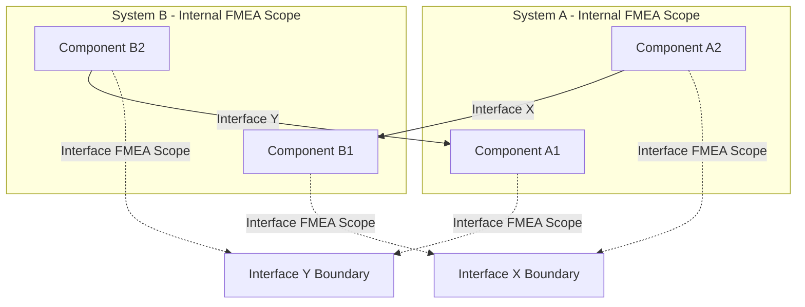

## System of Systems and Interface FMEA

### Overview

System of Systems (SoS) and Interface FMEA extends traditional FMEA methodology beyond the boundaries of a single system to address failure modes that arise specifically from the **interactions, interfaces, and emergent behaviors** between independently managed, operated, or developed systems. Standard FMEA typically decomposes a single system into subsystems, assemblies, and components, and analyzes each element's internal failure modes. This approach systematically under-analyzes a distinct and increasingly significant risk category: failures that occur not within any single component, but **at the boundary where two systems exchange data, energy, or material** — a gap that Interface FMEA is specifically designed to close.

### Why Interfaces Require Distinct Treatment

In a System of Systems context (e.g., a smart-grid combining independently operated power generation, distribution, and consumer-metering systems; or a multi-vendor IoT deployment; or a government IT platform integrating separately procured modules — directly relevant to systems such as a document management system integrating with separate authentication, records, or payment services), each constituent system may be:

- **Independently managed** — different teams, vendors, or even organizations own each system's internal FMEA, with no single authority responsible for the composite behavior
- **Independently evolving** — one system can be updated, patched, or replaced without the other systems' knowledge, invalidating interface assumptions that existed at initial integration
- **Individually compliant but collectively unsafe** — each system can pass its own internal FMEA/verification with no failure modes found, while the *interface* between them harbors an undetected failure mode because no single FMEA scope ever covered the boundary itself

This is the central justification for Interface FMEA as a distinct discipline: **the interface itself is treated as the analysis subject**, not merely as an attribute of either connected system.

### Interface Failure Mode Taxonomy

Interface failure modes are typically categorized by the nature of what crosses the boundary:

| Interface Type | Example Failure Modes |
| --- | --- |
| Data/Signal interface | Malformed data format, timing/synchronization mismatch, protocol version incompatibility, silent data corruption, unit mismatch (e.g., metric vs. imperial) |
| Physical/mechanical interface | Dimensional mismatch, incompatible connector, thermal expansion mismatch at a joint |
| Electrical/power interface | Voltage/current mismatch, grounding incompatibility, power sequencing failure |
| Human-system interface | Operator misinterpretation of one system's output when used as another's input, mismatched units/conventions displayed across systems |
| Procedural/organizational interface | Ambiguous responsibility handoff between operating teams, mismatched update schedules across independently maintained systems |

[Inference: this taxonomy reflects a synthesis of standard interface engineering categories used across INCOSE systems engineering practice and defense SoS guidance; exact category names vary by specific organizational procedure.]

### Interface FMEA Worksheet Structure

An Interface FMEA worksheet extends the standard FMEA columns with boundary-specific fields:

| Interface ID | System A | System B | Interface Function | Failure Mode | Failure Cause (which side?) | Local Effect on A | Local Effect on B | System-of-Systems Effect | Severity | Detection Mechanism | Owner |
| --- | --- | --- | --- | --- | --- | --- | --- | --- | --- | --- | --- |

The **"Owner" column is critical and often missing from ad hoc interface analysis** — because no single system owns the interface, Interface FMEA must explicitly assign responsibility for monitoring and remediating each interface failure mode, or the finding has no organizational home to act on it.

### SoS FMEA Scoping Diagram (svg_diagram)

The diagram illustrates the core structural gap: neither System A's internal FMEA nor System B's internal FMEA has Interface X or Interface Y as its analysis subject — each system's FMEA stops at its own boundary. Interface FMEA is scoped explicitly around the dotted "Interface Boundary" regions, which fall between the two internal analyses.

### Practical Workflow for SoS/Interface FMEA

1. **Map all system-to-system interfaces** — construct an interface inventory (often called an N² diagram or interface control matrix) identifying every point where data, energy, material, or human action crosses a system boundary within the SoS.
2. **Classify interface criticality** — not every interface warrants the same analytical depth; interfaces carrying safety-relevant, financial, or high-volume operational data typically receive full FMEA treatment, while low-consequence interfaces may receive lighter review.
3. **Analyze each interface bidirectionally** — failure modes must be considered from both directions (System A sending malformed data to B, and System B sending malformed data to A), since interface failure causes and effects are rarely symmetric.
4. **Model version/update asynchrony explicitly** — a distinct SoS-specific failure mode category is "interface contract violated by unilateral update," where one system's independent release cycle changes its interface behavior (data schema, timing, protocol version) without the connected system's awareness. This has no clean analog in single-system FMEA, where all components are typically updated under unified configuration control.
5. **Assign interface ownership and monitoring** — since no single system's operational team may notice an interface degrading (each side may see only its own half of the interaction, and log or health-check independently rather than jointly), Interface FMEA outputs should explicitly define which team monitors the interface's health and integration test coverage.
6. **Feed findings back into both connected systems' FMEAs** — a discovered interface failure mode should prompt a review of whether either system's internal FMEA needs revision (e.g., adding input validation for the specific malformed-data scenario identified).

### Example: Interface FMEA Excerpt (Illustrative — Government Records Integration Context)

| Interface | Function | Failure Mode | Cause | Local Effect | SoS Effect | Severity | Detection | Owner |
| --- | --- | --- | --- | --- | --- | --- | --- | --- |
| Document System ↔ Auth Service | User identity/token exchange for document access | Token format changed after Auth Service update | Auth Service released independently without notifying document system integrators | Document system rejects valid tokens | Users locked out of document retrieval system-wide | Critical | Automated integration health check (currently absent) | Joint — Auth Service release owner + Document system integration owner |
| Document System ↔ Records Repository | Metadata synchronization for filed documents | Timestamp timezone mismatch | Repository uses UTC; document system assumes local time | Documents appear "future-dated" or out of chronological order | Audit trail integrity questioned; compliance risk | Critical | Manual QA spot-check only | Document system integration team |

This illustrates the characteristic Interface FMEA finding: **each side's component may be functioning exactly as internally specified**, yet the composite behavior is a genuine, severity-rated failure mode that neither side's own FMEA would surface in isolation.

### Key Points

- **Interface FMEA scope is the boundary itself, not either connected system** — this reframing is the central methodological distinction from standard FMEA, which always scopes analysis to a single system's internal decomposition.
- **Version/configuration asynchrony is a first-class SoS failure mode category**, absent from single-system FMEA, because SoS constituent systems are typically not under unified configuration control or synchronized release schedules.
- **Ownership assignment is a mandatory output**, not an optional worksheet field, because interface failure modes otherwise fall into an organizational gap where each connected system's team assumes the other is responsible for monitoring the shared boundary.
- **Bidirectional analysis is required** — an interface failure mode list that only considers data flowing one direction (e.g., only "A sends bad data to B") systematically misses failure modes in the reverse direction, which often have different causes and different detection mechanisms.

### Common Pitfalls

- **Assuming interface FMEA is covered by summing both systems' individual FMEAs**: this is the most common and consequential error — internal FMEAs by construction stop at each system's own boundary and cannot represent failure modes whose cause and effect span the boundary itself.
- **No designated interface owner**: an interface failure mode identified but assigned to neither connected system's team typically remains unmitigated indefinitely, since neither team's individual performance metrics or incident review process covers the shared boundary. [Unverified: the specific organizational and governance mechanisms available to assign and enforce interface ownership vary widely and are not standardized across programs.]
- **Static interface assumptions in dynamically evolving SoS**: treating an interface control document as fixed once integration testing passes, without a mechanism to re-trigger interface FMEA review when either connected system undergoes a significant internal change or release.
- **Under-scoping "soft" interfaces**: focusing Interface FMEA exclusively on data/API interfaces while omitting human-procedural interfaces (e.g., a records clerk manually re-keying data between two systems) can miss a significant failure mode category, particularly in government and administrative SoS contexts.

**Related Topics**

- Interface Control Documents (ICDs) and N² diagram construction for SoS interface mapping
- Configuration management and version compatibility tracking across independently released systems
- INCOSE Systems Engineering guidance on System of Systems architecture and analysis
- Integration testing and automated interface health-check design
- Combining Interface FMEA with FTA for cross-system common-cause failure analysis
- Human-system interface failure modes in multi-system administrative workflows