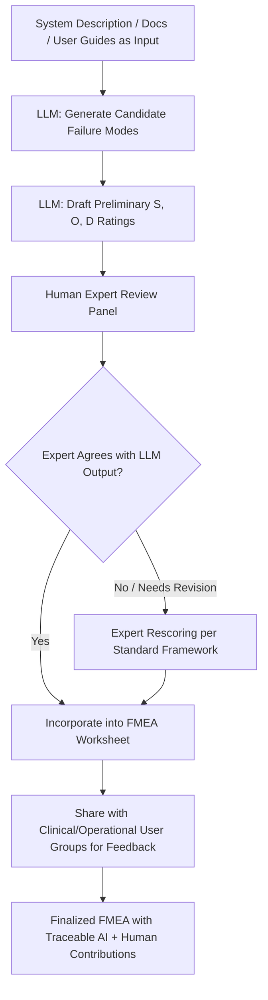

## Emerging AI Assisted Failure Identification

### Overview

AI-assisted failure identification applies machine learning and, increasingly, Large Language Models (LLMs) to augment or partially automate stages of the FMEA/FMECA process that have traditionally relied on manual expert brainstorming, historical failure database lookups, and worksheet population. Current research and industrial case studies span two distinct AI approaches: **classical machine learning** (classification models trained on structured historical failure/maintenance data to predict failure modes or root causes) and **LLM-based generative assistance** (using models like GPT-4, Gemini, or domain-fine-tuned variants to generate candidate failure modes, draft effects/causes text, and propose preliminary severity/occurrence/detection ratings from natural-language system descriptions). LLMs can support engineers in analyzing and interpreting FMEA-relevant data, assisting in pre-processing, identifying patterns, and uncovering correlations, which is particularly valuable for extracting failure-related information from text data. [Cambridge Core](https://www.cambridge.org/core/journals/design-science/article/aidriven-fmea-integration-of-large-language-models-for-faster-and-more-accurate-risk-analysis/22F110A2BF0DB4D01A69472CF17A0B43)

### Two Distinct AI Application Categories

**1. Classical ML for failure classification and prediction**

Trained on structured historical data (maintenance logs, field return databases, sensor telemetry) to classify failure modes or predict root causes from labeled examples. Research has applied fault diagnosis models using FMECA data with machine learning classifiers such as Support Vector Machines, K-Nearest Neighbour, and Random Forest, with Random Forest achieving reported fault classification accuracy above 98% in at least one automotive electric vehicle study. This category requires substantial labeled training data specific to the equipment class and does not generalize well across unrelated domains without retraining. [arxiv](https://arxiv.org/pdf/2511.17743)

**2. LLM-based generative failure mode identification**

Uses pretrained general-purpose or lightly fine-tuned LLMs, prompted with system descriptions, technical documentation, or process descriptions, to generate candidate failure modes directly from natural language — without requiring a large labeled training set. Studies have explored using models like ChatGPT to generate system hierarchies and failure modes through structured prompts, in some cases identifying failure modes that had been missed by human analysts. [arxiv](https://arxiv.org/pdf/2511.17743)

### LLM-Assisted FMEA Workflow (svg_diagram)

### Documented Case Study: Multi-LLM FMEA in Radiation Oncology

A recent case study provides a concrete, methodologically rigorous example of the current state of practice. Researchers evaluated whether large language models could supplement traditional expert-driven FMEA by identifying novel failure modes within a Radiation Planning Assistant workflow, addressing FMEA's traditional dependence on time-consuming, expert-experience-heavy analysis. [PubMed](https://pubmed.ncbi.nlm.nih.gov/42254724/)

**Methodology:** A multidisciplinary team of board-certified medical physicists, quality assurance engineers, and software developers independently used four different LLMs (ChatGPT-4, Gemini 2.5 Pro, phi4-reasoning-14B, and OpenAI/oss-120B) to generate potential failure modes across the workflow, using diverse prompting strategies including supplementary materials such as user guides as context. [PubMed](https://pubmed.ncbi.nlm.nih.gov/42254724/)

**Scoring and validation:** Each failure mode was first rated for severity, occurrence, and detectability by the LLMs themselves, then independently rescored by human experts using the established TG-100 framework (the AAPM's standard risk-analysis framework for radiation oncology) to enable direct comparison between AI-generated and expert-validated ratings. [PubMed](https://pubmed.ncbi.nlm.nih.gov/42254724/)

**Human-in-the-loop review architecture:** The team combined three board-certified medical physicists with strong patient treatment and safety expertise alongside three software developers with deep learning, front-end/back-end, visualization, and algorithm design expertise — reflecting the cross-disciplinary review structure this kind of AI-assisted analysis appears to require. LLM-generated candidate failure modes and preliminary RPN scores were manually reviewed, rescored by experts, and subsequently shared with clinical user groups for external feedback before finalization. [PubMed Central](https://pmc.ncbi.nlm.nih.gov/articles/PMC13235337/)[PubMed Central](https://pmc.ncbi.nlm.nih.gov/articles/PMC13235337/)

### Key Architectural Pattern: AI Proposes, Experts Dispose

Across the reviewed literature and case studies, a consistent architecture emerges regardless of industry:

1. **AI generates candidates** — failure modes, draft causes/effects text, and preliminary S/O/D or RPN scores, using either structured historical data (classical ML) or natural-language system documentation (LLM prompting)
2. **Domain experts validate and rescore** — using the organization's standard rating framework (TG-100 in radiation oncology, MIL-STD-1629A conventions in defense, AIAG-VDA in automotive), never accepting AI-proposed ratings as final without human review
3. **Downstream stakeholder feedback loop** — findings are circulated to the actual operational/clinical users of the system before the FMEA is finalized, providing a check against both AI hallucination and expert blind spots

A further characteristic noted in this research area is that LLM-assisted approaches can continuously learn and improve from new data and feedback, meaning result quality can increase over time as the framework is used repeatedly on similar systems. [Cambridge Core](https://www.cambridge.org/core/journals/design-science/article/aidriven-fmea-integration-of-large-language-models-for-faster-and-more-accurate-risk-analysis/22F110A2BF0DB4D01A69472CF17A0B43)

### Reported Benefits

- Proposed frameworks aim to streamline collaborative FMEA work, reduce manual effort, and improve the accuracy of risk assessments by integrating LLM support into data collection, pre-processing, risk identification, and decision-making stages. [DOAJ](https://doaj.org/article/1bd7380a693849a1ad4417f53762c42d)
- At least one study reported significant improvements in speed, accuracy, and reliability compared to conventional (fully manual) FMEA methods when integrating LLMs such as GPT-3.5, GPT-4, GPT-4o, and Gemini into the process. [arxiv](https://arxiv.org/pdf/2511.17743)
- In an implementation case study, the amount of programming and prompting required to achieve useful results was relatively small — reported as only 2–3 iterations, using default fine-tuning parameter settings. [ResearchGate](https://www.researchgate.net/publication/380643557_Integrating_large_language_models_for_improved_failure_mode_and_effects_analysis_FMEA_a_framework_and_case_study)
- LLMs can process large volumes of unstructured text (maintenance logs, incident reports, user guides) far faster than manual expert review, surfacing candidate failure modes for expert triage rather than requiring experts to read the full corpus themselves.

### Reported Limitations and Open Challenges

- End-user reviews written in non-technical, informal language add a layer of complexity to LLM-based data analysis when processing company documents and field feedback, since models must correctly interpret imprecise natural-language descriptions of problems. [ResearchGate](https://www.researchgate.net/publication/380643557_Integrating_large_language_models_for_improved_failure_mode_and_effects_analysis_FMEA_a_framework_and_case_study)
- LLM-proposed severity/occurrence/detection ratings are **preliminary drafts, not authoritative scores** — every reviewed case study architecture routes AI-generated ratings through mandatory expert rescoring against an established framework before acceptance, reflecting an implicit industry consensus that current LLMs are not treated as final arbiters of risk quantification.
- Classical ML classification approaches require substantial labeled historical data specific to the equipment or process class; reported high classification accuracy (98.18% in one Random Forest-based electric vehicle fault diagnosis study) is domain-specific and was achieved using FMECA data as the training foundation, not from a general-purpose pretrained model. [Inference: results in one domain and dataset do not necessarily generalize to other equipment classes or organizations without comparable training data.] [arxiv](https://arxiv.org/pdf/2511.17743)
- Reproducibility and prompt sensitivity: since LLM output quality depends on prompting strategy and supplementary context provided, the case study explicitly notes that team members used diverse prompting strategies, including supplementary materials such as user guides, as context — implying that inconsistent prompting across analysts could plausibly produce inconsistent candidate failure mode coverage. [Inference: this consistency risk follows logically from the reported variation in prompting approach, though it was not directly measured as a limitation in the cited source.] [PubMed](https://pubmed.ncbi.nlm.nih.gov/42254724/)

### Open-Source and Research Tooling

At least one open-access research framework integrates LLM agents with digital twins for industrial autonomous systems, including a demonstrated application analyzing a brake-by-wire system — a safety-critical automotive component — where the model identifies potential failure modes and suggests risk mitigation strategies. This reflects a broader research direction combining LLM-based failure identification with digital twin simulation, rather than treating LLM output as a standalone deliverable. [GitHub](https://github.com/YuchenXia/LLMRiskAnalyzer)

### Practical Integration Guidance (Current State)

1. **Use AI to widen the candidate net, not to replace the panel** — position LLM output as an additional brainstorming input alongside (not instead of) the traditional cross-functional FMEA team session, since the documented case studies universally retain human expert panels as the final scoring authority.
2. **Always rescore against your organization's established framework** — never adopt LLM-proposed S/O/D or RPN values directly; route them through the same expert rescoring process (TG-100, MIL-STD-1629A, AIAG-VDA, or internal equivalent) used for human-generated FMEA entries.
3. **Provide rich context to the LLM** — system documentation, user guides, and prior incident reports as prompt context appear to materially improve candidate failure mode relevance and specificity based on the reviewed methodologies.
4. **Maintain traceability between AI-suggested and human-validated content** — the worksheet should distinguish which failure modes originated from AI generation versus human brainstorming, and record which expert rescored each AI-proposed value, preserving the auditability that certification and design-review processes require.
5. **Circulate findings to actual system users before finalizing** — the radiation oncology case study's step of sharing results with clinical user groups for feedback reflects a validation pattern worth adopting broadly, since downstream operational users may catch both AI and expert blind spots.

### Key Points

- **No reviewed case study treats LLM output as final** — every documented implementation retains mandatory human expert review and rescoring as an architectural requirement, not an optional safeguard.
- **LLM contribution is strongest at the ideation/coverage stage** — generating a wider candidate list of failure modes, including modes a human panel might not have considered — rather than at the quantitative risk-scoring stage, where domain-specific expert judgment remains the accepted authority.
- **Classical ML and generative LLM approaches serve different purposes**: classical ML excels at classification/prediction from structured historical data within a well-characterized domain; LLMs excel at generating candidate failure modes from unstructured text and documentation, especially for systems with less mature historical failure databases.
- **This is an active, fast-evolving research area** rather than a settled methodology — reported results (speed, accuracy, coverage improvements) come from specific case studies and framework implementations, and organizations should evaluate applicability to their own systems and data rather than assuming universal generalizability. [Unverified: the maturity and reliability of any specific commercial AI-assisted FMEA tool not covered in the cited studies would require independent evaluation.]

### Common Pitfalls

- **Treating AI-generated failure modes as pre-validated**: skipping the expert rescoring step because AI output "looks complete" risks propagating hallucinated or contextually inappropriate failure modes into a formal safety or compliance record.
- **Insufficient context in prompting**: providing an LLM with only a brief system name or category, without supplementary documentation, produces generic rather than system-specific failure modes, undermining the coverage benefit the approach is intended to provide.
- **Ignoring prompt/model variability**: since different LLMs and prompting strategies can surface different candidate failure modes for the same system, relying on a single model/prompt pass rather than a documented, repeatable process risks inconsistent coverage across FMEA revisions.
- **Applying classical ML classifiers trained on one equipment class to a materially different one** without retraining or revalidation, given that reported high accuracy figures are tied to the specific training dataset and domain used.

**Related Topics**

- Prompt engineering strategies for structured FMEA/FMECA generation
- LLM-assisted natural language processing of maintenance and incident report text
- Digital twin integration with AI-driven failure mode simulation
- Validation frameworks for AI-generated risk ratings against established standards (TG-100, MIL-STD-1629A, AIAG-VDA)
- Machine learning classification models for failure mode prediction from field/maintenance data
- Human-AI collaborative review architectures for safety-critical risk analysis