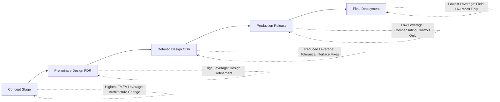

## Conducting FMEA Too Late in Development

### Overview

Conducting FMEA too late in development is one of the most frequently cited anti-patterns in reliability engineering practice: rather than being performed concurrently with design as a proactive risk-identification tool, FMEA is deferred until after the design is substantially frozen, a prototype exists, or — in the most severe cases — until after field failures have already occurred. This timing failure inverts FMEA's fundamental purpose. FMEA was conceived as a **preventive** technique intended to influence design decisions before they are costly to change; performed late, it becomes at best a documentation exercise justifying decisions already made, and at worst a compliance formality that identifies risks too late to act on economically.

### Why Timing Is Structurally Critical to FMEA's Value

The cost of correcting a design flaw increases sharply at each stage of the product lifecycle — a widely cited engineering principle (often associated with the "rule of ten" cost-escalation heuristic) holds that a defect costing $1 to fix at the concept/design stage may cost roughly 10× more to fix during prototype/testing, 100× more during production, and 1000× more after field deployment. [Inference: the specific multiplier values vary by source and industry and should be treated as an illustrative order-of-magnitude heuristic rather than a precise universal constant.] FMEA's entire value proposition rests on intervening while corrective action is still a design change (cheap) rather than a recall, retrofit, or field campaign (expensive).

$$\text{Cost to correct defect} \propto e^{k \cdot (\text{lifecycle stage reached before detection})}$$

### The Design Freeze Problem

Design reviews typically follow a maturity gate structure — Preliminary Design Review (PDR), Critical Design Review (CDR), and beyond. FMEA's design-influencing value is highest before PDR and diminishes sharply after CDR, because:

- **Before PDR**: architecture, component selection, and redundancy strategy are still open; FMEA findings can directly shape these decisions at near-zero incremental cost
- **Between PDR and CDR**: major architecture is fixed but detailed design (tolerances, materials, interfaces) is still adjustable; FMEA findings here typically require design refinement rather than redesign
- **After CDR**: the design is released for fabrication/tooling/production planning; FMEA findings now compete with schedule and cost pressure to avoid reopening a "closed" design, and mitigation often shifts from design change to compensating provisions (inspection, procedural controls) that are inherently less effective than eliminating the failure mode at the source
- **After production release**: FMEA becomes retrospective; findings can only inform field service bulletins, maintenance procedures, or next-generation redesign — the current fielded product's risk is now fixed

### Timing vs. Corrective Action Leverage (svg_diagram)

### Common Organizational Root Causes of Late FMEA

- **Schedule pressure treating FMEA as a deliverable, not an input**: FMEA is scheduled to satisfy a program milestone checklist item (e.g., "FMEA complete" as a CDR entry criterion) rather than being scheduled early enough to actually influence the design decisions the milestone is meant to review.
- **FMEA team assembled only after a design exists to analyze**: if the FMEA is only ever performed against a completed drawing package or finished prototype, by definition no earlier architectural decision was ever exposed to FMEA-driven scrutiny.
- **Treating FMEA as a compliance/paperwork exercise**: when FMEA is performed to satisfy an audit or certification checkbox rather than to genuinely inform engineering, it is naturally scheduled at whatever point in the process is administratively convenient — often near the end.
- **No iterative FMEA update process**: some programs perform a single FMEA pass and never revisit it as the design evolves, meaning even an appropriately-timed initial FMEA becomes stale and disconnected from the design by the time the design is finalized.
- **Absence of an FMEA champion or gate requirement**: without an organizational mandate tying FMEA initiation to an early design milestone (e.g., "FMEA must be initiated at concept review, updated at PDR"), the analysis has no forcing function to start early and naturally slips toward the end of the schedule where remaining capacity exists.

### Correct Timing Pattern: Concurrent, Iterative FMEA

The corrective pattern is not a single well-timed FMEA event, but an **iterative FMEA process that evolves alongside the design**:

1. **Concept-stage FMEA (functional level)**: performed before detailed design exists, based on functional block diagrams and intended architecture, to influence high-level architecture and redundancy decisions
2. **PDR-stage FMEA update**: refined as preliminary design data (component selection, interface definitions) becomes available, informing detailed design choices before they are finalized
3. **CDR-stage FMEA finalization**: completed against near-final design detail, primarily validating that earlier findings were addressed and catching residual detail-level failure modes (tolerances, specific part numbers)
4. **Post-release living FMEA**: updated with field/test data per the RCM feedback loop, ensuring the analysis remains a current representation of actual risk rather than a historical snapshot of the original design intent

### Iterative FMEA Timing Table

| Design Stage | FMEA Focus | Typical Corrective Action Available | Cost of Change |
| --- | --- | --- | --- |
| Concept | Functional failure modes, architecture-level | Architecture change, redundancy addition | Lowest |
| Preliminary Design (pre-PDR) | Subsystem-level failure modes | Interface redesign, component reselection | Low |
| Detailed Design (pre-CDR) | Component/part-level failure modes | Tolerance adjustment, material change, detail redesign | Moderate |
| Production Release | Manufacturing/assembly failure modes | Process control, inspection addition | High |
| Field Deployment | Field/wear-out failure modes | Compensating provision, service bulletin, next-gen redesign only | Highest |

### Key Points

- **FMEA's design-influence value decays monotonically with lifecycle stage** — the same failure mode identified at concept stage versus after production release requires categorically different (and progressively more expensive and less effective) mitigation strategies.
- **A single late FMEA cannot recover the lost value of earlier iterations** — performing a thorough, well-executed FMEA against a finished design still only yields compensating-control-level mitigations for findings that could have been architecturally eliminated had the analysis occurred earlier; the analysis quality does not compensate for its timing.
- **Iterative, staged FMEA is the corrective pattern**, not a single perfectly-timed analysis — because design knowledge itself evolves progressively, no single FMEA pass at any one point captures both early architectural leverage and late detailed-design accuracy.
- **Organizational forcing functions are necessary**, not just awareness of the principle — without a mandated linkage between FMEA initiation and specific early design milestones (concept review, PDR), schedule and resource pressure will tend to push FMEA later by default.

### Common Pitfalls

- **"We'll do FMEA once the design is stable"**: this reasoning inverts FMEA's purpose — the entire point is to influence the design before it stabilizes; waiting for stability guarantees the analysis arrives too late to shape architecture.
- **Treating FMEA as a one-time deliverable rather than a living process**: an FMEA performed once at any single stage, however well-timed, becomes stale as the design continues to evolve after that point unless a formal update/revision process is maintained.
- **Confusing "FMEA complete" milestone satisfaction with genuine design influence**: an FMEA scheduled to close out a milestone checklist item, performed against an already-finalized design package, satisfies the administrative requirement while forfeiting the technique's actual risk-reduction value. [Inference: this gap between compliance-satisfaction and genuine design-influence is a widely recognized critique in reliability engineering practice, though the degree to which it occurs in any specific organization is not something that can be generically quantified.]
- **No mechanism to re-trigger FMEA on design change**: even a well-timed initial FMEA loses value if subsequent design changes (introduced after the FMEA was completed) are never re-analyzed, silently reintroducing or creating new failure modes that go undetected until later stages or field deployment.

**Next Steps**

- Establishing FMEA initiation gates tied to concept review and PDR milestones
- Iterative/living FMEA update processes and revision control practices
- Cost-of-change escalation models across the product development lifecycle
- Integrating FMEA timing requirements into program management and stage-gate processes
- Design-for-reliability (DfR) practices that require early functional FMEA by policy
- Linking design-change triggers to mandatory FMEA re-analysis