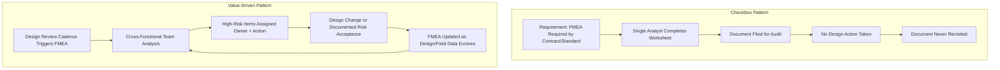

## Treating FMEA as a Compliance Checkbox

### Overview

Treating FMEA as a compliance checkbox is the anti-pattern in which the analysis is performed — and often performed competently on paper — solely to satisfy an external requirement (a customer contract clause, a certification body, an internal quality management system audit, or an ISO/IATF standard) rather than to genuinely inform engineering decisions. The worksheet gets completed, signed, and filed, but its findings never meaningfully influence design, process control, or risk mitigation. This differs from the late-timing anti-pattern in a critical way: a checkbox FMEA can be started early and still fail to deliver value, because the failure is not fundamentally about *when* it happens but about *why* it happens — the organizational intent behind the analysis, and what happens to its output afterward.

### Diagnostic Signs of a Checkbox FMEA

- **The FMEA is completed by one person in isolation**, rather than by a cross-functional team representing design, manufacturing, quality, service, and safety perspectives — genuine FMEA depends on diverse viewpoints to surface failure modes any single discipline would miss.
- **High-RPN items have no corresponding action items, owners, or target dates** — the worksheet identifies risk but the report stops there, with no traceable link to a decision, design change, or accepted-risk rationale.
- **The FMEA is never revisited after initial completion** — no revision history, no re-analysis triggered by subsequent design changes, field data, or corrective actions; the document exists as a static artifact rather than a living risk model.
- **Severity, occurrence, and detection ratings are assigned without supporting rationale or data** — ratings are filled in to produce a plausible-looking RPN number rather than derived from failure rate data, test results, or genuine engineering judgment documented in the remarks column.
- **The FMEA is generated by copying a prior product's FMEA with minimal modification** — reusing structure is reasonable, but wholesale duplication without genuine re-analysis of what is actually different about the new design produces a document that documents the old product's risk profile, not the new one's.
- **No engineering stakeholder outside the FMEA team has ever read the findings** — if design engineers, program managers, or safety reviewers cannot describe what the FMEA found, the analysis has not actually informed the organization's understanding of risk.

### Root Cause: Misaligned Incentive Structure

The checkbox pattern emerges when the organizational incentive is "have an FMEA document on file" rather than "understand and reduce our design risk." This misalignment typically originates from:

- **External imposition without internal ownership**: a customer or certifying body requires FMEA as a contractual/certification deliverable, but no internal engineering champion treats the analysis as valuable in its own right — the document is produced to satisfy an external party, not to serve the analyzing organization.
- **Audit-driven scheduling**: FMEA is scheduled to be "ready for the audit" rather than integrated into the design review cadence, reinforcing the perception that its purpose is to pass inspection rather than reduce risk.
- **No consequence for a low-value FMEA**: if a superficial, low-effort FMEA and a rigorous, well-integrated FMEA both satisfy the same audit checkbox with equal ease, the incentive structure rewards minimum effort.
- **Disconnected quality and engineering functions**: when FMEA ownership sits entirely within a quality department separate from the design engineering organization, with no formal mechanism requiring engineering to act on findings, the analysis can be completed to quality's satisfaction without ever reaching engineering decision-making.

### Compliance-Driven vs. Value-Driven FMEA (svg_diagram)

### Consequences of the Checkbox Pattern

- **False assurance**: the existence of a completed FMEA document can create organizational confidence that risk has been assessed and managed, when in fact the analysis had no bearing on the actual design — this is arguably more dangerous than having no FMEA at all, since it masks the absence of genuine risk management behind a compliance artifact.
- **Wasted analytical effort**: the labor invested in populating the worksheet produces no design-risk-reduction return, representing a pure cost with no corresponding benefit — the opposite of FMEA's intended cost-justification.
- **Repeated failure modes across product generations**: because findings are not fed back into design standards, lessons-learned databases, or engineering checklists, the same failure modes can reappear in successor products, since the checkbox FMEA never functioned as an organizational learning mechanism.
- **Audit findings from certification bodies**: reviewers experienced in evaluating FMEA quality (as opposed to mere existence) can often identify checkbox FMEAs by the diagnostic signs above, and their absence of genuine traceability to design decisions can itself become an audit finding, undermining the very compliance purpose the checkbox exercise was meant to serve.

### Converting Compliance-Driven FMEA into Value-Driven FMEA

1. **Assign FMEA ownership to design engineering, not solely to quality** — the team that will act on findings should be the team most invested in producing a genuinely useful analysis, with quality functioning as a process facilitator and auditor of rigor rather than the sole owner.
2. **Require a documented disposition for every high-severity/high-RPN item** — no worksheet is considered complete until every item above the organization's action threshold has an assigned owner, a corrective action or documented risk-acceptance rationale, and a target closure date.
3. **Integrate FMEA into the design review cadence itself**, not as a separate audit deliverable — findings should appear as a standing agenda item in PDR/CDR reviews, ensuring engineering leadership actually engages with the content rather than only its existence.
4. **Mandate cross-functional participation**, with attendance and contribution tracked — a single-analyst FMEA should not satisfy the organization's internal quality gate, regardless of whether it satisfies an external audit's minimum documentation requirement.
5. **Establish a living-document revision trigger** — tie FMEA re-analysis to defined events (design change requests, field failure reports, corrective action closures) rather than leaving revision to occur only when the next audit cycle demands it.
6. **Track a genuine engineering metric beyond "FMEA exists"** — e.g., percentage of high-RPN items with closed corrective actions, or reduction in recurring failure modes across product generations — to give the organization a value signal distinct from mere document completion.

### Key Points

- **A checkbox FMEA can be technically well-executed and still deliver zero value** — quality of worksheet population is a separate axis from organizational integration; a rigorous worksheet completed in isolation and then filed away fails just as completely as a superficial one.
- **The defining symptom is the absence of traceable action**, not the absence of effort — the diagnostic question is not "was the FMEA thorough?" but "did anything in the organization change as a result of the FMEA?"
- **Compliance and value are not inherently in tension** — a well-integrated, cross-functional, action-tracked FMEA satisfies audit and certification requirements as a natural byproduct of doing genuine risk analysis; the checkbox pattern arises specifically when compliance is pursued as the *primary* goal rather than as a consequence of genuine analysis.
- **Organizational incentive design, not analyst skill, is usually the root cause** — experienced, capable engineers will still produce checkbox FMEAs if the surrounding process rewards document completion over design influence.

### Common Pitfalls

- **Confusing document existence with risk management**: assuming that having a completed, signed-off FMEA on file means the associated risks have been addressed, without verifying that findings translated into action.
- **Copy-paste reuse across product generations without genuine re-analysis**: inheriting a prior FMEA's structure is reasonable and often efficient, but failing to critically re-examine what has actually changed in the new design produces a document that superficially satisfies the checklist while analyzing the wrong product.
- **Isolating FMEA within the quality function**: without an engineering ownership and action-tracking mechanism, quality-owned FMEA risks becoming a parallel documentation stream disconnected from actual design decision-making.
- **No consequence differentiation between rigorous and superficial FMEA**: if an organization's internal review process cannot distinguish a genuinely useful FMEA from a checkbox exercise, it has no mechanism to detect or correct the pattern, and it will tend to recur as schedule pressure increases. [Inference: this describes a structural risk factor rather than a claim about any specific organization's practice.]

**Related Topics**

- Establishing cross-functional FMEA team composition and facilitation practices
- Action item tracking and closure verification for high-RPN failure modes
- Integrating FMEA into stage-gate design review processes
- Lessons-learned databases and failure mode recurrence tracking across product generations
- Auditing FMEA quality versus FMEA existence in certification reviews
- Organizational incentive design for genuine risk-management engagement