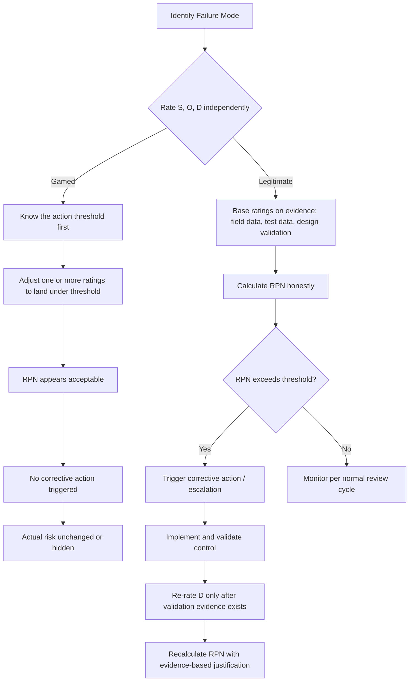

## Gaming or Misusing the RPN Score

### Overview

Risk Priority Number (RPN) gaming refers to the deliberate or unconscious manipulation of Severity (S), Occurrence (O), and Detection (D) ratings to produce a numerical outcome that misrepresents actual risk. Rather than reflecting engineering reality, the score is shaped to satisfy a threshold, avoid triggering mandatory actions, or protect a design/process decision that has already been made. This is one of the most persistent failure modes in FMEA practice because RPN is a multiplicative index ($RPN = S \times O \times D$) that appears rigorous but is highly sensitive to small, defensible-looking rating adjustments.

### Why RPN Is Vulnerable to Manipulation

**Key Points**

- RPN has no intrinsic unit; it is an ordinal-scale product treated as if it were interval or ratio data, which invites rationalization of individual ratings.
- The same RPN value (e.g., 120) can arise from many different (S, O, D) combinations, some representing very different real-world risk profiles.
- Rating scales (1–10 for each factor) are guideline-based and require judgment, leaving room for motivated reasoning.
- Teams are frequently under schedule or budget pressure to avoid triggering an action threshold (e.g., "any RPN > 100 requires a corrective action plan").
- Detection ratings are especially prone to optimistic bias because they require predicting the effectiveness of a control that may not yet exist.

### Common Patterns of RPN Gaming

#### 1. Threshold Anchoring (Reverse Engineering the Score)

The team knows the action threshold (e.g., RPN ≥ 100) and works backward, selecting S, O, D values that land just under it, rather than rating each factor independently based on evidence.

**Example**

A failure mode is genuinely rated S=8 (safety-related), O=6 (moderately frequent), which already yields $8 \times 6 = 48$. If Detection is honestly rated D=5 (RPN = 240, over threshold), the team instead assigns D=2 "because we plan to add a check later," dropping RPN to 96 — just under the 100-cutoff — without the detection control actually existing yet.

#### 2. Severity Suppression

Downgrading Severity to avoid triggering mandatory escalation paths that high-severity ratings often carry (e.g., automatic engineering review board involvement), since S is the factor most likely to force organizational attention regardless of the RPN product.

#### 3. Occurrence Optimism Without Data

Assigning low Occurrence ratings based on the absence of historical field failures, when the failure mode is for a new design, material, or process with no service history to justify the low rating — silently converting "we have no data" into "it doesn't happen."

#### 4. Detection Score Inflation

Rating Detection as effective (low D) based on an inspection or test method that:

- Has not been validated for that specific failure mode
- Detects a downstream symptom rather than the failure cause
- Relies on human visual inspection assumed to be 100% reliable

#### 5. Averaging or Consensus Softening

In group FMEA sessions, using a simple average of individual ratings (e.g., one engineer rates S=9, another rates S=5, average to S=7) instead of resolving the disagreement through evidence or escalation, which mathematically dilutes outlier concerns — particularly dangerous when the outlier is the most safety-conscious rater.

#### 6. RPN Recalculation Theater

After an "action" is nominally taken (e.g., a memo is issued, a checklist item is added with no verification of effectiveness), the D rating is lowered and a new, lower RPN is recorded to formally close the item, without objective evidence (test data, control validation) that risk actually decreased.

#### 7. Cherry-Picking the Rating Scale Version

Switching between different S/O/D scale definitions (e.g., a 1–10 automotive scale vs. a customized 1–5 scale) mid-project or across sub-teams to produce more favorable products, making cross-comparison and threshold logic inconsistent.

### Illustrative Diagram: Gaming Pathway vs. Legitimate Pathway

### Structural Weaknesses This Exploits

**Key Points**

- **Multiplicative masking**: A single lowered factor can offset two honestly high factors, since the score is a product, not a sum or a vector.
- **Single-number governance**: Organizations that gate decisions purely on "RPN < threshold" incentivize hitting the number rather than reducing the risk.
- **No mandatory evidence trail**: Many FMEA templates do not require citing the source (test report, field data, standard) behind each rating, making unjustified ratings indistinguishable from justified ones on the form itself.
- **Detection ambiguity**: Unlike Severity (often tied to failure effect) and Occurrence (ideally tied to failure-rate data), Detection is the most subjective factor and the easiest to inflate favorably.

### Detection and Prevention Strategies

#### Process-Level Controls

- **Require Severity to independently drive action**, regardless of RPN, for high-severity failure modes (e.g., AIAG-VDA's approach uses an Action Priority (AP) table with High/Medium/Low classification instead of a single RPN threshold, specifically because RPN thresholds proved gameable in practice).
- **Mandate evidence citations** for each S, O, D rating (test report ID, field return data, standard reference) so ratings cannot be asserted without traceability.
- **Freeze ratings before knowing the threshold outcome** in the review tool/software, or hide the running RPN calculation until all three ratings are finalized and locked.
- **Require independent re-verification of Detection ratings** by someone other than the design owner, since the design owner has incentive to view their own controls favorably.
- **Prohibit rating changes without a documented root-cause justification**, especially for closing out actions.

#### Review-Level Controls

- **Cross-functional review boards**: Require sign-off from quality, reliability, and safety functions, not just the design engineer, to reduce single-point bias.
- **Outlier flagging**: If ratings from multiple reviewers diverge significantly, require documented resolution rather than silent averaging.
- **Audit trail on RPN changes over time**: Track the history of each failure mode's S/O/D ratings across FMEA revisions; a pattern of ratings drifting downward without corresponding validated design/process changes is a red flag.
- **Periodic re-validation against field data**: Compare Occurrence ratings retrospectively against actual warranty/field-failure data to catch systematic optimism.

#### Organizational/Cultural Controls

- **Decouple performance metrics from RPN outcomes.** If engineers or programs are evaluated on "number of open high-RPN items," this directly incentivizes gaming; evaluate instead on quality of risk analysis and evidence.
- **Psychological safety for high ratings**: Ensure raising a high Severity or Occurrence score is not perceived as blaming an individual or threatening a program milestone.

### The AIAG-VDA Response to RPN Gaming

**Key Points**

- The 2019 AIAG-VDA FMEA Handbook explicitly moved away from RPN as the primary decision metric, replacing it with the **Action Priority (AP)** table.
- AP classifies each failure mode as High, Medium, or Low priority using a lookup table based on the *combination* of S, O, D — not their raw product — specifically to prevent low scores in one factor from mathematically canceling high scores in another.
- Under AP tables, a high Severity rating (9–10) combined with even a moderate Occurrence typically forces a "High" action priority regardless of how favorable the Detection rating is, closing the primary loophole exploited under multiplicative RPN gaming.
- [Inference] Organizations that have not transitioned to AP tables, or that use hybrid RPN/AP systems, may still retain the RPN-specific gaming vulnerabilities described above unless equivalent guardrails are implemented locally.

### Illustration: RPN vs Action Priority Sensitivity (svg_diagram)

<svg xmlns="http://www.w3.org/2000/svg" viewBox="0 0 720 320">
<text x="360" y="24" text-anchor="middle" font-size="16" font-weight="bold" fill="#1a1a1a">RPN vs Action Priority Sensitivity to Detection Rating (svg_diagram)</text>
<line x1="70" y1="270" x2="680" y2="270" stroke="#333" stroke-width="2" />
<line x1="70" y1="60" x2="70" y2="270" stroke="#333" stroke-width="2" />
<text x="375" y="300" text-anchor="middle" font-size="13" fill="#333">Detection Rating (D), lower = "better" detection</text>
<text x="30" y="165" text-anchor="middle" font-size="13" fill="#333" transform="rotate(-90 30 165)">Score</text>

<text x="90" y="285" font-size="11" fill="#333">10</text>

<text x="220" y="285" font-size="11" fill="#333">7</text>

<text x="350" y="285" font-size="11" fill="#333">5</text>

<text x="480" y="285" font-size="11" fill="#333">3</text>

<text x="610" y="285" font-size="11" fill="#333">1</text>

<polyline points="90,80 220,120 350,150 480,190 610,230" fill="none" stroke="#c0392b" stroke-width="3" />
<text x="615" y="235" font-size="12" fill="#c0392b" font-weight="bold">RPN (S=8, O=6)</text>
<line x1="90" y1="90" x2="610" y2="90" stroke="#2980b9" stroke-width="3" stroke-dasharray="6,3" />
<text x="615" y="94" font-size="12" fill="#2980b9" font-weight="bold">AP = High (fixed)</text>

<text x="90" y="260" font-size="11" fill="#555">RPN drops from ~480 to ~48</text>

<text x="90" y="65" font-size="11" fill="#555">AP stays "High" across all D values (S=8 alone forces it)</text>

</svg>

### Practical Checklist for Reviewers

**Key Points**

- Was each S, O, D rating assigned *before* the total RPN was visible or calculated?
- Is there a cited evidence source (data, test, standard) for each rating, especially Occurrence and Detection?
- Has Detection been rated based on a control that is actually implemented and validated, not merely planned?
- Do closed/reduced RPN values have corresponding validation evidence (test reports, capability studies) rather than just a revised number?
- Would this failure mode's action priority change if evaluated against an AP table instead of a raw RPN threshold?
- Are ratings consistent with the same failure mode as it appears in related FMEAs (e.g., design FMEA vs. process FMEA for the same feature)?

**Related Topics**

- Action Priority (AP) tables vs. traditional RPN thresholds
- Severity, Occurrence, and Detection rating scale calibration
- Evidence-based rating justification and traceability documentation
- Cross-functional FMEA review board design
- Detection control validation methods (Gage R&R, poka-yoke effectiveness testing)
- FMEA revision history auditing and rating drift analysis
- Linking FMEA to control plans and reaction plans
- Cognitive biases in risk assessment (anchoring, optimism bias, groupthink)