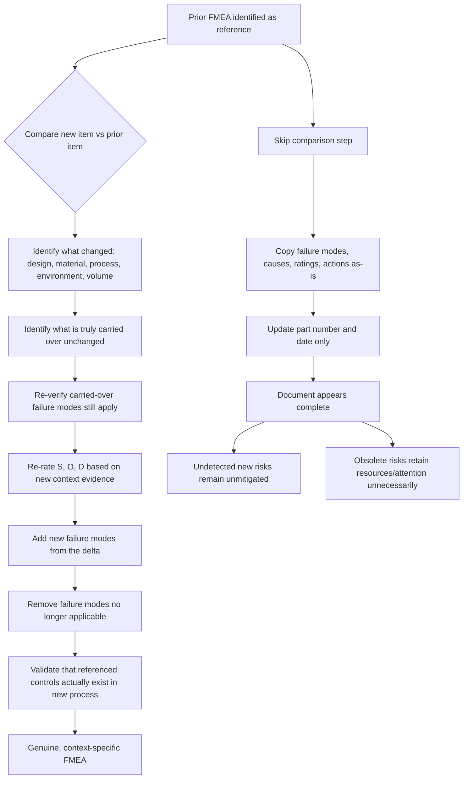

## Copying Prior FMEAs Without Genuine Analysis

### Overview

This anti-pattern occurs when a team reuses a previous FMEA (from a similar part, process, or platform) as a starting template and carries its content forward largely unchanged, without re-examining whether the failure modes, causes, effects, and ratings actually apply to the new design, process, or context. The document retains the *form* of a rigorous risk analysis while losing its *function*: identifying and mitigating risk specific to the item under review. It is sometimes called "cut-and-paste FMEA," "boilerplate FMEA," or "FMEA by inheritance."

### Why This Happens

**Key Points**

- Schedule pressure incentivizes reusing a "known good" document rather than starting analysis from scratch.
- Using a prior FMEA as a reference is a legitimate and recommended practice (carryover analysis); the anti-pattern is specifically the *failure to critically re-evaluate* that carried-over content.
- Organizational metrics that reward "FMEA completed" as a binary checkbox rather than evaluating analysis quality reinforce copying behavior.
- Engineers unfamiliar with a new failure mode's actual physics may default to what a template already contains rather than investigating unknowns.
- Software tools that auto-populate fields from a "similar part" database can make copying the path of least resistance even when parts differ meaningfully.

### Manifestations of the Anti-Pattern

#### 1. Unchanged Failure Modes for a Changed Design

A new part shares a function with a legacy part (e.g., "seals fluid") but uses a different material, geometry, or manufacturing process. The failure modes list is carried over unchanged, missing failure modes introduced by the new material (e.g., a new polymer's UV degradation) or omitting old failure modes that no longer apply (e.g., a corrosion mode eliminated by a coating change).

#### 2. Stale Severity, Occurrence, and Detection Ratings

Ratings from the prior FMEA are retained even though:

- The new design changes the failure effect (Severity should change)
- The new process has no field history yet, so Occurrence should reflect higher uncertainty, not the legacy part's mature-process Occurrence
- The detection method described no longer exists in the new process flow (Detection should be re-rated or marked unmitigated)

#### 3. Copied Causes Without Root-Cause Verification

Root causes are transferred verbatim (e.g., "insufficient torque") without validating that the new assembly method, fastener type, or tooling could produce that same cause, or without considering new causes unique to the new context.

#### 4. Recommended Actions Copied as "Already Implemented"

Actions listed as complete in the source FMEA are marked complete in the new FMEA without verifying the corresponding control (e.g., a specific fixture, poka-yoke, or inspection step) actually exists in the new process.

#### 5. Team Composition Mismatch

The original FMEA was developed by a cross-functional team with specific expertise (e.g., a supplier's process engineer). The copied version is approved by a different, sometimes smaller, team without the expertise to catch what no longer applies.

#### 6. Metadata and Boilerplate Drift

Part numbers, revision dates, or even unrelated product names from the source document are left in the copied file, indicating no substantive review occurred — a visible symptom often used in audits to identify this anti-pattern.

### Structural Diagram: Legitimate Carryover vs. Copy-Paste Anti-Pattern

### Why This Is Dangerous

**Key Points**

- Creates false assurance: a completed-looking FMEA suggests risk has been analyzed and mitigated when it has not been analyzed for the actual item in question.
- New, unique failure modes introduced by design or process changes go completely undocumented, meaning no corrective action or control is ever considered for them.
- Detection controls referenced from the old FMEA may not exist in the new process, leaving genuinely undetected failure modes.
- Audits and regulatory reviews (e.g., IATF 16949 audits in automotive) specifically look for evidence of copy-paste FMEAs, and finding one can trigger findings against the broader quality management system, not just the single document.
- [Inference] In safety-critical domains, an inherited FMEA that fails to capture a new, unanalyzed failure mode can directly contribute to field failures or safety incidents, since the risk was never actually assessed rather than assessed-and-accepted.

### How to Distinguish Legitimate Carryover Analysis from the Anti-Pattern

| Legitimate Carryover Analysis | Copy-Paste Anti-Pattern |
| --- | --- |
| Prior FMEA used explicitly as a *starting reference*, documented as such | Prior FMEA used as the *final deliverable* with minimal edits |
| Delta analysis performed: what changed vs. what stayed the same | No systematic comparison between old and new item performed |
| Ratings re-justified with evidence for the new context | Ratings retained without new evidence or justification |
| New failure modes from design/process changes explicitly added | Failure mode list length and content nearly identical to source |
| Controls verified to exist in the new process | Controls assumed to exist because they existed previously |
| Team includes engineers familiar with what changed | Team may lack visibility into the specific changes made |

### Detection and Prevention Strategies

#### Process-Level Controls

- **Mandate an explicit "delta" or change analysis** as a required input document before FMEA development begins, listing every difference between the new item and the reference item (materials, process steps, tooling, environment, duty cycle, volume).
- **Require citation of evidence** for every rating (test data, similar-part field data annotated with applicability rationale) rather than allowing an unattributed carried-over number.
- **Version-control and diff FMEA documents** so reviewers can see exactly what changed from the reference FMEA versus what was copied verbatim — a large proportion of unchanged content across a supposedly new item is a red flag.
- **Separate "similar part" reference from "final" FMEA status** in the tracking system so a document cannot be marked complete while still flagged as inherited-unreviewed.

#### Review-Level Controls

- **Require sign-off from someone with direct knowledge of what specifically changed** in the new design or process, not just someone who previously worked on the reference item.
- **Spot-check ratings against physical or process evidence** during review (e.g., "show me the capability study that supports this Occurrence rating for the new supplier's process").
- **Audit for boilerplate artifacts**: leftover part numbers, mismatched units, or process steps that don't exist in the new routing are efficient audit triggers.

#### Organizational/Cultural Controls

- **Reward analysis quality, not document completion speed.** If FMEA cycle time is the only tracked metric, copying is implicitly incentivized.
- **Provide training distinguishing "using history as a reference" (recommended, per most FMEA methodologies including AIAG-VDA's guidance on using historical data) from "using history as a substitute for analysis" (the anti-pattern).**
- **Normalize the expectation that even a highly similar item will have at least some new or re-rated content** — a copied FMEA with zero changes from its reference should itself be treated as suspicious rather than efficient.

### Practical Checklist for Reviewers

**Key Points**

- Is there a documented comparison between this item and the reference item it was based on?
- Does every retained failure mode have a stated reason it still applies (not just silence implying it does)?
- Are any ratings identical to the source FMEA without new supporting evidence?
- Do all referenced detection controls actually exist in the current process/design as documented (not just in the historical one)?
- Are there failure modes that should exist given the specific changes made, but are absent from the document?
- Does document metadata (part numbers, dates, process names) match the actual item under review throughout, with no leftover artifacts from the source document?

**Related Topics**

- Legitimate use of historical/carryover data in FMEA development
- Change analysis and delta documentation practices
- Gaming or misusing the RPN score
- Linking FMEA to design/process change management
- Audit criteria for FMEA quality (IATF 16949 context)
- Team competency requirements for FMEA participants
- Version control and revision tracking for living FMEA documents
- Root cause analysis rigor (5 Whys, fishbone) as a check against copied causes