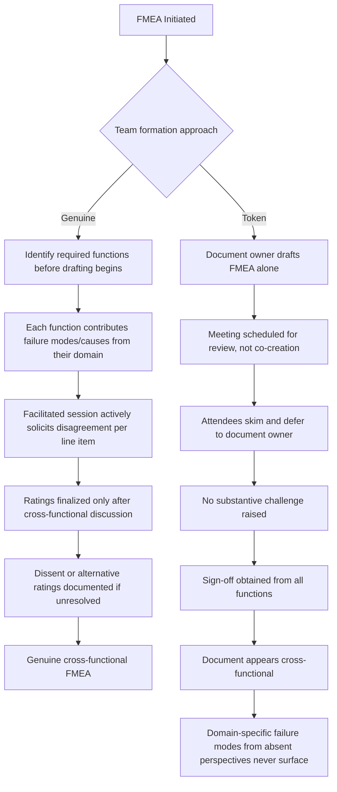

## Lack of Genuine Cross-Functional Input

### Overview

FMEA methodology (both AIAG-4th edition and AIAG-VDA) is built on the premise that risk cannot be adequately identified or evaluated by a single discipline. This anti-pattern occurs when an FMEA is nominally labeled "cross-functional" — a meeting is held, multiple names appear on the attendance sheet or sign-off page — but the actual analytical content is produced by one dominant discipline (typically the design or process engineer who owns the document), with other functions present in name only, disengaged, or unable to meaningfully contest the content. The document has the *appearance* of multi-disciplinary rigor without its substance.

### Why This Happens

**Key Points**

- FMEA sessions are frequently scheduled as long, dense meetings; attendees from functions like manufacturing, quality, service, or reliability may be present but multitasking or deferring to the document owner out of time pressure.
- Organizational hierarchy can suppress dissent: a junior quality engineer may hesitate to challenge a senior design engineer's Severity or Occurrence rating.
- Functions are often invited too late, after failure modes and causes are already drafted, reducing their role to rubber-stamping rather than co-authoring.
- Remote or asynchronous review (circulating a document for "comments" instead of live facilitated discussion) removes the interactive challenge-and-response that surfaces disagreement.
- Facilitators without trained FMEA facilitation skills default to asking "any objections?" rather than actively soliciting each function's specific perspective.
- Understaffing means the same individual is asked to represent multiple functions they are not truly expert in (e.g., one engineer signing as both "manufacturing" and "quality" representative).

### Manifestations of the Anti-Pattern

#### 1. Single-Author Drafting Presented as Team Consensus

The design or process engineer completes the entire FMEA independently, then distributes it in a meeting for approval rather than co-developing it live with the team — effectively converting a collaborative analysis method into a solo activity with a group sign-off.

#### 2. Token Representation

A function (e.g., service/warranty, or the end customer's perspective) is represented by an attendee with no real field or process knowledge, present only to satisfy an attendance requirement — meaning failure modes rooted in that function's domain (e.g., field-service-difficulty-related effects) are never genuinely surfaced.

#### 3. Deference to Rank or Ownership

Ratings and failure mode entries proposed by the process/design owner go unchallenged even when other functions privately disagree, because the perceived owner of the document is treated as having final authority over "their" FMEA.

#### 4. Missing Voice of the Customer / Service / Field Data

Without genuine input from service, warranty, or field-quality functions, failure modes that only manifest after extended use, in specific customer environments, or during field maintenance are systematically absent, since design and process engineers alone rarely have this visibility.

#### 5. Manufacturing/Process Engineering Absent from Design FMEA

A Design FMEA is completed without meaningful input from the people who will actually build or assemble the part, missing manufacturability-driven failure modes (e.g., a feature that is theoretically sound but nearly impossible to inspect or assemble correctly on the actual production line).

#### 6. No Documented Dissent or Alternative Viewpoints

A genuinely cross-functional session on a non-trivial item will typically surface some disagreement on ratings or failure mode inclusion. An FMEA record showing perfect, immediate consensus across every line item — especially on a complex or novel item — is itself a signal that challenge did not genuinely occur.

### Required vs. Token Participation by Function

| Function | Genuine Contribution Expected | Symptom When Token Only |
| --- | --- | --- |
| Design Engineering | Failure modes tied to design intent, functional requirements | (Usually the dominant voice — under-participation of others is the issue, not this function) |
| Manufacturing/Process Engineering | Manufacturability, assembly, tooling-driven causes | Process feasibility issues surface only after launch, not in the FMEA |
| Quality Engineering | Detection method feasibility, measurement system capability | Detection ratings assumed optimistic without Gage R&R or control plan linkage |
| Service/Warranty | Field failure modes, effects visible only after extended use | Field-only failure modes (e.g., wear, environmental exposure) absent |
| Reliability Engineering | Occurrence estimates grounded in test/field statistics | Occurrence ratings are guesses with no data citation |
| Supplier Representative (if applicable) | Process-specific causes for purchased components | Supplied-part failure modes generalized incorrectly from the buyer's assumptions |
| Safety/Regulatory (if applicable) | Severity classification tied to regulatory/safety standards | Severity systematically understated for compliance-relevant effects |

### Structural Diagram: Genuine vs. Token Cross-Functional Process

### Why This Is Dangerous

**Key Points**

- The entire methodological justification for FMEA's reliability rests on triangulating risk from multiple domains of expertise; without genuine input, the analysis inherits the blind spots of whichever single function actually authored it.
- Detection ratings in particular are unreliable without quality/measurement expertise, since design or process engineers may not know actual gauge capability or inspection error rates.
- Occurrence ratings are unreliable without reliability engineering or field-data input, since a design engineer's intuition about failure frequency is not equivalent to statistical evidence.
- Field-only failure modes (wear-out, environmental exposure over time, misuse patterns) are structurally invisible to design/manufacturing-only teams and require service/field input to surface at all.
- Audits (e.g., IATF 16949-based automotive audits) specifically check attendance records against actual evidence of multi-disciplinary contribution (e.g., whether the failure modes reflect knowledge only a specific function would have), and superficial cross-functional participation is a common audit finding.

### Detection and Prevention Strategies

#### Process-Level Controls

- **Define required functional representation before scheduling**, based on the item type (Design FMEA vs. Process FMEA) and its risk profile, rather than defaulting to whoever is available.
- **Co-develop, don't just review**: schedule the working session as a live drafting session with all functions present from the start, not a pre-written document circulated for rubber-stamp approval.
- **Require each function's specific contribution to be traceable** — e.g., annotate which function proposed a given failure mode, cause, or rating, making token attendance visible in the record itself.
- **Use trained facilitators** (a distinct role from the document owner) who are responsible for actively drawing out each function's perspective and surfacing disagreement rather than seeking quick consensus.

#### Review-Level Controls

- **Audit for participation evidence, not just attendance**: check whether failure modes in the document reflect knowledge specific to each listed attendee's function.
- **Flag suspiciously uniform consensus** on complex or novel items as requiring re-review, since disagreement is a normal and healthy sign of genuine cross-functional engagement.
- **Verify Detection and Occurrence ratings are traceable to the function with actual expertise** (quality/measurement for Detection, reliability/field-data for Occurrence) rather than to the document owner by default.

#### Organizational/Cultural Controls

- **Actively invite dissent**, particularly from lower-hierarchy participants, and separate the role of "facilitator" from "document owner" so no single person controls both the content and the discussion.
- **Protect psychological safety** so a quality or service representative can challenge a design engineer's rating without professional risk.
- **Resource cross-functional time properly**: treat FMEA sessions as requiring dedicated, focused time from each function rather than scheduling them as an add-on to already-full calendars.

### Practical Checklist for Reviewers

**Key Points**

- Does the attendance list match functions with actual, verifiable expertise relevant to this specific item (not just generic role titles)?
- Can specific failure modes, causes, or ratings be traced to the function most qualified to contribute them (e.g., Detection ratings linked to quality/measurement input)?
- Is there any documented disagreement or alternative viewpoint anywhere in the document's history, especially for a complex or novel item?
- Were field-service or warranty perspectives represented for failure modes that would only manifest after extended field use?
- Was the document drafted collaboratively in-session, or authored beforehand and merely circulated for approval?
- If a function's representative changed between sessions, is there evidence the person actually had domain expertise, not just organizational availability?

**Related Topics**

- FMEA facilitation techniques and the facilitator vs. document-owner role separation
- Linking Detection ratings to measurement system analysis (Gage R&R)
- Incorporating field/warranty data into Occurrence ratings
- Design FMEA to Process FMEA handoff and required participants
- Psychological safety and dissent management in technical reviews
- Copying prior FMEAs without genuine analysis
- Gaming or misusing the RPN score
- Team competency and training requirements for FMEA participants