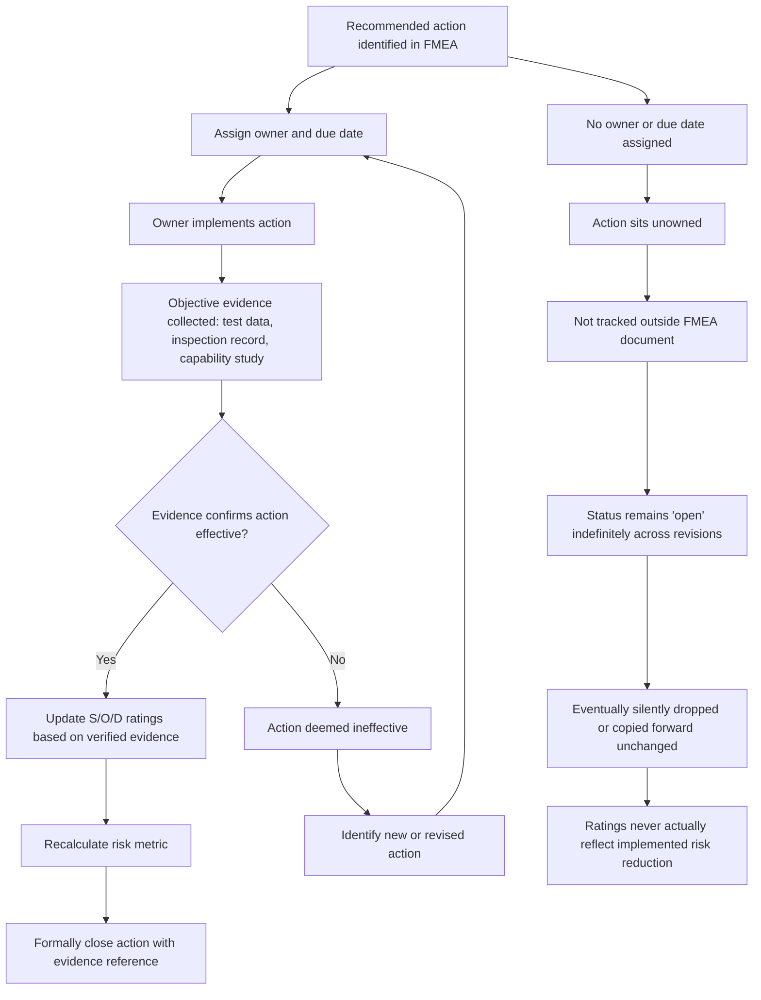

## Failing to Close Recommended Actions

### Overview

FMEA is only a risk-reduction tool if identified recommended actions are actually implemented, verified, and reflected in updated ratings. This anti-pattern occurs when recommended actions are documented — sometimes with real analytical rigor behind their identification — but are never completed, never verified as effective, or are marked "closed" without genuine evidence of implementation. The FMEA becomes a static risk *inventory* rather than a dynamic risk *reduction* process, and the document's open-action status diverges from the actual state of risk in the field or on the line.

### Why This Happens

**Key Points**

- Recommended actions are often owned by functions or individuals other than the FMEA facilitator/document owner (e.g., tooling, purchasing, a supplier), creating accountability gaps once the meeting ends.
- Actions frequently require capital, schedule, or cross-departmental coordination that competes with other business priorities, causing them to stall indefinitely without formal cancellation or re-negotiation.
- Without a tracking system independent of the FMEA document itself, actions have no forcing function to surface as overdue.
- Programs under launch-date pressure may implicitly deprioritize action closure once the immediate milestone (e.g., design review, PPAP submission) has passed, since the FMEA itself is not actively re-reviewed afterward.
- Closing an action in the tracking system is sometimes treated as an administrative/paperwork step rather than requiring the same evidentiary rigor as the original risk identification.
- No defined consequence exists in many organizations for an action that simply ages without progress, versus one that is actively escalated.

### Manifestations of the Anti-Pattern

#### 1. Actions Listed But Never Assigned an Owner or Due Date

A recommended action appears in the FMEA (e.g., "add fixture to prevent misassembly") with no named responsible individual and no target date, making it structurally impossible to track or escalate.

#### 2. Perpetually "In Progress" Actions

An action remains in "in progress" or "open" status across multiple FMEA revisions/reviews with no forward movement, no updated timeline, and no re-evaluation of priority — effectively becoming permanent, un-actioned risk acceptance without ever being formally accepted as such.

#### 3. Closure Without Verification Evidence

An action is marked "complete" or "closed" based on a verbal confirmation, an email, or an assumption that a downstream team implemented it, without objective evidence (a validated drawing change, a capability study, an inspection record, a training log) confirming the control actually exists and functions as intended.

#### 4. Rating Reduced Before Action Verified Effective

The Occurrence or Detection rating is lowered in the FMEA to reflect an anticipated benefit of the action *before* the action has been implemented and its effectiveness confirmed — inflating the appearance of reduced risk while the underlying control may not yet exist or may not work as expected.

#### 5. Action Silently Dropped During Document Revision

A recommended action present in an earlier FMEA revision disappears in a later revision with no explanation, closure evidence, or documented rationale for deprioritization — often occurring when FMEAs are copied/updated by someone unfamiliar with the action's history (see "Copying prior FMEAs without genuine analysis").

#### 6. No Re-Escalation Mechanism for Stalled Actions

The organization has no defined process for escalating an action that has missed its due date multiple times, so it simply persists indefinitely at the same organizational level without ever reaching someone with the authority to resource it or formally accept the risk.

#### 7. Action Ownership Transferred Without Handoff

The responsible engineer changes roles or leaves the project, and the action is never reassigned, effectively orphaning it while it may still appear as "open" and assigned to someone no longer tracking it.

### Structural Diagram: Action Lifecycle — Intended vs. Failure Pattern

### Why This Is Dangerous

**Key Points**

- The FMEA's credibility as a living risk-management document collapses if its action list does not reflect real-world state; stakeholders relying on "risk has been mitigated" statements are misinformed.
- Ratings reduced in anticipation of an unverified action create a false sense of reduced risk that can influence downstream decisions (e.g., a program office deciding not to add a redundant control because "the FMEA shows RPN was already reduced").
- Orphaned or silently dropped actions mean identified risks are never formally accepted, transferred, or mitigated — they simply vanish from active management despite being known.
- In regulated or audited environments (e.g., IATF 16949, aerospace AS9145/APQP), open or improperly closed FMEA actions are a common and significant audit nonconformance, since action-tracking discipline is directly assessed as evidence of an effective quality management system.
- [Inference] Chronic failure to close actions can also produce organizational fatigue where teams stop taking the FMEA action list seriously at all, undermining engagement in future FMEA sessions regardless of the specific item under review.

### Detection and Prevention Strategies

#### Process-Level Controls

- **Track actions in a system independent of the static FMEA document** (e.g., a linked action-tracking database or program management tool) with automated reminders, so overdue items surface without relying on someone manually reviewing the FMEA file.
- **Require every recommended action to have a named individual owner and a specific due date** before the FMEA session concludes; an action without both should not be considered finalized.
- **Require documented objective evidence as the only acceptable basis for closure** — define upfront what evidence type is acceptable per action type (e.g., a capability study for a process change, a validated drawing revision for a design change, a training completion record for a procedural change).
- **Prohibit rating changes until closure evidence is reviewed and accepted**, decoupling "action planned" from "risk reduced" in the document itself.
- **Build periodic FMEA re-review into the program timeline** (not just at initial release), so open actions are revisited on a defined cadence rather than only when someone happens to reopen the document.

#### Review-Level Controls

- **Audit open-action age distribution**: a large number of actions open beyond their original due date without escalation activity indicates a systemic tracking failure, not isolated cases.
- **Sample-check closed actions against their cited evidence** to confirm the evidence actually supports the claimed closure (e.g., does the capability study actually cover the failure mode in question, and does it show adequate capability).
- **Compare sequential FMEA revisions** for actions that disappear without a closure record or documented rationale.

#### Organizational/Cultural Controls

- **Define and enforce an escalation path** for actions that miss their due date a defined number of times, ensuring persistent risk reaches someone with authority to resource it or formally accept it.
- **Make action-closure rate and evidence quality, not just count of actions opened, a tracked program health metric.**
- **Ensure ownership transfers include explicit action handoff** as part of standard role-transition or offboarding checklists for anyone holding open FMEA actions.

### Practical Checklist for Reviewers

**Key Points**

- Does every open recommended action have a named owner and a due date?
- For every closed action, is there specific, verifiable evidence (not a verbal confirmation) supporting the closure?
- Were S/O/D ratings updated only after closure evidence was reviewed, not in anticipation of a planned action?
- Are there actions present in a prior revision that are absent from the current revision with no documented closure or cancellation rationale?
- Is there a defined escalation path for actions that are significantly overdue, and is there evidence it has ever been used?
- If an action owner has changed roles, is there a documented handoff of the open action to a new owner?

**Related Topics**

- Action tracking systems and their integration with FMEA documentation
- Verification and validation evidence standards for corrective actions
- Copying prior FMEAs without genuine analysis
- Gaming or misusing the RPN score
- Linking FMEA to control plans and reaction plans
- Periodic FMEA review cadence and living-document practices
- Escalation frameworks for stalled quality/engineering actions
- Audit criteria for FMEA action closure (IATF 16949, AS9145/APQP contexts)