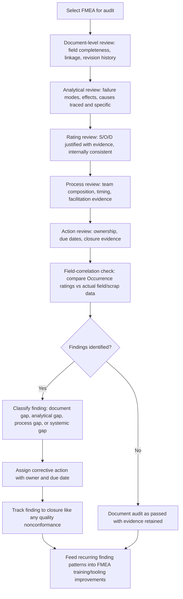

## Auditing FMEA Quality and Completeness

### Overview

Auditing FMEA quality and completeness is the systematic evaluation of an FMEA document (and the process that produced it) against defined criteria to determine whether it represents genuine, evidence-based risk analysis rather than a procedurally compliant but substantively weak artifact. Unlike a simple compliance check (does the document exist, are fields filled in), a quality audit evaluates whether the analytical content is defensible, traceable, current, and actually reduces risk. This discipline directly counters the anti-patterns covered elsewhere (RPN gaming, copied FMEAs, token cross-functional input, unclosed actions) by providing the detection mechanism that catches them.

### Audit Scope and Levels

**Key Points**

- **Document-level audit**: Reviews the FMEA form itself — field completeness, internal consistency, linkage to related documents (control plans, drawings, process flow diagrams).
- **Process-level audit**: Reviews how the FMEA was developed — team composition, evidence used, facilitation quality, timing relative to design/process maturity.
- **System-level audit**: Reviews the organization's overall FMEA program — training, tools, metrics, escalation processes, and whether lessons learned feed back into standard work.
- **Field-correlation audit**: Reviews whether the FMEA's predictions (Occurrence ratings, identified failure modes) match actual field/warranty/scrap data over time — the ultimate test of analytical validity.

### Core Completeness Criteria

#### Structural Completeness

- Every required field populated: item/function, failure mode, effect(s), Severity, cause(s)/mechanism(s), Occurrence, current controls (prevention and detection), Detection, RPN or Action Priority, recommended actions, responsibility, target date, status, and (after action) results with revised ratings.
- Linkage fields present and valid: cross-references to process flow diagrams, control plans, drawings, and related FMEAs (e.g., Design FMEA to Process FMEA traceability).
- Revision history intact and dated, showing the document's evolution rather than a single static snapshot.

#### Analytical Completeness

- Failure modes reflect all reasonable ways the function can fail, not just the historically known ones — including failure modes with no prior occurrence (a common gap, see "Copying prior FMEAs without genuine analysis").
- Effects are traced at multiple levels where applicable (local effect, next-level effect, end-user/system effect), not just a single generic effect statement.
- Causes are stated at a level specific enough to be actionable (e.g., "fixture locating pin worn beyond tolerance" rather than "human error").
- Current controls are described specifically enough to be verifiable (naming the actual inspection method, sample size, or automated check — not just "inspection").

### Rating Quality Criteria

**Key Points**

- Each Severity, Occurrence, and Detection rating should be traceable to a stated rationale or evidence source, not asserted without justification.
- Ratings should be internally consistent: if the current control described is a 100% automated poke-yoke, the Detection rating should reflect very high detection effectiveness; a mismatch between the control description and the rating is a quality flag.
- Occurrence ratings should reflect actual data (field returns, process capability, test failure rates) where available, with explicit acknowledgment when a rating is an estimate due to lack of data (a genuinely new failure mode with no history should generally not receive an optimistically low Occurrence rating by default).
- Detection ratings should reflect the demonstrated capability of the specific control described (e.g., supported by Gage R&R data, PPM escape data), not an assumed capability.
- Auditors should specifically check for RPN gaming patterns (see "Gaming or misusing the RPN score"): ratings that appear reverse-engineered from a threshold, unjustified rating decreases at closure, or averaged/softened team ratings.

### Process Quality Criteria

| Criterion | Quality Indicator | Red Flag |
| --- | --- | --- |
| Team composition | Functions represented match domain expertise needed (design, manufacturing, quality, reliability, service) | Token attendees, single-author drafting |
| Timing | FMEA developed/updated before design freeze or process launch, allowing action on findings | FMEA completed retroactively as a formality after launch |
| Evidence basis | Ratings cite data sources (test reports, field data, capability studies) | Ratings presented without any cited basis |
| Facilitation | Documented disagreement/discussion exists for non-trivial items | Suspiciously uniform, unchallenged consensus throughout |
| Action tracking | Actions have owners, dates, and evidence-based closure | Actions unowned, stalled, or closed without evidence |
| Currency | FMEA revised to reflect design/process changes, field issues, and closed actions | FMEA static since initial release despite known changes |

### Structural Diagram: FMEA Quality Audit Workflow

### Audit Techniques

#### Cross-Referencing Against Related Documents

Verify that every current control listed in the FMEA actually appears in the corresponding control plan, and vice versa — a control plan step with no corresponding FMEA entry, or an FMEA control not reflected in the control plan, indicates a disconnect between the risk analysis and the operational document meant to implement it.

#### Sampling and Deep-Dive

Rather than reviewing every line of a large FMEA superficially, select a sample of high-Severity or high-RPN/high-AP line items for deep verification: trace the cited evidence, confirm the control physically exists (e.g., walk the production floor to verify a described poka-yoke is actually installed and functioning), and confirm closure evidence for any associated actions.

#### Field-Data Correlation

Compare the FMEA's Occurrence ratings and identified failure modes against actual warranty, scrap, or field-return data for the item (or its closest predecessor). A significant field failure mode absent from the FMEA, or an Occurrence rating far more optimistic than actual field data supports, is strong evidence of analytical gaps.

#### Interview-Based Verification

Interview individual team members listed as contributors, separately from the group, to assess whether their stated domain input is genuinely reflected in the document and whether they recall meaningful discussion or disagreement — a technique specifically useful for detecting token cross-functional participation.

#### Boilerplate/Artifact Detection

Scan for leftover part numbers, mismatched terminology, or process steps referenced in the FMEA that don't exist in the actual current process — efficient indicators of copy-paste reuse without genuine re-analysis.

### Common Findings and Their Root Causes

**Key Points**

- **Missing failure modes for new technology/materials** → often traced to over-reliance on a prior FMEA as a template without a documented delta/change analysis.
- **Ratings with no cited evidence** → often traced to absence of a required evidence-citation field or convention in the FMEA template/tool.
- **Actions open far past due date with no escalation** → often traced to lack of an independent action-tracking system or undefined escalation path.
- **Inconsistent ratings across similar failure modes within the same FMEA** → often traced to multiple contributors rating independently without calibration discussion.
- **FMEA not updated after a field failure related to a documented failure mode** → often traced to no defined trigger/process requiring FMEA re-review upon a field issue.

### Establishing an Audit Program

**Key Points**

- Define audit frequency and trigger events (e.g., scheduled periodic audits, plus event-triggered audits after a field failure, a significant design change, or a supplier change).
- Use a standardized audit checklist/scorecard so findings are comparable across auditors and over time, rather than relying on unstructured subjective review.
- Ensure auditors have FMEA methodology training and, ideally, are independent of the team that authored the document being audited, to reduce confirmation bias.
- Track audit findings as formal nonconformances with the same rigor as other quality system findings, including root cause analysis for systemic (not just document-specific) issues.
- Feed recurring finding patterns back into organizational-level improvements: template redesign, additional facilitator training, tool changes (e.g., mandatory evidence-citation fields), or revised review governance — closing the loop between auditing and continuous improvement.

### Practical Checklist for Auditors

**Key Points**

- Are all required fields complete, and is the revision history intact and plausible given the item's development timeline?
- Does each Severity, Occurrence, and Detection rating have a traceable evidence source or documented rationale?
- Are ratings internally consistent with the described current controls?
- Does the team composition reflect genuine domain expertise for this specific item, verifiable beyond the attendance list?
- Are all open actions assigned an owner and due date, and are closed actions supported by objective evidence?
- Does the FMEA's Occurrence data and failure mode list correlate reasonably with actual field/warranty/scrap data for this item or its closest predecessor?
- Is there evidence of genuine analytical engagement (documented disagreement, evidence citations, item-specific detail) rather than boilerplate or copied content?

**Related Topics**

- Gaming or misusing the RPN score
- Copying prior FMEAs without genuine analysis
- Lack of genuine cross functional input
- Failing to close recommended actions
- Linking FMEA to control plans and reaction plans
- FMEA program metrics and continuous improvement feedback loops
- Field-data correlation and Occurrence rating calibration
- Training and competency requirements for FMEA facilitators and auditors