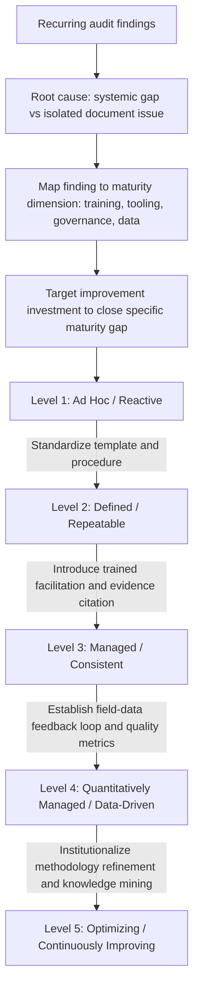

## FMEA Maturity Models

### Overview

An FMEA maturity model is a structured framework for assessing how effectively an organization's FMEA practice functions as a genuine risk-reduction discipline, as opposed to a compliance formality. Maturity models organize capability across a spectrum of levels — typically from ad hoc, reactive documentation through to fully integrated, data-driven, continuously improving risk management — and provide organizations with a diagnostic tool to identify their current state and a roadmap for advancement. Maturity assessment operates at the organizational/system level, complementing document-level and process-level FMEA quality audits.

### Purpose of Maturity Modeling

**Key Points**

- Provides a common vocabulary and reference framework for benchmarking FMEA practice across teams, sites, or business units within an organization.
- Distinguishes symptoms (a specific weak FMEA document) from root causes (a systemic organizational gap, such as absent training or no field-data feedback loop) by evaluating the *system* that produces FMEAs, not just individual outputs.
- Supports resource allocation decisions: identifying whether investment should go toward training, tooling, governance, or data infrastructure based on where the organization actually sits on the maturity spectrum.
- Enables tracking of improvement over time using a consistent framework, rather than relying solely on anecdotal or audit-by-audit assessment.
- [Inference] Because no single FMEA maturity model is universally standardized the way the AIAG-VDA rating scales are, organizations often adapt generic quality-maturity frameworks (e.g., CMMI-style level structures) specifically to FMEA practice rather than adopting a single external standard verbatim.

### Generic Maturity Level Structure

Most FMEA maturity models, whether custom-built or adapted from broader quality maturity frameworks, follow a similar five-level progression:

#### Level 1 — Ad Hoc / Reactive

- FMEAs are created inconsistently, often only when required by a customer or contract, with no standardized template or process.
- No formal training; facilitators are self-taught or learn by observing others.
- Ratings are subjective with no evidence citation convention.
- Documents are rarely revisited after initial completion; actions frequently go untracked or unclosed.
- FMEA is viewed primarily as a deliverable/checkbox rather than an analytical tool.

#### Level 2 — Defined / Repeatable

- A standardized template and basic procedure exist and are used consistently across projects.
- Basic training is provided, typically covering the mechanics of filling out the form (S/O/D scales, RPN calculation) rather than deep facilitation skill.
- Cross-functional attendance is expected, though genuine engagement quality varies (susceptible to "Lack of genuine cross functional input").
- Action tracking exists but may rely on manual processes (spreadsheets, static tracking) prone to items falling through gaps.
- FMEAs are typically created once per program milestone rather than treated as living documents.

#### Level 3 — Managed / Consistent

- Rating conventions require evidence citation as standard practice; unjustified ratings are flagged in review.
- Facilitation is performed by trained facilitators, often distinct from the document owner, applying structured techniques to surface disagreement.
- Action tracking is integrated into a dedicated system with defined escalation paths for overdue items.
- Periodic quality audits of FMEA documents are conducted using defined criteria (see "Auditing FMEA quality and completeness").
- Linkage between Design FMEA, Process FMEA, and control plans is systematically verified, not ad hoc.

#### Level 4 — Quantitatively Managed / Data-Driven

- Occurrence and Detection ratings are calibrated against actual field, warranty, and process capability data on an ongoing basis, closing the loop between predicted and actual risk.
- FMEA quality metrics (e.g., audit finding rates, action closure rates, rating-to-field-data correlation) are tracked and reviewed at a program or organizational level, not just per document.
- Lessons learned from field failures systematically trigger FMEA updates through a defined process, rather than depending on individual initiative.
- Tooling supports traceability, revision control, and cross-referencing automatically (e.g., FMEA software integrated with control plan and drawing systems).
- Gaming behaviors (RPN threshold-anchoring, rating averaging) are actively monitored for and addressed as they are identified through data patterns, not just individual audit findings.

#### Level 5 — Optimizing / Continuously Improving

- The organization treats FMEA methodology itself as subject to continuous improvement: templates, rating scales, facilitation techniques, and tooling are periodically re-evaluated and refined based on aggregated effectiveness data.
- Predictive analytics or systematic historical analysis inform proactive identification of failure modes for genuinely new designs, extending beyond individual team knowledge.
- FMEA practice is tightly integrated with broader systems engineering, reliability engineering, and design-for-six-sigma or similar disciplines, rather than functioning as an isolated quality activity.
- Organizational knowledge captured in FMEAs is systematically mined to improve design standards, DFMEA/PFMEA generic libraries, and training content across the enterprise.
- Maturity assessment itself is periodically revisited and the model refined based on what has proven to actually correlate with reduced field failures.

### Structural Diagram: Maturity Progression and Key Transition Drivers

### Maturity Dimensions Assessed

Rather than a single overall score, mature assessment frameworks typically evaluate maturity across several independent dimensions, since an organization can be advanced in one area and weak in another:

| Dimension | Low Maturity Indicator | High Maturity Indicator |
| --- | --- | --- |
| Process standardization | Inconsistent templates/procedures across teams | Single standardized, enforced methodology |
| Training and competency | Self-taught or no formal facilitator training | Certified/structured facilitator development program |
| Team engagement | Token cross-functional participation | Documented, genuine multi-disciplinary contribution |
| Evidence and data rigor | Ratings asserted without citation | Ratings calibrated against field/test/capability data |
| Action management | Manual, untracked, or unclosed actions | Integrated tracking with defined escalation |
| Document currency | Static, one-time documents | Living documents updated on defined triggers |
| Quality assurance | No systematic audit | Regular structured audits with tracked findings |
| Organizational learning | Lessons learned not systematically captured | Field data and audit findings feed back into standards/training |

### Common Pitfalls in Applying Maturity Models

**Key Points**

- **Treating the maturity level as a badge rather than a diagnostic tool** — organizations may claim a higher level than genuinely evidenced, undermining the model's purpose (an anti-pattern parallel to gaming the RPN score itself).
- **Assessing maturity only at the document level** without examining the underlying process and organizational dimensions that actually produced the documents.
- **Pursuing uniform advancement across all dimensions simultaneously** rather than prioritizing the dimension with the greatest current risk exposure or weakest performance.
- **Adopting a maturity model without adapting it to organizational context** (e.g., applying an automotive-oriented model unmodified to a very different regulated or unregulated industry) — [Speculation] the specific level definitions and weighting of dimensions likely need contextual adjustment for domains such as aerospace, medical devices, or software-intensive systems where failure mode characteristics and regulatory expectations differ significantly from automotive practice.
- **Failing to link maturity assessment results to actual resourcing decisions**, making the assessment an academic exercise disconnected from real improvement investment.

### Using Maturity Assessment to Drive Improvement

**Key Points**

- Conduct maturity assessment as a distinct activity from individual document audits, typically annually or at major program/organizational milestones, using structured interviews, document sampling, and metrics review across multiple teams or sites.
- Prioritize improvement investment toward the lowest-scoring dimension with the highest associated risk exposure, rather than spreading effort evenly.
- Use maturity assessment findings to justify tooling investment (e.g., moving from spreadsheet-based FMEA to integrated software with built-in traceability and evidence-citation enforcement) where the assessment reveals tooling as the binding constraint.
- Re-assess on a defined cadence to verify that targeted improvements actually moved the organization's dimension-specific scores, closing the loop between the maturity model and continuous improvement in the same way action tracking closes the loop for individual FMEA line items.

### Practical Checklist for Applying a Maturity Model

**Key Points**

- Has the organization selected or adapted a maturity framework with dimensions relevant to its specific industry and regulatory context?
- Is the current maturity level assessed using objective evidence (audit data, metrics, sampled documents) rather than self-reported impression?
- Are maturity scores tracked per dimension, not just as a single aggregate level, to identify specific improvement priorities?
- Is there a documented link between maturity assessment findings and actual resource allocation for training, tooling, or governance changes?
- Is maturity reassessed on a defined cadence to verify improvement initiatives produced measurable change?
- Does the model account for genuine field-data correlation (Level 4+ characteristics) rather than stopping at process standardization alone?

**Related Topics**

- Auditing FMEA quality and completeness
- Gaming or misusing the RPN score
- Lack of genuine cross functional input
- Failing to close recommended actions
- Field-data correlation and Occurrence rating calibration
- FMEA tooling and software selection criteria
- Facilitator training and certification programs
- Integrating FMEA with reliability engineering and systems engineering disciplines