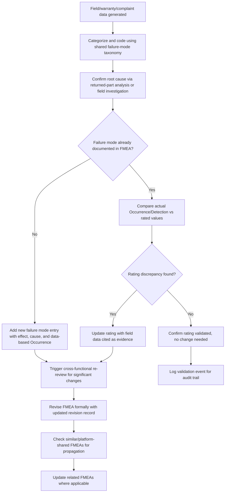

## Feeding Field and Warranty Data Back into FMEA

### Overview

Feeding field and warranty data back into FMEA is the practice of systematically capturing real-world failure information — from customer complaints, warranty claims, service records, and field returns — and using it to update, validate, and correct existing FMEAs. This closes the loop between predicted risk (the FMEA's Occurrence and Detection ratings, and the completeness of its failure mode list) and actual risk (what genuinely happens to the product or process in the field). Without this feedback loop, an FMEA remains a static, opinion-based prediction that can drift arbitrarily far from reality over a product's life.

### Why This Feedback Loop Matters

**Key Points**

- Occurrence ratings in a newly developed FMEA are frequently estimates based on similar-part history, engineering judgment, or limited test data; field data is the ground truth that validates or invalidates those estimates.
- Detection ratings assume a control catches a failure before it reaches the customer; warranty and field-return data reveal the actual escape rate, directly measuring whether that assumption holds.
- New failure modes not anticipated during the original FMEA session are often only discovered through field experience — feeding this back is the primary mechanism for closing analytical gaps identified after launch.
- Regulatory and industry frameworks (e.g., IATF 16949 in automotive) expect a defined process connecting field/warranty data analysis back to design and process risk documentation, making this loop an auditable requirement, not merely good practice.
- This feedback loop is also the primary countermeasure to several anti-patterns covered elsewhere: it exposes RPN gaming (ratings inconsistent with actual failure rates), reveals gaps from copied FMEAs (missing failure modes surfaced by field issues), and validates whether closed actions were genuinely effective.

### Data Sources for the Feedback Loop

| Source | What It Reveals | Typical Owner |
| --- | --- | --- |
| Warranty claims | Failure mode frequency, time-to-failure, cost impact | Service/warranty function |
| Field service reports | Failure symptoms, repair actions taken, environmental context | Field service/customer support |
| Customer complaints (non-warranty) | Failure modes not severe enough for formal claims, usage-pattern issues | Customer support/quality |
| Returned parts analysis | Physical root cause confirmation, actual failure mechanism | Reliability/quality engineering |
| In-process scrap and rework data | Process-related failure modes, actual Occurrence for process FMEAs | Manufacturing/quality |
| Supplier PPM and 8D reports | Supplied-component failure modes and root causes | Supplier quality engineering |
| Fleet/telematics monitoring (where available) | Failure precursors, usage severity, degradation trends | Reliability engineering |

### The Feedback Process

#### 1. Data Collection and Categorization

Field and warranty data must be captured with enough specificity to map to a corresponding FMEA line item — this typically requires a standardized failure-mode coding taxonomy shared between service/warranty systems and engineering, since generic complaint codes (e.g., "part failed") are too coarse to link to a specific failure mode entry.

#### 2. Root Cause Confirmation

Raw warranty or complaint data indicates a symptom, not necessarily the failure mode or cause as defined in the FMEA. Returned-part analysis or field investigation is often needed to confirm the actual failure mechanism before it can be meaningfully compared against the FMEA's documented causes.

#### 3. Occurrence Rating Recalibration

Actual failure rate data (e.g., failures per thousand units per time period) is compared against the Occurrence rating scale's defined frequency bands to determine whether the original rating was accurate, optimistic, or pessimistic, and the rating is updated accordingly with the field data cited as the evidence source.

#### 4. Detection Effectiveness Assessment

If a failure mode was supposed to be caught by an existing control (per the FMEA's Detection rating) but instead escaped to the field, this is direct evidence that the control's actual effectiveness differs from its rated effectiveness — triggering either a Detection rating correction or a new action to genuinely improve the control.

#### 5. New Failure Mode Identification

Field issues with no corresponding entry in the existing FMEA are logged as new failure modes to be added, along with their observed effects, root cause (once confirmed), and appropriately data-informed Occurrence rating.

#### 6. FMEA Update and Re-Review

Updates are incorporated into the FMEA as a formal revision (not an informal note), ideally through a reconvened cross-functional review for significant findings, ensuring the same rigor applied at initial development is applied to field-driven updates.

#### 7. Downstream Propagation

Confirmed findings are checked against similar or platform-shared FMEAs (same component/process used elsewhere) to determine whether the same update should be propagated, preventing the same field issue from recurring undetected on a related program.

### Structural Diagram: Field Data Feedback Loop

### Quantitative Considerations

Occurrence rating scales are typically anchored to failure rate bands (e.g., failures per thousand vehicles/units, or a Cpk-equivalent for process FMEAs). When recalibrating from field data:

$$\text{Observed Failure Rate} = \frac{\text{Number of Confirmed Failures}}{\text{Population Exposed} \times \text{Time or Usage Period}}$$

This observed rate is mapped against the Occurrence scale's defined bands (e.g., a scale might define Occurrence = 4 as corresponding to roughly 1 in 2,000 units) to select the evidence-supported rating, rather than retaining an originally assumed value. [Inference] Because failure rate bands and their exact numeric boundaries vary by organization and by which FMEA standard (AIAG-4th edition vs. AIAG-VDA) is in use, the specific mapping must be taken from the organization's own defined rating scale rather than assumed universal.

### Common Obstacles to Effective Feedback

**Key Points**

- **Disconnected systems**: Warranty/service databases and engineering FMEA repositories often use different coding schemes and are not integrated, requiring manual translation that is error-prone and easily deprioritized.
- **Attribution delay**: Warranty and field data often lag product launch by months or years, meaning the feedback arrives after the responsible engineering team has moved to other programs, weakening ownership.
- **Insufficient sample size early in field life**: Early field data may be too sparse to distinguish a genuine rate change from noise, requiring statistically informed judgment about when a rating update is justified.
- **No formal trigger requiring FMEA re-review**: Without a defined threshold or event (e.g., "any warranty issue exceeding X PPM triggers FMEA re-review"), field data may be analyzed and reported without ever flowing back into the actual risk document.
- **Root cause misattribution**: Field symptom data alone (without returned-part analysis) can be miscategorized against the wrong FMEA failure mode or cause, corrupting the feedback rather than improving it.

### Detection and Prevention Strategies

#### Process-Level Controls

- **Establish a shared failure-mode taxonomy** used consistently across warranty/service coding and engineering FMEA documentation, enabling direct mapping between field data and FMEA line items.
- **Define explicit triggers for mandatory FMEA re-review** based on field data thresholds (e.g., PPM exceedance, a specific safety-related complaint, a new failure mode discovered) rather than relying on periodic review alone.
- **Assign clear ownership for the feedback loop itself** — a defined function or role responsible for routing field data findings to the correct FMEA owner, since original engineering owners may have moved on.
- **Integrate FMEA software/tools with warranty and quality databases** where feasible, to reduce manual translation errors and delays.

#### Review-Level Controls

- **Audit FMEA Occurrence ratings against actual field data** for items with sufficient field history as a standard part of FMEA quality audits (see "Auditing FMEA quality and completeness").
- **Verify that significant field findings produced an actual FMEA revision**, not just a closed corrective-action report disconnected from the underlying risk document.

#### Organizational/Cultural Controls

- **Treat field data feedback as core to the FMEA discipline, not a separate warranty-analytics activity** — position it as the validation step that gives the entire FMEA methodology credibility.
- **Recognize and resource the feedback function explicitly**, since it often falls into organizational gaps between engineering, quality, and service functions if no one owns it directly.

### Practical Checklist for Reviewers

**Key Points**

- Is there a defined, working process connecting warranty/field data to FMEA updates, with evidence it has actually been used (not just documented as a policy)?
- For failure modes with sufficient field history, does the FMEA's Occurrence rating align with actual observed failure rates, or is there an unexplained discrepancy?
- Have field-discovered failure modes with no corresponding FMEA entry been identified and added?
- Where a control's Detection rating implied high effectiveness, does field escape data support that, or reveal a gap?
- Are significant field-driven findings propagated to similar or platform-shared FMEAs, not just the specific FMEA where the issue first surfaced?
- Is there a defined threshold or trigger event that mandates FMEA re-review based on field data, and can its use be demonstrated?

**Related Topics**

- Auditing FMEA quality and completeness
- FMEA maturity models
- Gaming or misusing the RPN score
- Copying prior FMEAs without genuine analysis
- Failing to close recommended actions
- Occurrence rating scale calibration and failure rate mapping
- Root cause analysis techniques (5 Whys, fishbone, returned-part analysis)
- Linking FMEA to control plans and reaction plans