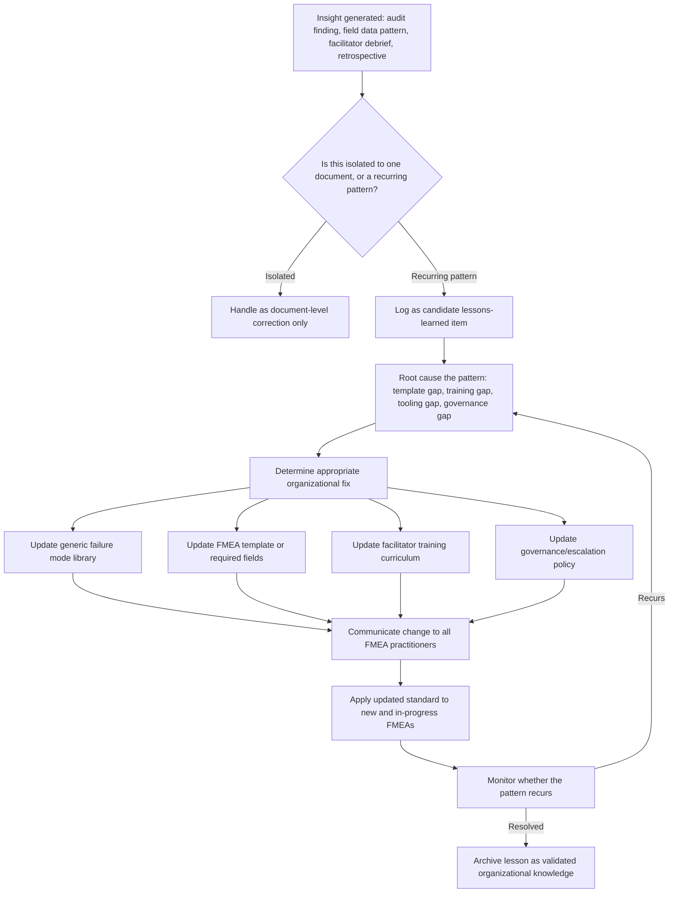

## Establishing Lessons Learned Feedback Loops

### Overview

A lessons learned feedback loop is the organizational mechanism by which insights generated during and after FMEA activity — including facilitation experience, analytical gaps discovered, field data findings, and audit results — are systematically captured, generalized, and fed back into the organization's standard FMEA practice (templates, generic failure mode libraries, training, and governance). This is distinct from feeding field/warranty data back into a *specific* FMEA (see "Feeding field and warranty data back into FMEA"): a lessons learned loop operates at the organizational/program level, ensuring that what one team learns from one item improves FMEA practice broadly, rather than the insight remaining isolated to a single document.

### Distinguishing Lessons Learned from Single-Document Updates

**Key Points**

- Updating one FMEA's Occurrence rating based on that item's field data is a document-level correction; recognizing that the same category of failure mode is systematically under-rated across the organization's generic failure mode library is a lessons-learned insight.
- A single facilitator noticing that cross-functional engagement improves when sessions are limited to 90 minutes is a local observation; codifying that into organizational facilitation guidance is a lessons-learned action.
- One audit finding a copied FMEA is a document-level nonconformance; recognizing that copied FMEAs recur specifically when reference-item comparison isn't a mandatory template field is a lessons-learned root cause requiring a systemic fix.
- The distinguishing test: does the insight, if unaddressed, only affect the one item/document, or does it represent a pattern likely to recur across other items, teams, or programs?

### Sources of Lessons Learned Input

| Source | Typical Insight Type |
| --- | --- |
| FMEA quality audits | Recurring document/process gaps (see "Auditing FMEA quality and completeness") |
| Field/warranty data analysis | Systematic Occurrence/Detection rating miscalibration patterns |
| Post-launch program retrospectives | Facilitation, timing, and resourcing issues specific to how the FMEA was conducted |
| Facilitator debriefs | Team dynamics issues, template usability problems, session structure effectiveness |
| Maturity assessments | Organization-wide capability gaps (see "FMEA maturity models") |
| Corrective action root cause analyses | Failure modes that trace back to gaps in generic FMEA knowledge or templates |
| Cross-program benchmarking | Best practices identified in one business unit not yet adopted elsewhere |
| Regulatory/customer audit findings | External validation of systemic weaknesses |

### Structural Diagram: Lessons Learned Loop Architecture

### Core Components of an Effective Loop

#### 1. Capture Mechanism

A defined, low-friction way for practitioners, facilitators, and auditors to log candidate lessons learned as they occur, rather than relying on memory or informal hallway conversations — commonly a structured log or database entry capturing the observation, its context, and the item/program where it arose.

#### 2. Triage and Pattern Recognition

A periodic review (e.g., quarterly) of accumulated lessons-learned entries to identify recurring themes across multiple items or programs, distinguishing genuine systemic patterns from one-off anomalies. This step prevents both under-reaction (dismissing a real pattern as isolated) and over-reaction (treating a single anomaly as requiring a broad policy change).

#### 3. Root Cause Attribution

For each identified pattern, determining which organizational lever is the actual root cause — a template design gap, insufficient facilitator training, a missing tooling feature (e.g., no mandatory evidence-citation field), or a governance gap (e.g., no defined re-review trigger) — since the corrective action differs substantially by category.

#### 4. Standard Update

Translating the root-caused insight into a concrete change to organizational standard work: revising the FMEA template, updating a generic/reference failure mode library used to seed new FMEAs, revising facilitator training materials, or adjusting review/audit criteria.

#### 5. Communication and Deployment

Actively communicating the change to all current FMEA practitioners and facilitators — not merely updating a document repository and assuming discovery — since a lesson that isn't actually known by practitioners cannot change behavior.

#### 6. Verification of Effectiveness

Monitoring subsequent FMEAs, audits, or field data to confirm the implemented change actually reduced recurrence of the original pattern, closing the loop in the same evidence-based manner required for individual FMEA action closure (see "Failing to close recommended actions").

### Generic Failure Mode Libraries as a Lessons Learned Repository

**Key Points**

- Many organizations maintain a generic or "seed" failure mode library — a curated list of failure modes, causes, and effects common to a given component type, material, or process category — used as a starting reference for new FMEAs.
- A mature lessons-learned loop treats this library as a living asset: newly discovered failure modes (from field data or audits) are added, and failure modes proven not to apply broadly are refined or annotated with applicability conditions.
- This directly supports legitimate carryover analysis (as distinct from the "Copying prior FMEAs without genuine analysis" anti-pattern): a well-maintained generic library gives teams a genuinely more complete and validated starting point, provided the delta/change analysis discipline is still applied.
- [Inference] Without active governance, a generic failure mode library can itself become stale or bloated over time, so maintaining it is typically assigned as an explicit ongoing responsibility rather than a one-time creation activity.

### Governance and Ownership

**Key Points**

- A lessons-learned loop requires a defined owner — often a reliability engineering function, a quality systems group, or an FMEA center-of-excellence — responsible for triage, root cause attribution, and standard updates, since without ownership captured insights tend to accumulate without ever being acted upon.
- Governance should define the cadence for triage review, the criteria for escalating an insight to a standard-work change, and the mechanism for communicating updates to practitioners.
- Cross-program or cross-site coordination is necessary in larger organizations to ensure a lesson learned in one business unit is evaluated for applicability elsewhere rather than remaining siloed.
- Lessons-learned activity should itself be auditable: an organization should be able to demonstrate which standard-work changes originated from which specific insights, providing traceability similar to action-closure evidence at the individual FMEA level.

### Common Obstacles

**Key Points**

- **No capture mechanism**: insights are discussed informally in meetings but never logged, so they are lost when the people involved move to other work.
- **Triage never occurs**: entries accumulate in a log with no periodic review, so patterns are never recognized even though the raw data exists.
- **Root cause attribution skipped**: a specific document is fixed, but the underlying template, training, or governance gap that allowed the issue is never addressed, guaranteeing recurrence.
- **Standard updates not communicated**: a template or library is updated, but practitioners continue using outdated versions because no active communication or deployment process exists.
- **No effectiveness verification**: a change is made and assumed to have worked, without checking whether the original pattern actually stopped recurring.
- **Ownership diffusion**: the loop is "everyone's responsibility," which in practice means no one is accountable for triage, root cause attribution, or follow-through.

### Detection and Prevention Strategies

#### Process-Level Controls

- **Implement a structured, low-friction capture tool** (a shared log, ticketing system, or database field) so lessons can be logged at the moment they are observed, by anyone — auditors, facilitators, engineers, service personnel.
- **Schedule mandatory periodic triage reviews** with defined attendance from the function responsible for FMEA governance, ensuring accumulated entries are actually reviewed rather than left dormant.
- **Require root cause attribution as a mandatory field** before any lessons-learned entry can be closed, preventing symptom-only fixes.
- **Maintain version-controlled generic failure mode libraries and templates** with clear change logs, so updates are traceable and discoverable by practitioners.

#### Review-Level Controls

- **Audit whether specific standard-work changes can be traced to specific originating insights**, verifying the loop is functioning rather than existing only as a policy statement.
- **Sample-check whether recently updated templates/libraries are actually in use** on current FMEA activity, not just published but unused.

#### Organizational/Cultural Controls

- **Assign explicit, resourced ownership** for the lessons-learned function rather than treating it as an unfunded collateral duty.
- **Recognize and reward the act of surfacing a lesson learned**, particularly when it originates from a mistake or gap, to counteract the natural tendency to under-report issues that reflect poorly on the reporting individual or team.
- **Close the loop visibly**: communicate not just the standard-work change itself but the originating insight and its impact, reinforcing that the capture mechanism produces real organizational change.

### Practical Checklist for Reviewers

**Key Points**

- Is there a defined, actively used mechanism for capturing candidate lessons-learned insights from audits, field data, retrospectives, and facilitator debriefs?
- Is there evidence of periodic triage review distinguishing recurring patterns from isolated incidents?
- For identified patterns, was root cause attributed to a specific organizational lever (template, training, tooling, governance) rather than only fixing the originating document?
- Were resulting standard-work changes (template revisions, library updates, training updates) actively communicated and deployed to practitioners?
- Is there evidence that implemented changes were verified to actually reduce recurrence of the original pattern?
- Is ownership of the lessons-learned function clearly assigned and resourced, with traceability between specific insights and specific standard-work changes?

**Related Topics**

- Feeding field and warranty data back into FMEA
- Auditing FMEA quality and completeness
- FMEA maturity models
- Copying prior FMEAs without genuine analysis
- Generic/seed failure mode library development and governance
- Facilitator training and certification programs
- Failing to close recommended actions
- Cross-program and cross-site knowledge sharing practices