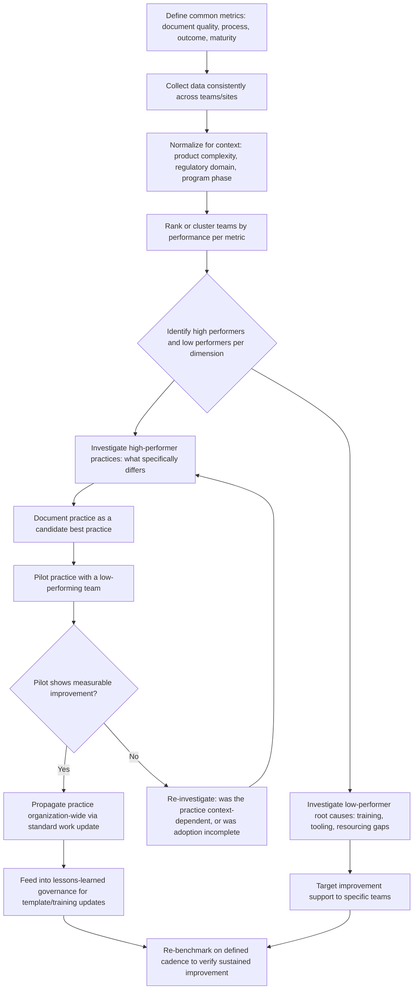

## Benchmarking FMEA Practices Across Teams

### Overview

Benchmarking FMEA practices across teams is the systematic comparison of FMEA process, quality, and outcomes between different teams, business units, sites, or programs within (or, in a limited sense, outside) an organization, in order to identify performance gaps, surface best practices, and standardize on the most effective approaches. Where maturity modeling assesses a single organization's capability against an absolute framework, benchmarking is inherently relative and comparative — it asks "how does Team A's FMEA practice compare to Team B's, and what can each learn from the other?" It is a primary mechanism for propagating improvements identified through auditing, field-data feedback, and lessons-learned processes across an organization that might otherwise leave good practice siloed.

### Why Cross-Team Benchmarking Is Necessary

**Key Points**

- Large organizations frequently develop FMEA practice unevenly across sites, business units, or programs, since local facilitators, tools, and management priorities differ even under a shared corporate template.
- Without benchmarking, an effective practice (e.g., a particularly rigorous evidence-citation convention, or a well-functioning action-escalation process) developed by one team remains isolated rather than propagated.
- Similarly, without cross-team visibility, a weak practice tolerated locally may go unrecognized because it is only compared against that team's own historical performance rather than against genuinely higher-performing peers.
- Benchmarking provides objective, comparative evidence to support resource allocation and standardization decisions, rather than relying on the loudest or most senior voice's opinion of what "good" looks like.
- Regulatory and customer audits in regulated industries sometimes explicitly probe for evidence of cross-site consistency, making benchmarking not merely an improvement activity but a compliance-relevant one.

### What to Benchmark

#### Document Quality Metrics

- Audit finding rates per FMEA (from structured quality audits — see "Auditing FMEA quality and completeness")
- Proportion of ratings with cited evidence versus unsupported assertions
- Rate of internal consistency issues (e.g., control description mismatched with Detection rating)

#### Process Metrics

- Average action closure time and percentage of actions closed with objective evidence versus informal confirmation
- Cross-functional attendance rates and, where measurable, engagement quality indicators (e.g., documented disagreement frequency as a proxy for genuine participation)
- Time from design/process freeze to FMEA completion (a proxy for whether the FMEA is timely enough to influence decisions versus completed retroactively)
- Frequency and consistency of periodic FMEA re-review

#### Outcome Metrics

- Correlation between FMEA Occurrence ratings and actual field/warranty failure rates (see "Feeding field and warranty data back into FMEA")
- Rate of field failures traced to failure modes absent from the corresponding FMEA (a measure of analytical completeness gaps)
- Recurrence rate of the same failure mode category across multiple programs (an indicator of whether lessons learned are propagating)

#### Maturity Metrics

- Maturity level or dimension scores from a maturity assessment framework (see "FMEA maturity models"), compared across teams/sites to identify which dimensions are furthest behind organizational leaders

### Structural Diagram: Cross-Team Benchmarking Cycle

### Benchmarking Methodology

#### 1. Establish Common, Comparable Metrics

Metrics must be defined and measured identically across teams for comparison to be valid — e.g., an "audit finding" must use the same checklist and severity classification everywhere, and "action closure" must require the same evidentiary standard, or the comparison will reflect measurement inconsistency rather than genuine performance difference.

#### 2. Normalize for Context

Raw comparison can be misleading without adjusting for relevant differences: a team working on a novel, high-complexity, safety-critical item should not be penalized relative to a team working on a mature, low-complexity item without accounting for that difference in inherent analytical difficulty.

#### 3. Identify Performance Clusters, Not Just Rankings

A simple ranked list can create unproductive competition or defensiveness; grouping teams into performance tiers (e.g., leading, adequate, needs improvement) per dimension, and focusing on the *specific practices* that distinguish tiers, is generally more constructive than an ordinal ranking alone.

#### 4. Investigate the "Why" Behind High Performance

Identifying that Team A has a higher action-closure rate is only the first step; understanding *why* — a dedicated action tracker with automated escalation, more disciplined facilitation, better resourcing — is what makes the finding actionable for other teams.

#### 5. Pilot Before Broad Propagation

A practice that works well in one team's specific context (culture, tooling, product type) may not transfer directly; piloting with a receptive low-performing team and measuring actual improvement before organization-wide rollout reduces the risk of propagating a practice that doesn't generalize.

#### 6. Re-Benchmark on a Defined Cadence

Benchmarking is not a one-time event; periodic re-measurement verifies that propagated practices produced sustained improvement and that new gaps (or new leading practices) are identified as they emerge.

### Common Pitfalls in Cross-Team Benchmarking

**Key Points**

- **Comparing incomparable contexts without normalization** — attributing a metric gap to practice quality when it's actually driven by inherent differences in product complexity, regulatory domain, or program maturity.
- **Using benchmarking punitively** — if lower-performing teams are penalized rather than supported, teams may respond by manipulating reported metrics (a benchmarking-specific variant of the same gaming dynamics seen in RPN misuse) rather than genuinely improving.
- **Benchmarking only document-level metrics** while ignoring process and outcome metrics, missing whether apparently "compliant" documents actually correlate with better field outcomes.
- **One-time benchmarking exercises** treated as a project rather than an ongoing capability, causing insights to go stale and improvements to go unverified.
- **Failing to close the loop back into governance** — identifying a best practice without a defined pathway (via lessons-learned processes) to actually update templates, training, or tooling organization-wide.
- **Over-indexing on a single metric** (e.g., RPN reduction rate) that can be gamed or that doesn't correlate with genuine risk reduction, rather than using a balanced set of document, process, and outcome metrics.

### Governance and Ownership

**Key Points**

- Cross-team benchmarking typically requires a centralized or coordinating function (e.g., a corporate reliability/quality group, or an FMEA center-of-excellence) with visibility across teams, since individual teams generally lack both the mandate and the comparative data to benchmark themselves meaningfully.
- Clear communication of benchmarking's improvement purpose — as distinct from individual performance evaluation — supports honest data reporting and receptiveness to adopting practices from other teams.
- Benchmarking findings should feed directly into the organization's lessons-learned governance (see "Establishing lessons learned feedback loops") to ensure identified best practices actually result in standard-work changes rather than remaining as a static comparative report.
- Sustained benchmarking programs typically require executive sponsorship, since implementing cross-team standardization (e.g., mandating a specific tool or template across previously autonomous teams) often requires authority beyond an individual team or program level.

### Practical Checklist for Reviewers

**Key Points**

- Are the metrics used for comparison defined and measured consistently across all benchmarked teams?
- Has data been normalized for relevant contextual differences (product complexity, regulatory domain, program phase) before drawing performance conclusions?
- Does the benchmarking process go beyond document-level metrics to include process metrics (action closure, engagement quality) and outcome metrics (field-data correlation)?
- When a high-performing practice is identified, is there a documented investigation into *why* it works, not just *that* it correlates with better metrics?
- Are candidate best practices piloted and measurably verified before being propagated organization-wide?
- Is there a defined pathway connecting benchmarking findings to actual governance changes (templates, training, tooling), and is benchmarking repeated on a defined cadence to verify sustained improvement?

**Related Topics**

- FMEA maturity models
- Auditing FMEA quality and completeness
- Establishing lessons learned feedback loops
- Feeding field and warranty data back into FMEA
- Generic/seed failure mode library development and governance
- FMEA tooling and software selection criteria
- Facilitator training and certification programs
- Organizational governance structures for quality/reliability functions