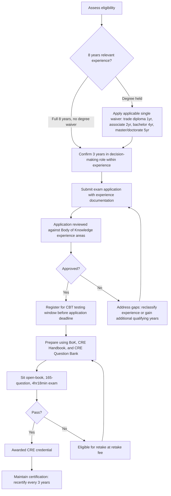

## ASQ Certified Reliability Engineer Credential

### Overview

The Certified Reliability Engineer (CRE) is a professional certification offered by the American Society for Quality (ASQ) for practitioners who apply statistical analysis, risk assessment, and lifecycle reliability methods to improve the reliability, maintainability, and safety of products, systems, and processes. A CRE specializes in improving the reliability, maintainability, and safety of products, systems, and processes, focusing on identifying potential failures, optimizing performance, and ensuring compliance with quality and reliability standards. The credential is directly relevant to FMEA practice: reliability engineering competency underpins credible Occurrence rating estimation, Detection control validation, and the broader data-driven maturity practices covered elsewhere in this material. [asq](https://www.asq.org/cert/reliability-engineer)

### Accreditation Status

The CRE program is accredited by the ANSI National Accreditation Board (ANAB) under the ISO 17024 standard, which is described as impartial, third-party validation that the certification program has met recognized national and international credentialing industry standards for a program's development, implementation, and maintenance. [asq](https://www.asq.org/cert/reliability-engineer)

### Eligibility Requirements

**Key Points**

- Candidates must have 8 years of on-the-job experience in one or more of the areas of the Certified Reliability Body of Knowledge. [asq](https://asq.org/cert/reliability-engineer/apply)
- At least 3 of those years must be in a "decision-making" position, defined as the authority to define, execute, or control projects/processes and to be responsible for the outcome — this may or may not include a management or supervisory title. [asq](https://asq.org/cert/reliability-engineer/apply)
- Candidates must have worked in a full-time, paid role — unpaid or academic-only experience does not qualify. [asq](https://asq.org/cert/reliability-engineer/apply)
- Experience previously used to qualify for ASQ certification as a quality engineer, quality auditor, software quality engineer, or quality manager often also applies toward reliability engineer certification. [asq](https://asq.org/cert/reliability-engineer/apply)

#### Education-Based Experience Waivers

Candidates who have completed a degree from a college, university, or technical school can waive part of the eight-year experience requirement, with only one waiver claimable: [asq](https://asq.org/cert/resource/pdf/certification/FactSheets/CRE%20Fact%20Sheet.pdf)

| Credential | Experience Waived |
| --- | --- |
| Diploma from a technical or trade school | 1 year |
| Associate degree | 2 years |
| Bachelor's degree | 4 years |
| Master's or doctorate degree | 5 years |

Note that the decision-making-position sub-requirement (3 years) is separate from the general 8-year requirement and is not reduced by these education waivers.

### Exam Structure

**Key Points**

- The CRE examination is a one-part, 165-question, multiple-choice exam offered in English only. [asq](https://asq.org.in/cert/CRE)
- Of the 165 questions, 150 are scored and 15 are unscored (unscored items are typically used for future exam-question calibration and are not identifiable to the candidate). [asq](https://asq.org.in/cert/CRE)
- Total appointment time is four-and-a-half hours, with exam time of 4 hours and 18 minutes. [asq](https://asq.org.in/cert/CRE)
- The exam is open book, and each candidate must bring their own reference materials. The ASQ CRE Handbook is commonly used as the primary reference during the exam itself. [asq](https://asq.org.in/cert/CRE)
- Exams are computer-based (CBT), administered during defined testing windows.

### Exam Content Structure (Body of Knowledge)

**Key Points**

- The exam is organized according to the ASQ Certified Reliability Engineer Body of Knowledge (BoK), most recently updated for 2025. [asq](https://asq.org/quality-press/display-item?item=H1642)
- The 2025 BoK update was based on a comprehensive job analysis study in which subject matter experts identified new tasks, knowledge, and competencies in current reliability engineering practice, distributed as a survey to active CREs to assess the importance and frequency of each knowledge area. [asq](https://asq.org/cert/resource/pdf/certification/BoK-Map-CRE-2025.pdf)
- Findings confirmed the continued relevance of the prior (2018) BoK content, with three new subtopics added in the 2025 revision. [asq](https://asq.org/cert/resource/pdf/certification/BoK-Map-CRE-2025.pdf)
- ASQ BoK updates typically retain most existing content, reflecting the multi-year durability of core practices, and are explicitly designed to test the "state of practice" rather than the "state of the art," so exam content reflects established, broadly-used methods rather than emerging techniques. [asq](https://asq.org/cert/resource/pdf/certification/BoK-Map-CRE-2025.pdf)
- The BoK is organized into major top-level sections; a notable structural addition (introduced in the 2018 BoK and carried forward) is a dedicated **Risk Management** section. This section is organized into three subgroups: Identification, Analysis, and Mitigation. [accendoreliability](https://accendoreliability.com/blog/page/195)
- Historically, BoK content has also spanned areas including reliability in design and development, probability and statistics for reliability, reliability testing, maintainability and availability, and data collection/analysis — consistent with the broader reliability engineering discipline this certification validates. [Unverified] The precise current section titles, question-count weighting per section, and exact 2025-added subtopics should be confirmed directly against ASQ's published current BoK document, since public secondary sources describe the general structure but do not consistently reproduce the exact current outline verbatim.
- The companion ASQ Certified Reliability Engineer Handbook (4th edition) covers new subtopics including project management in reliability engineering, the quality triangle, risk assessment, and software/firmware reliability, alongside a thorough review of probability and statistics for reliability. [asq](https://asq.org/quality-press/display-item?item=H1642)

### Structural Diagram: CRE Certification Pathway

### Cost and Testing Windows

**Key Points**

- The standard exam fee is $550, with retakes priced at $350. [asq](https://www.asq.org/cert/reliability-engineer)
- ASQ members save $100 on the initial examination fee. [asq](https://asq.org/cert/reliability-engineer/apply)
- Testing is administered in defined windows; one confirmed 2026 window runs September 1–30, 2026, with an application deadline of August 10, 2026. [Unverified] Additional testing windows throughout the year should be confirmed against ASQ's current test-date listing, since availability and deadlines are updated periodically. [asq](https://asq.org/cert/reliability-engineer/apply)
- Regional fee structures may differ by country; for example, one regional ASQ affiliate lists an exam member fee and non-member fee in local currency alongside a separate retake fee, so candidates outside North America should confirm pricing through their applicable regional ASQ partner. [asq](https://asq.org.in/?p=11734)

### Recertification

**Key Points**

- Recertification is required every three years. [asq](https://asq.org/cert/resource/pdf/certification/FactSheets/CRE%20Fact%20Sheet.pdf)
- Recertification is generally maintained through accumulation of recertification units (RUs) from qualifying professional activity (continuing education, work experience, publications, or a retake of the exam), consistent with ASQ's standard recertification model across its certification portfolio. [Unverified] The exact current RU point values and qualifying-activity categories specific to the CRE should be confirmed against ASQ's recertification handbook, as these details were not directly retrieved.

### Preparation Resources

**Key Points**

- ASQ provides a CRE Question Bank with sample exam questions based on the CRE Body of Knowledge, including a simulated timed exam mode and a review mode. [asq](https://asq.org/cert/reliability-engineer/apply)
- The ASQ CRE Handbook serves as a companion guide to the Body of Knowledge and can be used as a reference during the open-book exam itself. [asq](https://asq.org/cert/reliability-engineer/apply)
- Third-party training providers offer instructor-led exam-preparation courses (in-person and live virtual formats) structured around the published BoK, typically combining lecture time with practice exams and test-taking strategy content; these are supplementary and not required for eligibility or registration.

### Relevance to FMEA Practice

**Key Points**

- The CRE addresses the quantitative and analytical skills reliability engineers use to manage reliability and risk, directly supporting rigorous, evidence-based Occurrence and Detection rating practices rather than the unjustified or gamed ratings covered under FMEA anti-patterns. [reliableplant](https://reliableplant.com/Articles/Print/255?id=255)
- A reliability-engineering-credentialed practitioner is well-positioned to serve as the reliability function's genuine cross-functional contributor in FMEA sessions (see "Lack of genuine cross functional input"), specifically supplying data-grounded Occurrence estimates rather than unsupported engineering judgment.
- The BoK's dedicated Risk Management section (Identification, Analysis, Mitigation) parallels core FMEA logic, making CRE preparation material a relevant supplementary resource for organizations building internal FMEA facilitation competency.
- Industries commonly employing CREs include aerospace, automotive, biomedical, electronics, government, and manufacturing — largely overlapping with sectors where FMEA is a standard or mandated practice. [asq](https://asq.org/cert/resource/pdf/certification/FactSheets/CRE%20Fact%20Sheet.pdf)

**Related Topics**

- FMEA maturity models
- Feeding field and warranty data back into FMEA
- ASQ Certified Quality Engineer (CQE) credential
- Occurrence rating scale calibration and failure rate mapping
- Reliability statistics fundamentals (probability distributions, life data analysis)
- Facilitator training and certification programs
- Auditing FMEA quality and completeness
- Root cause analysis techniques and their overlap with reliability engineering methods