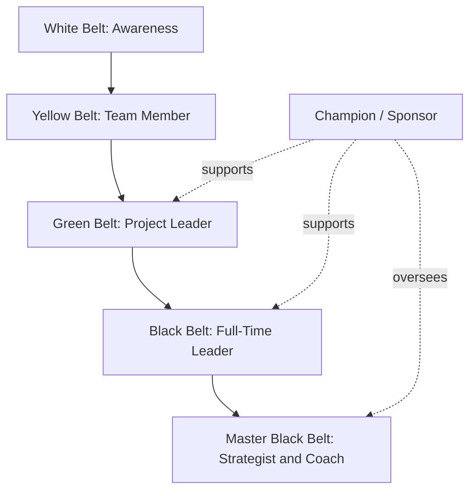
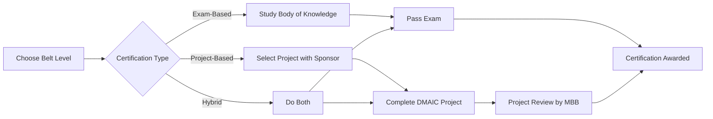
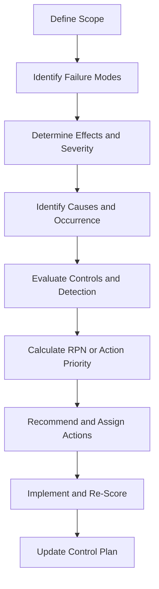
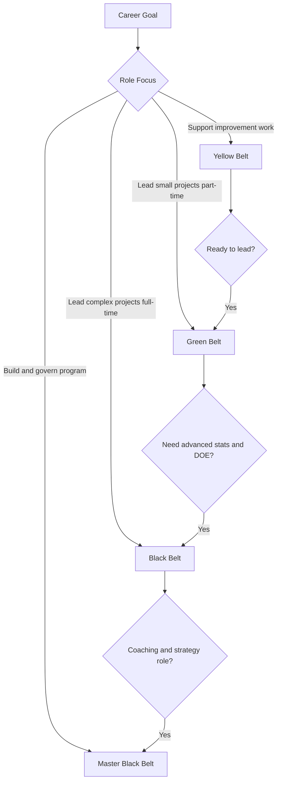

## Six Sigma Belt Certifications

### Overview

Six Sigma belt certifications are a tiered credentialing system that signals a practitioner's competence in the Six Sigma methodology: a data-driven approach to reducing process variation and defects. The belt hierarchy borrows its vocabulary from martial arts and was popularized at Motorola in the 1980s and later at General Electric in the 1990s. In the context of Failure Mode and Effects Analysis (FMEA), belt certifications matter because FMEA is a core tool in the Six Sigma toolkit, most prominently in the **Analyze**, **Improve**, and **Control** phases of DMAIC and in the **Design** and **Verify** phases of DFSS (Design for Six Sigma).

**Key Points**

- Belt certifications validate knowledge of statistical methods, project management, and process improvement frameworks.
- Certification requirements, body of knowledge, and exam formats vary by issuing organization; there is no single universal governing authority. Always confirm current requirements with the issuing body.
- FMEA proficiency is expected at multiple belt levels, typically increasing in depth from Yellow to Black Belt.
- Certifications are commonly valued in manufacturing, automotive, aerospace, medical devices, healthcare, and financial services.

### The Belt Hierarchy

**Typical Belt Levels and Roles**

| Belt Level | Typical Role | Typical Scope | FMEA Involvement |
| --- | --- | --- | --- |
| White Belt | Awareness-level participant | Basic vocabulary and concepts | Recognizes what an FMEA is and why it is used |
| Yellow Belt | Project team member | Supports projects, collects data | Contributes to FMEA workshops, identifies failure modes |
| Green Belt | Part-time project leader | Leads small to medium projects while retaining a day job | Facilitates and completes FMEAs, calculates RPN or Action Priority |
| Black Belt | Full-time improvement leader | Leads complex, cross-functional projects; mentors Green Belts | Designs FMEA programs, integrates FMEA with DOE, SPC, and control plans |
| Master Black Belt | Program strategist and coach | Trains and mentors Black Belts; deploys the program across the enterprise | Sets FMEA standards, audits quality of FMEAs |
| Champion / Sponsor | Executive or senior manager | Removes barriers, allocates resources, selects projects | Reviews FMEA-driven risk decisions |

[Inference] The exact titles, responsibilities, and time allocations differ by organization. Some companies use only Green and Black Belt levels, while others add levels such as "Lean Six Sigma" prefixes or "Executive Belt."

### Major Certifying Bodies

**Key Points**

- Certification is offered by professional societies, independent training providers, universities, and corporations.
- Accreditation and recognition differ significantly between providers.

**Commonly Referenced Issuers**

- **ASQ (American Society for Quality):** Offers Certified Six Sigma Yellow Belt (CSSYB), Green Belt (CSSGB), and Black Belt (CSSBB) credentials. ASQ exams are proctored, and the Black Belt credential has historically required a signed affidavit of project work or experience.
- **IASSC (International Association for Six Sigma Certification):** Offers exam-based Yellow, Green, and Black Belt certifications. IASSC emphasizes a standardized body of knowledge and does not require a completed project for the exam.
- **CSSC (Council for Six Sigma Certification):** Provides certification exams with a similar tiered structure.
- **Universities and Extension Programs:** Many offer certificate programs, often combining classroom instruction and a project.
- **Corporate Programs:** Companies such as Motorola, GE, and others operate internal belt programs whose credentials are recognized primarily within the company or its supply chain.
- **Automotive and Regulated Industry Programs:** Some sectors emphasize FMEA competence specifically, for example through AIAG & VDA FMEA training aligned to the harmonized FMEA handbook.

[Unverified] Exam fees, passing scores, and prerequisites change over time. Verify current details directly with each issuer before planning a certification path.

### Certification Pathways: Exam-Based vs. Project-Based

**Exam-Based Certification**

- Candidate passes a proctored or online exam covering the body of knowledge.
- Advantages: fast, standardized, lower cost.
- Limitation: may not demonstrate applied skill.

**Project-Based Certification**

- Candidate completes one or more real improvement projects with documented financial or quality impact, reviewed by a Master Black Belt or sponsor.
- Advantages: demonstrates applied competence; often more respected by employers.
- Limitation: longer timeline; depends on employer support and project availability.

**Hybrid Certification**

- Requires both a passing exam score and a validated project. Many corporate and some society programs use this model.

### Body of Knowledge by Belt Level

#### Yellow Belt

- Six Sigma fundamentals and terminology
- Basic DMAIC overview
- Process mapping basics (SIPOC, flowcharts)
- Simple data collection and basic charts (Pareto, histograms, run charts)
- Basic root cause tools (5 Whys, cause-and-effect diagrams)
- Introduction to FMEA concepts: failure mode, effect, cause, control

#### Green Belt

- Full DMAIC methodology
- Voice of the Customer (VOC) and Critical to Quality (CTQ) definition
- Measurement System Analysis (MSA) basics
- Process capability ($C_p$, $C_{pk}$), sigma level, and DPMO
- Hypothesis testing basics, correlation, and simple regression
- Control charts (SPC) and control plans
- **FMEA:** constructing a process FMEA (PFMEA) or design FMEA (DFMEA), scoring severity, occurrence, and detection, prioritizing actions, and tracking recommended actions

#### Black Belt

- Advanced statistics: ANOVA, multiple regression, non-parametric tests
- Design of Experiments (DOE), including factorial and fractional factorial designs
- Advanced MSA (Gage R&R, attribute agreement analysis)
- Advanced SPC and process capability for non-normal data
- Lean integration: value stream mapping, waste elimination, theory of constraints
- Project management, change management, and team leadership
- DFSS concepts (DMADV, IDOV)
- **FMEA:** integrating FMEA with QFD, control plans, DOE-driven verification, reliability engineering, and cross-functional risk management; facilitating FMEA in complex systems

#### Master Black Belt

- Program deployment strategy and portfolio management
- Coaching and training curriculum design
- Advanced statistical consulting
- Governance of FMEA standards and audit of FMEA quality across the organization

### Six Sigma Metrics Relevant to Belt Practice

Belt candidates are expected to compute and interpret the following.

**Defects Per Million Opportunities (DPMO)**

$$DPMO = \frac{D}{U \times O} \times 1{,}000{,}000$$

where $D$ is the number of defects, $U$ is the number of units, and $O$ is the number of defect opportunities per unit.

**Process Capability Indices**

$$C_p = \frac{USL - LSL}{6\sigma}$$

$$C_{pk} = \min\left(\frac{USL - \mu}{3\sigma}, \frac{\mu - LSL}{3\sigma}\right)$$

**Risk Priority Number (traditional FMEA)**

$$RPN = S \times O \times D$$

where $S$ is severity, $O$ is occurrence, and $D$ is detection, each typically scored on a 1 to 10 scale.

**Sigma Level Conversion**

By convention, a 6-sigma process corresponds to 3.4 DPMO, which includes a 1.5-sigma long-term shift assumption. [Inference] The 1.5-sigma shift is a widely used convention rather than a universally accepted empirical constant, and some practitioners and statisticians dispute it.

**Example**

A Green Belt candidate analyzes a solder process. In a sample of 500 boards, each with 20 solder joints (opportunities), 45 defects are found.

$$DPMO = \frac{45}{500 \times 20} \times 1{,}000{,}000 = 4{,}500$$

**Output**

The process runs at 4,500 DPMO, which corresponds to roughly 4.1 sigma using a standard conversion table with the 1.5-sigma shift. [Inference] The exact sigma value depends on the conversion table or software used.

### FMEA Within Belt Certification

FMEA appears in every credible belt curriculum, and candidates should be able to perform the following tasks depending on level.

**Green Belt FMEA Competencies**

- Define the scope and boundary of the analysis (process step or design function)
- List potential failure modes for each step or function
- Identify effects on the customer or downstream process
- Identify potential causes
- Document current preventive and detection controls
- Assign severity, occurrence, and detection ratings using an organizational rating scale
- Calculate RPN or determine Action Priority (AP), depending on the standard in use
- Recommend actions and record responsibility, target dates, and re-scored values

**Black Belt FMEA Competencies**

- Facilitate cross-functional FMEA teams and manage group dynamics
- Link FMEA to control plans, process flow diagrams, and special characteristics
- Use DOE and reliability data to justify occurrence and detection ratings
- Recognize limitations of RPN, including ties and non-linear risk perception, and apply alternatives such as Action Priority tables or criticality analysis
- Maintain FMEA as a living document through design and production lifecycle changes

**Example**

A Green Belt candidate presents a PFMEA excerpt for a welding station in a certification project.

| Process Step | Failure Mode | Effect | S | Cause | O | Current Control | D | RPN |
| --- | --- | --- | --- | --- | --- | --- | --- | --- |
| Weld seam | Incomplete penetration | Structural failure in service | 9 | Low amperage setting | 4 | Operator visual check | 7 | 252 |
| Weld seam | Excess spatter | Cosmetic rejection | 3 | Wire feed speed drift | 5 | Periodic sampling | 4 | 60 |

**Output**

The candidate prioritizes the first row because of its high severity and RPN. Recommended actions might include automated amperage monitoring and ultrasonic testing, after which the team re-scores occurrence and detection.

### DMAIC and FMEA Mapping for Belt Projects

| DMAIC Phase | Typical Belt Activities | FMEA Role |
| --- | --- | --- |
| Define | Project charter, SIPOC, VOC | Identify high-risk areas that justify the project |
| Measure | Data collection plan, MSA, baseline capability | Use data to inform occurrence and detection ratings |
| Analyze | Root cause analysis, hypothesis testing | Develop or refine FMEA to prioritize causes |
| Improve | Solution selection, pilot, DOE | Re-score FMEA after proposed solutions to quantify risk reduction |
| Control | Control plan, SPC, standardization | Feed FMEA results into control plan and reaction plans |

### Preparing for Certification

**Study Approach**

1. Select the target belt level based on role and career goals.
2. Obtain the current body of knowledge from the certifying organization.
3. Choose training: instructor-led, online, self-study, or employer-sponsored.
4. Practice with statistical software such as Minitab, JMP, R, or Python, since many programs use one of these.
5. Complete practice exams and review weak areas.
6. For project-based paths, secure a sponsor and a project with measurable baseline data early.

**Typical Prerequisites**

- White and Yellow Belt: usually none
- Green Belt: often none for exam-only routes; some require work experience or a Yellow Belt
- Black Belt: often a Green Belt or several years of relevant experience, plus project evidence for some issuers
- Master Black Belt: extensive Black Belt experience, mentoring record, and program leadership

[Unverified] Prerequisites differ among issuers and may change; confirm with the certifying body.

### Project Requirements and Documentation

For project-based certification, candidates commonly prepare the following.

- Project charter with problem statement, goal, scope, and business case
- Baseline data and measurement system validation
- Root cause analysis evidence, including FMEA
- Solutions tested with statistical validation
- Control plan and sustainment evidence
- Financial impact summary validated by finance or the sponsor
- Lessons learned and presentation or storyboard

**Example**

A Black Belt candidate's project on reducing customer returns for a medical device housing includes:

- A DMAIC storyboard with baseline return rate of 2.8%
- A Gage R&R study showing measurement system contribution below 10%
- A PFMEA that reduced the top three RPNs from an average of 288 to 84 after corrective actions
- A control chart demonstrating a sustained return rate of 0.9% over six months

**Output**

The reviewing Master Black Belt confirms statistical rigor, verifies financial savings with finance, and approves the certification.

### Maintaining and Renewing Certification

- Some issuers require recertification through continuing education units, a recertification exam, or a fixed renewal period. Others award certification without expiry.
- Common renewal activities include completing additional projects, attending conferences, publishing, mentoring, and participating in professional society activities.
- [Unverified] Renewal cycles and requirements vary by issuer and change over time.

### Value, Limitations, and Criticisms

**Benefits**

- Provides a shared vocabulary and toolset across teams
- Signals competence to employers and clients
- Supports career advancement in quality, operations, engineering, and process excellence roles
- Encourages disciplined, data-driven problem solving

**Limitations and Criticisms**

- Quality of belt programs varies widely; some "certificates" require little more than course attendance.
- Exam-only certifications may not reflect practical ability.
- Critics argue Six Sigma can be applied too rigidly or bureaucratically in some settings. [Speculation] Effectiveness depends heavily on organizational culture, leadership support, and project selection.
- The certification alone does not guarantee FMEA skill; quality of FMEAs depends on team facilitation, data integrity, and domain expertise.

### Common Pitfalls for Candidates

- Choosing an unaccredited or low-rigor program without verifying recognition
- Starting a project without baseline data or a validated measurement system
- Treating FMEA as a paperwork exercise instead of a risk-reduction tool
- Scoring ratings inconsistently because the team never agreed on an organizational rating scale
- Neglecting the Control phase, leaving improvements unsustained

### Choosing a Belt Path: Decision Guide

### Conclusion

Six Sigma belt certifications provide a structured progression from awareness to enterprise-level program leadership, with FMEA competence expected to deepen at each level. Practitioners should select an issuer whose recognition fits their industry, choose a pathway (exam, project, or hybrid) aligned with their goals, and treat FMEA as an applied risk-management discipline rather than a certification checkbox. Because requirements, fees, and body-of-knowledge details differ among issuers and change over time, current information should always be confirmed directly with the certifying organization.

### Related Topics

- ASQ Certified Six Sigma Green Belt and Black Belt body of knowledge
- IASSC exam structure and content domains
- Lean Six Sigma integration and Lean certifications
- Design for Six Sigma (DFSS) and DMADV
- AIAG and VDA FMEA handbook training and Action Priority
- ASQ Certified Quality Engineer (CQE) and Certified Reliability Engineer (CRE)
- Statistical software for belt practitioners (Minitab, JMP, R, Python)
- Measurement System Analysis and Gage R&R
- Control plans and SPC integration with FMEA
- Continuing education and professional development planning for quality professionals