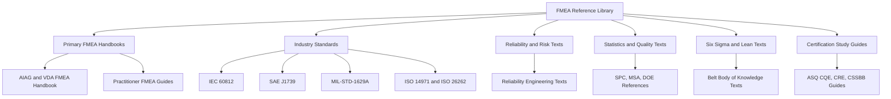

## Recommended Books and Reference Manuals

### Overview

Books and reference manuals form the authoritative backbone of FMEA competence. Industry standards define what an acceptable FMEA looks like, handbooks explain how to build one, and supporting texts on reliability, statistics, and quality management provide the analytical foundation. This reference organizes the most widely cited resources by purpose, explains what each is used for, and describes how to build a study and reference library for certification preparation and daily practice.

**Key Points**

- Standards and customer-specific requirements take precedence over general textbooks when they conflict. Always follow the version and customer requirements that apply to your contract.
- Editions, rating tables, and terminology change over time (for example, the shift from RPN-centric prioritization to Action Priority in the harmonized AIAG & VDA handbook). Confirm you are using the current edition.
- [Unverified] Publication dates, edition numbers, and availability of specific titles change; verify current editions with the publisher or standards body before purchasing.
- No single book covers everything. A working library combines a primary FMEA reference, a standards set, a statistics text, and a reliability text.

### Categories of Resources

### Primary FMEA Handbooks

**AIAG & VDA FMEA Handbook (First Edition, 2019)**

- Jointly published by the Automotive Industry Action Group (AIAG) and the German Association of the Automotive Industry (VDA).
- Harmonized the previously separate AIAG FMEA-4 and VDA Volume 4 approaches.
- Introduces the **7-step approach**: Planning and Preparation, Structure Analysis, Function Analysis, Failure Analysis, Risk Analysis, Optimization, and Results Documentation.
- Replaces the traditional RPN with **Action Priority (AP)** rating tables (High, Medium, Low) based on Severity, Occurrence, and Detection combinations.
- Covers DFMEA, PFMEA, and the supplemental FMEA for Monitoring and System Response (FMEA-MSR).
- Widely treated as the reference standard for automotive suppliers and increasingly used in other industries.
- Best for: automotive practitioners, IATF 16949 environments, anyone certifying FMEA competence to a current industry norm.

**AIAG FMEA-4 (Fourth Edition, 2008) [Legacy]**

- The pre-harmonization AIAG reference that popularized RPN, Severity/Occurrence/Detection tables, and the classic 10-column worksheet.
- Still encountered in legacy programs and older customer requirements.
- Best for: understanding historical practices and reading older FMEAs.

**VDA Volume 4 (Product and Process FMEA) [Legacy]**

- The German standard predating the harmonized handbook, with a structured, structure-tree-oriented method.
- Best for: understanding the origin of structure and function analysis concepts.

**Practitioner-Oriented FMEA Guides**

- *Effective FMEAs* by Carl S. Carlson: A widely cited practitioner text emphasizing team facilitation, risk-based prioritization, and avoiding common mistakes. [Inference] Frequently recommended for its practical tone, though it predates the harmonized handbook and its prioritization conventions differ.
- *The Basics of FMEA* by Robin E. McDermott, Raymond J. Mikulak, and Michael R. Beauregard: A concise introductory text often used for team training.
- *Failure Mode and Effect Analysis: FMEA from Theory to Execution* by D. H. Stamatis: A comprehensive treatment covering multiple FMEA types, forms, and implementation. Often used as a desk reference.

### Industry Standards and Reference Manuals

| Standard | Domain | Purpose |
| --- | --- | --- |
| IEC 60812 | General / multi-industry | Defines FMEA and FMECA procedures, terminology, and worksheet structure |
| SAE J1739 | Automotive | Legacy US automotive DFMEA and PFMEA standard, now largely superseded by the harmonized handbook |
| MIL-STD-1629A | Military / defense | Procedures for performing FMECA, including criticality analysis; historically influential |
| ISO 14971 | Medical devices | Risk management for medical devices; FMEA is a common tool for hazard and risk analysis |
| ISO 26262 | Automotive functional safety | Functional safety lifecycle; FMEA supports hazard analysis and safety analyses |
| ISO 31000 | Enterprise risk management | General risk management principles and guidelines |
| IEC 61508 | Functional safety | Safety of electrical, electronic, and programmable systems; FMEA supports failure analysis |
| ARP4761 | Aerospace | Guidelines for safety assessment of civil airborne systems, including FMEA and FMES |
| ISO 9001 | Quality management | Risk-based thinking requirement that FMEA often supports |
| IATF 16949 | Automotive quality management | Requires FMEA and control plan linkage for suppliers |

**Key Points**

- Standards are typically purchased from the issuing body (ISO, IEC, SAE, AIAG, and others) and are copyrighted.
- Some standards, such as MIL-STD-1629A, have been cancelled or superseded but remain historically useful. [Unverified] Verify the current status of any standard before citing it as a requirement.
- Automotive customer-specific requirements (for example, from OEMs) may add rating scales or format expectations beyond the base handbook.

### Companion AIAG Core Tools

FMEA is designed to work within an integrated quality system. Certification candidates in automotive contexts commonly need the companion manuals.

- **APQP (Advanced Product Quality Planning) and Control Plan:** Defines the product development framework and control plan format that consumes FMEA outputs.
- **PPAP (Production Part Approval Process):** Specifies documentation, including FMEAs, required for part approval.
- **MSA (Measurement Systems Analysis):** Supports defensible detection ratings through validated measurement systems.
- **SPC (Statistical Process Control):** Supports occurrence evidence and process monitoring.

### Reliability Engineering Texts

Reliability texts deepen the quantitative side of FMEA, including failure rates, distributions, and system modeling.

- *Reliability Engineering* by E. Elsayed: Covers reliability modeling, life data analysis, and system reliability.
- *Practical Reliability Engineering* by Patrick O'Connor and Andre Kleyner: A widely used text covering reliability, FMEA, FTA, and related methods.
- *Reliability Engineering: Theory and Practice* by Alessandro Birolini: A rigorous, mathematics-heavy reference.
- *Reliability Engineering Handbook* (various authors and editions): Broad reference material on methods.
- *Applied Reliability* by Paul A. Tobias and David C. Trindade: Emphasizes statistical life data analysis.
- *Reliability, Maintainability, and Risk* by David J. Smith: Practical coverage of reliability, safety, and risk assessment.

**Example**

A reliability engineer uses failure rate data from a reliability text to justify an occurrence rating.

If a component has a constant failure rate $\lambda = 2 \times 10^{-6}$ failures per hour, the probability of failure over a mission time $t = 5000$ hours is:

$$P(t) = 1 - e^{-\lambda t} = 1 - e^{-0.01} \approx 0.00995$$

**Output**

The probability of failure is roughly 1%, which the team maps to an occurrence rating using their organization's occurrence scale. [Inference] The mapping from probability to a 1 to 10 rating depends entirely on the rating scale adopted by the organization or standard.

### Statistics, Quality, and Six Sigma Texts

These texts support the analytical tools that feed FMEA scoring and verification.

- *Introduction to Statistical Quality Control* by Douglas C. Montgomery: A standard text on SPC, capability, and acceptance sampling.
- *Design and Analysis of Experiments* by Douglas C. Montgomery: A standard DOE reference.
- *The Certified Six Sigma Black Belt Handbook* (ASQ Quality Press): Aligned to the ASQ CSSBB body of knowledge.
- *The Certified Six Sigma Green Belt Handbook* (ASQ Quality Press): Aligned to the ASQ CSSGB body of knowledge.
- *The Six Sigma Handbook* by Thomas Pyzdek and Paul Keller: A comprehensive practitioner reference covering DMAIC, statistics, and tools.
- *The Certified Quality Engineer Handbook* (ASQ Quality Press): Covers broader quality engineering content, including risk tools.
- *The Certified Reliability Engineer Handbook* (ASQ Quality Press): Covers reliability, maintainability, and risk topics, including FMEA and FTA.
- *Statistical Methods for Quality Improvement* by Thomas Ryan: Supports advanced quality statistics.
- *Juran's Quality Handbook* (Joseph Juran and A. Blanton Godfrey): A comprehensive reference on quality management.
- *Out of the Crisis* by W. Edwards Deming: A foundational management text influencing quality philosophy.

### Risk Management and Safety Texts

- *System Safety Engineering and Risk Assessment: A Practical Approach* by Nicholas J. Bahr: Covers hazard analysis techniques, including FMEA.
- *Safeware: System Safety and Computers* by Nancy Leveson: Explores software and system safety.
- *Engineering a Safer World* by Nancy Leveson: Introduces systems-theoretic approaches (STAMP/STPA) that complement FMEA.
- *Probabilistic Risk Assessment* texts: Cover fault trees, event trees, and quantitative risk methods often used alongside FMEA.

### Domain-Specific References

**Medical Devices**

- ISO 14971 and its companion guidance ISO/TR 24971
- AAMI TIR reports on risk management
- FDA design control guidance documents

**Aerospace and Defense**

- SAE ARP4761 and ARP4754
- NASA reliability and safety handbooks
- Military handbooks on reliability prediction (for example, MIL-HDBK-217, which [Unverified] is dated and often supplemented by newer models)

**Software and IT**

- Software FMEA (SFMEA) guidance in IEC 60812 supplements and various academic and industry papers
- [Inference] Software FMEA practices are less standardized than hardware FMEA and vary by organization

**Healthcare Process Improvement**

- HFMEA (Healthcare FMEA) materials from the US Department of Veterans Affairs National Center for Patient Safety
- Institute for Healthcare Improvement (IHI) FMEA tools

### Choosing Resources by Certification Goal

| Certification or Goal | Recommended Core Resources |
| --- | --- |
| ASQ CSSGB / CSSBB | ASQ Six Sigma handbooks; *The Six Sigma Handbook*; a statistics text |
| ASQ CQE | *The Certified Quality Engineer Handbook*; Montgomery SQC text |
| ASQ CRE | *The Certified Reliability Engineer Handbook*; O'Connor and Kleyner or Tobias and Trindade |
| Automotive PFMEA/DFMEA practitioner | AIAG & VDA FMEA Handbook; APQP and Control Plan manual; MSA and SPC manuals |
| Medical device risk analyst | ISO 14971; ISO/TR 24971; a practitioner FMEA text |
| Functional safety engineer | ISO 26262 or IEC 61508; ARP4761 for aerospace; a systems safety text |
| General FMEA facilitator | IEC 60812; *Effective FMEAs* or Stamatis text; a group facilitation resource |

### Building a Personal Reference Library

**Practical Steps**

1. Determine the governing standard for your industry and customers.
2. Purchase or license the current edition of the primary FMEA handbook.
3. Add a reliability or statistics text that matches your analytical needs.
4. Acquire the study guide for any certification you plan to pursue.
5. Maintain an edition log so outdated material is not used by mistake.
6. Annotate handbooks with rating-scale page references and template locations for quick lookup.

**Example**

A supplier quality engineer preparing for a Black Belt exam and supporting an automotive customer might assemble:

- AIAG & VDA FMEA Handbook (current edition)
- APQP and Control Plan reference manual
- ASQ Certified Six Sigma Black Belt Handbook
- Montgomery's DOE text
- Customer-specific requirements documents

**Output**

The engineer keeps a one-page index mapping each FMEA step to the relevant handbook section, customer requirement clause, and exam body-of-knowledge topic, which shortens both audits and exam study time.

### Evaluating the Quality of a Book or Manual

**Checklist**

- Is the edition current, and does it reference the latest standard revisions?
- Does the author have documented practitioner or academic credibility in the domain?
- Are rating scales consistent with your governing standard, or do they conflict?
- Does the text include worked examples with realistic data?
- Does the material address limitations of RPN and alternative prioritization methods?
- Is it aligned with the certification body of knowledge, if used for exam preparation?

**Key Points**

- [Inference] Older texts remain valuable for foundational concepts but may promote practices, such as RPN thresholds, that newer standards discourage.
- Practitioner books often present opinionated methods; compare them against the governing standard before adopting them.

### Complementary Free and Low-Cost Resources

- Publicly available government and agency documents (for example, NASA reliability and safety publications and US Department of Veterans Affairs HFMEA materials)
- Professional society publications and conference proceedings from ASQ, SAE, IEEE Reliability Society, and similar bodies
- University lecture notes and open courseware on reliability and quality engineering
- Vendor white papers from FMEA software providers, which [Speculation] may emphasize their own tooling and workflows

### Common Pitfalls

- Relying on an outdated edition when a customer requires the current one
- Using a textbook rating scale that conflicts with the customer or industry standard
- Treating a single book as the complete authority across industries
- Purchasing unauthorized copies of copyrighted standards, which risks legal and quality issues
- Neglecting companion documents such as control plan and MSA manuals that determine how FMEA outputs are used

### Conclusion

An effective FMEA reference library is layered: governing standards define requirements, a primary handbook explains method, reliability and statistics texts supply analytical depth, and certification study guides align preparation to exam content. Because editions, prioritization methods, and customer requirements evolve, practitioners should verify current editions, maintain an edition log, and cross-check textbook advice against the standard that actually governs their work.

### Related Topics

- AIAG & VDA Action Priority tables and rating criteria
- IEC 60812 procedures and FMECA criticality analysis
- ASQ Certified Reliability Engineer (CRE) preparation
- ASQ Certified Quality Engineer (CQE) preparation
- Software tools for FMEA and integration with reference standards
- Professional societies, conferences, and continuing education
- Building an organizational FMEA rating scale library
- Standards monitoring and edition control processes