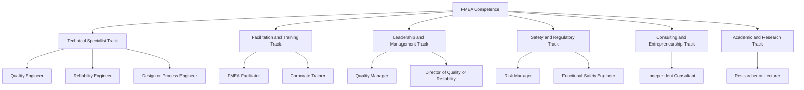
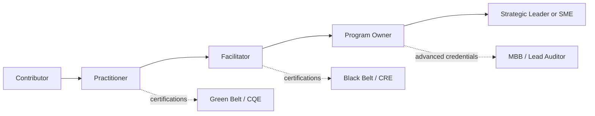
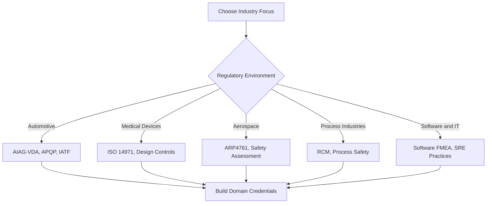
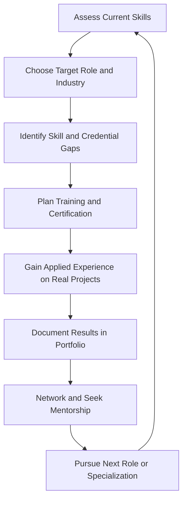

## Building a Career Path Around FMEA Expertise

### Overview

Failure Mode and Effects Analysis (FMEA) expertise is a transferable, high-value skill that sits at the intersection of quality engineering, reliability engineering, product safety, and operational risk management. Unlike a single job title, FMEA competence supports several career tracks: technical specialist, facilitator, quality or reliability leader, safety and compliance professional, consultant, and educator. This reference describes how to build a durable career around FMEA expertise, including role families, skill progression, certifications, portfolio development, industry-specific paths, and long-term strategy.

**Key Points**

- FMEA is rarely a standalone profession; it is most commonly a core competency within broader roles such as Quality Engineer, Reliability Engineer, Design Engineer, Process Engineer, or Risk Manager.
- Career value comes from combining FMEA facilitation and analytical skill with domain knowledge, statistics, communication, and leadership.
- [Inference] Demand for FMEA skills tends to be strongest in regulated and safety-critical industries such as automotive, aerospace, medical devices, energy, and pharmaceuticals, because customers and regulators expect documented risk analysis.
- [Unverified] Salary ranges, job titles, and hiring demand vary by country, industry, and time period; consult current job boards and salary surveys from professional societies before making decisions.

### Career Landscape

### Common Roles Where FMEA Is a Core Skill

| Role | Typical FMEA Involvement | Complementary Skills |
| --- | --- | --- |
| Quality Engineer | Builds and maintains PFMEAs, links to control plans, supports audits | SPC, MSA, corrective action, supplier quality |
| Design Engineer | Leads or contributes to DFMEAs | CAD, tolerance analysis, materials, testing |
| Reliability Engineer | Uses FMEA with life data, FTA, and predictions | Weibull analysis, accelerated testing, maintainability |
| Manufacturing / Process Engineer | Owns PFMEA for production processes | Lean, process control, automation |
| Supplier Quality Engineer | Reviews supplier FMEAs and enforces customer requirements | Auditing, PPAP, negotiation |
| Functional Safety Engineer | Applies FMEA within safety lifecycle | ISO 26262, IEC 61508, hazard analysis |
| Regulatory / Risk Management Specialist | Integrates FMEA into risk files | ISO 14971, documentation, compliance |
| Six Sigma Black Belt / Master Black Belt | Uses FMEA in DMAIC and DFSS projects | Statistics, project management, coaching |
| Process Excellence / Continuous Improvement Lead | Deploys FMEA as an enterprise risk tool | Change management, Lean, governance |
| Consultant / Trainer | Facilitates FMEAs and teaches methods | Curriculum design, communication, business development |

[Inference] Titles vary widely between organizations; a "Quality Engineer" in one company may perform work labeled "Reliability Engineer" in another.

### Skill Progression Framework

Career growth around FMEA typically follows a progression from participation to leadership. The stages below are a conceptual model, not a formal standard.

**Stage 1: Foundation (Contributor)**

- Understand FMEA vocabulary: failure mode, effect, cause, severity, occurrence, detection, controls
- Participate in FMEA workshops and document team outputs
- Read and interpret existing FMEAs, control plans, and process flow diagrams
- Learn the governing standard used by your industry (for example, the AIAG & VDA FMEA Handbook in automotive)

**Stage 2: Practitioner (Author)**

- Build complete DFMEAs or PFMEAs for defined scopes
- Apply the organization's rating scales consistently
- Prioritize risks using RPN or Action Priority as required
- Track recommended actions and update FMEAs after changes
- Support audits and customer reviews

**Stage 3: Facilitator (Team Leader)**

- Lead cross-functional FMEA sessions and manage group dynamics
- Guide teams away from common pitfalls such as over-scoring detection or ignoring high-severity, low-occurrence risks
- Link FMEA to control plans, validation plans, and special characteristics
- Coach less experienced team members

**Stage 4: Program Owner (Systems Thinker)**

- Standardize FMEA templates, rating scales, and review processes across products or sites
- Integrate FMEA with FTA, DOE, reliability testing, and lessons-learned databases
- Define quality metrics for FMEA effectiveness (for example, escape rates traced to missing failure modes)
- Interface with customers and regulators on FMEA expectations

**Stage 5: Strategic Leader or Subject Matter Expert**

- Set enterprise risk management strategy
- Mentor facilitators and program owners
- Influence industry standards through working groups and publications
- Represent the organization externally

### Core Competencies to Develop

**Technical Competencies**

- FMEA methodology (DFMEA, PFMEA, FMEA-MSR, FMECA, software FMEA where applicable)
- Statistics: descriptive statistics, capability analysis, hypothesis testing, DOE
- Reliability: failure distributions, Weibull analysis, life testing
- Measurement systems: Gage R&R, attribute agreement analysis
- Complementary tools: Fault Tree Analysis (FTA), control plans, process flow diagrams, QFD, 8D problem solving
- Domain knowledge: materials, manufacturing processes, electronics, software, clinical workflows, or other field-specific expertise

**Professional Competencies**

- Facilitation and meeting management
- Technical writing and documentation discipline
- Cross-functional communication with design, manufacturing, quality, and management
- Negotiation and influence, especially when recommending costly corrective actions
- Project management and change management
- Coaching and training delivery

**Example**

A facilitator quantifies the value of an action to convince management. Suppose a corrective action reduces the occurrence rating of a failure mode from 6 to 3 while severity stays at 8 and detection stays at 5.

$$RPN_{before} = 8 \times 6 \times 5 = 240$$

$$RPN_{after} = 8 \times 3 \times 5 = 120$$

$$\text{Reduction} = \frac{240 - 120}{240} \times 100\% = 50\%$$

**Output**

The facilitator reports a 50% RPN reduction and, because severity is 8, also notes that severity-driven prioritization (or Action Priority in the harmonized handbook) may still flag the item for review. [Inference] Presenting both the RPN change and the severity context helps prevent the misuse of RPN as the sole decision metric.

### Certifications and Credentials Supporting the Path

| Credential | Relevance to FMEA Career |
| --- | --- |
| Six Sigma Green / Black Belt | Demonstrates structured problem solving and FMEA use within DMAIC |
| ASQ Certified Quality Engineer (CQE) | Broad quality engineering including risk tools |
| ASQ Certified Reliability Engineer (CRE) | Deep reliability content, including FMEA and FTA |
| ASQ Certified Manager of Quality/Organizational Excellence (CMQ/OE) | Leadership and quality management |
| ASQ Certified Quality Auditor (CQA) or ISO Lead Auditor | Auditing FMEA compliance within quality systems |
| Functional safety credentials (for example, TÜV functional safety programs) | Safety-critical FMEA in automotive, industrial, and process sectors |
| Project Management Professional (PMP) | Program leadership skills |
| Vendor or standard-specific FMEA training (for example, AIAG & VDA FMEA training) | Direct evidence of current standard competence |

[Unverified] Availability, names, and requirements of certifications change; verify with the issuing organizations.

### Industry-Specific Career Paths

**Automotive**

- Emphasis on the AIAG & VDA FMEA Handbook, APQP, PPAP, and control plans
- Roles: Supplier Quality Engineer, Advanced Quality Planning Engineer, Program Quality Manager
- FMEA is tightly linked to customer-specific requirements and IATF 16949 audits

**Aerospace and Defense**

- Emphasis on safety assessment and reliability (for example, SAE ARP4761, MIL-STD heritage)
- Roles: Reliability Engineer, System Safety Engineer, Quality Assurance Engineer
- FMEA and FMECA are used with fault trees and hazard analyses

**Medical Devices and Pharmaceuticals**

- Emphasis on ISO 14971 risk management and regulatory expectations
- Roles: Risk Management Engineer, Design Assurance Engineer, Quality Systems Specialist
- FMEA outputs feed risk management files and design history documentation

**Healthcare Delivery**

- Emphasis on Healthcare FMEA (HFMEA) and patient safety programs
- Roles: Patient Safety Officer, Quality Improvement Specialist, Clinical Risk Manager

**Energy, Oil and Gas, and Process Industries**

- Emphasis on asset integrity, maintenance strategy, and process safety
- Roles: Reliability Engineer, Maintenance Planning Engineer, Process Safety Engineer
- FMEA often supports reliability-centered maintenance (RCM)

**Software and Technology**

- Emphasis on software FMEA, service reliability, and incident prevention
- Roles: Site Reliability Engineer, Quality Assurance Lead, Safety Assurance Engineer
- [Inference] Software FMEA practice is less standardized than hardware FMEA, so practitioners often adapt methods to architecture and deployment models

### Building a Professional Portfolio

A portfolio demonstrates applied skill beyond credentials.

**Suggested Portfolio Elements**

- Sanitized FMEA examples showing structure analysis, function analysis, failure chains, and action tracking (remove proprietary data)
- Case studies quantifying risk reduction, defect reduction, or cost avoidance
- Facilitation artifacts such as workshop agendas, rating scale guides, and lessons-learned summaries
- Training materials or presentations you have developed
- Publications, conference talks, or internal white papers
- Evidence of cross-tool integration, such as a PFMEA linked to a control plan and SPC charts

**Example**

A candidate prepares a case study.

- Problem: Intermittent connector failures causing field returns
- Method: DFMEA and PFMEA review, DOE on crimp parameters, updated control plan
- Result: Field return rate reduced from 1.8% to 0.4% over six months (illustrative figures)
- Lessons: Missing failure mode for terminal deformation added to the FMEA library

**Output**

The candidate presents a one-page summary, a sanitized FMEA excerpt, and a control chart showing sustained improvement, giving hiring managers concrete evidence of applied ability.

### Networking and Professional Community

- Join professional societies such as ASQ, SAE, IEEE Reliability Society, and industry-specific groups
- Participate in local chapters, technical committees, and standards working groups where feasible
- Attend conferences on quality, reliability, and safety
- Engage in online professional communities and technical forums
- Seek mentors who are senior facilitators, reliability leaders, or Master Black Belts
- Contribute to or review FMEA training materials to build visibility

### Advancement Strategies

**Deepen Technical Expertise**

- Pursue advanced statistics and reliability coursework
- Learn adjacent methods such as FTA, STPA, and hazard analysis to broaden risk analysis capability
- Gain hands-on experience across the product lifecycle, from concept to field feedback

**Build Leadership Skills**

- Volunteer to lead FMEA workshops for high-visibility programs
- Seek roles that involve cross-functional coordination or supplier management
- Develop financial literacy to express risk in terms of cost, warranty, and customer impact

**Develop a Specialization**

- Examples: automotive functional safety, medical device risk management, reliability-centered maintenance, or software reliability
- [Inference] Specialization often increases marketability but can narrow options; balance depth with transferable breadth

**Pursue Teaching or Consulting**

- Start by delivering internal training and mentoring
- Build a track record of measurable results before consulting independently
- Consider recognized training-provider credentials or standards-body authorization where required

### Compensation and Market Considerations

- [Unverified] Compensation varies substantially by country, industry, seniority, and credentials; use current salary surveys from professional societies and reputable job platforms.
- Roles in regulated or safety-critical industries and roles combining FMEA with functional safety, reliability, or leadership responsibilities [Inference] often command higher compensation than entry-level generalist quality roles.
- Consulting rates depend on reputation, industry, and demand and should be researched locally.

### Common Pitfalls

- Treating FMEA as a form-filling exercise rather than a risk-reduction discipline, which limits credibility with engineering teams
- Over-relying on RPN and neglecting severity-driven or Action Priority-based judgment
- Focusing only on facilitation without building quantitative or domain depth
- Allowing certifications to substitute for demonstrated results
- Ignoring updates to standards and customer requirements
- Failing to document achievements in measurable terms (defects prevented, cost avoided, audit findings resolved)
- Neglecting soft skills, especially conflict management during FMEA workshops

### Sample Development Plan

**Years 0 to 2: Foundation**

- Learn the governing FMEA standard and participate in multiple FMEA sessions
- Complete Green Belt or equivalent training
- Author at least two full FMEAs under mentorship

**Years 2 to 5: Practitioner and Facilitator**

- Lead FMEA workshops independently
- Earn a professional credential such as CQE or CRE
- Integrate FMEA with control plans, SPC, and validation activities
- Build a portfolio of measurable results

**Years 5 to 10: Program Owner or Specialist**

- Standardize FMEA processes for a product line or site
- Pursue Black Belt, auditor, or functional safety credentials
- Mentor others and contribute to training programs

**Years 10 and Beyond: Strategic Leader or Expert**

- Shape enterprise risk strategy, influence standards, or build a consulting practice
- Publish, present, and mentor at an industry level

[Speculation] Timelines vary considerably with industry, employer, and individual circumstances; treat this plan as a flexible template rather than a schedule.

### Measuring Career Progress

- Number and complexity of FMEAs authored or facilitated
- Documented risk reductions and quality improvements attributable to your work
- Feedback from team members on facilitation effectiveness
- Credentials earned and renewed
- Scope of responsibility (single project, product line, site, enterprise)
- Contributions to training, standards, or professional communities

### Conclusion

A career built around FMEA expertise rests on three pillars: rigorous method knowledge, domain and analytical depth, and the leadership skills needed to turn analysis into action. Because FMEA appears across industries and job families, practitioners can shape their path toward technical specialization, program leadership, safety and compliance, consulting, or education. Sustained progress comes from combining certifications with documented, measurable results, staying current with evolving standards, and investing in professional relationships.

### Next Steps

- Assess your current FMEA skills against the progression framework and identify gaps
- Select a target industry and confirm the governing standards and customer requirements
- Plan certifications aligned to your intended role (for example, Green or Black Belt, CQE, CRE)
- Begin assembling a sanitized portfolio of FMEA case studies
- Identify a mentor and join a relevant professional society

### Related Topics

- Six Sigma belt certifications
- Recommended books and reference manuals
- ASQ CQE and CRE certification preparation
- FMEA facilitation techniques and team dynamics
- Functional safety career paths (ISO 26262, IEC 61508)
- Continuing education and professional development planning
- Consulting and training business fundamentals for quality professionals