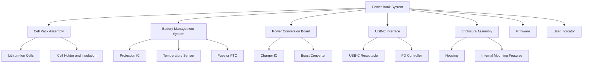
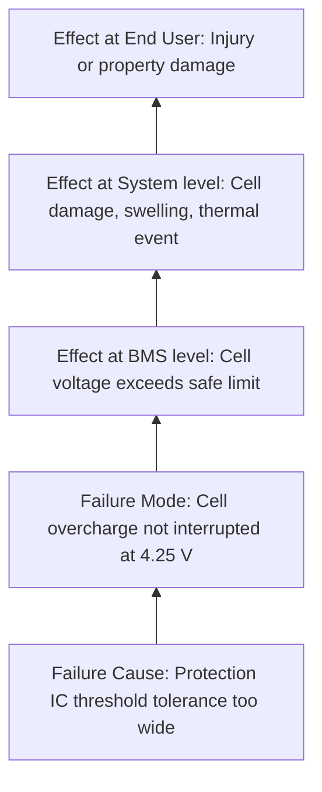
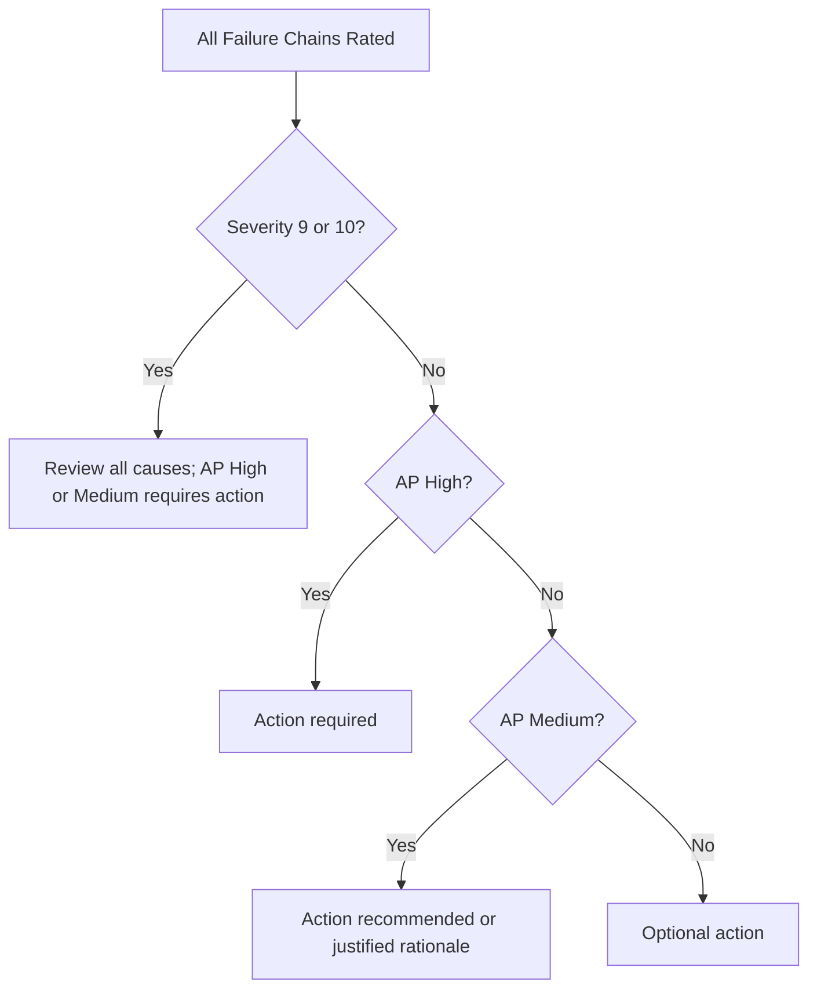
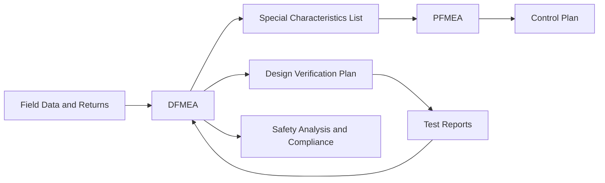

## Worked DFMEA Example Walkthrough

### Overview

This walkthrough builds a complete Design Failure Mode and Effects Analysis (DFMEA) for a realistic product: a **portable, rechargeable USB-C power bank with a lithium-ion battery pack**. It follows the 7-step approach of the harmonized AIAG & VDA FMEA Handbook: Planning and Preparation, Structure Analysis, Function Analysis, Failure Analysis, Risk Analysis, Optimization, and Results Documentation. Each step includes the rationale, the worksheet content, and the decisions a facilitator would make.

**Key Points**

- The example is illustrative. Ratings, failure rates, and thresholds are teaching values, not validated data, and must be replaced with data and rating scales from your own organization, customer, and governing standard.
- [Inference] Because this product involves a lithium-ion cell, a real program would also require formal safety analyses (for example, hazard analysis and compliance testing under applicable product safety standards) that go beyond DFMEA alone.
- The DFMEA analyzes the **design**, assuming the design is manufactured to specification. Manufacturing causes belong in the PFMEA.
- The worked example uses Action Priority (AP) as the primary prioritization method and shows RPN only for comparison. [Unverified] AP table values shown here are simplified representations; consult the current handbook for the authoritative tables.

### Step 1: Planning and Preparation

**Purpose:** Define what is analyzed, why, by whom, and with what boundaries.

**FMEA Project Definition (5T Framework)**

| Element | Definition for This Example |
| --- | --- |
| InTent | Identify and reduce design risks of the power bank before design freeze |
| Timing | Complete before design verification release; update after design changes and test results |
| Team | Design engineer (electrical), design engineer (mechanical), firmware engineer, safety and compliance engineer, quality engineer (facilitator), manufacturing engineer, test engineer |
| Task | DFMEA at system, subsystem, and component function level |
| Tools | FMEA software or spreadsheet, organizational rating scales, block diagram, boundary diagram |

**Scope Definition**

- **In scope:** Cell pack, battery management circuit, charge and discharge circuit, USB-C interface, enclosure, firmware, status indicator, thermal design
- **Out of scope:** Manufacturing process variation (PFMEA), packaging and shipping, external chargers and cables, end-user misuse beyond reasonably foreseeable conditions defined in the requirements
- **Baseline:** Requirements specification, previous-generation DFMEA, field return data, lessons learned, applicable regulatory and customer requirements

**Example: Foreseeable Use Conditions**

- Ambient temperature range: 0 °C to 45 °C during operation
- Charging via standard USB-C sources
- Occasional drop from pocket or desk height
- Carried in bags with keys and coins

### Step 2: Structure Analysis

**Purpose:** Decompose the product into system, subsystems, and components so that functions and failures can be assigned to the correct level.

**Boundary and Block Diagram Content**

- Interfaces: user, USB-C source, USB-C load device, environment (heat, moisture), packaging
- Energy flow: USB-C input to charger IC to cells to protection circuit to output converter to USB-C output
- Information flow: firmware to indicator LEDs, temperature sensor to microcontroller, fuel gauge to firmware

**Structure Tree**

For this walkthrough, the analysis focuses on three structure elements to keep the example tractable: the **Battery Management System (BMS)**, the **USB-C Interface**, and the **Enclosure Assembly**.

### Step 3: Function Analysis

**Purpose:** Define what each structure element is supposed to do, including requirements, so that failure to perform can be identified.

**Function Definitions with Requirements**

| Structure Element | Function | Requirement (Illustrative) |
| --- | --- | --- |
| Protection IC | Prevent cell overcharge | Cut off charging when cell voltage exceeds 4.25 V per cell |
| Protection IC | Prevent cell over-discharge | Cut off discharge when cell voltage falls below 2.8 V per cell |
| Protection IC | Prevent output short-circuit damage | Interrupt output current within 500 microseconds of short detection |
| Temperature Sensor and Firmware | Restrict operation outside safe temperature range | Suspend charging above 45 °C and below 0 °C |
| USB-C Receptacle | Provide mechanical and electrical connection | Withstand 10,000 insertion cycles with contact resistance below 30 milliohms |
| Enclosure Housing | Protect internal components from impact | Survive 1.2 m drop onto hard surface without internal component exposure or cell damage |
| Enclosure Housing | Limit exposure to hazardous surface temperature | Outer surface temperature at or below 60 °C under rated load |

**Function Net Concept**

The function net links functions across levels. For example, the system-level function "Deliver up to 20 W safely to the user's device" depends on:

- Power Conversion Board: convert cell voltage to required output
- BMS: keep cells within safe operating limits
- Enclosure: contain heat and protect against impact

### Step 4: Failure Analysis

**Purpose:** Build the **failure chain**: Failure Effect (FE), Failure Mode (FM), Failure Cause (FC), linked to each function.

**Failure Chain Logic**

- **Failure Mode (FM):** How the function fails to meet its requirement (loss, degradation, intermittent, unintended, excessive)
- **Failure Effect (FE):** Consequence at the next higher level and the end user or system level
- **Failure Cause (FC):** Design-related reason the failure mode could occur

**Failure Chains for the Selected Elements**

**Chain A: Overcharge Protection**

- Function: Prevent cell overcharge (cut off at 4.25 V)
- Failure Mode: Overcharge cutoff does not activate
- Failure Effects: Cell overheating, venting, fire hazard, potential injury
- Failure Causes:
  - Protection IC voltage threshold tolerance exceeds cell safe margin
  - Sense line routing susceptible to noise causing missed detection
  - Single point of failure with no redundant protection

**Chain B: Temperature Restriction**

- Function: Restrict operation outside safe temperature range
- Failure Mode: Charging continues above 45 °C
- Failure Effects: Accelerated cell degradation, reduced life, elevated thermal risk
- Failure Causes:
  - Temperature sensor placed away from hottest region of cell pack
  - Firmware fault-handling logic ignores sensor open-circuit condition
  - Thermal adhesive selection yields high thermal resistance between sensor and cell

**Chain C: USB-C Contact Reliability**

- Function: Provide durable electrical connection
- Failure Mode: Intermittent connection or high contact resistance
- Failure Effects: Charging interruption, localized heating at connector, customer dissatisfaction, returns
- Failure Causes:
  - Contact plating thickness insufficient for insertion cycle requirement
  - Receptacle solder joint design susceptible to fatigue under cable strain
  - Mechanical retention feature undersized for cable side loads

**Chain D: Enclosure Impact Protection**

- Function: Survive 1.2 m drop without cell damage
- Failure Mode: Housing cracks and allows internal shift
- Failure Effects: Cell deformation or internal short, potential thermal event
- Failure Causes:
  - Wall thickness at corners below minimum for selected polymer
  - Material selection has low impact strength at 0 °C
  - Insufficient internal cell retention and cushioning

### Step 5: Risk Analysis

**Purpose:** Rate Severity (S), Occurrence (O), and Detection (D) and determine action priority.

**Rating Scale Summary (Illustrative)**

| Rating | Severity | Occurrence (Design) | Detection (Design Controls) |
| --- | --- | --- | --- |
| 10 | Safety hazard without warning | Very high; failure almost inevitable | No detection opportunity or no control |
| 9 | Safety hazard or regulatory noncompliance with warning | Very high | Very remote chance of detection |
| 7 to 8 | Loss of primary function, major dissatisfaction | High | Low to moderate detection ability |
| 4 to 6 | Degraded function, customer annoyance | Moderate | Moderate to good detection ability |
| 2 to 3 | Minor annoyance | Low | High detection ability |
| 1 | No noticeable effect | Very low; prevented by design | Almost certain detection |

[Unverified] Actual rating tables must come from your organization and the governing handbook; the summary above is a simplified teaching aid.

**Current Controls**

- **Prevention Controls (PC):** Design measures that reduce the likelihood of the cause (for example, design standards, proven components, design margins, simulations)
- **Detection Controls (DC):** Verification and validation activities that detect the cause or failure mode before release (for example, tests, reviews, analysis)

**Risk Analysis Worksheet**

| ID | Function | Failure Mode | Effect (Worst Case) | S | Failure Cause | Prevention Control | O | Detection Control | D | RPN (reference) | AP |
| --- | --- | --- | --- | --- | --- | --- | --- | --- | --- | --- | --- |
| A1 | Prevent overcharge | Cutoff does not activate | Thermal event, injury | 10 | Protection IC threshold tolerance too wide | Reuse of qualified IC from prior generation | 4 | Overcharge abuse test on prototypes | 4 | 160 | H |
| A2 | Prevent overcharge | Cutoff does not activate | Thermal event, injury | 10 | No redundant protection path | Single-IC architecture per design guideline | 5 | Fault injection test on protection circuit | 5 | 250 | H |
| A3 | Prevent overcharge | Cutoff does not activate | Thermal event, injury | 10 | Sense line noise causes missed detection | Layout guideline for sense routing | 3 | EMC and noise injection test | 5 | 150 | H |
| B1 | Restrict temperature | Charging above 45 °C | Accelerated degradation, thermal risk | 9 | Sensor located away from hottest zone | Thermal simulation during layout | 5 | Thermal chamber test with thermocouples | 4 | 180 | H |
| B2 | Restrict temperature | Charging above 45 °C | Accelerated degradation, thermal risk | 9 | Firmware ignores open-circuit sensor | Firmware coding standard | 4 | Code review and unit test | 6 | 216 | H |
| C1 | Durable connection | Intermittent connection | Charging interruption, returns | 6 | Contact plating too thin for cycle life | Supplier datasheet review | 5 | 10,000-cycle insertion test | 3 | 90 | M |
| C2 | Durable connection | Intermittent connection | Charging interruption, returns | 6 | Solder joint fatigue under cable load | Reinforcement pad design rule | 4 | Cable pull and vibration test | 4 | 96 | M |
| D1 | Impact protection | Housing cracks | Internal short, thermal event | 10 | Corner wall thickness too thin | Wall thickness design rule | 4 | Drop test at 1.2 m, six orientations | 3 | 120 | H |
| D2 | Impact protection | Housing cracks | Internal short, thermal event | 10 | Polymer brittle at low temperature | Material datasheet review | 5 | Cold-temperature drop test | 4 | 200 | H |

**Example: Interpreting the Results**

Consider item A1 with $S = 10$, $O = 4$, $D = 4$.

$$RPN = S \times O \times D = 10 \times 4 \times 4 = 160$$

Compare with item C1 with $S = 6$, $O = 5$, $D = 3$.

$$RPN = 6 \times 5 \times 3 = 90$$

**Output**

Item A1 has a higher RPN than C1, but the critical point is that A1 has $S = 10$. Under Action Priority logic, high severity combined with non-trivial occurrence or detection weakness places the item in the High action priority category regardless of the numeric RPN. This illustrates why severity-weighted logic is preferred over raw RPN thresholds. [Inference] A hypothetical item with $S = 10$, $O = 2$, $D = 2$ would have $RPN = 40$, a value that a simple RPN cutoff might overlook, even though a severity-10 effect typically deserves review.

**Prioritization Snapshot**

### Step 6: Optimization

**Purpose:** Define, assign, implement, and evaluate actions to reduce risk, then re-rate.

**Action Strategy Hierarchy**

1. **Eliminate the failure mode or cause through design change** (best)
2. **Reduce occurrence** through design margin, redundancy, or robust component selection
3. **Improve detection** through added tests, monitoring, or diagnostic coverage (typically weakest for safety-critical failure modes)
4. Avoid relying solely on increased inspection or warnings

**Recommended Actions and Re-Scoring**

| ID | Action | Owner | Target | Status | New S | New O | New D | New RPN | New AP |
| --- | --- | --- | --- | --- | --- | --- | --- | --- | --- |
| A2 | Add independent secondary overvoltage protection (second IC or fuse-based cutoff) | Electrical Design Engineer | Design Freeze minus 4 weeks | Implemented | 10 | 2 | 3 | 60 | M |
| A1 | Select protection IC with tighter threshold accuracy (±25 mV) and update tolerance stack analysis | Electrical Design Engineer | Design Freeze minus 6 weeks | Implemented | 10 | 2 | 4 | 80 | M |
| A3 | Add filtering and guard routing; add noise injection test to verification plan | Electrical Design Engineer | Design Freeze minus 5 weeks | Implemented | 10 | 2 | 3 | 60 | M |
| B1 | Relocate temperature sensor to simulated hot spot; validate with thermocouple mapping | Thermal Engineer | Design Freeze minus 4 weeks | Implemented | 9 | 2 | 3 | 54 | M |
| B2 | Add firmware fail-safe: treat open or shorted sensor as over-temperature, disable charging | Firmware Engineer | Design Freeze minus 3 weeks | Implemented | 9 | 2 | 3 | 54 | M |
| D2 | Change to impact-modified polymer grade; validate at 0 °C; add internal cell retention cushion | Mechanical Design Engineer | Design Freeze minus 6 weeks | Implemented | 10 | 3 | 3 | 90 | M |
| D1 | Increase corner wall thickness; add ribs; confirm by drop simulation and physical test | Mechanical Design Engineer | Design Freeze minus 6 weeks | Implemented | 10 | 2 | 3 | 60 | M |

**Key Points**

- Severity generally does not change unless the design change alters the effect itself (for example, containing a thermal event so that the end-user effect is reduced). In this example, severity remains 10 for items where a thermal event remains a potential worst-case effect.
- Re-scoring must be justified by evidence, such as completed test results or validated analysis, not by intended actions alone.
- [Inference] Items that remain at Medium AP with severity 10 typically require documented rationale, and often independent safety analysis, for acceptance.

**Example: Verification Evidence for Re-Scoring**

For action A2, the team reduces occurrence from 5 to 2 only after:

- Fault-injection testing demonstrates that the secondary cutoff activates when the primary IC is disabled
- Reliability analysis of the secondary path shows an acceptably low failure probability
- Design review confirms the secondary path is independent of the primary path's failure causes

If the secondary path failure rate is estimated as $\lambda = 5 \times 10^{-8}$ failures per hour, then over a 10,000-hour service life:

$$P(t) = 1 - e^{-\lambda t} = 1 - e^{-0.0005} \approx 0.0005$$

**Output**

The probability of secondary path failure is approximately 0.05% over the service life. [Inference] Combined with the primary path's own failure probability and a requirement that both fail simultaneously for the hazard to occur, this supports a much lower occurrence rating, subject to the organization's rating scale and assumptions about independence.

### Step 7: Results Documentation

**Purpose:** Summarize and communicate findings, decisions, and residual risk to stakeholders.

**Documentation Content**

- FMEA scope, team, and revision history
- Structure and function analysis references
- Completed worksheet with initial and final ratings
- Action tracking log with owners, dates, and evidence links
- Residual risk summary and rationale for accepted risks
- Links to related documents: requirements, test reports, DVP&R, safety analysis, PFMEA, control plan
- Lessons learned for future programs and a reusable failure mode library

**Residual Risk Summary (Illustrative)**

| Category | Count Before Actions | Count After Actions |
| --- | --- | --- |
| High AP items | 6 | 0 |
| Medium AP items | 2 | 7 |
| Low AP items | 0 | 1 |

**Output**

The team presents the summary to the design review board, highlighting that all High action priority items were reduced to Medium or lower, that the remaining severity-10 items have documented independent protections and test evidence, and that special characteristics (for example, cell voltage cutoff accuracy and enclosure corner thickness) are flagged for the PFMEA and control plan.

### Linkages to Other Quality Documents

- **Special characteristics:** Design characteristics tied to high severity effects (for example, protection cutoff voltage accuracy) are passed to the PFMEA and control plan so that manufacturing controls preserve design intent.
- **Design verification plan:** Detection controls in the DFMEA become explicit test requirements.
- **Living document:** The DFMEA is updated when test results, field data, or design changes reveal new failure modes or change ratings.

### Facilitator Notes and Common Pitfalls Illustrated

- **Mixing design and process causes:** A cause such as "operator misaligns cell" belongs in the PFMEA, not this DFMEA. The DFMEA cause should describe how the design allows or fails to prevent the problem.
- **Scoring detection optimistically:** Detection ratings should reflect the ability of the planned tests to detect the cause or failure mode before release, not later inspection or customer feedback.
- **Ignoring severity when RPN is low:** Item A1's initial RPN of 160 might appear moderate, but severity 10 demands attention. Action Priority logic addresses this gap.
- **Relying on detection-only actions for safety-critical failures:** Adding another test does not remove a hazardous cause; design changes that reduce occurrence are stronger.
- **Failing to link to requirements:** Each failure mode should trace to a specific function and requirement so that pass or fail is clear.
- **Treating the FMEA as complete at release:** Field failures, supplier changes, and firmware updates can introduce new failure modes.

### Conclusion

This walkthrough demonstrated a complete DFMEA cycle for a power bank: defining scope and team, decomposing the structure, assigning functions and requirements, building failure chains, rating risk with Action Priority logic, implementing and re-scoring design actions, and documenting residual risk and links to downstream documents. The central lessons are to keep the analysis anchored to functions and requirements, prioritize by severity-aware logic rather than raw RPN, favor design changes over added inspection, and treat the DFMEA as a living document connected to verification, the PFMEA, and field experience. Behavior of real products and the acceptability of residual risk depend on actual data, test results, and applicable standards, and may vary by application and jurisdiction.

### Next Steps

- Extend this example by analyzing the remaining structure elements (cell pack, power conversion board, firmware, indicator)
- Practice building the companion PFMEA for cell pack assembly using the special characteristics identified here
- Write verification plan entries for each detection control and map them to acceptance criteria
- Perform a peer review of the worksheet using a checklist for function-failure linkage, rating consistency, and action effectiveness

### Related Topics

- Worked PFMEA example walkthrough
- Action Priority tables and rating criteria
- Structure, function, and failure net construction
- Linking DFMEA to design verification plans and test reports
- FMEA-MSR (Monitoring and System Response)
- Fault Tree Analysis complementing DFMEA
- Special characteristics and control plan linkage
- Facilitating cross-functional DFMEA workshops