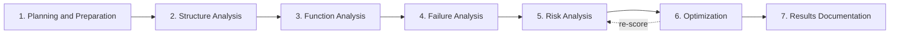
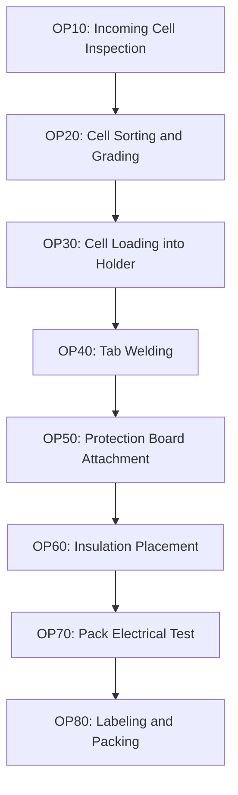
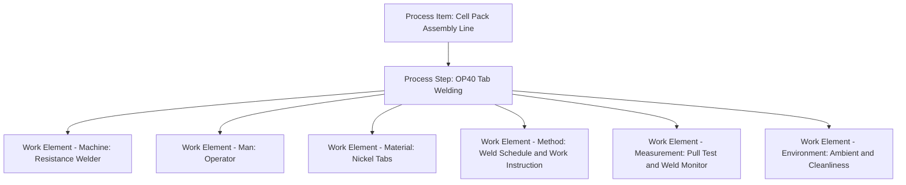
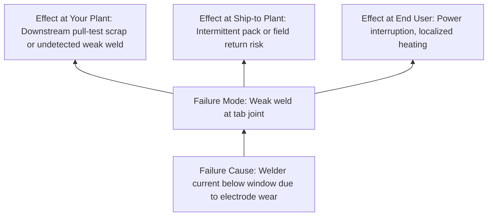
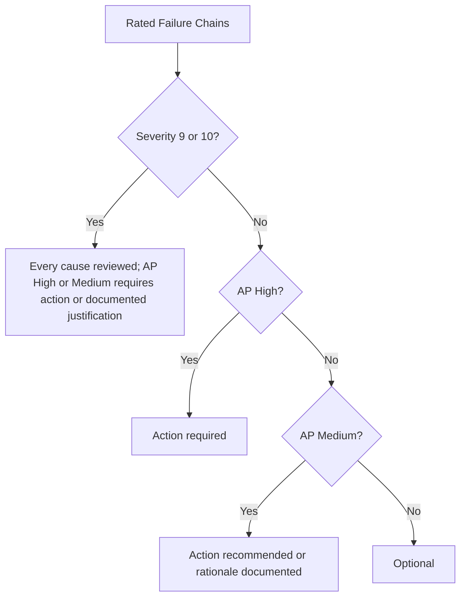
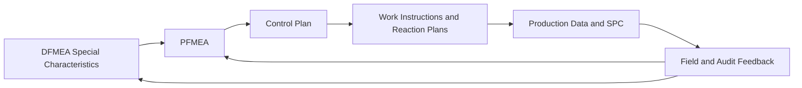

## Worked PFMEA Example Walkthrough

### Overview

This walkthrough builds a complete Process Failure Mode and Effects Analysis (PFMEA) for a realistic manufacturing process: **assembly of a lithium-ion cell pack for a portable USB-C power bank**. It continues the product used in the DFMEA walkthrough, so the design's special characteristics (protection cutoff voltage accuracy, enclosure corner thickness) flow into the process analysis. The walkthrough follows the 7-step approach of the harmonized AIAG & VDA FMEA Handbook: Planning and Preparation, Structure Analysis, Function Analysis, Failure Analysis, Risk Analysis, Optimization, and Results Documentation.

**Key Points**

- A PFMEA analyzes how the **manufacturing or assembly process** could fail to produce a product that meets design intent. It assumes the design is correct; design weaknesses belong in the DFMEA.
- The 6M framework (Man, Machine, Material, Method, Measurement, Milieu/Environment) organizes process work elements and helps prompt failure causes.
- All ratings, failure rates, and thresholds in this example are illustrative teaching values. Replace them with data, rating scales, and requirements from your organization, customer, and governing standard.
- [Unverified] Action Priority (AP) values shown here are simplified representations of the harmonized handbook's tables; consult the current handbook for the authoritative tables.
- [Inference] A real cell-pack line would also require process safety analysis and regulatory compliance work beyond the PFMEA.

### Step 1: Planning and Preparation

**Purpose:** Define the process scope, team, inputs, and boundaries.

**PFMEA Project Definition (5T Framework)**

| Element | Definition for This Example |
| --- | --- |
| InTent | Identify and reduce process risks in cell pack assembly before production launch |
| Timing | Complete before pre-production build and production part approval; update after process changes, trial-run results, and field feedback |
| Team | Manufacturing engineer (facilitator), quality engineer, process technician or operator representative, design engineer, test engineer, maintenance representative, supplier quality engineer |
| Task | PFMEA for each process step from incoming cells through packed pack assembly |
| Tools | Process flow diagram, DFMEA special characteristics list, rating scales, FMEA software or spreadsheet, prior PFMEAs and lessons learned |

**Scope Definition**

- **In scope:** Incoming cell inspection, cell sorting and grading, cell holder loading, tab welding, protection board attachment, insulation placement, pack-level electrical test, labeling, and handling
- **Out of scope:** Cell manufacturing at the supplier (covered by supplier's own PFMEA), final product enclosure assembly, shipping and transportation
- **Inputs:** DFMEA and special characteristics list, drawings and specifications, control plan draft, equipment specifications, historical scrap and rework data

**Special Characteristics Inherited from the DFMEA**

- Protection cutoff voltage accuracy (setting and verification of the protection circuit)
- Cell pack insulation integrity (prevents internal short)
- Weld strength at cell tab connections

### Step 2: Structure Analysis

**Purpose:** Decompose the process into steps and identify the work elements that influence each step.

**Process Flow**

**Structure Tree for Selected Step (OP40: Tab Welding)**

For this walkthrough, the analysis focuses on three process steps: **OP40 Tab Welding**, **OP60 Insulation Placement**, and **OP70 Pack Electrical Test**, since they connect directly to the inherited special characteristics.

### Step 3: Function Analysis

**Purpose:** Define what each process step and work element must accomplish, including the product characteristics and process parameters involved.

**Process Step Functions and Requirements (Illustrative)**

| Process Step | Function of Process Step (Product Characteristic) | Work Element | Function of Work Element (Process Characteristic) |
| --- | --- | --- | --- |
| OP40 Tab Welding | Create weld joint with pull strength of at least 30 N and contact resistance below 2 milliohms | Resistance welder | Deliver weld current of 2.5 kA ± 0.2 kA for 8 ms |
| OP40 Tab Welding | (same) | Operator | Position tab within 0.5 mm of the specified location |
| OP40 Tab Welding | (same) | Nickel tab material | Provide specified thickness and surface cleanliness |
| OP40 Tab Welding | (same) | Weld monitor | Detect out-of-window weld energy and reject the part |
| OP60 Insulation Placement | Apply insulation sheet covering all exposed cell terminals and tab edges | Fixture or operator | Place sheet with at least 2 mm overlap beyond conductive edges |
| OP60 Insulation Placement | (same) | Vision system | Verify sheet presence and position |
| OP70 Pack Electrical Test | Confirm protection cutoff voltage of 4.25 V ± 0.05 V and reject nonconforming packs | Test station | Apply calibrated voltage ramp and measure cutoff point |
| OP70 Pack Electrical Test | (same) | Calibration standard | Maintain measurement accuracy within 5 mV |

**Key Points**

- Function analysis links **product characteristics** (what the customer or next process needs) to **process characteristics** (what the process must do to achieve them).
- This linkage allows the PFMEA to trace failure causes back to controllable process parameters.

### Step 4: Failure Analysis

**Purpose:** Build failure chains. In a PFMEA, the **failure mode** describes how the process step fails to produce the intended product characteristic, the **failure effect** describes consequences at the plant, customer plant, and end user, and the **failure cause** describes how a work element fails to perform its function.

**Failure Effect Levels**

- **Your plant:** Scrap, rework, line stoppage
- **Ship-to plant (next customer):** Assembly problems, sorting, stoppage
- **End user:** Product malfunction, safety hazard, dissatisfaction
- Also consider regulatory or safety implications where applicable.

**Failure Chains for the Selected Steps**

**Chain A: OP40 Tab Welding**

- Failure Mode: Weak or cold weld at tab joint
- Failure Effects:
  - Your plant: Rework or scrap if detected
  - Ship-to plant: Intermittent pack function
  - End user: Loss of power, localized heating, potential thermal concern
- Failure Causes:
  - Electrode tip wear reduces delivered weld energy
  - Operator positions tab off-center
  - Nickel tab surface contamination (oxide or oil)
  - Welder current setpoint drift

**Chain B: OP40 Tab Welding (Excessive Energy)**

- Failure Mode: Burn-through or cell can damage during welding
- Failure Effects:
  - Your plant: Scrap of the cell and pack
  - End user: Internal cell damage that may not be detected immediately, potential thermal hazard
- Failure Causes:
  - Weld energy setpoint too high after a maintenance change
  - Incorrect weld schedule loaded for a different cell model
  - Electrode force too low causing arcing

**Chain C: OP60 Insulation Placement**

- Failure Mode: Insulation sheet missing or shifted
- Failure Effects:
  - Your plant: Rework if detected
  - End user: Possible internal short between tab and metal enclosure or adjacent conductor, thermal event
- Failure Causes:
  - Operator omits placement step under time pressure
  - Fixture allows sheet to slide during placement
  - Vision system misses shifted sheet due to lighting variation

**Chain D: OP70 Pack Electrical Test**

- Failure Mode: Nonconforming protection cutoff voltage not detected (false accept)
- Failure Effects:
  - Your plant: Nonconforming pack proceeds
  - End user: Overcharge protection does not activate at the correct voltage, potential thermal event
- Failure Causes:
  - Test station calibration drift
  - Test limit entered incorrectly after software update
  - Test program allows bypass of a failed measurement without authorization

### Step 5: Risk Analysis

**Purpose:** Assign Severity (S), Occurrence (O), and Detection (D) and determine action priority.

**Rating Definitions Specific to PFMEA**

- **Severity (S):** Based on the worst-case effect, considering your plant, ship-to plant, and end user. It is a property of the effect and does not change with process controls.
- **Occurrence (O):** Likelihood that the cause occurs and produces the failure mode, considering **prevention controls** in the process.
- **Detection (D):** Ability of **detection controls** to detect the cause or the failure mode before the product leaves the process step or plant.

**Rating Scale Summary (Illustrative)**

| Rating | Severity | Occurrence (Process) | Detection (Process Controls) |
| --- | --- | --- | --- |
| 10 | Safety hazard without warning | Very high; failure almost certain | No detection method or no control |
| 9 | Safety hazard or regulatory noncompliance with warning | Very high | Detection unlikely |
| 7 to 8 | Major disruption or major customer impact | High | Low to moderate detection |
| 4 to 6 | Moderate disruption, rework, or customer annoyance | Moderate | Moderate to good detection |
| 2 to 3 | Minor disruption | Low | High detection |
| 1 | No effect | Very low; failure eliminated through prevention | Error-proofed; almost certain detection |

[Unverified] Real rating tables must be taken from your organization and the current handbook.

**Current Controls**

- **Prevention Controls (PC):** Poka-yoke, preventive maintenance, setup verification, standardized work, material certification
- **Detection Controls (DC):** In-process inspection, automated monitoring, end-of-line test, first-piece approval, audits

**Risk Analysis Worksheet**

| ID | Process Step | Failure Mode | Effect (Worst Case) | S | Failure Cause | Prevention Control | O | Detection Control | D | RPN (ref) | AP |
| --- | --- | --- | --- | --- | --- | --- | --- | --- | --- | --- | --- |
| A1 | OP40 | Weak weld | Loss of power, localized heating | 8 | Electrode tip wear | Scheduled tip dressing every 2 hours | 5 | Operator visual check at end of shift | 7 | 280 | H |
| A2 | OP40 | Weak weld | Loss of power, localized heating | 8 | Tab off-center | Work instruction and fixture guide | 4 | Random pull test each hour | 5 | 160 | H |
| A3 | OP40 | Weak weld | Loss of power, localized heating | 8 | Contaminated tab surface | Supplier certificate of conformance | 4 | Periodic pull test | 6 | 192 | H |
| A4 | OP40 | Weak weld | Loss of power, localized heating | 8 | Current setpoint drift | Annual welder calibration | 3 | Weld monitor alarm not yet installed | 8 | 192 | H |
| B1 | OP40 | Burn-through or can damage | Undetected cell damage, thermal hazard | 10 | Wrong weld schedule loaded | Recipe stored in controller | 4 | None specific | 8 | 320 | H |
| C1 | OP60 | Insulation missing or shifted | Internal short, thermal event | 10 | Operator omits step | Standard work instruction | 5 | Operator self-check | 7 | 350 | H |
| C2 | OP60 | Insulation missing or shifted | Internal short, thermal event | 10 | Sheet slides in fixture | Fixture with stop features | 4 | Vision system with limited lighting control | 5 | 200 | H |
| D1 | OP70 | False accept of cutoff voltage | Overcharge protection incorrect | 10 | Calibration drift | Monthly calibration schedule | 4 | None beyond routine check | 6 | 240 | H |
| D2 | OP70 | False accept of cutoff voltage | Overcharge protection incorrect | 10 | Test limit entered incorrectly | Software change request form | 3 | Manual review of software release | 6 | 180 | H |

**Example: Interpreting RPN Versus Action Priority**

Consider A1 with $S = 8$, $O = 5$, $D = 7$.

$$RPN = S \times O \times D = 8 \times 5 \times 7 = 280$$

Consider C2 with $S = 10$, $O = 4$, $D = 5$.

$$RPN = 10 \times 4 \times 5 = 200$$

**Output**

A1 has the higher RPN, but C2 carries a severity of 10 and is a special characteristic linked to internal short risk. Action Priority logic treats high severity combined with non-trivial occurrence and imperfect detection as High priority, so both items require action regardless of the numeric RPN ordering. [Inference] A cutoff such as "act only if RPN exceeds 250" would have excluded C2, D1, and D2, demonstrating why raw RPN thresholds can hide severity-driven risk.

**Prioritization Logic**

### Step 6: Optimization

**Purpose:** Define, assign, implement, and evaluate actions, then re-rate.

**Action Strategy Hierarchy for Processes**

1. **Eliminate the cause or failure mode** through process or equipment redesign (for example, a fixture that physically prevents wrong placement)
2. **Reduce occurrence** through error-proofing (poka-yoke), automated parameter control, and preventive maintenance driven by data
3. **Improve detection** with automated, 100 percent, in-station detection (weld monitors, vision, inline test)
4. Avoid relying on operator vigilance, training alone, or additional manual inspection as the primary control

**Recommended Actions and Re-Scoring**

| ID | Action | Owner | Target | Status | New S | New O | New D | New RPN | New AP |
| --- | --- | --- | --- | --- | --- | --- | --- | --- | --- |
| A1 | Install weld monitor with energy window and auto-reject; replace time-based tip dressing with counter-based auto-dress | Manufacturing Engineer | Pre-production build minus 6 weeks | Implemented | 8 | 3 | 3 | 72 | L |
| A2 | Add locating fixture with mechanical stop and presence sensor | Tooling Engineer | Pre-production build minus 6 weeks | Implemented | 8 | 2 | 4 | 64 | L |
| A3 | Add incoming tab surface test on each lot and sealed packaging requirement | Supplier Quality Engineer | Pre-production build minus 5 weeks | Implemented | 8 | 2 | 4 | 64 | L |
| A4 | Weld monitor with drift alarm and weekly capability check | Manufacturing Engineer | Pre-production build minus 6 weeks | Implemented | 8 | 2 | 3 | 48 | L |
| B1 | Barcode-scan cell model to auto-load weld schedule; lock recipe changes behind engineering password | Controls Engineer | Pre-production build minus 5 weeks | Implemented | 10 | 2 | 3 | 60 | M |
| C1 | Add sensor-verified insulation placement that interlocks the transfer to the next station | Automation Engineer | Pre-production build minus 6 weeks | Implemented | 10 | 2 | 2 | 40 | M |
| C2 | Add fixture guide rails; upgrade vision with controlled lighting and periodic golden-sample check | Automation Engineer | Pre-production build minus 5 weeks | Implemented | 10 | 2 | 3 | 60 | M |
| D1 | Add master-sample verification (known-good and known-bad packs) at the start of each shift with automatic lockout on failure | Test Engineer | Pre-production build minus 4 weeks | Implemented | 10 | 2 | 3 | 60 | M |
| D2 | Locked test limits with version control, checksum verification, and two-person release approval | Test Engineer | Pre-production build minus 4 weeks | Implemented | 10 | 1 | 3 | 30 | M |

**Key Points**

- Severity stays at 8 or 10 in this example because the worst-case end-user effect is unchanged by process improvements; only occurrence and detection are reduced.
- Occurrence reductions must be supported by evidence, such as capability studies or trial-run data, rather than by intent alone.
- Detection improvements must be verified. For example, a vision system's detection rating should be justified by challenge testing with known-bad samples.

**Example: Verifying an Improved Detection Control**

The team challenges the OP70 master-sample verification with 30 known-bad packs and finds that all 30 are rejected.

Using the rule-of-three style approximation for zero failures in $n$ trials, the upper 95 percent bound on the miss rate is approximately:

$$p_{upper} \approx \frac{3}{n} = \frac{3}{30} = 0.10$$

**Output**

With only 30 trials, the demonstrated 95 percent upper bound on the miss rate is about 10 percent, which is not strong evidence for a very high detection rating. To support a stronger claim, such as an upper bound near 1 percent, the team would need roughly 300 challenge samples with zero misses.

$$n \approx \frac{3}{0.01} = 300$$

[Inference] The rule-of-three is an approximation; formal attribute agreement analysis or measurement system analysis is preferable for rigorous validation.

### Step 7: Results Documentation

**Purpose:** Summarize outcomes, communicate residual risk, and link the PFMEA to downstream documents.

**Documentation Content**

- Scope, team, and revision history
- Process flow diagram and structure and function analysis
- Completed worksheet with initial and final ratings
- Action tracking log with evidence, including capability studies and challenge test results
- Residual risk summary and justification for accepted risks
- Links to the control plan, work instructions, reaction plans, and DFMEA
- Lessons learned and updates to the organization's failure mode library

**Residual Risk Summary (Illustrative)**

| Category | Count Before Actions | Count After Actions |
| --- | --- | --- |
| High AP items | 9 | 0 |
| Medium AP items | 0 | 4 |
| Low AP items | 0 | 5 |

**Control Plan Linkage**

| Process Step | Characteristic | Control Method | Sample Size and Frequency | Reaction Plan |
| --- | --- | --- | --- | --- |
| OP40 | Weld energy within window | Weld monitor with auto-reject | 100 percent | Quarantine lot, stop line, engineering review |
| OP40 | Weld pull strength ≥ 30 N (special characteristic) | Destructive pull test | 5 pieces per hour | Contain last hour's output, adjust process |
| OP60 | Insulation presence and position (special characteristic) | Sensor interlock and vision | 100 percent | Reject and rework, investigate cause |
| OP70 | Protection cutoff voltage 4.25 V ± 0.05 V (special characteristic) | Automated end-of-line test with shift-start master samples | 100 percent; master check each shift | Lockout station, re-verify last shift's output |

### Facilitator Notes and Common Pitfalls Illustrated

- **Confusing failure mode with cause:** "Electrode wear" is a cause; "weak weld" is the failure mode. Keep the failure chain logic consistent.
- **Relying on operator vigilance:** C1 initially depended on operator self-check. The optimized action replaced it with a sensor interlock, which is a stronger control.
- **Overstating detection:** Detection ratings must reflect the actual capability of the control, verified by challenge tests, not the mere existence of an inspection step.
- **Ignoring severity in prioritization:** Items C2, D1, and D2 would be overlooked under an RPN-only cutoff.
- **Rating severity by process controls:** Severity describes the effect, not the likelihood of detection or prevention. Better controls change O and D, not S.
- **Failing to close the loop with the DFMEA:** If the PFMEA reveals that a design characteristic is difficult to control, feed that insight back to design for a potential design change.
- **Static documents:** Process changes, new equipment, supplier changes, and customer complaints should trigger PFMEA review.

### Conclusion

This walkthrough demonstrated a complete PFMEA cycle for cell pack assembly: scoping the process, decomposing steps and work elements, linking product and process characteristics, building failure chains across plant, customer, and end-user levels, rating risk with Action Priority logic, applying a hierarchy of preventive and detective actions, and connecting results to the control plan. The main lessons are to anchor the analysis to special characteristics inherited from the DFMEA, favor error-proofing over inspection, justify ratings with evidence, and maintain the PFMEA as a living document tied to production and field data. Actual outcomes and acceptable residual risk depend on real process data, applicable standards, and customer requirements, and may vary by application and jurisdiction.

### Next Steps

- Extend the analysis to the remaining process steps (OP10, OP20, OP30, OP50, OP80)
- Build a full control plan from the PFMEA and validate each control with capability or challenge studies
- Perform a measurement system analysis on the weld pull test and the end-of-line voltage test
- Conduct a peer review using a checklist covering function linkage, rating consistency, control effectiveness, and traceability to the DFMEA

### Related Topics

- Worked DFMEA example walkthrough
- Process flow diagrams and structure analysis
- Error-proofing (poka-yoke) strategies
- Control plan development and reaction plans
- Measurement system analysis and Gage R&R
- Special characteristics management
- Statistical process control and capability studies
- Facilitating cross-functional PFMEA workshops