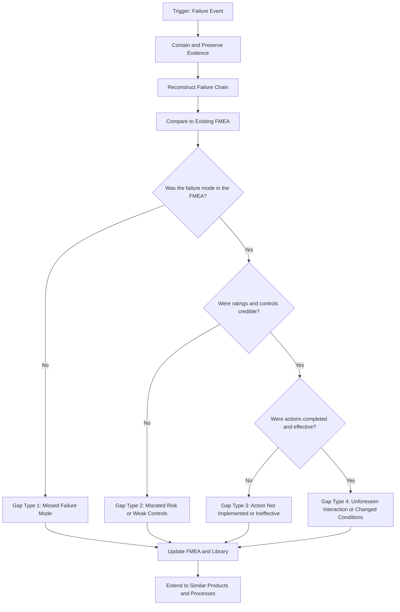
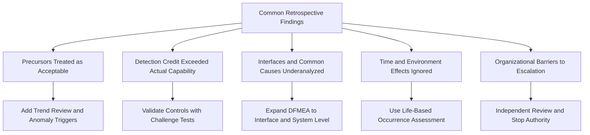

## Retrospective FMEA Analysis of Real World Product Failures

### Overview

A retrospective FMEA analysis applies the FMEA framework **after** a failure has occurred in the field, during testing, or in production. Instead of predicting what might go wrong, the team starts from a known failure, reconstructs the failure chain, and asks a different set of questions: Which failure mode occurred? Which causes were credible? Why did the existing prevention and detection controls not stop it? And, critically, what did the original FMEA (if one existed) say about it?

This reference explains the method, then applies it to four well-documented public cases: the **Space Shuttle Challenger** O-ring failure, the **Space Shuttle Columbia** foam strike, the **Takata airbag inflator** ruptures, and the **Samsung Galaxy Note 7** battery fires. Each case is reconstructed as a retrospective FMEA to show how the technique exposes systemic gaps in rating scales, detection assumptions, and organizational behavior.

**Key Points**

- Retrospective FMEA is a **learning and improvement tool**, not a legal or forensic finding. It does not replace formal root cause analysis (RCA), accident investigation, or regulatory findings.
- Public-case reconstructions in this reference are **simplified teaching illustrations** based on widely published investigation summaries. Ratings shown are analyst judgments assigned in hindsight, not the ratings any organization actually used. [Inference] Real investigations involve far more evidence, competing hypotheses, and legal constraints than any short FMEA summary can capture.
- [Unverified] Some technical details of these incidents are still debated or were disclosed differently across investigations, so treat specific claims as summaries and consult the primary investigation reports for authoritative detail.
- Hindsight bias is the central risk: knowing the outcome makes causes appear obvious. A disciplined retrospective must evaluate what was knowable **at the time**.

### Purpose and Value of Retrospective FMEA

**Why Perform One**

- **Prevent recurrence:** Update the FMEA library and design and process controls so the same chain cannot repeat.
- **Test the original FMEA's quality:** Determine whether the failure mode was identified, rated, and acted upon.
- **Find systemic weaknesses:** Reveal patterns such as normalization of deviance, optimistic detection ratings, or ignored low-occurrence, high-severity items.
- **Extend to similar products:** Identify other designs or processes that share the same cause mechanism.
- **Feed lessons learned:** Improve rating scales, checklists, and review practices.

**Triggers for a Retrospective FMEA**

- Field returns or warranty spikes
- Safety incidents, recalls, or regulatory actions
- Customer escapes and containment events
- Near misses, audit findings, or test failures during validation
- Major process excursions or supplier failures

### The Retrospective FMEA Method

**Step 1: Contain and Preserve Evidence**

- Secure failed parts, records, test data, design and process history, and change logs.
- Interview people who built, tested, and used the product, avoiding leading questions.

**Step 2: Reconstruct the Failure Chain**

- Build a timeline of design decisions, process changes, supplier changes, test results, and field events.
- Use complementary RCA tools such as 5 Whys, fishbone diagrams, fault tree analysis, and change analysis to establish the causal chain.
- Populate FMEA structure: function, failure mode, effects at each level, and causes.

**Step 3: Compare to the Existing FMEA**

Answer these questions for each failure chain:

1. Was the function and requirement defined?
2. Was the failure mode listed?
3. Were the effects and severity rated appropriately?
4. Was the cause listed?
5. Were prevention and detection controls listed, and did they actually exist and work as described?
6. Were recommended actions defined, assigned, completed, and verified?
7. Was the FMEA updated when the design, process, supplier, or use conditions changed?

**Step 4: Classify the Gap**

| Gap Type | Description | Typical Corrective Direction |
| --- | --- | --- |
| Missed failure mode | The chain was never identified | Improve team composition, use failure mode libraries, add field data review |
| Misrated risk | Failure mode listed but severity, occurrence, or detection was underestimated | Recalibrate rating scales, require evidence for ratings |
| Ineffective controls | Control was listed but did not work as credited | Validate controls with challenge testing, remove credit for weak controls |
| Action failure | Action not done, delayed, or ineffective | Strengthen action tracking, escalation, and verification |
| Changed conditions | Design, process, supplier, environment, or use changed after FMEA | Link change management to FMEA updates |
| Organizational or cultural | Warnings ignored, risk normalized, schedule pressure prevailed | Governance changes, independent review, escalation authority |

**Step 5: Re-Rate With Full Knowledge (Carefully)**

- Assign revised S, O, and D values reflecting the now-known failure mechanism.
- Distinguish between ratings **justified at the time** and ratings **justified now**. The difference quantifies the knowledge gap.

**Step 6: Update Documents and Extend**

- Update the DFMEA, PFMEA, control plan, and verification plans.
- Search for the same failure mechanism in other products, suppliers, and processes.
- Update the organizational failure mode library and rating guidance.

### Managing Hindsight Bias

**Key Points**

- Ask "What information was available and credible **then**?" before asking "Why did they miss it?"
- Separate **information availability** from **information interpretation**. In many disasters, data existed but was framed as acceptable.
- Use a structured timeline that marks decision points and the evidence available at each one.
- Involve people who were not part of the original decision when possible, to offset defensiveness and groupthink.
- Avoid single-cause conclusions. Real failures typically involve several contributing factors.

**Example: Decision Point Table**

| Date | Decision | Evidence Available | Interpretation at the Time | Alternative Interpretation |
| --- | --- | --- | --- | --- |
| T1 | Accept design margin | Test data with limited conditions | Margin considered adequate | Data did not cover worst-case conditions |
| T2 | Continue operation after anomaly | Anomaly observed but no failure | Treated as acceptable variation | Anomaly was a precursor of the failure mechanism |
| T3 | Approve change | Supplier reported equivalent performance | Change judged minor | Change altered a critical parameter |

### Case Study 1: Space Shuttle Challenger (1986) — O-Ring Joint Failure

**Background (Summary)**

The Challenger accident occurred during a cold-weather launch. Investigation findings, as summarized in the Rogers Commission report, identified failure of a solid rocket booster field joint where O-ring seals did not seal effectively, allowing hot gas to escape. [Unverified] Specific details of temperature effects and organizational decision-making are described in the official report and subsequent analyses; consult those sources for authoritative detail.

**Retrospective Failure Chain (Simplified)**

| Element | Reconstruction |
| --- | --- |
| Function | Seal the field joint against hot combustion gas throughout ignition and flight |
| Failure Mode | Primary and secondary O-rings fail to seal, allowing gas blow-by |
| Effects | Local: erosion of seals and joint. System: burn-through and structural failure. End: loss of vehicle and crew |
| Causes | Joint rotation during ignition reducing seal compression; reduced O-ring resilience at low temperature; design reliance on redundant seals that were not truly independent; launch below tested temperature range |
| Prevention Controls (at the time) | Design margin arguments, redundant O-ring design, flight-to-flight acceptance based on prior successful flights |
| Detection Controls (at the time) | Post-flight inspection of joints, review of prior anomalies |

**Gap Classification**

- **Misrated risk and ineffective controls:** Prior flights showed O-ring erosion and blow-by, but because earlier flights succeeded, the anomaly was treated as within accepted experience instead of a warning of a failure mechanism.
- **Changed conditions:** The launch temperature was below the range covered by prior experience.
- **Organizational:** Concerns raised by engineers did not prevail in the launch decision. [Inference] This illustrates the limits of any FMEA when governance does not empower engineers to stop a launch.

**Retrospective Re-Rating (Illustrative Hindsight Ratings)**

| Item | Severity | Occurrence (at the time, honest evidence) | Detection | Comment |
| --- | --- | --- | --- | --- |
| O-ring seal failure under cold conditions | 10 | Should have been elevated given observed blow-by and lack of cold-temperature data | 8 to 10 (no test demonstrating seal performance at the actual temperature) | Redundancy credit should not have lowered occurrence if the seals were not independent |

**Lessons for FMEA Practice**

- **Do not treat "no failure yet" as evidence of low occurrence** when precursor damage exists.
- **Redundancy is not independence.** Common-cause failures (for example, temperature affecting both seals) invalidate multiplicative risk reduction.
- **Operating envelope matters.** Detection and occurrence ratings must reflect actual conditions, including out-of-experience conditions.
- **Severity 10 items require independent, documented go or no-go criteria.**

### Case Study 2: Space Shuttle Columbia (2003) — Foam Strike

**Background (Summary)**

During Columbia's launch, insulating foam separated from the external tank and struck the left wing's leading edge. The Columbia Accident Investigation Board (CAIB) concluded that the damage compromised the thermal protection, leading to loss of the vehicle during re-entry. [Unverified] Consult the CAIB report for authoritative technical and organizational detail.

**Retrospective Failure Chain (Simplified)**

| Element | Reconstruction |
| --- | --- |
| Function | Protect the orbiter structure from re-entry heat using wing leading-edge thermal protection |
| Failure Mode | Breach of thermal protection system allowing hot gas to enter the wing |
| Effects | Local: internal wing structure damage. System: loss of control and structural failure on re-entry. End: loss of vehicle and crew |
| Causes | Foam shedding from the external tank; impact energy exceeding tolerance of the leading-edge material; limited ability to inspect or repair in orbit |
| Prevention Controls (at the time) | Foam application process controls, reliance on prior flights that experienced foam loss without catastrophic outcome |
| Detection Controls (at the time) | Post-launch imagery review, analytical debris impact models with limited validity for the observed conditions |

**Gap Classification**

- **Misrated risk:** Repeated foam-shedding events were reclassified from a safety-of-flight concern to an acceptable maintenance issue after prior flights returned safely.
- **Ineffective controls:** Impact models were used outside their validated range.
- **Organizational:** Requests for additional imagery were not pursued. [Inference] This is an example of normalization of deviance, where repeated anomalies become accepted.

**Retrospective Re-Rating (Illustrative)**

| Item | Severity | Occurrence | Detection | Comment |
| --- | --- | --- | --- | --- |
| Foam impact breaches leading-edge thermal protection | 10 | Should reflect the repeated observed foam-loss events, not the absence of prior catastrophic outcomes | 9 to 10 (limited capability to assess damage or repair in orbit) | Detection credit for models outside validated range is unjustified |

**Lessons for FMEA Practice**

- **Model validity must be part of detection credit.** A simulation used beyond its validated range provides weak detection.
- **Track anomaly trends.** Repeated "acceptable" anomalies should trigger review of the underlying mechanism.
- **Consider recovery and mitigation options** (inspection, repair, contingency) in the analysis of severity and detection.

### Case Study 3: Takata Airbag Inflator Ruptures

**Background (Summary)**

Ruptures of certain Takata airbag inflators, which sprayed metal fragments into vehicle occupants, led to extensive recalls across many vehicle brands. Publicly reported investigations and regulatory actions linked the problem to degradation of the ammonium nitrate propellant over time under heat and humidity, combined with manufacturing and design factors. [Unverified] Findings, causal weighting, and legal conclusions varied across investigations and jurisdictions; consult regulatory and investigative documents for authoritative detail.

**Retrospective Failure Chain (Simplified)**

| Element | Reconstruction |
| --- | --- |
| Function | Deploy the airbag by controlled propellant burn without rupturing the inflator housing |
| Failure Mode | Inflator housing ruptures during deployment |
| Effects | Local: fragmentation of metal housing. System: airbag fails to protect and projectiles enter the cabin. End: severe injury or death |
| Causes (reported factors) | Propellant degradation from long-term exposure to temperature cycling and moisture; propellant density and porosity variation; manufacturing moisture control gaps; design without desiccant or robust environmental protection |
| Prevention Controls (at the time) | Material specification, process controls, accelerated aging tests |
| Detection Controls (at the time) | Lot acceptance testing, validation tests of limited duration and climate coverage |

**Gap Classification**

- **Missed or underestimated failure mode:** Long-term environmental degradation and its effect on burn rate and pressure may not have been adequately represented in life-cycle assumptions.
- **Ineffective detection:** Validation tests that did not span the actual range of service life and climate conditions.
- **Process-design interaction:** Manufacturing variation (for example, moisture exposure) affected a design that had limited margin.
- **Organizational and supply chain:** Multi-tier supply chain complexity slowed identification and response. [Inference] Fleet-wide field data aggregation is essential for slowly developing failure mechanisms.

**Retrospective Re-Rating (Illustrative)**

| Item | Severity | Occurrence | Detection | Comment |
| --- | --- | --- | --- | --- |
| Inflator rupture due to propellant degradation | 10 | Increases over service life and in hot, humid climates | 8 to 9 if tests did not represent the full life and climate range | Time-dependent failure modes need life-based occurrence rating, not a single-time snapshot |

**Lessons for FMEA Practice**

- **Time-dependent and environment-dependent failure modes** need explicit consideration of service life, climate, and aging.
- **Design and process interplay:** A design that is marginally robust makes process variation a safety issue. DFMEA and PFMEA must feed each other.
- **Field data integration:** Slow-developing failures depend on early field signals; FMEA should be updated as field data arrives.
- **Detection credit must match test representativeness.**

**Example: Life-Dependent Occurrence**

Using a Weibull failure model with shape parameter $\beta > 1$ (wear-out behavior), the cumulative failure probability is:

$$F(t) = 1 - e^{-(t/\eta)^{\beta}}$$

Suppose, for illustration only, $\beta = 3$ and $\eta = 30$ years. The probability of failure by 10 years and by 15 years is:

$$F(10) = 1 - e^{-(10/30)^3} = 1 - e^{-0.037} \approx 0.036$$

$$F(15) = 1 - e^{-(15/30)^3} = 1 - e^{-0.125} \approx 0.118$$

**Output**

The failure probability rises from about 3.6 percent to about 11.8 percent between 10 and 15 years under these illustrative parameters. An occurrence rating based only on early-life data would understate later risk. [Inference] The parameters are hypothetical and are used only to show why life-based analysis matters for wear-out mechanisms.

### Case Study 4: Samsung Galaxy Note 7 Battery Fires

**Background (Summary)**

The Galaxy Note 7 was recalled in 2016 after reports of battery overheating and fires. Publicly reported investigation results from the manufacturer described two distinct battery issues from different suppliers: one related to cell design and electrode deformation, and a later one associated with manufacturing defects such as welding issues and insulation problems. [Unverified] Details of causes and supplier attribution come from company and third-party investigation summaries; consult primary sources for authoritative detail.

**Retrospective Failure Chain (Simplified)**

| Element | Reconstruction |
| --- | --- |
| Function | Store and deliver electrical energy without internal short circuit or thermal runaway |
| Failure Mode | Internal short circuit in the cell leading to thermal runaway |
| Effects | Local: cell overheating. System: device fire or venting. End: burns, property damage, recall |
| Causes (reported, batch 1) | Design and housing constraints causing electrode deformation or insufficient space; separator contact and stress leading to internal short |
| Causes (reported, batch 2) | Manufacturing defects such as welding burrs or missing insulation tape, creating short paths |
| Prevention Controls (at the time) | Cell supplier qualification, design specifications, incoming acceptance |
| Detection Controls (at the time) | Standard safety and abuse testing, production inspection, sampling |

**Gap Classification**

- **Design gap (first cause):** Interaction between the cell design tolerances and the device's mechanical envelope.
- **Process gap (second cause):** Process control and inspection insufficient to catch defects such as burrs or missing insulation.
- **Corrective action verification gap:** The first fix did not resolve all risk pathways, because more than one failure mechanism existed. [Inference] This shows the danger of assuming a single root cause and closing an investigation prematurely.

**Retrospective Re-Rating (Illustrative)**

| Item | Severity | Occurrence | Detection | Comment |
| --- | --- | --- | --- | --- |
| Internal short due to design-related electrode stress | 10 | Moderate to high in affected lots | 7 to 9 if standard testing did not replicate the deformation conditions | DFMEA should cover mechanical interaction between cell and device |
| Internal short due to welding burr or missing insulation | 10 | Moderate in affected lots | 7 to 8 if inspection sampling could not detect low-rate defects | PFMEA needs 100 percent detection for special characteristics |

**Lessons for FMEA Practice**

- **Multiple root causes can coexist.** Verification of corrective actions must consider all credible failure chains.
- **Interface analysis matters.** The cell-to-device mechanical and thermal interface must be part of the DFMEA scope.
- **Low-rate manufacturing defects require detection capability matched to safety-critical severity.** Sampling may be inadequate.
- **Supplier PFMEAs and control plans must be reviewed and audited,** not only accepted.

### Cross-Case Pattern Summary

| Pattern | Challenger | Columbia | Takata | Note 7 |
| --- | --- | --- | --- | --- |
| Precursor warnings existed | Yes | Yes | [Inference] Field signals developed over time | [Inference] Early signals emerged in the field |
| Occurrence underestimated | Yes | Yes | Yes (life-dependent) | Yes |
| Detection credited beyond real capability | Yes | Yes (model range) | Yes (test representativeness) | Yes (sampling limits) |
| Common-cause or interface effects | Yes (seals, temperature) | Yes (foam and structure) | Yes (design and process interplay) | Yes (cell and device interface) |
| Organizational or governance contribution | Yes | Yes | Yes | [Inference] Speed and schedule pressure are frequently cited in analyses |
| Single root cause assumption risk | Moderate | Moderate | Moderate | High (two distinct causes) |

### Worked Example: Retrospective FMEA on a Field Failure Report

This smaller, hypothetical case demonstrates the method on a routine industrial failure.

**Scenario**

A manufacturer of portable power tools receives a spike in warranty returns for a battery charger that overheats and melts its housing after 8 to 14 months of use. No injuries have been reported.

**Step 1: Reconstruct the Failure Chain**

- Function: Convert AC mains to regulated DC charging current without exceeding surface temperature limits
- Failure Mode: Excessive heating of the power transformer area
- Effect: Housing deformation, potential fire hazard, warranty claim, brand damage
- Investigation findings: A change of the thermal pad supplier occurred 10 months before the spike. The new pad has lower thermal conductivity and degrades with heat cycling. The DFMEA was not updated after the supplier change.

**Step 2: Compare to the Original FMEA**

| Question | Finding |
| --- | --- |
| Was the failure mode listed? | Yes, "excessive heating" was listed |
| Was the cause listed? | No, thermal pad degradation was not listed |
| Were controls credible? | Detection relied on a short-duration thermal test with the original pad |
| Was the FMEA updated after the change? | No; supplier change did not trigger a review |

**Step 3: Classify the Gap**

- Changed conditions: supplier change
- Ineffective detection: short-duration test could not reveal aging degradation
- Process gap: change management not linked to FMEA

**Step 4: Re-Rate**

| Item | Original S / O / D | Retrospective S / O / D | Comment |
| --- | --- | --- | --- |
| Overheating due to thermal pad degradation | 8 / 3 / 4 | 8 / 6 / 7 | Occurrence raised because field data confirms the mechanism; detection raised because the test did not cover aging |

$$RPN_{original} = 8 \times 3 \times 4 = 96$$

$$RPN_{retrospective} = 8 \times 6 \times 7 = 336$$

**Output**

The RPN rises from 96 to 336. The change quantifies the knowledge gap. Actions include qualifying the pad with thermal aging tests, adding supplier change notification requirements linked to FMEA review, and adding an accelerated life test to the verification plan. The team also screens other products using the same pad.

**Step 5: Extend**

- Search the bill of materials for other products with the affected pad
- Update the failure mode library with "thermal interface material degradation"
- Add a change management checkpoint: any supplier or material change triggers DFMEA and PFMEA review

### Practical Templates

**Retrospective FMEA Worksheet Columns**

| Column | Purpose |
| --- | --- |
| Event reference | Link to incident, complaint, or investigation ID |
| Function and requirement | What should have happened |
| Failure mode | What actually happened |
| Effects (local, system, end user) | Consequences |
| Causes (confirmed and probable) | Mechanisms, with evidence level |
| Original FMEA reference | Corresponding row, if any |
| Original S / O / D | As documented |
| Control credited at the time | Prevention and detection |
| Control actual performance | Verified effectiveness |
| Gap classification | Missed mode, misrating, control failure, action failure, changed conditions, organizational |
| Retrospective S / O / D | Revised ratings |
| Actions | Corrective, preventive, and systemic |
| Extension scope | Similar products, processes, suppliers |

**Evidence Level Guidance**

- **Confirmed:** Supported by physical evidence, tests, or records
- **Probable:** Supported by strong indirect evidence
- **Possible:** Plausible but unverified; requires further investigation

### Metrics for Learning Organizations

- Percentage of field failures whose failure modes were present in the original FMEA
- Percentage of field failures for which the credited detection control failed to detect
- Average time from field signal to FMEA update
- Number of FMEA updates triggered by change management
- Rate of repeat failure mechanisms across products

### Common Pitfalls

- **Hindsight bias:** Judging past decisions by outcome rather than by available information
- **Blame orientation:** Focusing on individuals rather than system conditions reduces candor and learning
- **Single-cause closure:** Stopping at the first plausible cause and missing additional contributing chains
- **Rewriting history:** Editing the original FMEA instead of preserving it and documenting the retrospective separately
- **Ignoring near misses:** Waiting for a major failure before analyzing warning signals
- **Overconfidence in corrective actions:** Failing to verify effectiveness with data
- **Neglecting extension:** Fixing one product while identical mechanisms remain in others
- **Treating public case summaries as complete:** Investigations contain nuances that short summaries cannot capture

### Ethics and Communication Considerations

- Communicate findings factually, noting uncertainty and evidence level.
- Preserve privacy and proprietary information when sharing lessons.
- Recognize that safety-related findings may carry legal or regulatory reporting obligations that vary by jurisdiction.
- Promote a just culture where reporting concerns is protected and expected.

### Conclusion

Retrospective FMEA turns failures into structured learning. By reconstructing the failure chain, comparing it with the original analysis, classifying the type of gap, and re-rating with care for hindsight bias, teams can improve rating scales, strengthen controls, and close organizational blind spots. The public cases of Challenger, Columbia, Takata, and the Note 7 illustrate recurring themes: precursors accepted as normal, detection credited beyond actual capability, overlooked interfaces and common causes, time and environment effects, and governance barriers. FMEA is most effective when it is a living, evidence-based process integrated with change management, field data, and independent review. Conclusions about any real incident depend on the full investigative record and may vary with new evidence.

### Next Steps

- Select a recent internal failure or near miss and perform a retrospective FMEA using the worksheet above
- Audit a sample of existing FMEAs for credited controls that lack verified effectiveness
- Link change management, supplier change notifications, and field data review to mandatory FMEA updates
- Review the primary investigation reports for the public cases discussed here to deepen understanding

### Related Topics

- Root cause analysis methods (5 Whys, fishbone, fault tree analysis)
- Normalization of deviance and safety culture
- Change management and FMEA maintenance
- Field data analysis and warranty analytics
- Weibull analysis and life-based occurrence assessment
- Measurement system analysis and challenge testing of detection controls
- 8D problem solving and corrective action verification
- Failure mode libraries and lessons-learned databases