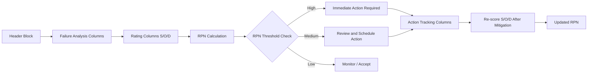

## Building an FMEA Template from Scratch

### Overview

A Failure Mode and Effects Analysis (FMEA) template is a structured worksheet used to identify potential failure modes in a system, process, or design, assess their risk, and prioritize corrective actions. Building one from scratch means defining the column structure, rating scales, calculation logic, and supporting reference tables before any analysis work begins.

### Core Template Structure

A functional FMEA template requires the following column groups, typically arranged left to right in a spreadsheet:

**1. Identification columns**

- Item/Function/Process Step
- FMEA ID or reference number
- Revision date
- Team/owner

**2. Failure analysis columns**

- Potential Failure Mode — the way a component or step could fail
- Potential Effect(s) of Failure — consequence of that failure on the next process step, end user, or system
- Potential Cause(s) of Failure — root mechanism driving the failure mode
- Current Process/Design Controls (Prevention) — controls that prevent the cause from occurring
- Current Process/Design Controls (Detection) — controls that detect the failure before it reaches the customer

**3. Rating columns**

- Severity (S) — 1–10 scale
- Occurrence (O) — 1–10 scale
- Detection (D) — 1–10 scale
- Risk Priority Number (RPN) = S × O × D

**4. Action columns**

- Recommended Actions
- Responsibility and Target Date
- Actions Taken
- Resulting S, O, D, and RPN (post-mitigation)

### Step-by-Step Build Process

#### Step 1: Choose the FMEA type

Determine whether the template is for:

- **Design FMEA (DFMEA)** — failure modes in a product design
- **Process FMEA (PFMEA)** — failure modes in a manufacturing/service process
- **System FMEA** — failure modes at the system/interface level

This choice determines the terminology used in "Item/Function" (e.g., "Process Step" for PFMEA vs. "Design Function" for DFMEA).

#### Step 2: Build the header block

Include:

- Item/System name
- FMEA number
- Design/Process responsibility
- Prepared by
- FMEA date (original and revised)
- Core team members

#### Step 3: Define the rating scales

These are typically built as separate reference tabs/tables that the main sheet references via dropdown validation.

**Severity scale (example, 1–10):**

| Rating | Criteria |
| --- | --- |
| 10 | Hazardous — failure affects safe operation without warning |
| 9 | Hazardous — failure affects safe operation with warning |
| 7–8 | Major disruption to function |
| 5–6 | Moderate disruption, customer dissatisfaction |
| 3–4 | Minor disruption |
| 1–2 | No discernible effect |

**Occurrence scale (example, 1–10):**

| Rating | Criteria |
| --- | --- |
| 10 | Failure almost inevitable (≥1 in 2) |
| 8–9 | High — repeated failures (1 in 20–50) |
| 5–7 | Moderate (1 in 200–2,000) |
| 3–4 | Low (1 in 2,000–20,000) |
| 1–2 | Remote (≤1 in 1,500,000) |

**Detection scale (example, 1–10, inverted logic):**

| Rating | Criteria |
| --- | --- |
| 10 | No detection method exists |
| 8–9 | Very low chance of detection |
| 5–7 | Moderate chance of detection |
| 3–4 | High chance of detection |
| 1–2 | Almost certain detection |

Note the inversion: for Detection, a *high* number means *poor* detectability, unlike Severity/Occurrence where high numbers mean high risk directly. This is standard convention but is a common source of scoring errors, so it's worth flagging explicitly in the template's instructions tab.

#### Step 4: Build the RPN calculation

$$RPN = S \times O \times D$$

In a spreadsheet, this is a simple multiplication formula across the three rating cells, typically locked/protected so users can't overwrite the formula while still editing S, O, D inputs.

Some organizations supplement or replace RPN with an **Action Priority (AP)** ranking (as used in AIAG-VDA FMEA methodology), which uses a lookup table combining S, O, and D into High/Medium/Low priority bands rather than a multiplied score. [Unverified — whether to use classic RPN or AIAG-VDA AP depends on which standard your organization or industry mandates.]

#### Step 5: Add conditional formatting for risk visualization

Typical thresholds (organization-dependent):

- RPN ≥ 200: Red (high priority, immediate action)
- RPN 100–199: Yellow (review required)
- RPN < 100: Green (acceptable, monitor)

#### Step 6: Add supporting tabs

- **Instructions/Legend tab** — explains each column and scale
- **Rating tables tab** — the S/O/D reference tables (Step 3), used as dropdown data sources
- **Revision history tab** — tracks changes to the FMEA over time
- **Action tracker tab** (optional) — a filtered view of only open action items, sorted by RPN descending

#### Step 7: Apply data validation

- S, O, D columns: dropdown restricted to integers 1–10
- Responsibility column: dropdown of team member names
- Status column (if added): dropdown of "Open / In Progress / Closed"

### Example Template Layout (Row-Level)

| Item/Function | Failure Mode | Effect(s) | Severity | Cause(s) | Occurrence | Current Controls | Detection | RPN | Recommended Action | Responsibility | Actions Taken | New S | New O | New D | New RPN |
| --- | --- | --- | --- | --- | --- | --- | --- | --- | --- | --- | --- | --- | --- | --- | --- |
| Pump seal | Seal cracks | Fluid leak, system shutdown | 8 | Material fatigue | 4 | Visual inspection monthly | 6 | 192 | Switch to reinforced seal material | J. Reyes | Material changed, retested | 8 | 2 | 4 | 64 |

### Template Structure Diagram

### Common Pitfalls When Building from Scratch

- **Inconsistent scale anchors** — if different reviewers interpret "Severity 7" differently, RPN values aren't comparable across rows. Always attach the full scale table directly in the workbook, not in a separate document.
- **Treating RPN as the sole prioritization metric** — two failure modes can have the same RPN (e.g., S=9,O=2,D=5 vs. S=3,O=6,D=5) with very different real-world risk profiles. Many teams add a rule: "any Severity ≥ 9 requires action regardless of RPN."
- **No revision control** — FMEAs are living documents; without a revision history tab, teams lose track of why scores changed.
- **Locking formulas incorrectly** — protecting the RPN formula cell is good, but over-protecting the sheet can block legitimate updates to controls or actions.

### Next Steps

- AIAG-VDA Action Priority (AP) tables as an RPN alternative
- Linking FMEA action items to a CAPA (Corrective and Preventive Action) tracker
- Automating FMEA template generation and RPN reporting with a spreadsheet macro or script
- Facilitating a cross-functional FMEA session using the completed template
- Auditing an existing FMEA template against IATF 16949 or AIAG-VDA requirements