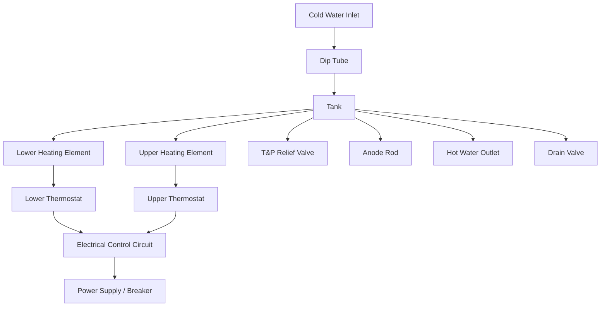

## Capstone Project: A Full FMEA on a Sample System

### Overview

This capstone project applies the complete FMEA methodology end-to-end on a concrete sample system, taking it from system definition through failure mode identification, risk scoring, and mitigation planning. The sample system used throughout is a **household electric water heater** (a system familiar enough to reason about without domain expertise, but complex enough to yield a meaningful multi-component analysis).

### Step 1: Define the System Scope

**System:** Residential electric storage water heater

**FMEA type:** Design FMEA (DFMEA), with process-level notes where relevant

**Boundary:** Cold water inlet to hot water outlet, including electrical control components; excludes household wiring upstream of the unit's breaker

**Major subsystems/components:**

- Tank (pressure vessel, glass lining, anode rod)
- Heating elements (upper and lower)
- Thermostats (upper and lower)
- Pressure relief valve (T&P valve)
- Dip tube
- Drain valve
- Insulation/jacket
- Electrical control circuit

### Step 2: Build the Block Diagram

### Step 3: Function Definition per Component

| Component | Primary Function |
| --- | --- |
| Tank | Store and contain heated water under pressure |
| Heating elements | Convert electrical energy to thermal energy |
| Thermostat | Regulate element cycling to maintain set temperature |
| T&P valve | Relieve excess pressure/temperature to prevent tank rupture |
| Dip tube | Direct incoming cold water to tank bottom |
| Anode rod | Sacrificial corrosion protection for tank lining |
| Drain valve | Allow tank draining for maintenance |

### Step 4: Full FMEA Worksheet

Using the standard 1–10 S/O/D scales established in the template-building phase:

| # | Component/Function | Failure Mode | Effect(s) | S | Cause(s) | O | Current Controls | D | RPN | Recommended Action |
| --- | --- | --- | --- | --- | --- | --- | --- | --- | --- | --- |
| 1 | Tank | Corrosion perforation | Water leak, property damage | 8 | Anode rod depleted, no maintenance | 5 | None (no scheduled inspection) | 7 | 280 | Add anode rod inspection to annual maintenance schedule |
| 2 | Heating element | Element burns out | No hot water | 5 | Sediment buildup causing overheating | 6 | None | 6 | 180 | Recommend annual tank flushing; consider low-watt-density element |
| 3 | Thermostat | Fails closed (stuck on) | Overheating, potential T&P valve activation | 9 | Contact welding from repeated cycling | 3 | T&P valve as backup safety | 4 | 108 | Specify thermostat with fail-safe high-limit cutoff |
| 4 | Thermostat | Fails open (stuck off) | No heating | 4 | Mechanical/electrical failure | 4 | None (no diagnostic indicator) | 7 | 112 | Add indicator light for element/thermostat status |
| 5 | T&P valve | Fails to open under pressure | Tank rupture, explosion risk | 10 | Mineral scale seizes valve | 3 | Manual test lever (rarely used) | 8 | 240 | Mandate valve testing at every service interval; consider redundant pressure sensor |
| 6 | T&P valve | Leaks/discharges prematurely | Water waste, nuisance failure, user disables it | 4 | Valve seat wear or thermal expansion w/o expansion tank | 6 | None | 3 | 72 | Require expansion tank installation per code |
| 7 | Dip tube | Cracks/disintegrates | Reduced hot water output, cold water mixing | 3 | Polymer degradation (early-generation dip tubes) | 3 | None | 6 | 54 | Specify verified dip tube material/supplier |
| 8 | Anode rod | Fully consumed | Accelerated tank corrosion (see #1) | 6 | Water chemistry accelerates consumption | 6 | None (no depletion indicator) | 7 | 252 | Add anode rod wear indicator or scheduled replacement interval |
| 9 | Electrical control circuit | Short circuit | Fire hazard, breaker trip | 9 | Insulation degradation from moisture ingress | 2 | Circuit breaker | 5 | 90 | Improve wiring compartment sealing against condensation |
| 10 | Drain valve | Fails to seal after use | Slow leak, water damage | 5 | Low-quality plastic valve, thread wear | 5 | None | 6 | 150 | Upgrade to brass ball valve as standard |

### Step 5: Risk Prioritization

Sorted by RPN, highest first:

| Rank | Failure Mode | RPN | Priority |
| --- | --- | --- | --- |
| 1 | Tank corrosion perforation | 280 | Critical |
| 2 | Anode rod fully consumed | 252 | Critical |
| 3 | T&P valve fails to open | 240 | Critical (Severity override — S=10) |
| 4 | Element burns out | 180 | High |
| 5 | Drain valve fails to seal | 150 | Medium |

**Severity override rule applied:** Item #5 (T&P valve failure to open) has S=10, meeting the common industry rule that any failure mode with Severity ≥ 9 requires action regardless of RPN ranking — even though its RPN (240) ranks third, it should be treated as equal-or-higher priority to the top-ranked item due to catastrophic failure potential.

### Step 6: Action Plan Summary

| Priority | Action | Owner | Target |
| --- | --- | --- | --- |
| 1 | Add T&P valve testing to service checklist; evaluate redundant pressure relief | Design/Service team | Immediate |
| 2 | Establish anode rod inspection/replacement interval | Service team | Next revision |
| 3 | Add sediment-flush recommendation to user manual | Documentation | Next revision |
| 4 | Specify fail-safe thermostat with high-limit cutoff | Design engineering | Next design cycle |
| 5 | Upgrade drain valve material spec | Procurement | Next design cycle |

### Step 7: Post-Mitigation Re-Scoring (Sample)

After implementing the T&P valve testing protocol and expansion tank requirement:

| Failure Mode | Original S,O,D,RPN | New S,O,D,RPN | Notes |
| --- | --- | --- | --- |
| T&P valve fails to open | 10,3,8 → 240 | 10,2,4 → 80 | Detection improved via mandatory testing; occurrence reduced via scale-resistant valve spec |
| Tank corrosion perforation | 8,5,7 → 280 | 8,3,4 → 96 | Occurrence reduced via anode maintenance; detection improved via inspection |

### Key Points

- The severity override rule prevents a high-severity, low-RPN failure mode from being deprioritized simply because occurrence or detection scores are favorable.
- Post-mitigation re-scoring closes the loop and demonstrates the FMEA's function as a living risk-reduction document, not a one-time audit.
- Component-level FMEA rows should trace back to the block diagram boundary defined in Step 1; any component outside the defined boundary is out of scope and should be explicitly excluded rather than silently omitted.
- [Inference] Real-world OEM FMEAs for this class of product would typically include additional failure modes around gasket/fitting corrosion at inlet/outlet connections and thermal cutoff (ECO) failure, omitted here for capstone scope management.

### Related Topics

- Applying FCA (Failure Cause Analysis) trees to trace root causes identified in this capstone
- Building a Control Plan derived from the finalized FMEA action items
- Cross-referencing this DFMEA with a corresponding manufacturing PFMEA
- Using fault tree analysis (FTA) to validate the T&P valve failure pathway
- Facilitating a live FMEA review session using this dataset as a training exercise