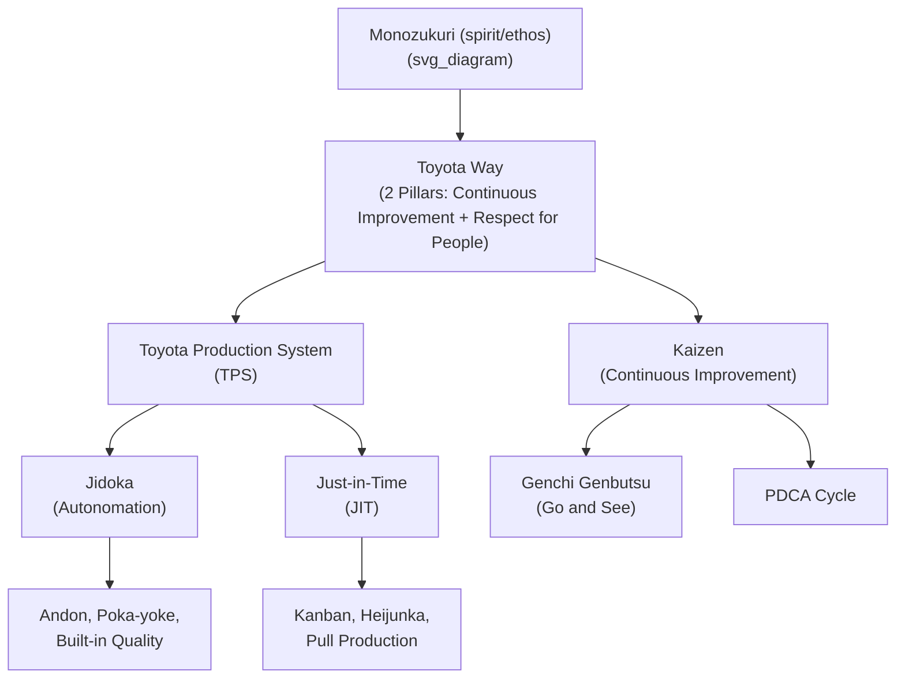

## Japanese Craftsmanship Traditions and the Concept of Monozukuri


### Definition and Etymology

Monozukuri (ものづくり / 物作り) is a compound of *mono* (物, "thing" or "product") and *zukuri* (from *tsukuru*, 作る, "to make"). Unlike the English "manufacturing," which derives from Latin roots meaning "made by hand" but has come to denote mechanical mass production, monozukuri carries a connotation of spirit, pride, and continuous refinement embedded in the act of making. It is often translated as "the art/science of manufacturing" or "craftsmanship," but practitioners and scholars generally treat it as untranslatable in full — it denotes not merely production, but a holistic ethos in which the maker's skill, dedication, and relationship to the object are inseparable from the object itself.

**Key Points**

- Monozukuri is not a technique but a cultural disposition toward making things well
- It bridges artisanal (shokunin) tradition and modern industrial engineering
- The concept underlies Toyota's philosophy but predates and exceeds automotive manufacturing
- It implies continuous improvement, respect for materials, and pride of workmanship as inseparable from technical execution

### Historical Roots: The Shokunin Tradition

The cultural substrate of monozukuri traces to the *shokunin* (職人, artisan/craftsman) tradition of feudal and early modern Japan.

- **Edo period (1603–1868) guild structures**: Artisans — swordsmiths, carpenters, potters, lacquerware makers — organized into hereditary or apprenticeship-based lineages (*ie* system). Mastery was transmitted through years of direct observation and repetition rather than written instruction, embodied in the phrase *"minarai"* (見習い, "learning by watching").
- **The shokunin kishitsu (craftsman spirit)**: Sociologist and essayist descriptions of shokunin ethics (popularized in the West partly through Tasio Odate's writings on Japanese woodworking and later through documentaries on figures like sushi master Jiro Ono) emphasize:
  - Relentless pursuit of technical perfection, often over a lifetime
  - Social obligation — the craftsman's work serves the community and the craft's legacy, not merely the individual
  - Humility paired with pride: a shokunin does not consider the work "finished" in an absolute sense
- **Sword-making (*tosho*) as archetype**: Japanese swordsmithing is frequently cited as the purest historical expression of monozukuri: folding and forging steel through iterative processes (kneading, hammering, quenching) refined over centuries, where the maker's judgment on subtle variations in material behavior — not fixed formulas — determined quality. [Inference] Many TPS scholars use swordsmithing as an illustrative analogy rather than a documented direct lineage to Toyota's methods.
- **Temple and shrine carpentry (*miyadaiku*)**: Techniques for joining wood without nails (developed extensively in structures like Hōryū-ji, one of the world's oldest wooden buildings, standing since the 7th century) demonstrate multi-generational knowledge transfer and design for longevity — themes later echoed in TPS's emphasis on built-in quality and long-term thinking.

### From Artisan Craft to Industrial Philosophy

Monozukuri's transition from artisanal ethic to industrial management philosophy occurred primarily through 20th-century Japanese manufacturing, especially in textiles and automobiles.

**Sakichi Toyoda and the textile loom lineage**

- Sakichi Toyoda (1867–1930), founder of the Toyoda group, is frequently framed as a modern shokunin: a self-taught inventor who personally iterated on loom mechanisms, embodying hands-on mastery of his craft.
- His automatic loom incorporated **jidoka** (自働化) — a mechanism that stopped the loom automatically when a thread broke, preventing defective cloth from being produced. This is a direct engineering expression of monozukuri values: the machine itself was invested with a form of craftsman's judgment (detecting an abnormality and halting rather than proceeding blindly).
- Sakichi's son, Kiichiro Toyoda, and later Taiichi Ohno extended this ethos into automobile manufacturing, formalizing it into what became known as the Toyota Production System.

**Monozukuri as corporate/national policy language**

- In postwar Japan, monozukuri became a rallying concept for rebuilding industrial competitiveness, especially from the 1970s–1990s as Japanese manufacturers (Toyota, Honda, Sony, Canon) gained global reputations for quality.
- The Japanese government has used monozukuri as explicit policy language: the **Monozukuri Hakusho** (ものづくり白書, "Monozukuri White Paper"), issued annually since 1999 by the Ministry of Economy, Trade and Industry (METI) jointly with the Ministry of Health, Labour and Welfare and the Ministry of Education, tracks the state of Japan's manufacturing base, skills transmission, and industrial policy. [Unverified] The exact publishing cadence and specific content may vary by year; readers should consult current METI publications for the latest edition.
- Monozukuri is frequently invoked alongside **hitozukuri** (人づくり, "making people") — the belief that developing skilled, disciplined people is a precondition for making good products. This pairing appears explicitly in Toyota's internal training philosophy and in the Toyota Way documentation.

### Monozukuri Within the Toyota Production System

Monozukuri functions as the cultural and philosophical substrate beneath TPS's more codified tools and systems (kanban, just-in-time, jidoka, kaizen). The relationship can be understood as layered:



- **Jidoka** operationalizes the shokunin's instinct to never pass a defect forward — a machine or worker stops the line the moment an abnormality is detected, echoing the artisan's refusal to let flawed work leave the bench.
- **Kaizen** (改善, continuous improvement) mirrors the shokunin's lifelong pursuit of mastery: no process is ever considered finally perfected.
- **Genchi Genbutsu** (現地現物, "go to the actual place, see the actual thing") reflects the artisan's direct, hands-on relationship with materials and processes rather than abstract or delegated judgment.
- **Takumi** (匠, master craftsman) is a term still used within Toyota and other Japanese manufacturers to denote employees who have reached an exceptional level of tacit skill — for example, in engine assembly, paint finishing, or precision machining — roles that cannot be fully replaced by automation because they encode decades of embodied judgment. [Inference] The specific criteria and formal designation processes for "takumi" status vary by company and are not uniformly standardized across Japanese industry.

### Monozukuri vs. Western "Manufacturing": A Conceptual Comparison

| Dimension | Western "Manufacturing" (traditional connotation) | Monozukuri |
| --- | --- | --- |
| Primary focus | Output volume, cost efficiency | Process integrity, maker's pride, long-term quality |
| Relationship to worker | Labor as interchangeable input | Worker skill (takumi) as irreplaceable asset |
| Defect handling | Often inspected/sorted after production | Prevented at the source (jidoka, poka-yoke) |
| Knowledge transfer | Documented procedures, standardized training | Documented procedures **plus** tacit apprenticeship (minarai) |
| Time horizon | Often quarterly/project-based | Multi-generational craft legacy |
| Improvement model | Periodic redesign/re-engineering | Continuous, incremental (kaizen) |

[Inference] This table presents generalized cultural tendencies rather than fixed rules; individual Western and Japanese firms vary considerably, and many non-Japanese manufacturers have explicitly adopted monozukuri-influenced practices (e.g., through lean transformations).

### Modern Applications and Institutionalization

- **Monozukuri dojo**: Many Japanese manufacturers, including Toyota, operate internal training centers ("dojo," 道場, literally "place of the way") where employees practice standardized work, kaizen techniques, and problem-solving repeatedly under skilled supervision — a direct institutional descendant of apprenticeship-based shokunin training.
- **Global Production Center (GPC)**: Toyota's system for training "master trainers" who then propagate standardized skills and monozukuri values to plants worldwide, ensuring that craftsmanship values travel with the technical system rather than being lost in translation.
- **Monozukuri in robotics and Industry 4.0 discourse**: Japanese industrial policy and corporate R&D framing (e.g., in discussions of "Society 5.0" and smart manufacturing) continue to invoke monozukuri to argue that automation and IoT-enabled factories should augment, not replace, human craftsmanship and judgment. [Speculation] The long-term balance between automation and monozukuri's human-centered values remains a subject of ongoing debate within Japanese industry as labor demographics shift.

### Example: Jidoka as Monozukuri in Engineering Form

**Example**

Consider a simplified poka-yoke (mistake-proofing) implementation reflecting monozukuri's "never pass on a defect" principle, expressed as pseudocode for an assembly-line sensor check:



```
function check_assembly_station(part_id, torque_reading):
    if torque_reading < MIN_TORQUE or torque_reading > MAX_TORQUE:
        stop_line()
        trigger_andon(station_id, reason="Torque out of spec", part_id=part_id)
        notify_team_leader()
        return False
    return True
```

This is not merely a QA gate bolted onto production — within the monozukuri framework, the line stop is itself a moment of respect: for the customer (who should never receive a defective part), for the worker (whose judgment triggers root-cause investigation rather than blame), and for the craft (the standard is not compromised for throughput). [Inference] Actual Toyota andon and jidoka implementations involve considerably more sophisticated sensor networks, escalation protocols, and team-leader response procedures than this illustrative example; specific implementations vary by plant and era.

### Common Misconceptions

- **Monozukuri is not simply "Japanese quality control."** Quality control (QC) is a subset of technique; monozukuri is a broader orientation toward the meaning and purpose of making things.
- **Monozukuri is not exclusive to manufacturing.** The term is applied to software development, culinary arts, architecture, and service design in contemporary Japanese business discourse. [Unverified] The extent of this cross-domain usage varies by industry and source; some usages may be more marketing-oriented than substantively rooted in the traditional concept.
- **Monozukuri does not mean rejecting automation.** Toyota's jidoka concept explicitly blends automation with human judgment ("autonomation," not simply "automation") — machines handle repetitive precision, humans handle exception judgment.

### Related Topics

- Taiichi Ohno and the codification of TPS
- Sakichi Toyoda's automatic loom and the origin of jidoka
- The Toyota Way: Continuous Improvement and Respect for People (2001 document)
- Hitozukuri (人づくり) and Toyota's people-development philosophy
- Shokunin kishitsu (craftsman spirit) in contemporary Japanese industry
- Genchi Genbutsu and the epistemology of direct observation
- Takumi certification and tacit skill transfer in Japanese manufacturing
- Comparative case study: German Meisterhandwerk vs. Japanese shokunin traditions
- Monozukuri Hakusho (METI White Paper) as an industrial policy artifact
- Kaizen philosophy and the PDCA (Plan-Do-Check-Act) cycle