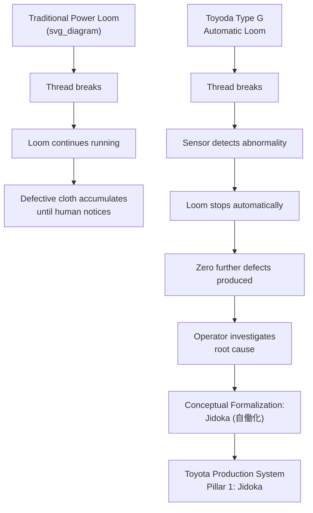

## Sakichi Toyoda and the Automatic Loom

### Biographical Context

Sakichi Toyoda (豊田佐吉, 1867–1930) was born in Kosai, Shizuoka Prefecture, Japan, the son of a carpenter. He is widely referred to in Toyota literature and Japanese industrial history as the "King of Japanese Inventors" (発明王). His career spans the Meiji, Taisho, and early Showa periods — an era of rapid industrialization in Japan following centuries of relative isolation.

**Key Points**

- Sakichi founded what became the Toyota Group, though he never entered the automobile business himself
- His inventions center on textile weaving, particularly power looms
- His most significant invention — the Type G Automatic Loom (1924) — introduced the jidoka principle, later foundational to TPS
- His philosophy directly shaped the values his son Kiichiro Toyoda and later Taiichi Ohno formalized into the Toyota Production System

### Early Inventions and Motivation

Sakichi's inventive career began with observing his mother and other women hand-weaving cotton, a physically exhausting and error-prone process.

- **1890 — Toyoda Wooden Hand Loom**: His first invention, a wooden hand loom that improved efficiency over traditional looms by roughly 40–50% while reducing physical strain on the weaver. [Unverified] Precise efficiency figures vary across secondary sources and should be treated as approximate.
- **1896 — Toyoda Power Loom**: Japan's first power-driven loom, mechanizing weaving previously done entirely by hand.
- **1897 — Founding of Toyoda Shokai**: An early venture to manufacture and sell his looms, which struggled financially — a recurring pattern in Sakichi's career of technical success paired with commercial difficulty, later corrected through partnerships and reinvestment in R&D.
- **1907–1911 — Circular Loom experiments and travel**: Sakichi undertook study trips, including to the United States and Europe, to examine Western textile machinery and patents, reflecting an early commitment to benchmarking against global best practice rather than working in isolation.

### The Core Problem: Defective Thread Breaks

In conventional power looms of the era, when a warp or weft thread broke, the machine continued operating regardless, producing defective, flawed cloth until a human operator noticed and intervened. This created two persistent problems:

1. **Quality problem**: Significant yardage of defective cloth could be produced before detection.
2. **Labor problem**: To catch breaks quickly, factories needed many workers constantly monitoring multiple looms, limiting the ratio of machines to operators and keeping labor costs high.

Sakichi's insight was that a well-designed machine should be capable of recognizing an abnormal condition and stopping itself, rather than requiring constant human vigilance — a conceptual leap from simple automation to what would later be named **autonomation**.

### The Type G Automatic Loom (1924)

The **Toyoda Automatic Loom, Type G**, completed in 1924, is the culminating invention of Sakichi's career and the direct technical ancestor of jidoka.

**Technical features**

- **Automatic thread-break detection**: Mechanical sensors detected when the warp or weft thread broke or ran out, triggering an immediate stop of the loom.
- **Automatic shuttle change**: The loom could automatically replace an empty shuttle without stopping the weaving process — a significant productivity innovation in itself.
- **Non-stop shuttle-change mechanism**: Combined with the stop-on-defect feature, this allowed one operator to oversee many looms simultaneously (reports commonly cite ratios of one operator to as many as 25–50 looms, compared to roughly 3–4 looms per operator with earlier technology). [Unverified] Exact operator-to-loom ratios varied by factory configuration and are cited inconsistently across sources; treat specific numbers as illustrative rather than precise.
- **Zero defective cloth from thread breaks**: Because the loom stopped itself the instant a break occurred, the machine could not continue producing flawed fabric unattended.

**Patent recognition**

Sakichi held numerous patents (commonly cited as over 100 across his lifetime, spanning Japan and internationally). [Unverified] The precise total patent count varies by source. The Type G loom's automatic stop mechanism was internationally recognized as a significant advance in textile machinery engineering.

### From Mechanical Innovation to Management Philosophy: The Birth of Jidoka

The Type G loom's core behavior — **a machine that stops itself upon detecting an abnormality, embedding a form of judgment directly into the equipment** — became formalized decades later as **jidoka** (自働化), one of the two pillars of the Toyota Production System (the other being Just-in-Time).

The term jidoka is a deliberate wordplay in Japanese:

- 自動化 (jidōka, using the standard character for "dō") means simple "automation."
- 自働化 (jidōka, using a modified character with the "person" radical 亻added to 動) means "automation with a human touch" or "autonomation" — automation endowed with human-like judgment.

Toyota's own internal and public materials attribute this conceptual distinction directly to Sakichi's loom: the machine does not merely run automatically, it also *thinks* enough to stop itself rather than propagate a defect.



### Sakichi's Legacy: Founding the Toyota Group

- **1926 — Toyoda Automatic Loom Works, Ltd.**: Sakichi founded this company to manufacture the Type G loom, which became the nucleus of what is now the Toyota Group of companies.
- **Sale of the Platt Brothers patent rights**: In 1929, Sakichi's company sold the manufacturing and sales rights of the automatic loom patent to Platt Brothers & Co., a major British textile machinery firm, for approximately £100,000 (commonly cited figure). [Unverified] The exact sum and terms are reported with some variation across historical sources. This capital is widely credited in Toyota company histories as the seed funding that enabled Sakichi's son, **Kiichiro Toyoda**, to establish an automobile division within the loom works — directly funding Toyota Motor Corporation's founding research.
- **1933 — Automobile Department established** within Toyoda Automatic Loom Works, led by Kiichiro, which became **Toyota Motor Corporation** in 1937.
- Sakichi died in 1930, before the automobile venture matured, but is regarded within Toyota as the philosophical and financial founder of the enterprise.

### The Toyoda Precepts (Toyoda Kōryō)

After Sakichi's death, his associates and family compiled the **Toyoda Precepts** (豊田綱領, 1935), a set of guiding principles attributed to his philosophy of business and life. Commonly summarized points include:

- Be contributive to the development and welfare of the country by working together, regardless of position, in faithfully fulfilling your duties
- Be at the vanguard of the times through endless creativity, inquisitiveness, and pursuit of improvement
- Be practical and avoid frivolity
- Be kind and generous; strive to create a warm, homelike atmosphere
- Be reverent, and show gratitude for things great and small in thought and deed

[Inference] These precepts are frequently cited in Toyota corporate literature as a direct antecedent to the modern "Toyota Way" (2001) pillars of Continuous Improvement and Respect for People, though the precepts themselves predate that formal document by roughly 65 years.

### Example: Jidoka Logic Traced to the Loom's Mechanism

**Example**

The Type G loom's stop-on-break behavior can be expressed conceptually as a simple control logic, illustrating the direct lineage to modern jidoka implementations on assembly lines:



```
loop while weaving:
    read thread_sensor
    if thread_sensor.detects_break() or thread_sensor.detects_empty():
        halt_loom()
        flag_for_operator_attention()
        break
    else:
        continue_weaving_cycle()
```

This same "detect abnormality → stop → signal → resolve" logic is the direct conceptual ancestor of modern andon cords, torque sensors, and automated quality gates found on contemporary Toyota assembly lines — separated from Sakichi's mechanical loom by a century of technological change but unified by the same underlying principle.

### Common Misconceptions

- **Sakichi Toyoda did not found Toyota Motor Corporation directly.** He founded the loom works; his son Kiichiro founded the automobile business, using capital derived substantially from Sakichi's loom patents.
- **Jidoka was not coined by Sakichi himself as a management term.** The mechanical principle originated with his loom; the formal articulation of jidoka as one of TPS's two pillars is generally credited to later Toyota engineers, particularly in the context of Taiichi Ohno's development of the production system. [Inference] The exact individual(s) responsible for coining "jidoka" as a distinct management term (as opposed to the mechanical behavior itself) are not definitively documented in a single authoritative source available here.
- **The automatic loom's innovation was not full automation alone.** Its significance lies specifically in combining automation with self-stopping judgment — automation without the stop-on-defect feature would not have carried the same philosophical weight within TPS history.

### Related Topics

- Jidoka as a TPS pillar: technical implementation in modern assembly lines
- Kiichiro Toyoda and the founding of Toyota Motor Corporation
- The Toyoda Precepts (Toyoda Kōryō) and their relationship to the Toyota Way (2001)
- Andon systems and visual control in TPS
- Poka-yoke (mistake-proofing) as a descendant of jidoka principles
- Taiichi Ohno's formalization of the Toyota Production System
- Platt Brothers patent sale and the financing of Toyota's automotive R&D
- Comparative history: textile industry origins of other lean-adjacent methodologies
- Monozukuri and the shokunin tradition underlying Sakichi's inventive philosophy