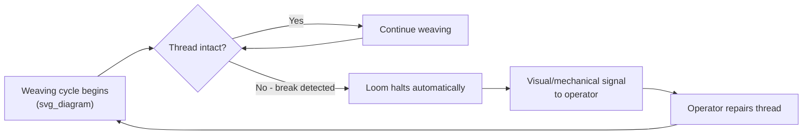
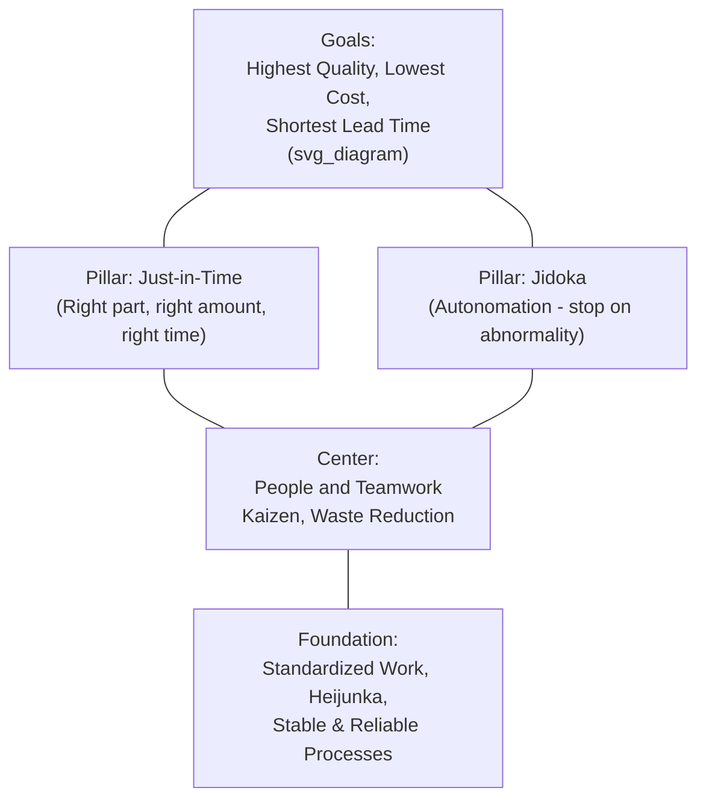

## The Birth of Jidoka from the Toyoda Loom

### Overview

Jidoka (自働化) is one of the two foundational pillars of the Toyota Production System, alongside Just-in-Time (JIT). Its origin lies not in automobile manufacturing but in textile machinery — specifically, in the self-stopping mechanism Sakichi Toyoda engineered into his automatic looms in the early 20th century. Understanding this origin clarifies why jidoka means something distinct from ordinary automation and why it occupies such a central position in TPS philosophy.

**Key Points**

- Jidoka originated as a mechanical solution to a specific textile manufacturing problem: undetected thread breaks
- The concept evolved from a single mechanical feature into a company-wide management philosophy
- Jidoka is defined by the principle of separating human judgment from machine cycle time — stopping instantly upon abnormality
- It later became formalized as "autonomation" (automation with a human touch), distinguished by a modified kanji character

### The Problem That Preceded the Solution

Before Sakichi's innovations, textile weaving — whether by hand or by early power looms — carried an inherent quality risk: when a thread broke during weaving, nothing about the process itself signaled this to anyone. Hand weavers had to continuously watch their own work; power looms compounded the problem because a single operator often supervised multiple machines and could not watch all of them simultaneously.

The consequence was a specific, well-defined failure mode:

- A thread breaks
- The loom does not know a defect condition exists and continues its mechanical cycle
- The loom weaves flawed cloth (with visible gaps, misweaves, or missing threads) until a human happens to notice
- The defective yardage must be identified, cut out, and scrapped — representing wasted material, wasted machine time, and wasted labor

This is the textile-industry analog of what TPS would later generalize as **overproduction of defects** — a process continuing to "work" without any built-in capacity to recognize that the work itself has gone wrong.

### The Mechanical Solution: Automatic Stop-on-Break

Sakichi's development work, culminating in the **Toyoda Automatic Loom, Type G (1924)**, introduced a sensing mechanism that:

1. Continuously monitored the warp and weft threads during weaving
2. Detected a break or thread exhaustion mechanically (via tension-sensitive sensing elements)
3. Triggered an immediate halt of the loom's weaving cycle upon detection
4. Signaled the abnormal condition so a human operator could intervene

The critical design decision was not merely that the loom stopped — mechanical safety stops existed elsewhere in industrial history — but that **the stop condition was tied directly to product quality**, not just machine safety. The loom was engineered to distinguish a "good" weaving cycle from a "bad" one and to refuse to continue producing under bad conditions.



### From Mechanism to Philosophy: Naming Jidoka

The term jidoka emerged through a deliberate linguistic distinction from ordinary automation:

| Term | Kanji | Literal Meaning | Implication |
| --- | --- | --- | --- |
| Jidōka (automation) | 自動化 | Self + move + -ization | A machine that runs by itself, without judgment |
| Jidōka (autonomation) | 自働化 | Self + **work** (人-radical) + -ization | A machine that runs by itself **and** exercises judgment, like a human would |

The second character in the "autonomation" version (働, *dō*, "to work") contains the radical 亻 (person), distinguishing it from the character used in ordinary "automation" (動, *dō*, simply "to move"). This character choice is widely cited in Toyota literature as intentional: the loom's stopping behavior gave the machine a form of judgment normally requiring a human presence — hence "automation with a human touch."

**This distinction is the philosophical core of jidoka**: a jidoka-equipped process does not simply run without a person; it runs *as if* a vigilant, quality-conscious person were watching it every second, and it defers to human judgment the moment something abnormal occurs.

### Generalization Beyond Textiles: Jidoka in TPS

When Kiichiro Toyoda and later Taiichi Ohno developed the Toyota Production System for automobile manufacturing (from the 1930s through the 1950s–1960s), they generalized the loom's specific mechanical principle into a broader production philosophy applicable to any process, not just weaving:

- **Detect the abnormality** — whether a broken thread, a missing part, a torque reading out of spec, or a defective weld
- **Stop the process immediately** — rather than allowing a defect to travel downstream
- **Signal the problem** — visually and audibly (this became the basis of the **andon** system: overhead lights and cords allowing any worker to signal or halt the line)
- **Fix the root cause** — not just the symptom, often using techniques like the **Five Whys** developed within the TPS problem-solving tradition
- **Prevent recurrence** — through process or design changes (later formalized further via **poka-yoke**, mistake-proofing mechanisms)

This generalization meant that jidoka was no longer a mechanical feature exclusive to looms, but a principle that could be embedded in:

- Assembly line stations (via andon cords any worker can pull)
- Press and stamping machines (via sensors detecting misaligned material)
- Welding robots (via feedback sensors halting on out-of-spec welds)
- Software and administrative processes in later "lean office" applications [Inference] — this extension into non-manufacturing domains reflects later interpretive application of jidoka principles rather than Sakichi's or Ohno's original mechanical or shop-floor context.

### Why Jidoka Matters Structurally in TPS

Jidoka is one of the "two pillars" (alongside JIT) supporting the Toyota Production System, commonly depicted in the well-known **TPS House diagram**.



Jidoka's structural role is to **prevent defects from propagating through the value stream**, which in turn:

- Protects the JIT pillar's viability — a pull-based, low-inventory system (JIT) cannot tolerate defects flowing downstream, because there is no buffer stock to absorb the disruption of catching and reworking bad output later
- Frees workers from constant machine-watching, enabling the practice of **multi-machine handling** (one operator overseeing several machines), directly inherited from the loom's operator-to-machine ratio improvements
- Embeds quality responsibility at the point of creation rather than relying on end-of-line inspection

### Example: Andon System as Jidoka's Modern Descendant

**Example**

A simplified logical model of an automobile assembly line andon system, showing direct conceptual continuity with the loom's stop-on-break mechanism:



```
function monitor_station(station_id):
    while assembly_in_progress:
        reading = sensor.check(station_id)
        if reading.is_abnormal() or worker.pulls_andon_cord(station_id):
            andon_light.set(station_id, color="yellow")  # signal for help
            if not resolved_within_cycle_time:
                andon_light.set(station_id, color="red")  # line stops
                halt_line()
                notify_team_leader(station_id)
            else:
                andon_light.set(station_id, color="green")  # resolved
```

The mechanism differs enormously in technical sophistication from Sakichi's 1924 loom, but the underlying logic — sense abnormality, signal, escalate to full stop if unresolved, restore only after correction — is functionally identical.

### Common Misconceptions

- **Jidoka does not mean "full automation" in the general business sense.** It specifically denotes automation paired with built-in judgment to detect and respond to abnormalities — a machine that runs unattended but never runs *blindly*.
- **The loom's automatic shuttle-change feature and its stop-on-break feature are often conflated but are functionally distinct.** The shuttle-change mechanism improved productivity (reducing downtime for routine shuttle replacement); the stop-on-break mechanism is the specific feature genealogically linked to jidoka as a quality principle.
- **Jidoka is not synonymous with andon.** Andon is one specific visual signaling implementation of jidoka principles on modern lines; jidoka is the broader principle from which andon (among other tools, such as poka-yoke) descends.

### Related Topics

- Sakichi Toyoda and the automatic loom (mechanical origins in detail)
- Andon systems: design and escalation protocols on modern lines
- Poka-yoke: mistake-proofing devices and design patterns
- The TPS House diagram: pillars, foundation, and goals
- Taiichi Ohno's formalization of jidoka within TPS
- The Five Whys and root-cause analysis in TPS problem-solving
- Multi-machine handling (tajun mochi) and operator efficiency ratios
- Just-in-Time (JIT) as the second pillar of TPS
- Monozukuri and the cultural roots of built-in quality