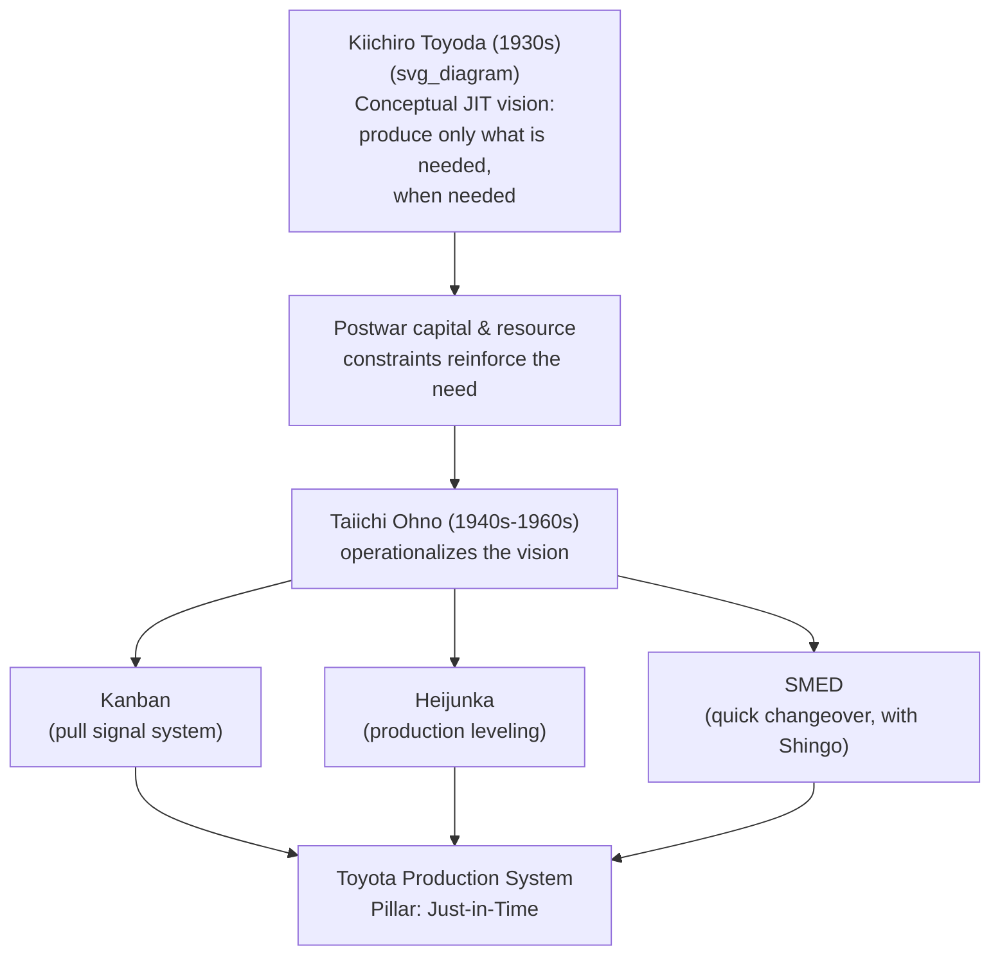

## Kiichiro Toyoda and the Origins of Just-In-Time Thinking

### Biographical Context

Kiichiro Toyoda (豊田喜一郎, 1894–1952) was the eldest son of Sakichi Toyoda. Trained as a mechanical engineer at the Tokyo Imperial University, he worked initially within his father's loom business before pivoting the family enterprise toward automobile manufacturing — a shift that led to the founding of Toyota Motor Corporation in 1937. He is credited within Toyota's own historical materials as the originator of the Just-in-Time concept, one of the two foundational pillars of the Toyota Production System.

**Key Points**

- Kiichiro founded Toyota Motor Corporation, building on capital and engineering culture inherited from his father Sakichi
- He coined the phrase "Just-in-Time" (ジャストインタイム / JIT) as a guiding principle for production
- His motivation was rooted in Japan's severe capital and resource constraints in the 1930s–1940s, not abstract efficiency theory
- Taiichi Ohno later operationalized Kiichiro's conceptual vision into the concrete mechanisms (kanban, pull systems) that define JIT in practice today

### From Looms to Automobiles

Kiichiro's transition into automobile manufacturing was neither obvious nor immediately profitable, and reflected both personal conviction and national industrial policy pressure.

- **1929–1930**: Kiichiro traveled to Europe and the United States to study automobile manufacturing, textile machinery markets, and industrial practices, following in his father's earlier pattern of international benchmarking.
- **1933**: An Automobile Department was established within Toyoda Automatic Loom Works, funded substantially by the proceeds of the 1929 sale of automatic loom patent rights to Platt Brothers & Co. (a British textile machinery firm), as Sakichi had intended before his death in 1930.
- **1937**: Toyota Motor Corporation was formally established as an independent company, adopting the "Toyota" spelling (rather than the family name "Toyoda") reportedly for phonetic and visual branding reasons (eight strokes in katakana, considered auspicious, and a cleaner separation from the family name for the loom business). [Unverified] The exact reasoning behind the name change is reported with some variation across sources, though the auspicious-stroke-count explanation is commonly cited in company histories.

### The Conditions That Produced Just-in-Time Thinking

Unlike Ford's mass production system, which Kiichiro studied closely and which relied on enormous capital reserves, large inventories, and vast economies of scale, Toyota in the 1930s–1950s operated under conditions that made American-style mass production impractical:

- **Severe capital scarcity**: Postwar and prewar Japan lacked the financial reserves to hold large inventories of raw materials, work-in-process, or finished goods.
- **Small domestic market with fragmented demand**: Unlike the U.S. market's appetite for long runs of a single vehicle model, Japan's market demanded smaller quantities of a wider variety of vehicle types on the same production lines.
- **Limited factory floor space**: Japanese manufacturing facilities, especially in the immediate postwar period, could not accommodate the sprawling inventory buffers common in American plants.
- **Postwar economic devastation**: Following Japan's defeat in 1945, resource scarcity (materials, capital, and even basic supplies) was acute, reinforcing the imperative to eliminate any form of waste, especially excess inventory.

Kiichiro's response to these constraints was to articulate a production philosophy in which parts would be produced or delivered **only as needed, in the amount needed, at the time needed** — eliminating the buffer stockpiles that mass production relied upon.

### The Coining of "Just-in-Time"

Kiichiro is widely credited, within Toyota's own official historical publications, with originating the phrase and underlying concept of Just-in-Time production, reportedly articulated in the 1930s as a guiding principle for the nascent automobile operation. Toyota's corporate histories describe his reasoning roughly as follows: rather than manufacturing components in large batches and stockpiling them, each process should produce only what the next process needs, exactly when it needs it — treating excess inventory itself as a form of waste rather than a safety margin.

[Inference] The precise date, wording, and context of Kiichiro's original articulation of "Just-in-Time" are described somewhat variably across secondary sources; the concept is consistently attributed to him in Toyota's own historical materials, though the specific documentary record of his original statement is not something this response can verify beyond company-published accounts.

This was a significant departure from prevailing industrial logic of the era, which generally treated large inventory buffers as protection against supply disruptions, demand fluctuations, and machine breakdowns — a logic rooted in Ford-style mass production and scientific management (Taylorism).

### Conceptual Comparison: Ford Mass Production vs. Kiichiro's JIT Vision

| Dimension | Ford Mass Production (studied by Kiichiro) | Kiichiro's JIT Vision |
| --- | --- | --- |
| Inventory philosophy | Large buffers considered protective | Inventory considered waste (muda) |
| Production trigger | Push — produce to forecast/schedule | Pull (conceptual origin) — produce to actual need |
| Product variety | Long runs of standardized models ("any color as long as it's black") | Smaller lots, more variety, on same lines |
| Capital requirements | High — large plants, large stock | Low — matched to Japan's capital constraints |
| Response to disruption | Absorbed by inventory buffers | Requires high process reliability and quick problem detection |

### From Vision to System: Taiichi Ohno's Operationalization

Kiichiro articulated Just-in-Time as a conceptual goal and organizational value, but the concrete mechanisms that made it operationally achievable were developed over subsequent decades primarily by **Taiichi Ohno**, who joined Toyota's textile operations in 1932 and moved into automobile manufacturing management after World War II.

Ohno's key contributions building on Kiichiro's conceptual foundation included:

- **Kanban system**: A visual card/signal system (inspired partly by Ohno's observation of American supermarket restocking practices in the 1950s) that allowed downstream processes to "pull" parts from upstream processes only as consumed, operationalizing Kiichiro's "only what's needed, when needed" principle into a concrete shop-floor mechanism.
- **Pull production**: Reversing the traditional push logic (produce to forecast, push to next stage) into a pull logic (each stage signals its need backward to the prior stage).
- **Heijunka (production leveling)**: Smoothing production volume and mix over time to make pull-based JIT feasible without violent fluctuations in upstream demand.
- **Single-Minute Exchange of Die (SMED)**, developed with Shigeo Shingo: Reducing changeover times dramatically, which was a practical prerequisite for producing smaller batches of varied products economically — directly serving Kiichiro's small-lot, high-variety vision.



### Just-in-Time as a TPS Pillar

Within the formalized TPS structure (commonly depicted as the "TPS House"), Just-in-Time stands alongside Jidoka as one of two supporting pillars, resting on a foundation of standardized work and process stability, and supporting the overarching goals of highest quality, lowest cost, and shortest lead time.

JIT's core operational principles, as later codified, are commonly summarized as three interlocking elements:

1. **Pull system** — production and material movement triggered by actual downstream consumption, not forecast
2. **Continuous flow** — minimizing batch-and-queue processing in favor of one-piece or small-lot flow wherever feasible
3. **Takt time** — pacing production to match the rate of actual customer demand, rather than maximum machine capacity

### Example: Conceptual Pull Logic Traced to Kiichiro's Principle

**Example**

A simplified logical representation of a kanban-based pull trigger, illustrating the direct lineage from Kiichiro's conceptual JIT statement to Ohno's mechanized implementation:



```
function downstream_process_consumes(part):
    remove_kanban_card(part)
    send_kanban_signal(upstream_process, part.type, quantity=1)

function upstream_process_receives_signal(signal):
    if signal.requests_production():
        produce(signal.part_type, signal.quantity)
        attach_kanban_card(produced_part)
    else:
        wait()  # do not produce without a pull signal
```

The critical principle embedded here — the upstream process does **not** produce speculatively, only in direct response to actual downstream consumption — is the mechanized expression of Kiichiro's original "only what is needed, when needed" articulation.

### Kiichiro's Broader Legacy

- **Wartime and postwar hardship**: Toyota Motor Corporation faced near-bankruptcy in 1949–1950 due to postwar economic conditions and a severe cash crisis, requiring a bank-led restructuring and significant layoffs.
- **1950 resignation**: Kiichiro resigned as company president, taking personal responsibility for the crisis and the resulting labor dispute and layoffs — an act frequently cited in Toyota corporate culture as exemplifying leadership accountability. [Inference] The framing of this resignation as a voluntary act of accountability versus a response to direct pressure varies somewhat in tone across historical accounts, though the resignation itself and its timing are well documented.
- **Toyoda Precepts and hitozukuri**: Kiichiro is credited alongside his father's legacy with reinforcing the people-centered dimension of Toyota's culture, later formalized in concepts like hitozukuri (人づくり, "developing people") that Toyota pairs with monozukuri.
- Kiichiro died in 1952, two years after resigning the presidency, without seeing the full operational maturity of the JIT system Ohno would build over the following decades.

### Common Misconceptions

- **Kiichiro did not invent kanban.** He articulated the conceptual goal of Just-in-Time production; the kanban card system and most concrete JIT mechanisms were developed later, primarily by Taiichi Ohno.
- **JIT did not originate as a response to Toyota Motor Corporation, then later applied to looms.** The capital and resource-scarcity logic began forming during the loom business era and prewar automobile experimentation, well before the postwar period most commonly associated with TPS's full maturation.
- **JIT was not developed as an abstract efficiency theory.** It arose from concrete, severe material and financial constraints specific to Japan's economic conditions in the 1930s–1950s — a point Toyota's own histories emphasize to distinguish JIT's origins from Western industrial engineering theory of the same period.

### Related Topics

- Taiichi Ohno and the development of the kanban system
- Sakichi Toyoda and the automatic loom (family and financial origins)
- The Toyota Production System "House" diagram: pillars and foundation
- Heijunka: production leveling and its role in enabling pull systems
- SMED (Single-Minute Exchange of Die) and Shigeo Shingo's contributions
- Toyota's 1950 financial crisis and its influence on lean thinking
- Muda, mura, muri: the three forms of waste in TPS
- Takt time and demand-paced production design
- Hitozukuri and Toyota's people-development philosophy