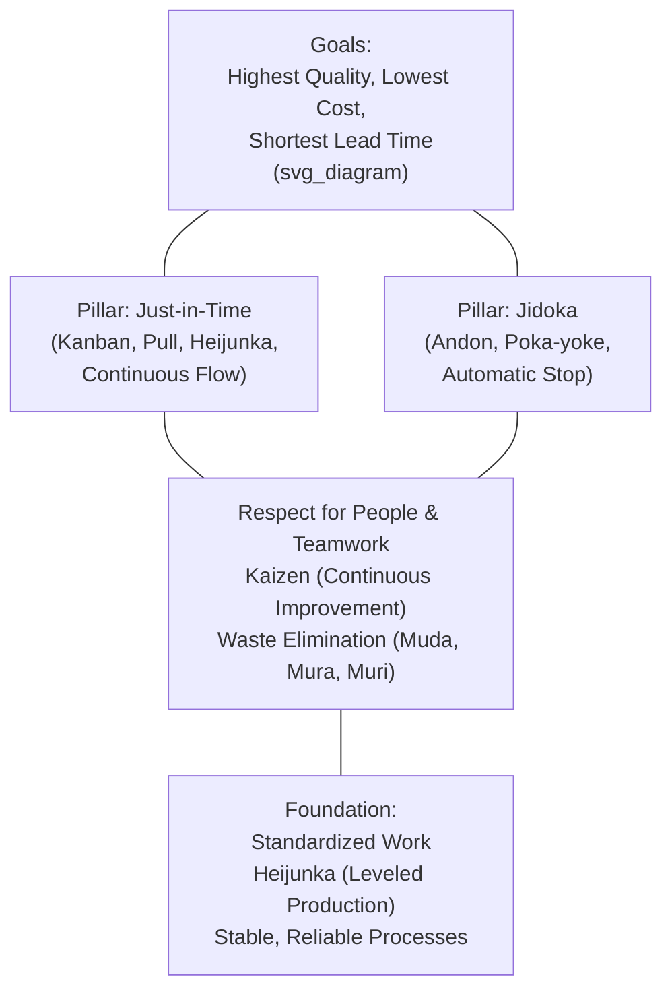

## Taiichi Ohno and the Development of TPS at Toyota


### Biographical Context

Taiichi Ohno (大野耐一, 1912–1990) is widely regarded as the principal architect of the Toyota Production System. Born in Dalian, Manchuria (then under Japanese administration), he graduated in mechanical engineering from Nagoya Technical High School and joined Toyoda Spinning and Weaving in 1932 — his father's connections having secured him the position. He transferred to Toyota Motor Corporation in 1943 and spent the remainder of his career there, rising to managing director and later vice president before retiring in 1978, though his influence on TPS continued through consulting and writing until his death in 1990.

**Key Points**

- Ohno is credited as the primary developer and systematizer of TPS, transforming Kiichiro Toyoda's conceptual JIT vision and Sakichi Toyoda's jidoka mechanism into an integrated, replicable production system
- His development work occurred primarily from the late 1940s through the 1960s–1970s, shaped directly by observing American manufacturing and retail practices
- He is the author of the seminal 1978 book "Toyota Production System: Beyond Large-Scale Production," which remains a foundational TPS text
- His management style was notoriously demanding and confrontational, a trait frequently discussed alongside his technical contributions

### Early Career and the Textile-to-Automobile Transition

- **1932–1943**: Ohno worked in Toyota's textile (spinning and weaving) operations, gaining early exposure to the jidoka-oriented machinery culture established by Sakichi Toyoda.
- **1943**: Transferred to Toyota Motor Corporation's Koromo plant (now Toyota City) as a machine shop manager, amid wartime production pressures.
- **Postwar chaos (1945–1949)**: Japan's automobile industry faced severe material shortages, a devastated economy, and extremely limited capital — conditions that made American-style mass production (requiring large capital reserves and inventory buffers) simply impossible to replicate.
- **1950 financial crisis**: Toyota nearly went bankrupt, requiring a bank-led restructuring, significant layoffs, and the resignation of president Kiichiro Toyoda. This crisis reinforced, at an organizational level, the imperative to eliminate waste of every kind — reinforcing rather than originating the JIT philosophy Kiichiro had already articulated.

### The Formative Influence: Studying (and Reinterpreting) American Manufacturing

Ohno's development of TPS was shaped substantially by direct engagement with American industrial practices — but critically, by *adapting* rather than *copying* them, given Japan's radically different constraints.

- **Ford's mass production system**: Ohno studied Henry Ford's methods closely, admiring the pursuit of flow and waste elimination in Ford's writing, but recognized that Ford's model depended on enormous scale, long production runs of standardized products, and large capital reserves — none of which matched Toyota's postwar reality of small lots, high variety, and severe capital scarcity.
- **1956 U.S. study trip**: Ohno visited American automobile plants and, notably, American supermarkets. The supermarket's restocking model — shelves replenished only as customers actually purchased items, rather than being pre-stocked according to a forecast — provided the direct conceptual inspiration for the **kanban** pull system: downstream "consumption" (the next process needing parts) should trigger upstream "restocking" (the prior process producing more), rather than upstream processes pushing output based on independent schedules or forecasts.
- **Statistical process control and quality thinking**: Postwar Japan's manufacturing sector was also influenced by American quality experts, notably **W. Edwards Deming**, whose lectures on statistical quality control in Japan (from 1950 onward, under the sponsorship of the Union of Japanese Scientists and Engineers, JUSE) reinforced a broader Japanese industrial movement toward quality-at-the-source thinking that intersected with, though was organizationally somewhat distinct from, Ohno's specific TPS development at Toyota. [Inference] The degree of direct influence of Deming's teachings specifically on Ohno's personal thinking, versus a broader shared postwar Japanese quality movement, is a matter of some nuance across historical accounts; the two developments are often discussed in parallel rather than as strictly identical or causally linked.

### Systematizing TPS: Key Developments Attributed to Ohno

Ohno's central achievement was integrating previously separate concepts — Sakichi's jidoka, Kiichiro's JIT vision — into a coherent, mutually reinforcing system, while personally developing several of its core mechanisms.

**Kanban system**

- A visual signaling mechanism (originally physical cards) instructing upstream processes to produce or deliver parts only in response to actual downstream consumption.
- Formalized Kiichiro's conceptual "only what's needed, when needed" principle into a concrete, repeatable shop-floor tool.
- Rolled out gradually and experimentally across Toyota's plants beginning in the late 1940s–1950s, reportedly facing significant internal resistance before becoming standard practice. [Unverified] The precise timeline and sequence of kanban's internal rollout across specific Toyota plants varies somewhat across secondary historical accounts.

**Pull production and continuous flow**

- Reversed the conventional "push" logic of mass production (produce to forecast, push output to the next stage regardless of need) into a "pull" logic (each process produces only what the next process actually draws from it).
- Pursued one-piece flow and small-lot production wherever technically and economically feasible, directly opposing the large-batch orthodoxy of Fordist mass production.

**Waste (muda) classification**

Ohno is credited with articulating a structured taxonomy of waste in manufacturing, commonly cited as the **seven wastes (muda)**:

1. Overproduction (producing more, sooner, or faster than needed)
2. Waiting (idle time for people or equipment)
3. Transportation (unnecessary movement of materials)
4. Overprocessing (doing more work than the customer requires)
5. Excess inventory (materials, WIP, or finished goods beyond immediate need)
6. Unnecessary motion (inefficient human movement)
7. Defects (rework, scrap, and correction effort)

Ohno regarded **overproduction as the most fundamental waste**, since it directly drives excess inventory, excess motion, and often masks defects by burying them in large batches before they are discovered. [Inference] Some later TPS literature adds an eighth waste (unused employee creativity/talent); this addition is generally attributed to later interpreters of TPS rather than to Ohno's original formulation.

**Standardized work**

- Ohno insisted that standardized work — documented, precise, repeatable work sequences — was a *precondition* for kaizen (continuous improvement), not a constraint on it: without a stable baseline, improvement cannot be reliably measured or sustained.
- This reflects a broader TPS principle that standardization and improvement are complementary rather than opposed.

**Andon and visual management**

- Building on jidoka's core principle, Ohno championed the widespread use of andon boards and cords, enabling any line worker to signal or stop production upon detecting an abnormality — a significant cultural and organizational shift, since it placed authority to halt the entire line in the hands of frontline workers rather than only supervisors.

### The TPS House: Ohno's Integrated Framework

Ohno's contribution was not any single tool in isolation but the **integration** of jidoka, JIT, standardized work, and continuous improvement into a mutually reinforcing whole — commonly depicted as the "TPS House."



This visual metaphor — commonly attributed to Fujio Cho, a later Toyota president and Ohno's protégé, as a teaching aid — captures Ohno's central insight: JIT and jidoka cannot function independently. A pull system without built-in quality control (jidoka) would rapidly propagate defects through a system with minimal inventory buffers to absorb them; conversely, jidoka without JIT's waste-elimination discipline would not address the broader goal of eliminating overproduction and excess inventory.

### Management Style and Organizational Resistance

Ohno's implementation of TPS within Toyota was reportedly marked by significant internal resistance and a demanding, sometimes harsh management approach.

- He was known within Toyota for standing workers in a marked circle on the shop floor (the "Ohno circle") and requiring them to observe a process for extended periods until they could identify waste and improvement opportunities themselves — an experiential teaching method emphasizing genchi genbutsu (go and see) over abstract instruction. [Unverified] Specific details and duration of this practice vary across anecdotal accounts.
- His insistence on reducing inventory to expose problems (a central TPS principle — lowering the "water level" of inventory to reveal the "rocks" of underlying process problems) was initially controversial, as it ran counter to conventional manufacturing wisdom that treated inventory as protective.
- Kanban's rollout faced internal skepticism for years before becoming accepted practice, reportedly requiring sustained personal advocacy from Ohno across multiple plants and departments. [Unverified] The extent and specific nature of this resistance is described with varying levels of detail and some variation in emphasis across different secondary sources.

### Ohno's Published Legacy

Ohno's 1978 book, published originally in Japanese and later translated into English as *Toyota Production System: Beyond Large-Scale Production* (1988), remains one of the primary original-source texts on TPS, articulating in his own words the philosophy, historical development, and core mechanisms of the system. Key themes emphasized in the book include:

- The primacy of eliminating waste (muda) as the organizing objective of the entire system
- The importance of genchi genbutsu — direct, firsthand observation of the actual production floor — over reliance on reports or abstract data
- Skepticism toward automation for its own sake, favoring automation paired with human judgment (jidoka) over automation that simply replaces human labor without addressing underlying process problems
- The concept that "the machine that stops" (jidoka) and "the process that only makes what is needed" (JIT) are two expressions of the same underlying discipline: making problems visible rather than hiding them behind buffers or unmonitored automation

### Example: The "Water Level and Rocks" Metaphor

**Example**

Ohno's most frequently cited teaching metaphor illustrates why reducing inventory (lowering "water level") is deliberately used to expose process problems ("rocks") that would otherwise remain hidden beneath a buffer of excess stock:



```
High inventory ("high water"):
  ~~~~~~~~~~~~~~~~~~~~~~~~~~~~~~  <- water level (inventory)
       [rock]   [rock]   [rock]   <- problems hidden below the surface
  (Ship sails smoothly; problems invisible)

Low inventory ("lowered water", intentional JIT discipline):
  ~~~~~~~~~~~~~~
       [ROCK]!!  [ROCK]!!  [ROCK]!!  <- problems now exposed above the surface
  (Ship must navigate around exposed rocks — problems must be solved,
   not merely buffered against)
```

This metaphor encapsulates Ohno's core operating philosophy: JIT's low-inventory discipline is not primarily a cost-cutting measure but a deliberate mechanism for forcing continuous confrontation with — and resolution of — underlying process instability.

### Common Misconceptions

- **Ohno did not invent jidoka or JIT from nothing.** He inherited jidoka's mechanical origin from Sakichi Toyoda's loom and JIT's conceptual foundation from Kiichiro Toyoda; his primary contribution was systematizing, mechanizing (via kanban), and integrating these into a coherent, teachable, replicable system.
- **Kanban and JIT are not synonymous.** Kanban is a specific signaling tool used to implement pull-based JIT; JIT is the broader philosophy and goal.
- **TPS was not designed as a rigid, fixed toolkit.** Ohno's own writings emphasize continuous adaptation and improvement (kaizen); the specific tools associated with TPS evolved considerably over his multi-decade tenure and continued evolving after his retirement.

### Related Topics

- The kanban system: card types, sizing rules, and calculation formulas
- The seven (or eight) wastes of muda in detail, with examples
- Kiichiro Toyoda and the origins of Just-in-Time thinking
- Sakichi Toyoda and the birth of jidoka from the automatic loom
- Genchi genbutsu and the Ohno Circle teaching method
- The TPS House diagram: full breakdown of pillars and foundation
- Shigeo Shingo's collaboration with Ohno on SMED and poka-yoke
- W. Edwards Deming's influence on postwar Japanese quality movements
- Muda, mura, muri: the three interconnected forms of operational waste
- Fujio Cho and the codification of the Toyota Way (2001)