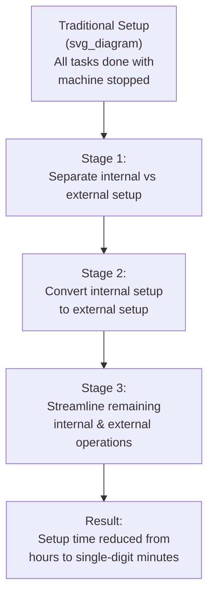
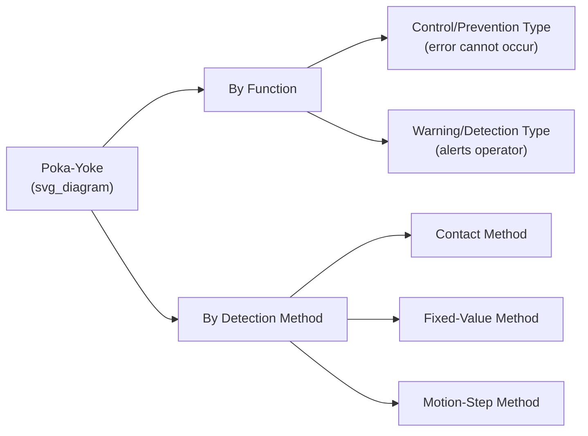

## Shigeo Shingo's Contributions to SMED and Poka-Yoke

### Biographical Context

Shigeo Shingo (新郷重夫, 1909–1990) was a Japanese industrial engineer and consultant whose work, alongside Taiichi Ohno's, forms one of the two most frequently cited individual contributions to the technical development of the Toyota Production System. Unlike Ohno, who worked as an internal Toyota executive, Shingo operated primarily as an external industrial engineering consultant across many Japanese companies (including Toyota, Mitsubishi, and others), which shaped both the generality of his methods and how they were documented and disseminated internationally.

**Key Points**

- Shingo developed SMED (Single-Minute Exchange of Die), a systematic methodology for radically reducing equipment changeover/setup times
- He developed and popularized poka-yoke (mistake-proofing), a set of design principles for preventing defects at their source
- His consulting relationship with Toyota, particularly collaboration with Taiichi Ohno, helped make small-lot, high-variety production economically viable
- He was an influential author and teacher, helping transmit TPS concepts to a global audience through books and international consulting

### Background and Early Career

- Shingo trained in mechanical engineering at Yamanashi Technical College, graduating in 1930, and worked initially in various Japanese manufacturing and railway-related roles.
- He became associated with the Japan Management Association (JMA) as an industrial engineering consultant, a role that took him into numerous factories across Japan over several decades, exposing him to a wide range of production problems beyond any single company's specific context.
- His engagement with Toyota deepened from the 1950s onward, where his consulting work intersected directly with Ohno's internal development of TPS. [Unverified] The precise formal nature and duration of Shingo's contractual relationship with Toyota (versus his broader independent consulting practice) is described with some variation across secondary sources.

### SMED: Single-Minute Exchange of Die

**The Problem SMED Addresses**

In traditional mass production, changing a die, tool, or fixture on a press or machine — to switch from producing one part to producing another — could take hours. This long changeover time created strong economic pressure to run large batches of a single product before switching over, since the "wasted" changeover time needed to be amortized across as many units as possible. This batch-size pressure directly conflicted with the small-lot, high-variety production Toyota needed to serve Japan's fragmented domestic market without holding large inventories.

**Shingo's Development of SMED (1950s–1970s)**

Shingo developed SMED over roughly two decades of factory-floor observation and experimentation, with the method most often dated to a period of intensive refinement in the 1950s through its fuller articulation and international publication in the late 1960s and 1970s. The core innovation was distinguishing between two categories of setup activity:

- **Internal setup (IED — Internal Exchange of Die)**: Tasks that can only be performed while the machine is stopped (e.g., physically removing and mounting a die).
- **External setup (OED — External Exchange of Die)**: Tasks that can be performed while the machine is still running the previous job (e.g., preparing the next die, gathering tools, pre-heating components).

**The SMED Methodology — Core Steps**

1. **Observe and document the current setup procedure** in full, without judgment, often using time studies and video recording.
2. **Separate internal from external setup** — identify which currently-internal tasks are being performed unnecessarily while the machine is stopped.
3. **Convert internal setup to external setup** wherever possible — redesign the process so preparation happens before the machine stops.
4. **Streamline all remaining setup operations** — both internal and external — through standardization, elimination of adjustments (e.g., via fixed positioning devices instead of trial-and-error alignment), parallel operations (multiple people working simultaneously), and functional standardization of fasteners and fixtures.



**The "Single-Minute" Target**

The name SMED refers to Shingo's ambitious target of reducing changeover times to under ten minutes (a "single digit" number of minutes), a dramatic reduction from the hours-long changeovers common in traditional mass production. A frequently cited case in Shingo's own writing describes work at a Toyota plant reducing a die-change process from roughly 4 hours to approximately 3 minutes. [Unverified] Specific figures for individual case studies vary somewhat in how they are cited across different editions and summaries of Shingo's work; readers should consult Shingo's original published case studies for precise figures and context.

**Why SMED Matters to TPS**

SMED is a critical enabling technology for Just-in-Time production: without the ability to change over equipment quickly and cheaply, small-lot production (a prerequisite for pull-based, low-inventory manufacturing) would be economically punishing. SMED directly serves the JIT pillar of TPS by making frequent, small-batch changeovers economically viable rather than something to be avoided through large-batch production.

### Poka-Yoke: Mistake-Proofing

**Origins and Naming**

"Poka-yoke" (ポカヨケ) combines *poka* (ポカ, an inadvertent error or blunder) and *yokeru* (よける, to avoid). The term itself is often credited to Shingo as a deliberate softening of an earlier term, *baka-yoke* (バカヨケ, literally "fool-proofing" or "idiot-proofing"), which was considered insulting to workers; Shingo's terminology reframed the concept around preventing honest, inadvertent human error rather than implying worker incompetence. [Unverified] The exact circumstances and timing of this terminology shift are reported with some variation across sources, though the baka-yoke-to-poka-yoke reframing is a commonly cited element of the concept's history.

**Core Philosophy**

Poka-yoke rests on the premise that human error is inevitable — people will occasionally forget steps, misread instructions, or make unintentional mistakes regardless of training or diligence — and that the correct response is not to blame or punish workers, but to **design the process or equipment so that the error either cannot occur or is immediately detected before becoming a defect**.

**Two Functional Categories of Poka-Yoke**

1. **Control (prevention) type**: The device physically prevents the error from occurring at all, or halts the process automatically if an abnormal condition is detected (directly related to jidoka's stop-on-abnormality principle).
   - Example: A fixture designed so a part can only be inserted in the correct orientation (asymmetric locating pins).
2. **Warning (detection) type**: The device alerts an operator to an error condition without automatically stopping the process, relying on the operator to respond.
   - Example: A light or buzzer that activates if a required component was not picked from its bin.

**Three Detection Methods Within Poka-Yoke**

- **Contact method**: Detects whether a product's shape, dimension, or physical characteristic makes proper contact with a sensing device (e.g., a limit switch that only trips when a part is correctly seated).
- **Fixed-value (constant number) method**: Detects whether a specified number of movements or actions has been completed (e.g., a counter ensuring exactly the correct number of bolts have been used before allowing the next process step).
- **Motion-step (sequence) method**: Detects whether the correct sequence of process steps has been followed (e.g., a system requiring steps to be completed in a fixed order before permitting the next action).



**Relationship to Jidoka**

Poka-yoke is often described as a refinement and generalization of jidoka's core principle — while jidoka (originating with Sakichi Toyoda's loom) established the concept of a machine halting itself upon detecting an abnormality, Shingo's poka-yoke work provided a much more systematic, catalog-like set of specific design techniques and physical mechanisms for achieving that outcome across an enormous range of manufacturing contexts, not limited to weaving or even to fully automated processes.

### Zero Quality Control (ZQC)

Shingo articulated poka-yoke within a broader framework he termed **Zero Quality Control (ZQC)**, which argued that statistical sampling inspection (checking a sample of output after the fact) is fundamentally inferior to **source inspection** combined with poka-yoke devices — checking conditions *before* or *during* production that could lead to a defect, rather than inspecting finished output for defects that have already occurred. This represented a significant philosophical departure from conventional statistical quality control (SQC) approaches prevalent in mid-20th-century manufacturing, including approaches associated with Deming-influenced statistical process control.

[Inference] Shingo's ZQC framework is sometimes presented as being in tension with statistical-sampling-based quality control philosophies; the degree to which this represents genuine methodological disagreement versus complementary approaches applied at different points in a production system is a matter of some interpretive nuance across quality management literature.

### Example: Poka-Yoke Logic Applied to an Assembly Step

**Example**

A simplified logical model of a fixed-value poka-yoke device ensuring the correct number of screws has been installed before a workpiece can advance to the next station:



```
function check_before_release(workpiece):
    screw_count = sensor.count_screws(workpiece)
    if screw_count != REQUIRED_SCREW_COUNT:
        lock_conveyor()
        andon_light.set(color="red")
        display_message(f"Expected {REQUIRED_SCREW_COUNT} screws, found {screw_count}")
        return False
    else:
        unlock_conveyor()
        return True
```

This directly implements Shingo's fixed-value detection method combined with a control-type response (the conveyor physically locks, preventing the workpiece from advancing) — illustrating the practical fusion of poka-yoke's detection logic with jidoka's stop-on-abnormality principle.

### Shingo's Broader Influence and Published Works

Shingo authored numerous influential books that helped transmit TPS concepts to an international audience, particularly as Western manufacturers began studying Japanese production methods intensively from the late 1970s and through the 1980s. Frequently cited works include treatments of the Toyota Production System from an industrial engineering perspective, dedicated volumes on the SMED system, and works specifically on zero quality control and poka-yoke systems, generally published originally in Japanese with English translations following in subsequent years. [Unverified] Specific publication years for individual English translations vary depending on edition and publisher; readers seeking precise bibliographic details should consult current library or publisher records.

The **Shingo Prize** (now the **Shingo Institute** and its associated awards for operational excellence), established in 1988 at Utah State University, was named in his honor and continues to recognize organizations demonstrating excellence in operational practices aligned with lean and TPS principles.

### Common Misconceptions

- **Shingo did not invent jidoka.** Poka-yoke is best understood as a systematic refinement and generalization of the stop-on-abnormality principle that originated with Sakichi Toyoda's loom; Shingo provided the structured taxonomy and design methodology, not the foundational concept.
- **SMED does not mean every changeover must literally take under ten minutes.** "Single-Minute" is the aspirational naming target of the methodology; actual achievable changeover times vary by process, and the methodology's value lies in the systematic reduction approach, not a universal fixed numeric outcome.
- **Poka-yoke devices are not exclusively electronic or high-tech.** Many classic poka-yoke examples are simple mechanical designs (asymmetric fixtures, guide pins, physical stops) — the principle predates and does not require sophisticated sensors or software.

### Related Topics

- Sakichi Toyoda and the birth of jidoka from the automatic loom
- Taiichi Ohno and the development of TPS at Toyota
- Andon systems and visual management on the shop floor
- Standardized work and its relationship to kaizen
- Single-piece flow and small-lot production economics
- Zero Quality Control (ZQC) versus statistical sampling inspection
- The Shingo Prize and the Shingo Institute for Operational Excellence
- Setup reduction case studies across industries beyond automotive manufacturing