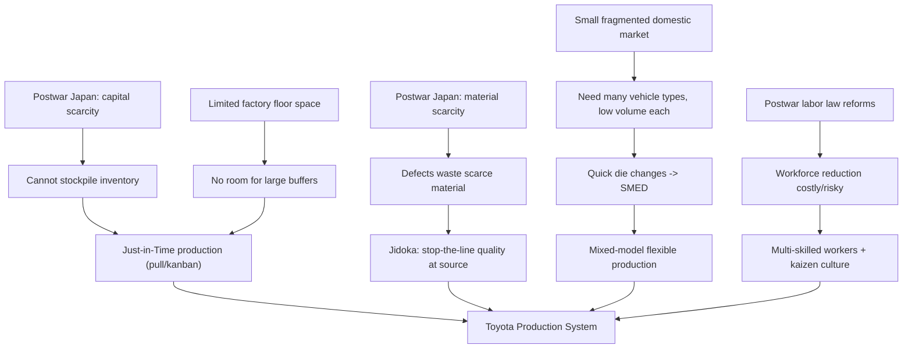

## Post War Japan Resource Constraints and Their Influence on TPS

### Historical Context

Japan emerged from World War II in 1945 with its industrial base devastated by strategic bombing, its currency in collapse, and its access to raw materials severed by the loss of colonial territories (Manchuria, Korea, Taiwan) that had previously supplied coal, iron ore, and other inputs. The country had no domestic oil reserves, limited arable land, and a small landmass relative to its population. These were not temporary postwar conditions alone — they reflected Japan's permanent structural position as a resource-poor island nation, which meant the constraints that shaped early Toyota practice persisted as an enduring design pressure rather than a problem solved once reconstruction ended.

Toyota Motor Corporation itself nearly collapsed in this period. In 1949–1950, a severe financial crisis (driven by hyperinflation controls under the Dodge Line and a credit squeeze) forced the company to lay off roughly a quarter of its workforce, triggering a strike, and led founder Kiichiro Toyoda to resign in 1950 to take responsibility. This near-death experience embedded a lasting institutional aversion to overproduction, excess inventory, and capital waste.

### Key Points

- **Capital scarcity**: Toyota could not finance large batches of machinery, raw material stockpiles, or Western-style mass-production infrastructure. Ford and GM in this era relied on scale — huge dedicated presses, massive work-in-process buffers, and long production runs to amortize equipment costs. Toyota had none of that financial cushion.
- **Material scarcity**: Steel, rubber, and other industrial inputs were in short supply and expensive to import, since Japan had almost no domestic reserves. Waste of any material was economically intolerable.
- **Small domestic market**: Unlike the vast, homogeneous US market that could absorb millions of identical vehicles, postwar Japan's market was small and fragmented, demanding many vehicle types (trucks, small cars, buses) in low volumes. This made Ford-style dedicated single-model production lines economically irrational.
- **Space constraints**: Japan's limited land area meant factories could not sprawl the way American plants did. Warehousing large buffer stocks of parts was physically and financially expensive.
- **Labor conditions**: Postwar labor law reforms (encouraged by the American occupation) empowered unions and made layoffs politically and socially costly, especially after the trauma of the 1950 strike. This pushed Toyota toward valuing and cross-training a stable workforce rather than treating labor as a disposable, task-segmented input as in classic Taylorist/Fordist lines.
- **No access to Fordist capital equipment**: Without funds for the giant single-purpose stamping presses used in Detroit, Toyota engineers (notably Taiichi Ohno) had to devise ways to change dies quickly on smaller, general-purpose machines — a scarcity-driven innovation that became the seed of Single-Minute Exchange of Dies (SMED).

### Causal Mechanisms: From Constraint to Practice

Each resource constraint mapped directly onto a specific TPS principle or technique. This is the core technical linkage to understand:

| Constraint | Direct Consequence | TPS Principle/Tool Born From It |
| --- | --- | --- |
| Capital scarcity | Could not stockpile inventory or buy dedicated mass-production equipment | Just-in-Time (JIT) production |
| Material scarcity | Waste of steel, rubber, and parts was unaffordable | Muda (waste) elimination as a central philosophy |
| Small, fragmented market | Needed many vehicle variants in low volumes on the same line | Flexible, mixed-model production; quick die changes (SMED) |
| Limited factory space | Could not warehouse large buffers between processes | Pull system / kanban to synchronize adjacent processes |
| Costly quality failures (no spare material to scrap and redo) | Defects had to be caught immediately, not reworked later in bulk | Jidoka (autonomation) and Andon stop-the-line authority |
| Labor law changes / union power | Workforce reduction was costly; needed workers to add value beyond single tasks | Multi-skilled workers, teamwork, kaizen (continuous improvement) from shop floor |
| No dollars for imported oil-based inputs / rubber | Every unit of raw material had to convert into a sellable unit of output | Elimination of overproduction as the "worst" of the seven wastes |

### Example: Just-In-Time as a Direct Response to Capital Scarcity

Kiichiro Toyoda's original 1930s concept of "just-in-time" (parts arriving exactly when needed, in the quantity needed) became operationally urgent, not merely aspirational, once postwar capital was scarce. A concrete illustration:

- An American automaker in the 1950s could afford to stamp thousands of body panels in one long run, storing the surplus in warehouses until needed — a strategy that trades capital (tied up in inventory and storage space) for lower per-unit die-change costs.
- Toyota could not tie up its scarce cash in unsold inventory sitting in a warehouse. Instead, Ohno restructured the plant so that each process produced only what the next process consumed, communicated via kanban cards. This inverted the traditional "push" scheduling (produce to forecast, push output downstream) into a "pull" system (downstream process signals its need, upstream process responds).
- This was not adopted because it was theoretically elegant — it was adopted because the alternative (holding inventory) was financially unsustainable for a nearly bankrupt company.

### Example: Jidoka and the Economics of Defects

Sakichi Toyoda's earlier invention (1896, in the textile business) of automatic looms that stopped themselves when a thread broke was the conceptual ancestor of jidoka. In the postwar automotive context, this principle gained new urgency:

- With scarce steel and no spare capital for rework lines, a defect discovered downstream — after material had already been consumed through several further processing steps — represented compounded waste of scarce material at every step it had passed through.
- The solution was to build in automatic detection and immediate line-stoppage (the andon cord) so a defect was caught and corrected at its source, before more scarce material and labor were invested in a flawed unit.

### Supply Chain and Supplier Relationships

Resource scarcity also shaped Toyota's approach to its supplier network (keiretsu-style relationships):

- Toyota could not afford to vertically integrate and own every stage of production the way Ford did with facilities like the River Rouge complex.
- Instead, Toyota cultivated close, long-term relationships with external suppliers, extending JIT delivery expectations to them, and often assisting suppliers with process improvement (early kaizen consulting) because a supplier's inefficiency became Toyota's inventory-carrying-cost problem.
- This distributed, tightly coordinated supplier network is [Inference] partly a rational response to Japan's capital-scarce postwar environment, since vertical integration on the American model would have required capital Toyota did not possess.

### Diagram: Constraint-to-Principle Causal Flow (svg_diagram)

### Distinguishing Fact from Interpretation

- It is well documented that Toyota faced a severe financial crisis in 1949–1950, that Kiichiro Toyoda resigned over it, and that Japan lacked domestic raw material reserves after the war.
- It is also well documented that Taiichi Ohno developed the core JIT/kanban mechanics at Toyota through the 1950s–1960s, and that he and colleagues have cited resource constraints in their own writings as a shaping force.
- The claim that TPS was *primarily or deterministically caused* by resource scarcity, as opposed to also reflecting deliberate managerial philosophy, engineering ingenuity, and influences like American supermarket restocking systems (which Ohno cited as inspiration for kanban) is a matter of historical interpretation. [Inference] Most credible histories treat resource constraint as a major forcing condition that made wasteful practices economically impossible, while crediting individual insight (Ohno, the Toyoda family) for the specific solutions devised in response. Treat "constraints caused TPS" as a strong contributing explanation, not the sole cause.

### Contrast with Contemporary American Mass Production

Understanding TPS's origin requires the contrast with Fordism, since TPS was in many ways defined by what Toyota *could not* replicate:

- **Ford/GM (economy of scale)**: Large capital investment, dedicated single-purpose equipment, long production runs of identical units, large in-process and finished-goods inventories treated as an acceptable buffer against demand variability and machine downtime.
- **Toyota (economy of scope, forced by scarcity)**: Minimal capital investment, general-purpose flexible equipment, short production runs of varied units, near-zero buffer inventories treated as hidden liability (tying up cash, hiding defects, consuming scarce space) rather than a safety net.

### Conclusion

The resource constraints of postwar Japan — capital scarcity from wartime destruction and the 1949–1950 financial crisis, material scarcity from the loss of colonial supply sources and lack of domestic reserves, a small and fragmented domestic vehicle market, limited industrial land, and new labor protections limiting workforce flexibility — collectively made the American model of mass production financially and physically impossible to copy. Toyota's engineers, principally Taiichi Ohno building on Sakichi and Kiichiro Toyoda's earlier ideas, responded by inverting core assumptions of production: pulling material through the system only as needed (JIT), stopping production immediately upon defect detection rather than accepting rework (jidoka), and building flexibility into equipment and labor rather than committing to fixed, single-purpose scale. These scarcity-driven inventions became the technical foundation of what was later formalized and named the Toyota Production System.

**Related Topics**

- Sakichi Toyoda and the origins of jidoka (automatic loom, 1896)
- The 1950 Toyota financial crisis and Kiichiro Toyoda's resignation
- Taiichi Ohno's supermarket-inspired kanban system
- The Dodge Line and its effect on Japanese industrial financing
- Comparison of Fordism/mass production economics versus TPS economics
- Development of SMED (Single-Minute Exchange of Dies) by Shigeo Shingo
- Keiretsu supplier networks and their role in JIT
- The Toyoda family's founding philosophy and the Toyoda Precepts