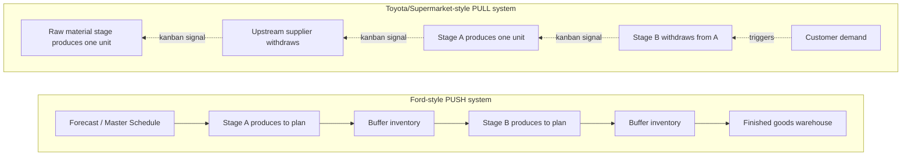

## Studying Ford's Mass Production System and the American Supermarket Model

### Historical Context

In 1950, Toyota's Eiji Toyoda and Taiichi Ohno traveled to the United States, spending roughly three months touring Ford's plants, most notably the River Rouge complex in Dearborn, Michigan, then the largest and most advanced manufacturing facility in the world. Their stated purpose was to study whether Ford's mass production methods could be adapted for Toyota. The trip produced a paradoxical result: Toyota engineers were impressed by Ford's scale and mechanization but concluded that the system itself was poorly suited to Japan's conditions and, more importantly, noticed structural weaknesses in it that Ford's own engineers had normalized. Separately, and significantly, Ohno observed American supermarkets during visits in the 1950s and identified their restocking logic as a superior scheduling model compared to anything he had seen in an American factory. These two observations — one a critique of Fordism, one a positive borrowing from retail — became twin pillars of TPS's operational design.

### Key Points

- **Ford's system studied**: Assembly line flow, standardized interchangeable parts, division of labor into narrow specialized tasks, large-scale dedicated machinery, and the moving assembly line concept (which Ford himself had partly derived from meatpacking "disassembly" lines).
- **What Toyota admired**: The discipline of continuous flow — parts moving steadily through a sequence of workstations rather than in isolated batches — and the sheer productivity gain from synchronized line movement.
- **What Toyota rejected or diagnosed as flawed**: Large buffer inventories between stages (treated by Ford as normal insurance against stoppages), production driven by forecasts and pushed downstream regardless of actual downstream need (a "push" system), and the resulting risk of overproduction — building parts or vehicles that would sit as inventory rather than converting quickly to revenue.
- **The supermarket insight**: Ohno observed that an American supermarket restocks its shelves only after a customer removes an item — the shelf is replenished based on actual consumption, not on a central plan predicting consumption. This is the origin of the "pull" logic behind kanban.
- **Synthesis**: TPS took Ford's line-flow discipline (continuous, sequential processing) and grafted onto it the supermarket's demand-triggered replenishment logic (pull instead of push), while discarding Ford's tolerance for large buffer stocks.

### Ford's Mass Production System: Technical Characteristics

Ford's system, as it existed by the 1913–1950s era and as Toyota's engineers encountered it, rested on several interlocking design choices:

1. **Interchangeable parts and standardization**: Precision-machined parts that fit any unit of a given model without hand-fitting, enabling assembly by unskilled or semi-skilled labor.
2. **Division of labor**: Each worker performed a single, narrowly defined repetitive task (Taylorist scientific management influence), minimizing skill requirements and training time per worker.
3. **The moving assembly line**: The chassis (or product) moved past stationary workers, each adding a component, rather than workers moving to a stationary product. This dramatically cut cycle time — famously reducing Model T chassis assembly time from roughly 12.5 hours to about 93 minutes in Ford's early implementation.
4. **Economy of scale**: Profitability depended on producing enormous volumes of a nearly identical product (the Model T's famous "any color so long as it is black" era) to amortize the cost of dedicated single-purpose machinery across millions of units.
5. **Push scheduling**: Production plans were set centrally based on sales forecasts; each stage produced according to plan and pushed output to the next stage or into inventory, regardless of the receiving stage's immediate need.
6. **Large buffer inventories**: Work-in-process and finished-goods buffers absorbed variability — a machine breakdown or quality problem at one station did not halt the whole line because downstream stations could draw from buffer stock.

### The Structural Weakness Toyota Identified

Toyota's engineers concluded that Ford's push-and-buffer model, while enabling extraordinary throughput at massive scale, embedded a form of waste that was invisible within Ford's own accounting logic:

- Overproduction was not treated as waste in classical Fordist thinking; keeping machines and workers continuously busy was treated as efficient, even if the output exceeded near-term demand.
- Large inventories consumed capital, floor space, and concealed quality problems, since a defect produced today might not be discovered until a buffered unit was used weeks later — by which time the root cause was hard to trace and many more defective units may have been produced in the interim.
- [Inference] Toyota's assessment that overproduction constituted a hidden but serious waste, rather than harmless surplus capacity utilization, represents a specific philosophical reframing rather than a universally obvious accounting fact; it depended on Toyota's own resource-scarce context (see the postwar constraints topic) that made tied-up capital and space unaffordable.

### The American Supermarket Model: Technical Mechanics

The supermarket model Ohno studied (commonly associated with chains observed in his 1950s American trips) worked as follows:

- Shelves are stocked to a target level.
- A customer buying an item reduces the shelf stock — this is the consumption signal.
- Store staff restock the shelf based on what was actually taken, typically referencing a small card, tag, or count system indicating how much was sold and needs replenishing.
- The store does not pre-produce or pre-stock based purely on a long-range forecast disconnected from actual point-of-sale activity; restocking is triggered by observed demand at the point of consumption.

Ohno mapped this directly onto factory logic:

- Each downstream workstation ("customer") withdraws parts from an upstream workstation's output buffer ("shelf") only as needed.
- The upstream station ("supplier") is authorized to produce more of that part only in response to that withdrawal — not according to an independent central schedule.
- The **kanban card** was engineered as the physical (later electronic) signaling mechanism replicating the supermarket's replenishment trigger: a kanban card is attached to a container of parts; when the container is emptied, the card is returned upstream as authorization (and only authorization) to produce/deliver another batch of that exact quantity.

### Example: Push vs. Pull in Practice

Consider a simplified two-stage process — stamping stage (A) feeding an assembly stage (B):

- **Push (Ford-style)**: Stage A stamps 1,000 panels per day according to a fixed daily schedule set by the master production plan, regardless of whether Stage B is currently consuming panels at that rate. If Stage B slows down (say, due to a changeover or minor stoppage), panels pile up in a buffer between A and B. The buffer's job is to absorb this mismatch.
- **Pull (Toyota/supermarket-style)**: Stage A only stamps a new panel when a kanban card arrives signaling that Stage B has consumed one. If Stage B slows down, Stage A automatically slows down too, because no consumption signal arrives. No large buffer accumulates; the system self-regulates to actual downstream demand.

This is the mechanism by which the supermarket's replenishment logic replaces Ford's forecast-driven push logic while retaining Ford's valued continuous, sequential flow between stages.

### Diagram: Push System vs. Pull System (svg_diagram)

### The Hybrid Nature of TPS's Origin

A common misconception is that TPS rejected Ford wholesale. In fact:

- Toyota retained and refined Ford's core insight of **flow** — product moving in a continuous, sequenced path through processing stages is more efficient than isolated batch processing in separate departments (functional layout). TPS's later concept of single-piece flow is, in a sense, a stricter and more disciplined evolution of Ford's line-flow idea, applied even to low-volume, mixed-model production.
- What Toyota discarded was Ford's dependency on **scale and forecast-driven push** to justify large buffers, replacing it with the supermarket's **demand-driven pull**.
- [Inference] It is reasonable to describe TPS as a synthesis: Ford's flow-based line architecture plus the supermarket's pull-based inventory control, adapted to Toyota's low-volume, high-mix, capital-constrained postwar reality. This framing is widely used in TPS historiography (including in accounts attributed to Ohno himself) but represents an interpretive synthesis of the two case studies rather than a single documented "aha" moment.

### Contrast Table: Ford Mass Production vs. TPS-as-Synthesized

| Dimension | Ford Mass Production | Toyota Production System |
| --- | --- | --- |
| Production trigger | Forecast/schedule (push) | Actual downstream consumption (pull) |
| Inventory philosophy | Buffer = safety, absorbs variability | Buffer = waste, hides problems |
| Product variety | Low (single model, uniform) | High (mixed-model on same line) |
| Scheduling control | Centralized master plan | Decentralized, signal-based (kanban) |
| Response to line stoppage | Line kept running via buffer stock | Line may stop (jidoka) to fix root cause |
| Underlying flow concept | Continuous line movement | Continuous flow + demand synchronization |
| Capital requirement | High (dedicated equipment, buffers) | Lower (general-purpose equipment, minimal stock) |

### Conclusion

Toyota's postwar study of Ford's River Rouge plant and its parallel study of American supermarket restocking practices produced two complementary lessons rather than a single borrowed blueprint. From Ford, Toyota extracted and preserved the principle of continuous, sequenced flow through production stages. From the supermarket, Toyota extracted the principle of demand-triggered replenishment, engineering the kanban system as its factory-floor equivalent. The result was not an imitation of either source but a deliberate hybrid — a system that moved material continuously like Ford's line, yet governed by consumption signals like a supermarket shelf, discarding Ford's forecast-driven push scheduling and large buffer inventories in the process. This synthesis, further combined with jidoka and waste-elimination principles rooted in postwar scarcity, forms the conceptual backbone later formalized as the Toyota Production System.

**Related Topics**

- Taiichi Ohno's development and refinement of the kanban system
- The concept of single-piece flow versus batch-and-queue processing
- Push versus pull scheduling in modern supply chain management
- Henry Ford's original innovations: the moving assembly line and interchangeable parts
- The Toyota-Ford relationship and subsequent joint ventures (e.g., NUMMI)
- Muda, mura, muri: the three categories of waste and inconsistency in TPS
- Heijunka (production leveling) as a response to mixed-model, low-volume demand