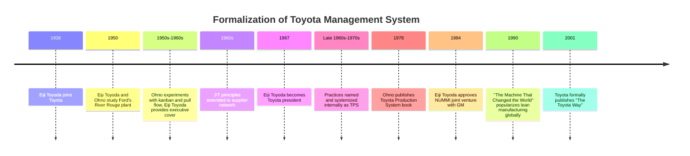

## Eiji Toyoda and the Formalization of the Toyota Management System

### Historical Context

Eiji Toyoda (1913–2013), a cousin of founder Kiichiro Toyoda, joined Toyota Motor Corporation in 1936 and rose through engineering and executive roles to become president in 1967 and later chairman. He is a distinct figure from Taiichi Ohno: where Ohno was the shop-floor engineer who devised the operational mechanics of JIT and kanban, Eiji Toyoda was the executive leader who authorized, protected, and institutionalized those innovations at the organizational level, and who later commissioned the formal codification of Toyota's management philosophy into written form. His 1950 trip to Ford's River Rouge plant (alongside Ohno's separate observations) is often cited as a catalytic moment, but his more consequential long-term role was as the executive sponsor who gave Ohno organizational cover to experiment for over two decades before TPS was named, documented, and diffused company-wide.

### Key Points

- **Executive sponsorship, not shop-floor invention**: Eiji Toyoda did not design kanban, jidoka, or SMED himself; his contribution was strategic — protecting Ohno's unconventional, initially controversial floor-level experiments from being shut down by skeptical middle management, and later mandating that these practices be formalized and extended company-wide and to suppliers.
- **1950 US trip**: Alongside studying Ford's mass production system, Eiji Toyoda's assessment that pure American-style mass production was unsuited to Japan's small, fragmented, resource-constrained market gave strategic legitimacy to pursuing an alternative path, which Ohno was then empowered to build out operationally over the following decades.
- **Presidency (1967 onward)**: As Toyota's president, Eiji Toyoda oversaw the period in which TPS practices, previously concentrated in machining and body-assembly areas under Ohno's direct control, were extended across the full breadth of Toyota's operations and supply chain.
- **Formalization into documented philosophy**: Under Eiji Toyoda's leadership tenure, Toyota moved from tacit, orally transmitted shop-floor practice toward written internal documentation of what would later be called the Toyota Production System, enabling training, replication across plants, and eventual publication of TPS principles to the outside world (notably through Ohno's own 1978 book, published while Eiji Toyoda was chairman).
- **The Toyoda Precepts and long-term philosophy**: Eiji Toyoda's tenure is associated with reinforcing the foundational family/company principles (originating from Sakichi Toyoda's earlier precepts) that valued continuous improvement, respect for people, and long-term thinking over short-term financial optimization — values later articulated externally as the "Toyota Way" (formally published in 2001, after Eiji Toyoda's active executive period, but reflecting management culture he helped entrench).
- **Global expansion decisions**: Eiji Toyoda's later strategic decisions, including approving the joint venture with General Motors (NUMMI, 1984), served as a real-world test of whether TPS principles could be transplanted into an American unionized workforce and culture — a test of the system's portability beyond its Japanese origin conditions.

### The Ohno–Toyoda Relationship: Division of Labor in Building TPS

Understanding Eiji Toyoda's specific contribution requires distinguishing his role from Ohno's:

| Role | Taiichi Ohno | Eiji Toyoda |
| --- | --- | --- |
| Position | Shop-floor engineer, later executive | Company executive, later president/chairman |
| Primary contribution | Designed and iteratively tested kanban, jidoka extensions, JIT mechanics on the factory floor | Authorized, protected, and scaled these practices organization-wide |
| Method | Trial-and-error experimentation, often against resistance from other managers | Strategic sponsorship, resource allocation, and eventual formal mandate |
| Time horizon of contribution | Continuous operational refinement from the late 1940s through the 1960s–70s | Sustained executive backing across decades, plus later formalization and global scaling decisions |
| Relationship to written codification | Authored the seminal 1978 book explaining TPS externally | Provided the organizational conditions (time, authority, resources) that allowed the system to mature enough to be worth codifying |

[Inference] Historical accounts generally agree that without an executive willing to shield Ohno's experiments — which disrupted established production norms and initially produced friction with line supervisors and other departments — the operational innovations might not have survived long enough to become systemic company practice. The precise degree of personal risk Eiji Toyoda took on Ohno's behalf, however, is described with varying emphasis across different secondary sources, so specific anecdotes of protection should be treated as illustrative of a documented pattern rather than independently verified in every telling.

### From Tacit Practice to Formal System: The Codification Process

A critical aspect of "formalization" is the shift from an informal, orally-transmitted floor practice to a documented, teachable management system. This progression roughly followed these stages:

1. **Localized experimentation (late 1940s–1950s)**: Ohno tests kanban and pull-flow concepts in a single machine shop area, largely undocumented outside that area, spreading by direct supervision and word of mouth.
2. **Internal expansion (1950s–1960s)**: Practices extend to additional plants and processes within Toyota, still primarily transmitted through direct mentorship and on-the-job coaching rather than written manuals.
3. **Supplier extension (1960s)**: JIT and kanban principles extended outward to Toyota's supplier network, requiring more formal specification of expectations (delivery timing, quantities, quality standards) since suppliers could not rely purely on tacit shop-floor culture shared with Toyota's own workers.
4. **Executive-level naming and systemization (late 1960s–1970s)**: Under Eiji Toyoda's presidency, the accumulated practices are recognized and referred to internally as a coherent system ("Toyota Production System"), rather than a loose collection of shop-floor tricks.
5. **External publication (1978 onward)**: Ohno's book *Toyota Production System: Beyond Large-Scale Production* makes the system's principles available outside Toyota for the first time in a structured, authored form.
6. **Academic and consulting diffusion (1980s–1990s)**: Western researchers and consultants (e.g., the MIT International Motor Vehicle Program's *The Machine That Changed the World*, 1990) further codify and popularize TPS concepts under the label "lean manufacturing" for a global audience.
7. **Toyota's own explicit written codification (2001)**: Toyota formally publishes "The Toyota Way," an internal document articulating the underlying values (continuous improvement and respect for people) beneath the specific tools — a step reflecting the cultural groundwork Eiji Toyoda's era had already established, even though he was not its author.

### Diagram: Formalization Timeline (svg_diagram)

### Example: NUMMI as a Test of Formalized Portability

The 1984 New United Motor Manufacturing, Inc. (NUMMI) joint venture between Toyota and General Motors, approved during Eiji Toyoda's tenure as chairman, is a significant case study in whether a *formalized* system (as opposed to tacit, culturally-embedded practice) could transfer to a different national and organizational culture:

- The plant reused a former GM facility in Fremont, California, that had previously been shut down partly due to poor labor relations and quality problems.
- Toyota implemented TPS principles (standardized work, andon cords, kanban, respect-based labor relations, worker involvement in kaizen) with a largely re-hired unionized American workforce.
- The plant subsequently demonstrated substantial quality and productivity improvements relative to its prior performance under GM-only management, offered as evidence that TPS principles, once formalized into transferable procedures and training rather than remaining purely tacit shop-floor culture unique to Japan, could be taught to and adopted by a different workforce.
- [Inference] The degree to which NUMMI's success reflects the *system itself* versus other contextual factors (new management approach generally, selection effects in rehiring, novelty effects) is debated in organizational research; it is reasonably treated as suggestive evidence of portability rather than definitive proof, and different sources vary in their causal weighting.

### Distinguishing Fact from Interpretation

- Eiji Toyoda's biographical facts (birth/death years, joining Toyota in 1936, presidency from 1967, involvement in the 1950 Ford plant visit, and approval of the NUMMI venture) are well documented.
- The specific characterization of his role as primarily "executive sponsor and formalizer" rather than "operational designer" is a widely used interpretive framing in TPS historiography, useful for distinguishing his contribution from Ohno's, but it is a scholarly synthesis rather than a claim Eiji Toyoda made about himself in a single definitive source.
- The causal claim that his protection was *necessary* for TPS's survival (i.e., that without it, the practices would have been abandoned) is an inference commonly drawn in management case studies, not a directly falsifiable historical fact.

### Conclusion

Eiji Toyoda's significance in TPS's history lies less in inventing specific tools and more in performing the executive functions that allowed tacit, experimental shop-floor practices developed largely by Taiichi Ohno to survive, scale, and eventually be codified into a transmissible management system. His 1950 assessment (alongside Ohno) that Ford-style mass production was unsuited to Japan's market provided early strategic direction; his subsequent decades as an executive and president provided the organizational protection and mandate needed for Ohno's operational innovations to mature; and his later leadership decisions, including authorizing external publication of TPS principles and testing the system's portability through the NUMMI joint venture, moved Toyota's management approach from an internal, tacit practice into a formally documented and globally influential system now studied under the broader banner of lean manufacturing.

**Related Topics**

- Taiichi Ohno's operational innovations and his 1978 book
- The Toyoda Precepts and Sakichi Toyoda's founding philosophy
- The 2001 publication of "The Toyota Way" and its two pillars (continuous improvement, respect for people)
- NUMMI joint venture: structure, outcomes, and lessons for lean transformation
- The MIT International Motor Vehicle Program and the coining of "lean manufacturing"
- Succession and leadership culture within the Toyoda family and Toyota Motor Corporation
- Diffusion of TPS principles to non-automotive industries