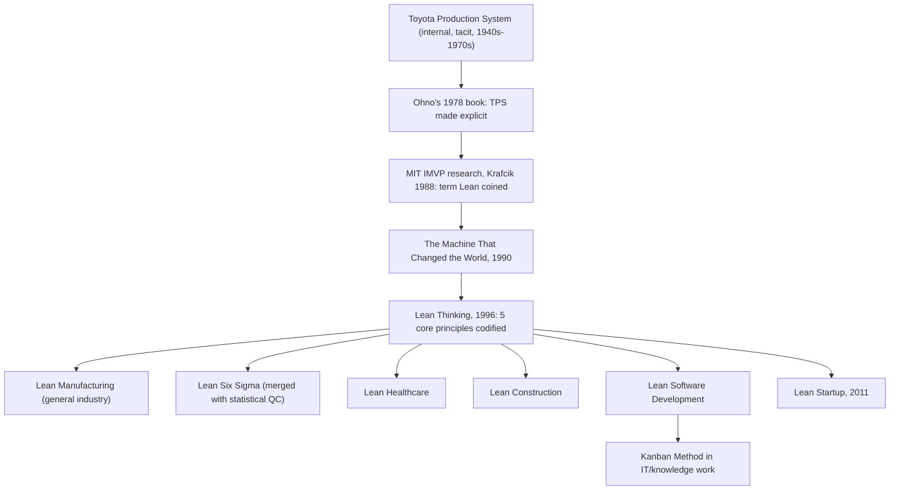

## From TPS to the Global Lean Manufacturing Movement

### Historical Context

The Toyota Production System developed internally at Toyota from the late 1940s through the 1970s as a set of tacit, orally transmitted shop-floor practices before being named, formalized, and eventually published externally, first by Taiichi Ohno's 1978 book. However, "TPS" and "Lean Manufacturing" are not identical terms — Lean is the Western, generalized, academically-coined label applied to TPS-derived principles after they were studied, abstracted, and repackaged for a global, cross-industry audience. Understanding this chapter requires tracing how a company-specific system became an internationally codified management philosophy applicable far beyond automotive assembly.

### Key Points

- **The term "Lean" was coined outside Toyota**: The word "lean" to describe this production philosophy did not originate at Toyota. It was coined by researchers at MIT's International Motor Vehicle Program (IMVP), most notably associated with John Krafcik's 1988 article "Triumph of the Lean Production System," and later popularized globally through the 1990 book *The Machine That Changed the World* by James Womack, Daniel Jones, and Daniel Roos.
- **The Machine That Changed the World (1990)**: This book, based on a multi-year, multi-country study of the global automotive industry, is widely credited as the single most influential publication in transmitting TPS concepts to a worldwide business and academic audience, comparing Japanese, American, and European automakers' productivity and quality performance and attributing Toyota's superior results to its distinctive production system.
- **Lean Thinking (1996)**: Womack and Jones followed up with *Lean Thinking*, which distilled TPS-derived practices into five now-canonical "Lean principles": specify value, map the value stream, create flow, establish pull, and pursue perfection. This abstraction is what allowed the philosophy to be taught and applied outside automotive manufacturing.
- **Generalization beyond automotive and beyond manufacturing**: Once abstracted into principles rather than automotive-specific procedures, Lean concepts were subsequently applied to industries far removed from Toyota's original context, including healthcare (Lean Healthcare), software development (Lean Software Development, and indirectly influencing Agile/Scrum thinking), construction (Lean Construction), startups (the Lean Startup methodology, via Eric Ries, 2011), and services/office administration (Lean Office).
- **Convergence with Six Sigma**: In the early 2000s, Lean principles were frequently merged with Six Sigma's statistical quality-control methodology to form "Lean Six Sigma," combining Lean's waste-elimination and flow focus with Six Sigma's data-driven defect-reduction focus.
- **Terminology drift and dilution risk**: As Lean spread globally, the term became applied to a very wide range of practices, from faithful, deep implementations addressing organizational culture and respect for people, to superficial cost-cutting programs that adopted Lean vocabulary (e.g., kaizen events, 5S) without adopting the underlying philosophy — a pattern often criticized in Lean literature as focusing on tools while missing the system's cultural and people-centered foundations.

### The Abstraction Process: From TPS Tools to Lean Principles

A key technical distinction in this chapter is how specific, automotive-context TPS tools were generalized into abstract Lean principles applicable elsewhere:

| TPS Tool/Concept (Toyota-specific) | Generalized Lean Principle | Cross-Industry Application Example |
| --- | --- | --- |
| Kanban (physical card signaling parts consumption) | Establish pull | Kanban boards in software development (e.g., tracking work-in-progress limits in IT/knowledge work) |
| Jidoka / andon cord (stop-the-line on defect) | Build quality in at the source | "Stop the line" culture in hospital patient-safety programs |
| Muda, mura, muri (waste, unevenness, overburden) | Eliminate waste in all its forms | Eliminating non-value-added steps in administrative/office workflows |
| Value stream (flow of material and information through processes) | Map the value stream | Value stream mapping used in healthcare patient-flow analysis |
| Heijunka (production leveling) | Create flow / level demand | Leveling patient admission scheduling; leveling software release cadences |
| Genchi genbutsu ("go and see" at the actual place) | Pursue perfection through direct observation | Management practices emphasizing direct workplace observation over relying on reports alone |

### Example: Lean Software Development and Agile

One of the more consequential and sometimes underappreciated lines of transmission runs from TPS through Lean Manufacturing into software engineering practice:

- Mary and Tom Poppendieck's 2003 book *Lean Software Development: An Agile Toolkit* explicitly mapped TPS/Lean principles (eliminate waste, amplify learning, decide as late as possible, deliver as fast as possible, empower the team, build integrity in, see the whole) onto software project management.
- Concepts such as work-in-progress (WIP) limits in Kanban boards (popularized in software/IT contexts by David J. Anderson's "Kanban Method," 2010) are a direct lineage descendant of Toyota's physical kanban card system, adapted to knowledge-work contexts where "inventory" is unfinished work items rather than physical parts.
- [Inference] While Lean and Agile software methodologies share substantial conceptual DNA and mutual influence, characterizing Agile/Scrum as a direct or exclusive "descendant" of TPS oversimplifies a more tangled history that also draws on independent software engineering research (e.g., iterative development practices predating widespread Lean awareness in software circles); the relationship is best described as significant cross-pollination rather than strict lineage.

### Example: Lean Startup Methodology

Eric Ries's 2011 book *The Lean Startup* applied Lean principles to entrepreneurship and new product development:

- The "build-measure-learn" feedback loop is conceptually related to TPS's PDCA (Plan-Do-Check-Act) continuous improvement cycle, adapted to the context of validating business hypotheses rather than optimizing a manufacturing line.
- The concept of a "Minimum Viable Product" (MVP) parallels Lean Manufacturing's aversion to overproduction — building the smallest testable version of a product to avoid investing resources into unvalidated assumptions, analogous to avoiding production of unneeded inventory.

### Diagram: Diffusion Path from TPS to Global Lean Movement (svg_diagram)

### The Five Core Lean Principles (as generalized by Womack and Jones)

1. **Specify value**: Define value strictly from the end customer's perspective; anything not contributing to what the customer is willing to pay for is a candidate for elimination.
2. **Map the value stream**: Identify every step (value-adding and non-value-adding) required to bring a product or service from concept/raw material to the customer, exposing waste.
3. **Create flow**: Arrange remaining value-adding steps so the product/service progresses smoothly without interruptions, delays, or backflows — a direct generalization of TPS's continuous-flow emphasis drawn originally from Ford's line and Toyota's refinements.
4. **Establish pull**: Produce only in response to actual downstream demand rather than forecast-driven push, directly generalizing kanban's supermarket-inspired logic.
5. **Pursue perfection**: Treat waste elimination and process improvement (kaizen) as a never-ending pursuit rather than a one-time project.

### Distinguishing Fact from Interpretation

- The chronology of key publications (Ohno 1978, Krafcik 1988, Womack/Jones/Roos 1990, Womack/Jones 1996, Poppendieck 2003, Anderson 2010, Ries 2011) is well documented and verifiable.
- The characterization of "Lean" as a Western academic abstraction of TPS, rather than a term Toyota itself originated, is a well-established and widely cited historical fact.
- Claims about the *fidelity* of various industry-specific Lean adaptations (e.g., whether "Lean Healthcare" or "Lean Startup" faithfully preserves TPS's original respect-for-people philosophy versus adopting only surface-level tools) are contested in management literature and should be treated as an area of ongoing debate rather than settled fact. [Inference] A recurring critique in Lean scholarship is that many Western adoptions emphasize visible tools (5S, value stream mapping, kanban boards) while under-investing in the cultural and human-relations dimensions that Toyota itself considers foundational; this critique appears frequently enough in the literature to be treated as a significant and credible perspective, though it represents an interpretive judgment about implementation quality rather than a single verifiable fact.

### Conclusion

The transition from Toyota Production System to the global Lean Manufacturing movement was not a rebranding initiated by Toyota, but an external process of observation, abstraction, and codification carried out primarily by Western researchers, beginning with MIT's International Motor Vehicle Program and crystallizing in the publications of Womack, Jones, and Roos. This process distilled Toyota's automotive-specific tools (kanban, jidoka, heijunka, genchi genbutsu) into generalized principles (specify value, map the value stream, create flow, establish pull, pursue perfection) capable of application far beyond manufacturing, giving rise to Lean Six Sigma, Lean Healthcare, Lean Construction, Lean Software Development, and the Lean Startup methodology. This diffusion dramatically expanded TPS's influence worldwide, though it also introduced variability in how faithfully different adopters preserved the philosophy's original emphasis on long-term thinking and respect for people alongside its more visible operational tools.

**Related Topics**

- The five core Lean principles in depth (specify value, map value stream, create flow, establish pull, pursue perfection)
- Lean Six Sigma: integrating statistical process control with waste elimination
- Value stream mapping as a diagnostic and design tool
- Lean Startup: build-measure-learn and Minimum Viable Product
- Kanban Method in software/IT (David J. Anderson) versus Toyota's original kanban
- Critiques of superficial ("tool-only") Lean implementations versus deep cultural adoption
- The Toyota Way's two pillars: continuous improvement and respect for people