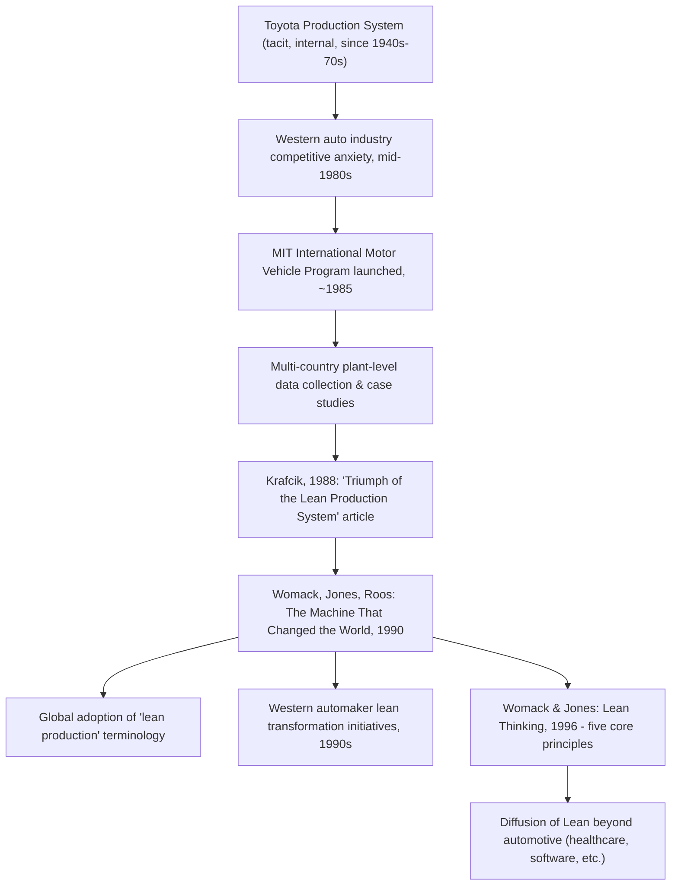

## The Machine That Changed the World and the MIT International Motor Vehicle Program

### Historical Context

The MIT International Motor Vehicle Program (IMVP) was a large-scale, multi-year research initiative launched in the mid-1980s at the Massachusetts Institute of Technology to systematically study the global automotive industry, in response to growing concern in American and European industrial and policy circles over Japanese automakers' rising competitiveness. The program's centerpiece deliverable, the 1990 book *The Machine That Changed the World* by James P. Womack, Daniel T. Jones, and Daniel Roos, synthesized this research and is widely regarded as the single most consequential publication in transmitting Toyota Production System concepts to a global business, academic, and policy audience. It is the book that introduced the term "lean production" to widespread use.

### Key Points

- **Origin and scale of IMVP**: The IMVP was established at MIT around 1985 amid US and European anxiety about the automotive industry's competitive position relative to Japan; it involved a multi-year, multi-country research effort funded by a consortium of automakers, government bodies, and industry associations, and surveyed a large sample of automotive assembly plants worldwide to gather comparative performance data.
- **John Krafcik's precursor role**: Researcher John Krafcik, working within the IMVP context, published a 1988 article titled "Triumph of the Lean Production System" in the *Sloan Management Review*. This article is generally credited as the origin point of the term "lean" applied to Toyota-style production, predating the 1990 book and providing its conceptual and terminological foundation.
- **The 1990 book's core finding**: Comparing plants across Japan, North America, and Europe, the study found that Toyota-style "lean" plants achieved substantially better performance simultaneously on productivity (labor hours per vehicle) and quality (defects per vehicle) than traditional mass-production plants — challenging the then-common assumption that higher quality necessarily required a productivity trade-off.
- **"Lean" as a deliberate contrast to "mass production"**: The authors framed lean production explicitly as an alternative paradigm to Ford-style mass production, emphasizing lean's use of multi-skilled teams, flexible and increasingly automated machinery, and reduced levels of inventory, tooling investment, and time to produce products with greater variety.
- **Methodological approach**: The research combined quantitative plant-level performance benchmarking (comparable metrics gathered across many plants worldwide) with qualitative case study analysis of production philosophy and management practice, giving the findings persuasive empirical weight beyond earlier anecdotal or single-company accounts of Toyota's methods.
- **Broader scope than production alone**: While production system comparisons were central, the book and the IMVP's broader research also examined product development processes, supplier relationships, and dealer/distribution networks, arguing that Toyota's advantages extended across the full value chain, not merely the assembly line.
- **Global and policy impact**: The book was highly influential not only among academics and consultants but also among Western automotive executives and policymakers, contributing to a wave of lean transformation initiatives across the US and European auto industry through the 1990s.

### From Krafcik's Article to the Book: Building the "Lean" Concept

Understanding this chapter requires distinguishing sequential contributions:

1. **Krafcik (1988)**: Introduced the term "lean production" in an academic management journal article, contrasting it with both traditional craft production (highly skilled workers, low volume, high cost) and Fordist mass production (unskilled/semi-skilled workers, high volume, dedicated equipment, large buffers).
2. **Womack, Jones, and Roos (1990)**: Expanded Krafcik's conceptual framing into a full-length, empirically-grounded, and much more widely read book, drawing on the complete IMVP research program's plant survey data and case studies, making "lean" a term recognized far beyond academic management circles.
3. **Subsequent Womack/Jones follow-up (Lean Thinking, 1996)**: Further distilled the concept into the five core Lean principles used broadly in later lean methodology teaching (see the companion topic "From TPS to the Global Lean Manufacturing Movement").

### The Three Production Paradigms Contrasted

The book's central analytical framework distinguishes three historical production paradigms:

| Paradigm | Labor Model | Volume | Flexibility | Quality Approach | Representative Era/Example |
| --- | --- | --- | --- | --- | --- |
| Craft production | Highly skilled individual craftsmen | Very low | High (custom-built) | Dependent on individual skill | Pre-1910s automobile manufacturing |
| Mass production | Narrow, low-skill, repetitive tasks | Very high | Low (single model/design) | Inspected at end of line, defects reworked | Ford River Rouge, mid-20th century |
| Lean production | Multi-skilled teams, cross-trained | Flexible, mixed-model | High (variety without major cost penalty) | Built in at the source (jidoka-derived), continuous improvement | Toyota's postwar system |

### Example: The Productivity-Quality Finding

A key, empirically striking finding highlighted in the book is that lean-organized plants outperformed mass-production plants on both key metrics simultaneously, rather than trading one for the other:

- Traditional industrial-engineering intuition (embedded in mass-production thinking) often assumed that higher quality required slower, more careful (and thus less productive) work, or additional costly inspection stages.
- The IMVP plant comparisons found Japanese, Toyota-style plants (and lean plants outside Japan, including transplant facilities) achieving fewer labor hours per vehicle assembled and fewer defects per hundred vehicles than comparable Western mass-production plants, undermining the assumed productivity-quality trade-off.
- [Inference] The precise numerical gaps reported across different plant comparisons in the study varied significantly by plant, region, and product segment, and specific figures should be treated as illustrative of the general pattern documented by IMVP research rather than as fixed, universal constants applicable to any given plant comparison today; the automotive industry's competitive landscape has also evolved substantially since the original study period.

### Diagram: IMVP Research to Global Impact Pathway (svg_diagram)

### Reception and Influence

- The book is frequently cited as a foundational text in operations management curricula and is credited with substantially accelerating Western manufacturers' adoption of Toyota-derived practices during the 1990s, beyond what direct observation of Toyota alone (e.g., through the NUMMI joint venture) had achieved.
- Its comparative, data-driven methodology gave the findings credibility with skeptical Western executives who might have dismissed purely qualitative or anecdotal accounts of Japanese manufacturing superiority.
- [Inference] Attributing the entire global spread of lean adoption in the 1990s to this single book alone would overstate its role; other contemporaneous factors (direct competitive pressure from Japanese imports and transplants, consulting industry growth, and other publications) also contributed. The book is best characterized as the most influential single catalyst and the origin of the enduring "lean" terminology, rather than the sole cause of the movement's spread.

### Distinguishing Fact from Interpretation

- The existence and rough founding period of the MIT IMVP, Krafcik's 1988 article, and the 1990 publication of *The Machine That Changed the World* by Womack, Jones, and Roos are well-documented facts.
- The book's central empirical claim (lean plants outperforming mass-production plants on both productivity and quality) reflects the study's own reported findings and is widely cited in subsequent literature, though as with any large empirical study, methodology and specific figures have been subject to academic scrutiny and refinement in later research.
- Judgments about the book's relative importance compared to other contributing factors in the global spread of lean thinking are interpretive assessments rather than singular, independently falsifiable facts, though the described role as the term's popularizing origin is a well-supported historical claim.

### Conclusion

*The Machine That Changed the World*, produced from the MIT International Motor Vehicle Program's extensive multi-country automotive industry research, served as the critical bridge between Toyota's internally developed, largely tacit production system and its recognition as a globally applicable management paradigm under the name "lean production." Building on John Krafcik's 1988 terminological groundwork, the 1990 book combined rigorous plant-level empirical comparison with case study analysis to demonstrate that Toyota-style lean production could simultaneously outperform traditional mass production on both productivity and quality — a finding that directly challenged prevailing Western industrial assumptions and catalyzed a wave of lean transformation efforts across global manufacturing industries throughout the 1990s and beyond.

**Related Topics**

- John Krafcik's 1988 "Triumph of the Lean Production System" article
- Lean Thinking (1996) and the five core Lean principles
- Comparative plant-level performance benchmarking methodologies in operations research
- NUMMI as a real-world antecedent case study referenced in lean transformation literature
- The craft-mass-lean production paradigm framework
- Diffusion of lean production practices across the global automotive industry in the 1990s
- Criticisms and academic refinements of the original IMVP findings in later operations management research