## Masaaki Imai and the Global Spread of Kaizen Practice

### Historical Context

Masaaki Imai (born 1930) is a Japanese management consultant credited with being the primary figure responsible for introducing and popularizing the concept of kaizen (継続的改善, "continuous improvement") to Western business audiences, distinct from and largely running parallel to the Womack/Jones/MIT IMVP lineage that popularized the broader term "lean." Where the MIT IMVP research and *The Machine That Changed the World* framed Toyota's system primarily through comparative plant-performance data aimed at executives and policymakers, Imai's work focused specifically on the philosophy and practice of continuous, incremental improvement carried out by all employees, and did so through direct consulting engagement, training programs, and consultancy institution-building rather than academic research publication alone. Imai founded the Kaizen Institute in 1985 and, prior to that, founded the Cambridge Corporation (a Tokyo-based executive recruitment and management consulting firm) in the 1960s, which gave him direct, sustained exposure to Japanese management practices across many companies, not solely Toyota.

### Key Points

- **Kaizen's origin as a concept**: Kaizen as a management philosophy at Toyota is closely associated with the broader TPS culture of continuous, incremental, worker-driven process improvement, historically linked to Total Quality Control/Total Quality Management movements in postwar Japan and influenced by American quality experts who worked in Japan after WWII, including W. Edwards Deming and Joseph Juran, whose statistical quality control and management ideas were adapted into Japanese industrial practice.
- **Imai's 1986 book, *Kaizen: The Key to Japan's Competitive Success***: This book is widely regarded as the single most influential publication introducing the term and concept of kaizen to a Western management audience, distinguishing continuous, incremental, everyone-involved improvement (kaizen) from the Western tendency to favor large, discontinuous, expert-driven innovation projects.
- **Kaizen as philosophy versus kaizen as event**: Imai's original framing presented kaizen as an ongoing daily mindset and organizational culture applicable to every employee at every level, not merely a periodic special project; this is distinct from the later, narrower Western practice of the "kaizen event" or "kaizen blitz" (an intensive, time-boxed workshop, often lasting several days, focused on rapidly improving a specific process).
- **Founding of the Kaizen Institute (1985)**: Imai established the Kaizen Institute as a global consulting and training organization dedicated specifically to teaching and implementing kaizen methodology across industries and countries, providing an institutional vehicle for kaizen's international spread independent of Toyota's own direct influence or the MIT IMVP's automotive-industry focus.
- **Gemba Kaizen (1997)**: Imai's follow-up book emphasized the concept of gemba (現場, "the actual place" — i.e., the shop floor or the location where value-creating work actually happens), reinforcing the principle that meaningful improvement requires management to directly observe and engage with the real work location rather than relying solely on reports or abstract data (closely related to the TPS principle of genchi genbutsu, "go and see").
- **Distinct diffusion path from "Lean"**: While kaizen and lean concepts substantially overlap and are frequently taught together in modern practice, Imai's kaizen-focused consulting and publishing activity represents a partially independent transmission channel for TPS-derived ideas into global business practice, running alongside (and sometimes predating in Western public awareness) the MIT IMVP's lean production research.

### Kaizen's Conceptual Building Blocks

Imai's writing organized kaizen practice around several component ideas, many of which trace back to specific TPS and Japanese quality-management tools:

| Component | Description | Related TPS/Quality Concept |
| --- | --- | --- |
| PDCA cycle | Plan-Do-Check-Act iterative improvement loop | W. Edwards Deming's statistical quality control influence |
| Gemba | Going to the actual workplace to observe reality directly | Genchi genbutsu |
| Muda, mura, muri | Identifying waste, unevenness, and overburden as targets for elimination | Core TPS waste categories |
| Standardized work | Establishing a current best-known method as the baseline for improvement | TPS standardized work |
| Small, incremental improvements | Preferring many small, low-risk, employee-driven changes over infrequent large capital projects | TPS's shop-floor-driven improvement culture under Ohno |
| Everyone's involvement | Framing improvement as every employee's responsibility, not solely engineers or specialists | TPS's respect-for-people and worker-empowerment principles |

### Example: Kaizen versus Innovation — Imai's Core Distinction

A central conceptual contribution in Imai's work is the contrast he draws between "kaizen" and "innovation" as two different approaches to organizational improvement:

- **Innovation (in Imai's framing)**: Large, often technology-driven, discontinuous leaps in performance, typically led by specialists or senior management, requiring significant capital investment, and occurring infrequently.
- **Kaizen**: Small, continuous, incremental improvements, typically identified and implemented by the people doing the work themselves, requiring little or no capital investment, and occurring constantly as an ongoing organizational habit.
- Imai's argument, directed particularly at Western management audiences accustomed to prioritizing breakthrough innovation, was that sustained competitive advantage often derives more from the cumulative effect of continuous kaizen than from occasional large innovations, and that the two approaches are complementary rather than substitutes — an organization benefits from both large strategic innovations and a persistent daily kaizen culture operating between them.

### Diagram: Two Improvement Modes (svg_diagram)

```mermaid
flowchart LR
    subgraph Innovation["Innovation (large, discontinuous)"]
        direction TB
        I1[Infrequent] --> I2[Large capital investment]
        I2 --> I3[Led by specialists/management]
        I3 --> I4[Step-change performance jump]
    end

    subgraph Kaizen["Kaizen (continuous, incremental)"]
        direction TB
        K1[Constant, daily] --> K2[Little/no capital investment]
        K2 --> K3[Led by all employees at gemba]
        K3 --> K4[Gradual, cumulative performance gain]
    end

    Innovation -.complementary, not substitutes.-> Kaizen
```

### The Kaizen Event / Kaizen Blitz: A Later Western Adaptation

As kaizen concepts spread through Western consulting practice, a specific, more tactical application format emerged that should be distinguished from Imai's original, broader cultural framing:

- A **kaizen event** (also called a kaizen blitz or rapid improvement workshop) is a structured, time-boxed activity, commonly spanning three to five days, in which a cross-functional team focuses intensively on analyzing and redesigning a specific process or work area.
- This format became a popular, practical entry point for Western organizations adopting kaizen principles, since it produces visible, measurable results within a short, well-defined timeframe, making it attractive for organizations seeking quick wins.
- [Inference] Imai's own writing generally emphasizes kaizen as a pervasive, everyday cultural habit rather than a periodic scheduled event; the "kaizen event" format, while a legitimate and widely used practical tool descended from kaizen principles, represents a narrower operationalization that some Lean/kaizen practitioners and scholars view as a partial departure from — or at minimum a supplementary tactic to — the fuller cultural transformation Imai originally described. This is a matter of practitioner interpretation and emphasis rather than a settled factual dispute.

### Imai's Relationship to Toyota and to the Broader TQM Movement

- Imai's consulting career and writing draw on observations across many Japanese companies, not exclusively Toyota, situating kaizen within the broader postwar Japanese quality-management movement (Total Quality Control/Total Quality Management) that was itself substantially influenced by American statisticians and quality experts, notably W. Edwards Deming, who taught statistical process control methods in Japan starting in the early 1950s, and whose influence is commemorated in Japan's Deming Prize for quality management.
- This means kaizen, as popularized by Imai, should be understood as overlapping with, but not strictly identical to, "TPS" narrowly defined as Toyota's specific production system; kaizen is one significant strand within TPS (Toyota explicitly uses the term as one of its core pillars) while simultaneously being a broader Japanese management concept with its own independent development and diffusion history.

### Distinguishing Fact from Interpretation

- Masaaki Imai's biographical facts (founding the Cambridge Corporation, founding the Kaizen Institute in 1985, and authoring *Kaizen* in 1986 and *Gemba Kaizen* in 1997) are well documented.
- The characterization of Imai as the primary figure responsible for introducing the specific term "kaizen" to Western management audiences is a widely accepted historical attribution in management literature.
- The framing distinguishing "kaizen as continuous cultural philosophy" from "kaizen event as tactical tool" reflects a real and frequently discussed distinction in Lean/kaizen practitioner literature, but characterizations of the latter as a "narrowing" or "departure" from Imai's original intent represent an interpretive critique rather than a claim Imai has made in identical terms in every source; it is presented here as a commonly noted observation, not an uncontested fact.

### Conclusion

Masaaki Imai played a distinct and significant role in the global diffusion of Toyota Production System-derived thinking, operating largely in parallel to the MIT IMVP/lean production research lineage. Through his 1986 book *Kaizen* and his founding of the Kaizen Institute, Imai introduced continuous, incremental, employee-driven improvement — a core cultural element of TPS — to Western business audiences as a standalone, teachable philosophy, distinguishing it from large-scale, specialist-driven innovation. His later work on gemba further reinforced the importance of direct, on-site observation in driving genuine improvement. While kaizen concepts have since been adapted into more tactical formats such as the time-boxed kaizen event, Imai's original contribution remains foundational to how continuous improvement culture, as distinct from discrete lean production tools, is understood and taught globally today.

**Related Topics**

- Imai's 1986 book "Kaizen: The Key to Japan's Competitive Success"
- Gemba Kaizen (1997) and the principle of genchi genbutsu
- The PDCA (Plan-Do-Check-Act) cycle and its origins in Deming's work
- W. Edwards Deming's influence on postwar Japanese quality management and the Deming Prize
- Kaizen events/kaizen blitz as a tactical implementation format
- Total Quality Management (TQM) and its relationship to TPS and kaizen
- Distinguishing kaizen (Toyota/Japanese management concept) from the broader "Lean" terminology coined by MIT IMVP researchers