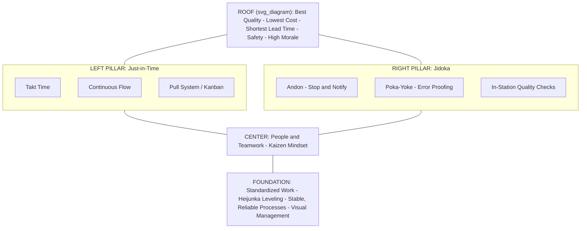

## The House of TPS Model and Its Structural Metaphor

### Historical Context

The "House of TPS" (or "TPS House") is a widely used visual and pedagogical framework that represents the Toyota Production System as a structural diagram resembling a house, with a roof, two supporting pillars, a foundation, and a center. This diagram is not attributed to a single, precisely dated original source in the way that specific books (Ohno 1978, Womack/Jones/Roos 1990) can be dated; rather, it emerged as a widely adopted teaching device within TPS training and consulting literature to convey how the system's individual tools and principles relate to one another structurally, rather than existing as an unordered checklist of techniques. [Unverified] The exact origin and first publication of the house diagram in its now-standard form is not consistently attributed to one individual in secondary literature, and different sources present slightly varying versions of the house's internal elements; it should be treated as a commonly used consensus teaching model rather than a single canonical artifact with one verifiable inventor.

### Key Points

- **Structural metaphor's purpose**: The house metaphor communicates that TPS is an integrated system where each element depends on and supports the others, rather than a loose collection of independently applicable tools — removing or weakening one part (e.g., attempting jidoka without standardized work) compromises the stability of the whole structure, just as removing a pillar or the foundation compromises a physical house.
- **The roof**: Represents the system's overarching goals, most commonly depicted as the best quality, lowest cost, and shortest lead time, sometimes with safety and morale also included, reflecting the ultimate customer- and business-facing objectives that all underlying elements exist to serve.
- **The two pillars**: The two main pillars are Just-in-Time (JIT) and Jidoka (autonomation, or "automation with a human touch"), representing the two structural pillars of TPS as Toyota itself has described them in official communications, each pillar encompassing its own sub-elements (kanban and takt time under JIT; andon and poka-yoke under jidoka).
- **The foundation**: The base of the house typically includes standardized work, heijunka (production leveling), and kaizen (continuous improvement), along with stable and reliable processes — representing the idea that the pillars cannot function without a stable, consistent operational base beneath them.
- **The center/heart**: Many versions of the diagram place people and teamwork at the center of the house, reflecting the TPS/Toyota Way principle that the tools and pillars are enacted and sustained by engaged, respected, and continuously developed employees rather than functioning as purely mechanical procedures.
- **Pedagogical rather than operational function**: The house diagram's primary value is educational and communicative — helping people new to TPS grasp the system's interdependent structure quickly — rather than serving as an operational tool used on the shop floor itself (unlike, for example, an actual kanban card or andon cord).

### Standard Components of the House Diagram

| House Element | Typical Contents | Function in the Metaphor |
| --- | --- | --- |
| Roof | Best quality, lowest cost, shortest lead time (sometimes + safety, high morale) | The visible goals/outcomes the entire system is built to achieve |
| Left pillar | Just-in-Time: kanban, takt time, continuous flow, pull system | Structural support delivering the right part, at the right time, in the right quantity |
| Right pillar | Jidoka: andon, poka-yoke, in-station quality checks, built-in quality | Structural support ensuring defects are caught and corrected at the source |
| Center | People and teamwork; kaizen mindset | The animating human element that operates and sustains the pillars |
| Foundation | Standardized work, heijunka (leveling), stable and reliable processes, visual management | The stable base without which the pillars cannot stand |

### Diagram: The House of TPS (svg_diagram)

### Example: Why the Metaphor Emphasizes Interdependency

The structural logic of the house is often explained through a failure-mode illustration: what happens if one element is implemented in isolation without the others.

- **JIT without jidoka**: If a factory attempts pull-based, low-inventory flow (JIT) without reliable defect-detection mechanisms (jidoka), a quality problem at one station can rapidly propagate downstream with no buffer stock to absorb it, and without an andon-style stop mechanism the defect may not be caught until much later, at which point far more defective work has already been produced under the low-inventory regime — arguably worse than under a buffered push system, since there is no stock cushion to mask the problem while it is investigated.
- **Jidoka without standardized work (the foundation)**: If workers are empowered to stop the line upon detecting an abnormality (jidoka) but there is no standardized, agreed-upon "normal" process against which an abnormality can be judged, workers and supervisors lack a shared baseline to determine what actually constitutes a defect or deviation, undermining jidoka's effectiveness.
- **Pillars without the human center**: If JIT and jidoka are implemented purely as mechanical/procedural systems without genuine employee engagement, training, and involvement in kaizen, the system tends to degrade over time as workers lack the motivation or authority to sustain and improve the processes, since much of TPS's continuous improvement depends on shop-floor-level observation and initiative rather than purely top-down engineering control.
- [Inference] These failure-mode illustrations are commonly used in TPS/Lean training to justify the interdependency claim embedded in the house metaphor; they represent widely-cited pedagogical reasoning rather than controlled experimental findings, though they are consistent with documented cases of failed or superficial lean implementations that adopted isolated tools without addressing underlying process stability or culture.

### Variations Across Sources

It is worth noting for accuracy that the House of TPS diagram is not perfectly standardized across all sources:

- Some versions list only two foundation elements (standardized work and heijunka); others add stability, visual management, or the Toyota Way philosophy explicitly as separate foundation blocks.
- Some versions place "people" as a separate third pillar rather than as the house's central/heart element.
- Some versions include "safety" and/or "morale" in the roof alongside quality, cost, and lead time; others limit the roof strictly to quality, cost, and delivery/lead time (sometimes abbreviated as "QCD").
- [Unverified] Because the house diagram is a pedagogical consensus artifact rather than a single formally published document from Toyota itself, readers encountering different versions across different training materials, consulting firms, or textbooks should expect this variation and treat the core structural logic (interdependent pillars resting on a foundation, in service of top-level goals) as the stable, consistent element, rather than expecting exact uniformity in every labeled sub-component.

### Distinguishing Fact from Interpretation

- That Just-in-Time and Jidoka are described as TPS's "two pillars" is well documented and consistent with Toyota's own official descriptions of its production system.
- That standardized work, heijunka, and stable processes function as foundational prerequisites for JIT and jidoka to operate effectively is a widely supported claim in TPS/Lean literature and consistent with how Toyota itself describes standardized work's role.
- The specific visual "house" diagram format, while extremely widely used in TPS/Lean training and consulting, is a pedagogical tool of somewhat uncertain singular origin and inconsistent exact labeling across sources, and should be understood as a consensus teaching device rather than an official, singularly authoritative Toyota publication with one fixed, universally agreed-upon layout.

### Conclusion

The House of TPS model uses architectural metaphor — a roof, two pillars, a center, and a foundation — to communicate that the Toyota Production System functions as an integrated, interdependent whole rather than a menu of independently applicable techniques. The roof represents the system's ultimate goals (quality, cost, lead time, and often safety and morale); the two pillars, Just-in-Time and Jidoka, represent TPS's principal structural mechanisms for delivering flow and built-in quality respectively; the center represents the people and teamwork that operate and sustain the system; and the foundation, comprising standardized work, production leveling (heijunka), and process stability, represents the prerequisite conditions without which the pillars cannot function reliably. While specific labeling varies somewhat across different presentations of the diagram, its core pedagogical purpose — illustrating structural interdependency rather than an unordered toolbox — remains consistent across virtually all versions used in TPS and Lean training worldwide.

**Related Topics**

- Just-in-Time (JIT): kanban, takt time, and continuous flow in depth
- Jidoka (autonomation): andon systems and poka-yoke error-proofing
- Standardized work as a foundation for both improvement and quality control
- Heijunka (production leveling) and its role in stabilizing the foundation
- The Toyota Way's two pillars: continuous improvement and respect for people (a related but distinct framework)
- Common failure modes in partial or superficial Lean implementations
- Comparing the House of TPS model to other TPS/Lean visual frameworks (e.g., the Lean Iceberg Model)