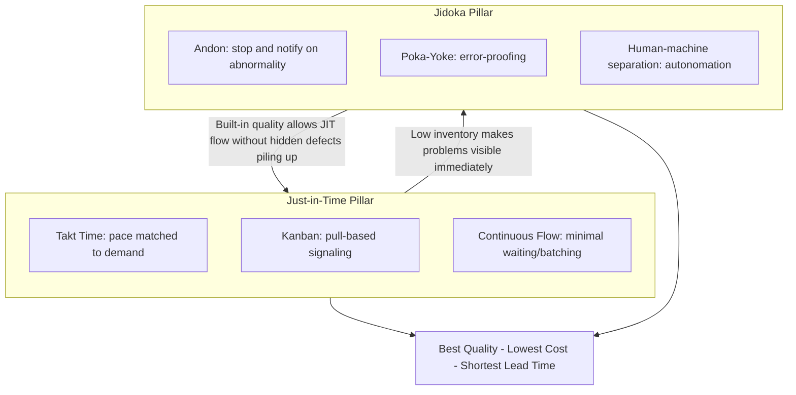

## The Two Pillars of Just in Time and Jidoka

### Historical Context

Just-in-Time (JIT) and Jidoka are Toyota's own designated "two pillars" of the Toyota Production System, as reflected in Toyota's official corporate descriptions of TPS. JIT traces its conceptual origin to Kiichiro Toyoda, who articulated the idea in the 1930s that parts should arrive "just in time" for use rather than being stockpiled in advance; it was operationalized decades later by Taiichi Ohno through the kanban system, developed from the late 1940s onward. Jidoka traces its origin further back, to Sakichi Toyoda's 1896 invention of an automatic loom that stopped itself when a thread broke, preventing the production of defective cloth — a principle later carried into automobile manufacturing. Together, these two pillars represent Toyota's two distinct but complementary strategies for eliminating waste: JIT addresses waste from overproduction and excess inventory, while Jidoka addresses waste from producing and processing defective work.

### Key Points

- **JIT's core aim**: Produce only what is needed, when it is needed, and in the amount needed — eliminating the waste of overproduction, excess inventory, and unnecessary waiting.
- **Jidoka's core aim**: Build quality into the process itself by giving both machines and workers the ability to detect abnormalities and stop production immediately, preventing defects from moving downstream — often summarized as "automation with a human touch" or "autonomation."
- **Complementary, not overlapping, functions**: JIT governs the *flow and timing* of production (how much, when); Jidoka governs the *quality and correctness* of what is produced at each step. A system can theoretically have excellent flow with no quality control (fast production of defects) or excellent quality control with poor flow (correct parts produced far too early or in the wrong quantity) — TPS requires both pillars functioning together.
- **JIT's core mechanisms**: Kanban (signal cards authorizing production/movement of parts), takt time (the pace of production synchronized to customer demand rate), continuous flow (minimizing work sitting idle between processing steps), and the pull system (each process draws from the preceding process only as needed).
- **Jidoka's core mechanisms**: Andon (a visual and/or audible signal, historically a cord or button, allowing any worker to stop the line upon detecting an abnormality), poka-yoke (error-proofing devices or process designs that make it physically difficult or impossible to create or pass on a defect), and separation of human and machine work (machines detect abnormalities and stop automatically, freeing workers from having to continuously monitor a machine purely to catch defects, which was the original efficiency insight behind Sakichi Toyoda's automatic loom).

### Just-in-Time: Detailed Mechanics

**Takt Time**: Calculated as available production time divided by customer demand rate, takt time establishes the pace at which each process must complete one unit of work to exactly match customer demand — neither producing faster (which creates excess inventory) nor slower (which creates shortages).

$$\text{Takt Time} = \frac{\text{Available Production Time}}{\text{Customer Demand}}$$

For example, if a plant operates 480 minutes per day and customer demand is 240 units per day, takt time is 2 minutes — one unit must be completed, on average, every 2 minutes to exactly match demand without over- or under-producing.

**Kanban**: A signaling mechanism (traditionally a physical card, now often electronic) attached to a container or location that authorizes replenishment of a specific part in a specific quantity only when triggered by actual consumption downstream, directly implementing the pull logic derived from the American supermarket restocking model Ohno observed.

**Continuous Flow**: Structuring the physical layout and process sequence so that a unit of work moves from one processing step directly to the next with minimal waiting, batching, or transport delay — ideally approaching "single-piece flow," where units move one at a time rather than in batches.

### Jidoka: Detailed Mechanics

**Andon**: A visual management system, often a lit board or overhead display, combined with a physical trigger (traditionally a pull-cord, now often a button) that any line worker can activate immediately upon noticing a defect, abnormal condition, or inability to complete a task within the standard cycle time. Activation typically triggers an immediate response from a team leader (to assess and potentially help resolve the issue within the same cycle) rather than an immediate full line stop in modern implementations — a full stop only occurs if the issue cannot be resolved before the line reaches the next station.

**Poka-Yoke**: Physical or procedural error-proofing mechanisms designed by Shigeo Shingo (working alongside Ohno) to make it physically difficult, or impossible, to make a mistake or to pass on a defective unit undetected — for example, a fixture designed so a part can only be inserted in the correct orientation, or a sensor that halts a process if a required component is missing.

**Human-Machine Separation ("Autonomation")**: The core original insight from Sakichi Toyoda's automatic loom — a machine capable of detecting its own abnormal condition (e.g., a broken thread) and stopping itself automatically eliminates the need for a worker to stand and watch the machine purely to catch that failure, allowing one worker to oversee multiple machines rather than being tied to monitoring a single one continuously. This is why jidoka is often translated as "automation with a human touch" rather than simple automation — it specifically refers to automation combined with built-in judgment/detection capability, not merely mechanized repetition of a task.

### Comparative Table: JIT versus Jidoka

| Dimension | Just-in-Time (JIT) | Jidoka |
| --- | --- | --- |
| Primary waste addressed | Overproduction, excess inventory, waiting | Defects, processing of defective work |
| Core question answered | "How much, and when, should we produce?" | "Is what we are producing correct?" |
| Key mechanisms | Kanban, takt time, pull system, continuous flow | Andon, poka-yoke, human-machine separation |
| Historical origin | Kiichiro Toyoda's 1930s concept; operationalized by Ohno from late 1940s | Sakichi Toyoda's 1896 automatic loom invention |
| Failure mode if absent | Overproduction, bloated inventory, long lead times | Defects propagate downstream undetected, compounding waste |
| Analogy | Supermarket shelf restocking | Self-stopping loom |

### Example: How the Two Pillars Interact on an Assembly Line

Consider a single assembly station receiving parts via kanban (JIT) and equipped with an andon cord (Jidoka):

1. A kanban card signals that the downstream station has consumed a unit, authorizing this station to produce one more unit at the calculated takt time (JIT governing timing and quantity).
2. While assembling the unit, the worker notices a component does not fit correctly, or a poka-yoke fixture indicates a part is missing (Jidoka's built-in quality check).
3. The worker pulls the andon cord, immediately alerting the team leader and typically triggering a visual/audible signal without necessarily stopping the whole line at that instant (Jidoka's stop-and-notify mechanism).
4. The team leader arrives to assist; if the problem is resolved before the unit reaches the end of the station's allotted cycle time, the line continues without a full stoppage. If not, the line does stop at that station.
5. Because inventory levels are deliberately kept low (a JIT design choice), this single-station stoppage has an immediate and visible ripple effect on adjacent stations — which is intentional: TPS is designed so that problems become immediately visible and forcing, rather than being absorbed invisibly into a large buffer, ensuring root causes get addressed rather than papered over.

This example demonstrates why the two pillars must function together: JIT's low-inventory design is precisely what makes Jidoka's stop-the-line signals meaningful and forcing; without low inventory, a stoppage at one station would simply be absorbed by buffer stock elsewhere, and the underlying problem might persist unaddressed for a long time.

### Diagram: JIT and Jidoka as Complementary Pillars (svg_diagram)

### Distinguishing Fact from Interpretation

- The designation of JIT and Jidoka as Toyota's official "two pillars" of TPS is a well-documented fact, consistent with Toyota's own corporate communications and Ohno's writings.
- The historical origin attributions (Kiichiro Toyoda's JIT concept; Sakichi Toyoda's 1896 automatic loom as jidoka's conceptual ancestor) are well-established historical facts.
- The specific claim in the worked example that a stoppage "typically" triggers team-leader response before a full line stop, rather than an immediate full stop, reflects commonly documented modern implementation practice at Toyota and other lean manufacturers, though exact escalation procedures and timing thresholds vary by facility, product line, and specific implementation, and should not be treated as a universally fixed protocol identical at every lean-operating plant.

### Conclusion

Just-in-Time and Jidoka function as Toyota's two structural pillars because they address two distinct, complementary dimensions of production waste: JIT governs the timing and quantity of production to eliminate overproduction and excess inventory, using kanban, takt time, and pull-based flow; Jidoka governs the correctness of production to eliminate defects, using andon signaling, poka-yoke error-proofing, and the separation of human judgment from mechanical repetition. Neither pillar functions well in isolation — low inventory without built-in quality control risks defects propagating unnoticed, while built-in quality control without demand-synchronized flow risks producing correct output in the wrong quantity or at the wrong time. Their combined, mutually reinforcing operation is what allows TPS to achieve simultaneous gains in cost, quality, and lead time rather than requiring a trade-off between them.

**Related Topics**

- Kanban system mechanics and card-based signaling in depth
- Takt time calculation and its role in line balancing
- Andon systems: escalation procedures and visual management
- Poka-yoke design principles, developed by Shigeo Shingo
- Sakichi Toyoda's automatic loom and the origin of autonomation
- Standardized work as the foundation supporting both pillars
- Single-piece flow and its relationship to continuous flow