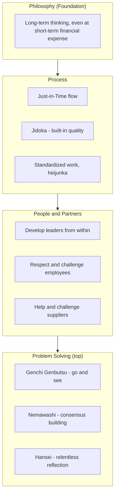

## Long Term Philosophy as the Foundation of Decision Making

### Historical Context

The principle of long-term philosophy as the base of decision-making is most formally articulated as the first of the "14 Management Principles" identified by Jeffrey Liker in his influential 2004 book *The Toyota Way*, which synthesized decades of academic and consulting observation of Toyota's management practices into a structured framework. Liker organized these principles into a "4P model" (Philosophy, Process, People/Partners, Problem Solving), with long-term philosophy positioned as the foundational first "P" — meaning it precedes and underlies all the operational tools (JIT, jidoka, kaizen, etc.) discussed elsewhere in TPS literature. This principle is distinct from, but closely related to, the more diffuse cultural values traceable to Sakichi Toyoda's original company precepts from the early 20th century, which similarly emphasized serving the broader good, being studious and creative, and pursuing steady, dependable growth over speculative gain.

### Key Points

- **Liker's Principle 1**: "Base your management decisions on a long-term philosophy, even at the expense of short-term financial goals," is the formal statement of this principle as codified in *The Toyota Way*.
- **Position within the 4P framework**: Philosophy sits beneath and supports the other three P's — Process (the "eliminate waste" pillar containing most classic TPS tools), People and Partners ("respect, challenge, and grow them"), and Problem Solving ("continuous organizational learning") — meaning that, in Liker's framework, adopting individual TPS tools without the underlying long-term philosophical commitment is considered structurally incomplete.
- **Contrast with shareholder-value-maximization short-termism**: The principle is frequently contrasted in Lean literature with a management orientation that prioritizes quarterly earnings, short-term stock price performance, or immediate cost-cutting, even when such actions may undermine long-term capability, quality, employee development, or customer trust.
- **"Purpose beyond making money"**: A frequently cited aspect of this principle is Toyota's stated organizational purpose extending beyond profit generation alone — commonly summarized as generating value for the customer, society, and the economy, with profit understood as a necessary outcome and enabler of this broader purpose rather than the sole or primary objective driving individual decisions.
- **Practical manifestation — willingness to accept short-term cost for long-term capability**: This principle is commonly illustrated through Toyota's documented willingness to invest in things like extensive employee training, supplier development assistance, and maintaining excess production capacity or workforce stability during downturns, even when these choices reduce short-term financial metrics, on the reasoning that they build long-term organizational capability and trust.
- **Relationship to family-company governance history**: [Inference] Toyota's ownership and governance structure, including significant continuing influence from the Toyoda family and historically patient shareholder relationships (compared to purely public-market-driven ownership structures common in many Western firms), is sometimes cited in management literature as a structural factor that has made pursuing long-term philosophy over short-term financial pressure more organizationally feasible for Toyota; this is a contributing contextual factor discussed by some analysts rather than a claim made as the sole explanation in Liker's own principle.

### The 4P Model: Where Long-Term Philosophy Fits

| Level (4P Model) | Category | Example Principles/Tools |
| --- | --- | --- |
| Philosophy (foundation) | Long-term thinking | Principle 1: base decisions on long-term philosophy, even at short-term financial expense |
| Process | Eliminate waste | JIT, jidoka, pull systems, standardized work, visual management, heijunka |
| People and Partners | Respect, challenge, grow | Leader development from within, respecting and challenging employees and suppliers |
| Problem Solving | Continuous learning | Genchi genbutsu, consensus-based decision-making (nemawashi), relentless reflection (hansei) |

### Example: Short-Term versus Long-Term Decision Framing

A commonly used illustrative contrast in Lean/Toyota Way literature involves how a company might respond to a temporary demand downturn:

- **Short-term-financial-first approach**: Immediately lay off production workers to cut costs and preserve quarterly profit margins, since idle labor represents an immediate, visible expense with no offsetting output.
- **Long-term-philosophy-first approach**: Retain the workforce during the downturn (potentially reassigning workers to training, kaizen activities, or maintenance work), accepting a short-term cost in the form of paid but temporarily less "productive" labor, on the reasoning that a skilled, loyal, experienced workforce represents a long-term capability asset that is costly and slow to rebuild once dispersed, and that abrupt layoffs damage trust and morale in ways that impair future performance and flexibility.
- [Inference] This contrast is a widely used pedagogical illustration in Toyota Way literature to make the abstract principle concrete; specific real-world decisions at Toyota or any company are shaped by many additional situational factors (severity and duration of the downturn, financial reserves, labor law context, competitive pressure), so this example should be read as illustrating the underlying philosophical trade-off in principle, not as a claim that Toyota (or any lean-practicing company) always resolves every downturn decision identically or that layoffs never occur under this philosophy.

### Diagram: Long-Term Philosophy as Foundation Within the 4P Model (svg_diagram)

### Relationship to Financial Decision-Making Norms

A significant conceptual point in this topic is the explicit acknowledgment, within Liker's own principle statement, that long-term philosophy may sometimes conflict with short-term financial goals, rather than assuming the two are always aligned:

- This distinguishes the principle from a simplistic claim that "good long-term thinking always also produces good short-term results" — the principle explicitly frames long-term commitment as sometimes requiring the acceptance of short-term financial cost.
- This has drawn both praise (as an antidote to perceived excessive short-termism in Western public-company management, particularly regarding quarterly earnings pressure) and critical scrutiny (regarding how, in practice, any company reconciles this stated philosophy with real financial constraints, investor expectations, and competitive pressures, especially for publicly traded companies without Toyota's particular ownership structure and history).
- [Inference] Whether or to what extent a given organization can successfully adopt "long-term philosophy over short-term financial goals" as a genuine operating principle, rather than merely an aspirational statement, likely depends significantly on its specific governance structure, ownership concentration, capital market pressures, and industry competitive dynamics; this is a reasonable inference grounded in general organizational theory but is not something that can be stated as a universal, guaranteed outcome for every company attempting to adopt this principle.

### Practical Manifestations Commonly Cited in Toyota Way Literature

- **Supplier development investment**: Toyota's practice of investing time and expertise helping suppliers improve their own processes, rather than simply switching suppliers when problems arise, reflecting a long-term relationship view over short-term transactional cost minimization.
- **Internal leadership development**: A strong preference for developing and promoting leaders from within the organization over an extended period, rather than frequently hiring external executives, reflecting a view that deep organizational and philosophical understanding takes years to build and is a long-term asset.
- **Deliberate, unhurried decision-making (nemawashi)**: Toyota's documented practice of building broad internal consensus before finalizing major decisions, even though this can slow initial decision speed compared to top-down directive approaches, reflecting a long-term view that thorough buy-in produces faster and more reliable implementation once a decision is made.

### Distinguishing Fact from Interpretation

- That Jeffrey Liker's *The Toyota Way* (2004) formally articulates "long-term philosophy" as Principle 1 within a structured 4P model is a well-documented, verifiable fact about that specific publication.
- That Toyota's own historical practices (supplier development, internal leadership promotion, employment stability efforts during downturns) are frequently cited as illustrations of this principle in action is well-supported by case-study literature, though specific claims about Toyota's decision-making in any particular historical episode should be checked against primary sources for that episode rather than assumed from the general principle alone.
- Broader claims connecting Toyota's family/governance structure to its capacity for long-term thinking, and claims about how transferable or generalizable this principle is to companies with different ownership and capital-market contexts, are areas of ongoing management-theory discussion and interpretation rather than settled, universally agreed-upon facts.

### Conclusion

Long-term philosophy, as formally codified in Jeffrey Liker's *The Toyota Way* as the foundational first principle beneath Toyota's broader 4P management model, holds that management decisions should be grounded in a long-term organizational purpose — generating value for customers, employees, and society — even when this requires accepting short-term financial cost. This principle is presented not as an isolated value statement but as the structural foundation supporting the more commonly discussed operational tools of TPS (JIT, jidoka, standardized work) and Toyota's people-and-partner practices (supplier development, internal leadership growth, consensus-based decision-making), on the reasoning that these tools and practices are unlikely to be genuinely and sustainably adopted by an organization whose underlying decision-making orientation remains fundamentally short-term and purely financially driven.

**Related Topics**

- Jeffrey Liker's 14 Management Principles and the 4P model in full
- Nemawashi: consensus-based decision-making at Toyota
- Genchi genbutsu ("go and see") as a problem-solving principle
- Hansei: the practice of relentless reflection
- Toyota's supplier development practices and long-term supplier relationships
- Leadership development and internal promotion practices at Toyota
- Comparing Toyota's governance structure to typical publicly traded Western manufacturing firms