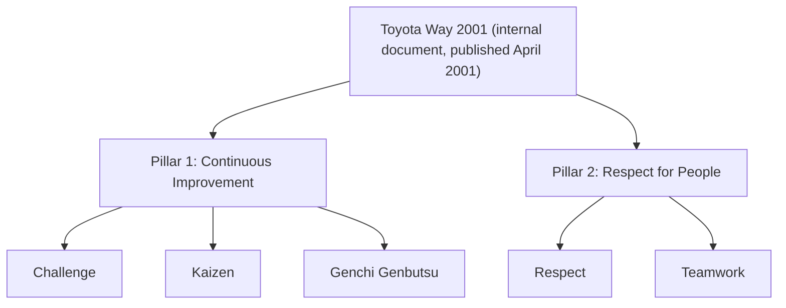

## The Origin and Structure of the Toyota Way 2001 Document

### Historical Context

The Toyota Way 2001 is an internal document formally published by Toyota Motor Corporation in April 2001, created to explicitly codify the company's underlying values and management philosophy in written form for the first time at this level of formality and internal distribution. Its creation responded to a specific organizational concern: as Toyota expanded globally through the 1980s and 1990s, establishing manufacturing operations and hiring employees far outside Japan (e.g., through NUMMI and subsequent wholly-owned plants in North America, Europe, and elsewhere), company leadership grew concerned that the tacit cultural values underlying TPS — historically transmitted through decades of direct, in-person mentorship, shared language, and organizational osmosis within Japan — would not automatically transfer to a rapidly growing, geographically and culturally diverse workforce. The Toyota Way 2001 was Toyota's own attempt to make explicit what had previously been implicit, addressing this transferability problem directly rather than leaving newer or non-Japanese employees to absorb the philosophy purely through informal cultural immersion.

### Key Points

- **Publication context**: Released internally in April 2001, decades after TPS's operational tools had already matured and been extensively documented by figures like Taiichi Ohno (1978) and studied externally by researchers like the MIT IMVP team (1990) — meaning the *tools* of TPS were already well known externally well before Toyota itself formally documented the *underlying philosophy* in this specific internal form.
- **Motivating problem — globalization and workforce diversity**: As Toyota's workforce grew to include large numbers of employees who had not been socialized within the traditional Japanese Toyota organizational culture over many years, executives recognized a risk that operational tools (kanban, andon, standardized work) might be adopted mechanically without the underlying values that made them effective and sustainable, echoing concerns discussed in the Lean literature about "tool-only" adoption without cultural transformation.
- **Two pillar structure**: The Toyota Way 2001 organizes Toyota's values around two overarching pillars: **Continuous Improvement** (関与, often associated with the term kaizen in spirit) and **Respect for People** (人間性尊重). This two-pillar structure is distinct from, though related to, the earlier-discussed "two pillars" of JIT and Jidoka — the Toyota Way's pillars describe cultural/philosophical orientation, while JIT/Jidoka describe operational production mechanisms.
- **Five sub-values beneath the two pillars**: Toyota's own published structure further breaks the two pillars into five component values: under Continuous Improvement — Challenge, Kaizen, and Genchi Genbutsu; under Respect for People — Respect and Teamwork.
- **Not a replacement for TPS documentation, but a complement to it**: The Toyota Way 2001 does not describe operational tools like kanban or andon in technical detail (that material exists in separate internal TPS training and reference materials); instead, it articulates the values and mindset that are meant to underlie and motivate the correct use of those tools.
- **Internal distribution and training use**: The document was created for internal use across Toyota's global operations, intended to be taught and reinforced through Toyota's internal training and leadership development processes rather than published as an external commercial book (unlike Ohno's 1978 book or Liker's 2004 *The Toyota Way*, which is a distinct, externally authored academic/consulting interpretation, not Toyota's own internal document, despite the similar title).

### The Two Pillars and Five Values Structure

| Pillar | Sub-Value | Core Meaning |
| --- | --- | --- |
| Continuous Improvement | Challenge | Maintaining a long-term vision and meeting challenges with courage and creativity to realize that vision |
| Continuous Improvement | Kaizen | Continuously improving business operations, always driving for innovation and evolution |
| Continuous Improvement | Genchi Genbutsu | Going to the source to find the facts needed to make correct decisions, build consensus, and achieve goals |
| Respect for People | Respect | Respecting others, making every effort to understand each other, taking responsibility, and building mutual trust |
| Respect for People | Teamwork | Stimulating personal and professional growth, sharing opportunities for development, and maximizing individual and team performance |

### Diagram: Toyota Way 2001 Structure (svg_diagram)

### Distinguishing the Toyota Way 2001 from Liker's "The Toyota Way" (2004)

A significant and frequently confused distinction in this chapter concerns two different, similarly-named works:

| Aspect | Toyota Way 2001 (internal document) | The Toyota Way (2004 book by Jeffrey Liker) |
| --- | --- | --- |
| Author/source | Toyota Motor Corporation itself | Jeffrey Liker, an external academic researcher |
| Publication type | Internal corporate document | Externally published commercial/academic book |
| Purpose | Codify company values for internal global workforce alignment | Analyze and explain Toyota's management system for external business/academic audiences |
| Structure | Two pillars (Continuous Improvement, Respect for People), five sub-values | 14 Management Principles organized into a 4P model (Philosophy, Process, People/Partners, Problem Solving) |
| Relationship to TPS tools | References philosophy/values underlying tools; does not itself detail JIT/jidoka mechanics | Extensively analyzes and explains specific TPS tools and mechanics as evidence for the 14 principles |

[Inference] Liker's 14-principle framework is widely understood in management literature to have been informed by, and to substantially overlap conceptually with, Toyota's own internally articulated values (including material consistent with the Toyota Way 2001's two-pillar structure), but Liker's specific 14-principle/4P structure is his own analytical synthesis rather than a direct restatement or authorized translation of Toyota's internal document; the two works should be treated as related but independently authored and structured, not as the same document under two names.

### Example: Genchi Genbutsu as a Bridge Between Philosophy and Practice

Genchi genbutsu ("go and see" or, more literally, "actual place, actual thing") illustrates how the Toyota Way 2001's philosophical values connect concretely to operational decision-making practice:

- As a value under the Continuous Improvement pillar, genchi genbutsu instructs employees and managers to personally go to the location where work actually happens and directly observe the situation, rather than relying solely on secondhand reports, aggregated data, or assumptions when investigating a problem or making a decision.
- This value directly parallels and reinforces the earlier-discussed operational principle of jidoka's emphasis on catching and understanding problems at their source, and Imai's later popularization of "gemba" (the actual workplace) in kaizen literature — illustrating how the Toyota Way 2001's stated values are consistent with, and provide philosophical grounding for, operational practices that had already existed within TPS for decades before this document formally articulated the underlying value in writing.

### Purpose and Limitations as a Codification Effort

- The Toyota Way 2001 represents an explicit acknowledgment by Toyota's own leadership that tacit cultural transmission, which had worked reasonably well within a geographically concentrated, culturally homogeneous Japanese workforce over decades, would not scale automatically to a global, multi-cultural organization without deliberate articulation.
- [Inference] The document's practical effectiveness in actually transmitting deep cultural values (as opposed to surface-level familiarity with stated principles) to a global workforce is a matter that management scholars and practitioners have continued to study and debate; simply publishing a values document does not guarantee behavioral or cultural change throughout a large global organization, and Toyota itself has continued to invest heavily in training, mentorship, and leadership development programs alongside the document, suggesting the document was understood internally as one component of a broader cultural transmission strategy rather than a sufficient mechanism on its own.

### Distinguishing Fact from Interpretation

- The 2001 publication date, the two-pillar (Continuous Improvement / Respect for People) structure, and the five sub-values (Challenge, Kaizen, Genchi Genbutsu, Respect, Teamwork) are documented facts about Toyota's own internal materials, as subsequently referenced and described in secondary business literature and Toyota's own external communications about its philosophy.
- The characterization of the document's motivating purpose (globalization-driven concern about tacit knowledge transfer) is a widely cited explanation in business literature discussing the document's origin, consistent with the broader documented pattern of Toyota's international expansion timeline.
- The relationship and distinction between the Toyota Way 2001 (internal Toyota document) and Liker's The Toyota Way (2004 external book) is an important factual distinction that is sometimes blurred in casual secondary discussion due to the shared title; readers should take care to distinguish the two rather than assume they are the same publication.

### Conclusion

The Toyota Way 2001 represents Toyota's own internal effort to formally codify, for the first time in this explicit written form, the underlying cultural values it considered essential beneath its long-successful but largely tacitly-transmitted production system. Structured around two pillars — Continuous Improvement and Respect for People — and five component values (Challenge, Kaizen, Genchi Genbutsu, Respect, and Teamwork), the document was created specifically to address the risk that Toyota's rapid global expansion would result in operational tools being adopted by a diverse international workforce without the accompanying philosophical foundation that had historically made those tools effective within Japan. While distinct from and predating Jeffrey Liker's externally-authored 2004 book of a similar title, the Toyota Way 2001 provides the internal, company-authored philosophical reference point against which much of the subsequent external Lean and Toyota Way literature can be understood.

**Related Topics**

- Jeffrey Liker's 14 Management Principles and 4P model (a distinct, externally authored framework)
- Genchi genbutsu as both a stated value and an operational practice
- Toyota's global expansion history and the NUMMI joint venture as an early cultural-transfer test case
- Nemawashi and consensus-building as an expression of the "Respect" and "Teamwork" values
- Comparing tacit versus codified knowledge transfer in organizational culture
- Masaaki Imai's concept of gemba and its conceptual overlap with genchi genbutsu
- Long-term philosophy as the foundational principle in Liker's related framework