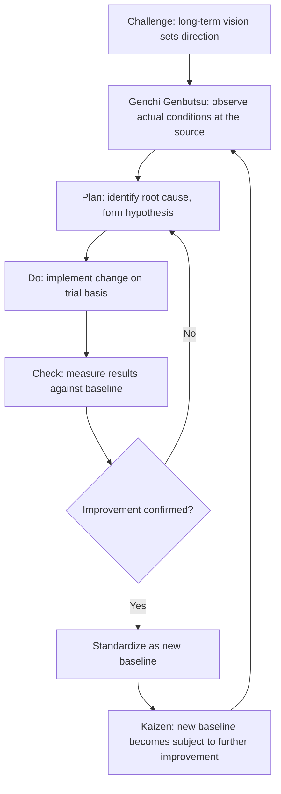

## Continuous Improvement as a Guiding Pillar of the Toyota Way

### Historical Context

Continuous Improvement is one of the two overarching pillars formally articulated in Toyota's internal Toyota Way 2001 document, standing alongside Respect for People as the two foundational values Toyota codified to describe its organizational culture (see the companion topic "The Origin and Structure of the Toyota Way 2001 Document"). Within this pillar, Toyota identifies three component sub-values: Challenge, Kaizen, and Genchi Genbutsu. While "continuous improvement" as a general concept is most closely associated in Western popular understanding with the term kaizen and with Masaaki Imai's 1986 book, the Toyota Way 2001's framing situates kaizen as one of three interlocking components beneath the broader Continuous Improvement pillar, alongside Challenge (long-term vision and courage) and Genchi Genbutsu (fact-based, firsthand decision-making) — together describing not just a technique but an organizational mindset toward perpetual, never-finished improvement.

### Key Points

- **Not a single tool, but a mindset**: Continuous Improvement as a Toyota Way pillar describes an orientation toward organizational learning and betterment that is meant to permeate all levels and functions, distinguishing it from any single specific technique (kaizen event, PDCA cycle, or specific quality tool), which are implementations of the mindset rather than the mindset itself.
- **Three component sub-values**: Challenge (maintaining a long-term vision and meeting challenges with courage and creativity), Kaizen (continuously improving operations, always driving toward innovation and evolution), and Genchi Genbutsu (going to the source to find facts needed to make correct decisions and build consensus).
- **"Never satisfied" orientation**: A frequently cited characterization of this pillar is the idea that no process, however well it currently performs, is ever considered finished or perfect — every current standard is understood as a temporary best-known method to be challenged and improved further, rather than a final, fixed solution.
- **Standardized work as improvement's necessary baseline**: A key structural point (also discussed under the House of TPS model) is that continuous improvement requires a stable, documented current standard against which improvement can be measured and from which deviation can be recognized; without standardized work, "improvement" lacks a clear baseline and risks becoming arbitrary or unmeasurable change rather than genuine, verifiable improvement.
- **Everyone's responsibility, not a specialist function**: Consistent with Imai's kaizen philosophy, the Toyota Way's Continuous Improvement pillar frames improvement activity as an expectation for employees at all levels, including frontline shop-floor workers, rather than being the exclusive domain of engineers, quality specialists, or management.
- **Long-term orientation embedded in "Challenge"**: The Challenge sub-value explicitly links continuous improvement to long-term vision — improvement efforts are meant to be guided by and contribute toward long-term organizational goals rather than being disconnected, ad hoc fixes pursued for their own sake.

### The Three Sub-Values in Detail

| Sub-Value | Core Meaning | Relationship to Improvement |
| --- | --- | --- |
| Challenge | Form a long-term vision, and meet challenges with courage and creativity to realize that vision | Provides the long-term direction and motivation guiding what improvement efforts should ultimately aim toward |
| Kaizen | Continuously improve business operations, always driving for innovation and evolution | The ongoing, incremental improvement activity itself, conducted by employees at all levels |
| Genchi Genbutsu | Go to the source to find the facts needed to make correct decisions, build consensus, and achieve goals | Ensures improvement efforts are grounded in direct observation of reality rather than assumption, secondhand report, or abstract theory |

### The PDCA Cycle as the Operational Mechanism

While the Toyota Way 2001 document itself states values rather than detailed procedural steps, the Plan-Do-Check-Act (PDCA) cycle, associated with W. Edwards Deming's influence on postwar Japanese quality management, is the most commonly cited operational mechanism through which the Continuous Improvement pillar's kaizen sub-value is enacted in practice:

1. **Plan**: Identify a problem or improvement opportunity through direct observation (genchi genbutsu), analyze root causes, and develop a hypothesis for improvement.
2. **Do**: Implement the proposed change, typically on a small scale or trial basis first.
3. **Check**: Observe and measure the results of the change against the original standard or hypothesis.
4. **Act**: If the change proves beneficial, standardize it as the new baseline (updating standardized work); if not, revert and use what was learned to inform a new Plan stage.
5. The cycle then repeats indefinitely — reflecting the pillar's "never finished" orientation, since even a successful improvement immediately becomes the new baseline subject to further future challenge.

### Diagram: The Continuous Improvement Cycle Within the Toyota Way (svg_diagram)

### Example: Continuous Improvement Applied to a Repetitive Process

Consider a workstation where an operator performs a repetitive assembly task, currently governed by an existing standardized work document specifying the sequence, timing, and method:

1. **Challenge-driven motivation**: Management has communicated a long-term goal of reducing overall assembly lead time by a meaningful margin over the coming years, giving improvement efforts at this station a clear directional purpose rather than improvement for its own sake.
2. **Genchi genbutsu observation**: A team leader or the operator themselves directly observes the task being performed in real time (rather than reviewing only aggregated cycle-time data), noticing that a specific hand movement to retrieve a tool takes longer than necessary due to its storage location.
3. **Kaizen action (PDCA)**: The team proposes relocating the tool closer to the point of use (Plan), tests the new tool placement for a trial period (Do), measures whether cycle time actually improves and whether any new problems are introduced (Check), and if successful, updates the standardized work documentation to reflect the new tool location as the new required standard (Act).
4. **Perpetuation**: The updated standard is not treated as a final, permanent solution — it becomes the new baseline against which future observation and improvement will again be measured, in principle indefinitely.

This example illustrates how the three sub-values interlock in practice: Challenge provides the "why" (long-term direction), Genchi Genbutsu provides the "how we know" (fact-based observation), and Kaizen provides the "what we do" (the incremental change itself), all operating on top of the standardized work foundation.

### Relationship to Other Chapter Topics

- **Versus Imai's kaizen concept**: Imai's popularization of kaizen (see the companion topic on Masaaki Imai) substantially overlaps with, and is generally understood to have informed, the "Kaizen" sub-value within Toyota's own Continuous Improvement pillar, but Toyota's own framing situates kaizen as one of three interlocking sub-values rather than as the entirety of the pillar's meaning — Challenge and Genchi Genbutsu are equally load-bearing components in Toyota's own articulation, even though "kaizen" alone has become the more widely recognized term in general Western business vocabulary.
- **Versus the House of TPS foundation**: The House of TPS model places kaizen (and standardized work) in the foundation supporting the JIT and Jidoka pillars; this reflects the same underlying concept viewed through a different structural metaphor — the House model organizes TPS's operational tools, while the Toyota Way 2001's Continuous Improvement pillar organizes the company's broader cultural values, of which the operational kaizen tool is one manifestation.
- **Versus Long-Term Philosophy (Liker's Principle 1)**: Both frameworks emphasize a long-term orientation, but Liker's "Philosophy" level in the 4P model is broader, encompassing business purpose generally, while the Toyota Way 2001's "Challenge" sub-value specifically ties long-term vision to the motivation for continuous improvement activity — the two concepts are closely related and mutually reinforcing but originate from different codification efforts (Toyota's own internal document versus Liker's external academic synthesis).

### Distinguishing Fact from Interpretation

- That Continuous Improvement is one of Toyota's own two stated pillars in the Toyota Way 2001 document, and that it comprises the three sub-values of Challenge, Kaizen, and Genchi Genbutsu, is a documented fact consistent with Toyota's own published descriptions of its values.
- The PDCA cycle's association with enacting kaizen in practice is a widely accepted and commonly taught operational framework in TPS/Lean literature, tracing to broader Deming-influenced quality management practice in postwar Japan.
- The specific worked example (tool relocation at an assembly station) is an illustrative, generic scenario constructed to demonstrate how the three sub-values interlock in a plausible practical setting; it is not a documented historical case from a specific named Toyota facility and should be read as a pedagogical illustration rather than a reported real event.

### Conclusion

Continuous Improvement, as one of the two foundational pillars in Toyota's own internally codified Toyota Way 2001 document, describes an organizational mindset of perpetual, never-finished betterment, structured around three interlocking sub-values: Challenge (long-term vision and courageous ambition), Kaizen (ongoing incremental improvement by employees at all levels), and Genchi Genbutsu (fact-based decision-making grounded in direct, firsthand observation). Operationalized in practice most commonly through the PDCA cycle and dependent on a stable standardized-work baseline against which improvement can be measured, this pillar reframes even a currently well-performing process as merely a temporary best-known standard, always open to further challenge — a philosophical stance that distinguishes Toyota's approach from treating any given process design as a fixed, permanent solution.

**Related Topics**

- Genchi genbutsu as both a value and a practical decision-making method
- The Challenge sub-value and its link to long-term organizational vision
- The PDCA (Plan-Do-Check-Act) cycle and its Deming-era origins
- Standardized work as the necessary baseline for measurable improvement
- Respect for People as the Toyota Way's second pillar (Respect and Teamwork)
- Masaaki Imai's kaizen philosophy and its relationship to Toyota's own framing
- Hansei (relentless self-reflection) as a related problem-solving practice