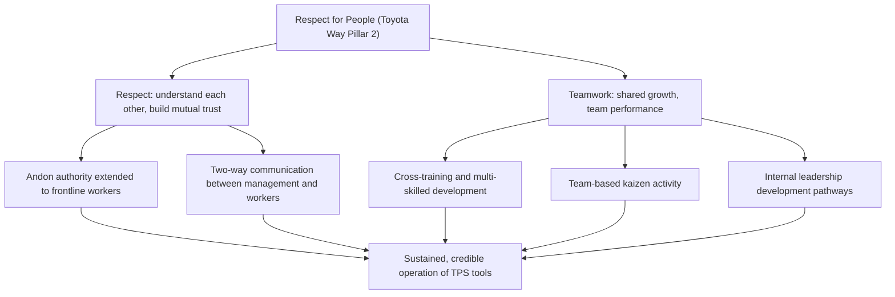

## Respect for People as a Guiding Pillar of the Toyota Way

### Historical Context

Respect for People is the second of Toyota's two overarching pillars formally articulated in the internal Toyota Way 2001 document, standing alongside Continuous Improvement (see the companion topic on that pillar). Within this pillar, Toyota identifies two component sub-values: Respect and Teamwork. This pillar's roots extend well before the 2001 document's formal codification, tracing conceptually to Sakichi Toyoda's early 20th-century company precepts, to the postwar labor relations reforms and the 1950 Toyota financial crisis and strike (which left a lasting institutional impression regarding the human cost of workforce disruption), and to the operational philosophy embedded in jidoka itself — where the term "automation with a human touch" reflects an early and explicit design choice to keep human judgment and involvement central to the production process rather than treating workers as interchangeable, replaceable components of a purely mechanical system.

### Key Points

- **Two component sub-values**: Respect (respecting others, making every effort to understand each other, taking responsibility, and building mutual trust) and Teamwork (stimulating personal and professional growth, sharing opportunities for development, and maximizing individual and team performance).
- **Distinct from a generic corporate HR slogan**: Within TPS/Toyota Way literature, Respect for People is presented as functionally load-bearing for the system's operational effectiveness, not merely an ethical or public-relations add-on — the argument is that TPS's operational tools (kaizen, andon, standardized work) depend on genuinely engaged, trusted, and empowered employees to function as intended, and would degrade into hollow, mechanically-followed procedures without this underlying respect-based relationship.
- **Practical manifestation — empowerment to stop the line**: The authority given to any line worker to activate an andon signal and potentially stop production (discussed under Jidoka) is frequently cited as a direct structural expression of respect for people in practice — it reflects trust that frontline workers possess the judgment and standing to make consequential operational decisions, rather than reserving all quality-control authority to supervisors or specialists.
- **Practical manifestation — worker-driven kaizen**: The expectation that continuous improvement suggestions originate substantially from frontline employees, not solely from engineers or management, reflects a respect-based assumption that the people closest to the work possess valuable knowledge and judgment about how to improve it.
- **Long-term employment and internal development orientation**: Toyota's documented historical preference for internal leadership development and relative employment stability (discussed under Long-Term Philosophy) is commonly linked to the Respect for People pillar, reflecting an investment orientation toward employees as a long-term asset to be developed rather than a short-term cost to be minimized.
- **Extends to teamwork and mutual accountability**: The Teamwork sub-value explicitly frames individual growth as connected to collective team performance, reflecting an orientation toward shared responsibility and mutual support rather than purely individualized competition or evaluation.
- **Also extends to partners and suppliers**: Related principles in Toyota Way literature (and explicitly named in Liker's 14-principle framework, discussed under Long-Term Philosophy) extend a version of this respect-based orientation to external supplier relationships — helping and challenging suppliers to improve, rather than treating them as purely transactional, replaceable vendors.

### The Two Sub-Values in Detail

| Sub-Value | Core Meaning | Operational Manifestation |
| --- | --- | --- |
| Respect | Respecting others, making every effort to understand each other, taking responsibility, and building mutual trust | Andon authority given to frontline workers; management practices emphasizing genuine two-way communication rather than purely top-down directives |
| Teamwork | Stimulating personal and professional growth, sharing development opportunities, and maximizing individual and team performance | Cross-training and multi-skilled worker development; kaizen activities conducted by teams rather than isolated individuals; internal leadership development pathways |

### Example: Andon Authority as Structural Respect

The andon system, discussed in detail under Jidoka, provides a clear illustration of how Respect for People functions as more than an abstract value statement:

- In a traditional, low-trust mass-production model, the authority to halt an entire production line represents significant cost and risk, and would typically be reserved for supervisors or specialists deemed to have the necessary judgment and accountability.
- Under TPS, this authority is explicitly extended to any individual line worker, on the premise that the worker closest to the actual work is best positioned to notice a genuine problem in real time, and that the organization trusts that judgment enough to accept the operational cost of a potential stoppage rather than risk a defect propagating downstream.
- This represents a concrete, high-stakes operational design choice — not merely a stated value — that embodies the Respect sub-value's emphasis on trust and mutual accountability: the worker is trusted with real authority, and in turn is expected to exercise that authority responsibly rather than triggering stoppages carelessly.
- [Inference] This example is commonly used in TPS/Lean training precisely because it makes an otherwise abstract cultural value tangible and falsifiable in operational terms — an organization that claims to value "respect for people" but does not extend meaningful decision authority to frontline workers is, by this logic, not genuinely implementing the principle regardless of stated values, though this is an interpretive standard commonly applied in Lean practitioner critique rather than a formally measurable test defined by Toyota itself.

### Example: Worker-Driven Kaizen Suggestion Systems

Many Toyota facilities and other TPS-influenced organizations implement structured suggestion systems inviting frontline employees to propose process improvements:

- Rather than treating improvement ideas as flowing exclusively top-down from engineering or management, these systems are designed to actively solicit, evaluate, and implement ideas originating from the employees performing the work daily.
- Recognition and follow-through on implemented suggestions (rather than ideas being submitted and then ignored) is commonly emphasized in Lean literature as essential to sustaining genuine engagement — a suggestion system that collects ideas but rarely acts on them tends to erode trust and undermines the Respect for People pillar's credibility over time.
- [Inference] The specific structure, scale, and historical participation rates of Toyota's internal suggestion systems have varied across different eras and facilities; general claims about suggestion-system effectiveness should be understood as reflecting a widely cited best-practice pattern in Lean literature rather than a single fixed, universally documented statistic applicable to every Toyota facility at every point in time.

### Diagram: Respect for People — From Value to Operational Practice (svg_diagram)

### Relationship to the Historical 1950 Crisis

The 1950 Toyota financial crisis, workforce reduction, resulting strike, and Kiichiro Toyoda's subsequent resignation (discussed under postwar resource constraints) is frequently cited in Toyota Way literature as a formative institutional memory contributing to the company's later emphasis on employment stability and respect-based labor relations:

- [Inference] While it would be an overstatement to claim this single historical episode is the sole cause of Toyota's subsequent Respect for People orientation, it is commonly cited in company histories and case studies as a significant, formative event that left a lasting impression on Toyota's leadership regarding the human and organizational cost of adversarial labor relations and abrupt workforce reduction, contributing to (alongside broader postwar Japanese labor law reforms and cultural factors) the emphasis on stable employment and mutual trust later formalized in the Toyota Way 2001 document.

### Relationship to Other Chapter Topics

- **Versus Long-Term Philosophy**: Respect for People and Long-Term Philosophy (Liker's Principle 1) are closely related but distinct — Long-Term Philosophy concerns the organization's overall decision-making orientation (prioritizing durable value over short-term financial metrics), while Respect for People concerns specifically how the organization treats and empowers its employees and partners; the two principles reinforce each other (e.g., employment stability decisions during downturns reflect both a long-term view and a respect-based commitment to the workforce).
- **Versus Continuous Improvement**: The two Toyota Way pillars are explicitly designed to function together — Continuous Improvement's kaizen activity in practice depends on genuinely engaged employees willing and able to identify and propose improvements, which in turn depends on the trust and empowerment described under Respect for People; the two pillars are frequently described in Toyota Way literature as mutually reinforcing rather than independently sufficient.
- **Versus the House of TPS model's center**: The House of TPS diagram's placement of "people and teamwork" at the center of the house structurally reflects the same underlying concept as this pillar, illustrating how the same core idea (people as central to the system's function) appears across different TPS/Toyota Way frameworks using different organizing metaphors.

### Distinguishing Fact from Interpretation

- That Respect for People is one of Toyota's own two stated pillars in the Toyota Way 2001 document, comprising the sub-values of Respect and Teamwork, is a documented fact consistent with Toyota's own published descriptions.
- That andon authority is extended to frontline workers, and that worker-suggestion systems have historically been a feature of Toyota's operations, are well-documented operational facts.
- The interpretive claim that these operational features "prove" or constitute the genuine functional implementation of the Respect for People value (as opposed to merely being consistent with it) reflects a commonly used argumentative framing in Lean practitioner and academic literature, not a formally defined or independently measurable test that Toyota itself has published as a verification standard.
- The causal weight attributed to the 1950 crisis in shaping later Respect for People practices is a widely cited historical interpretation but should be understood as one significant contributing factor among several (including broader postwar labor law reform) rather than a sole, isolated cause.

### Conclusion

Respect for People, as the second of Toyota's two stated pillars in the Toyota Way 2001 document, comprises the sub-values of Respect (mutual understanding, responsibility, and trust) and Teamwork (shared growth and collective performance), and functions in TPS literature as more than an abstract ethical statement — it is presented as operationally load-bearing, embodied concretely in practices such as extending andon stop-the-line authority to frontline workers, soliciting and acting on worker-driven kaizen suggestions, and favoring internal leadership development and employment stability over purely transactional labor treatment. Rooted partly in formative historical experience, including the 1950 financial crisis and strike, and reinforced by postwar Japanese labor relations reform, this pillar is understood in Toyota Way literature as functioning in close, mutually reinforcing relationship with the Continuous Improvement pillar — since the trust and empowerment described under Respect for People are what allow the ongoing, employee-driven improvement activity of the Continuous Improvement pillar to function credibly and sustainably.

**Related Topics**

- The Teamwork sub-value and Toyota's cross-training and multi-skilling practices
- Andon authority as a structural expression of trust and empowerment
- Worker-driven kaizen suggestion systems and their design principles
- The 1950 Toyota financial crisis and its lasting influence on labor relations philosophy
- Continuous Improvement as the Toyota Way's complementary first pillar
- Extending respect-based principles to supplier relationships (Liker's Principle 11)
- The House of TPS model's placement of people and teamwork at the system's center