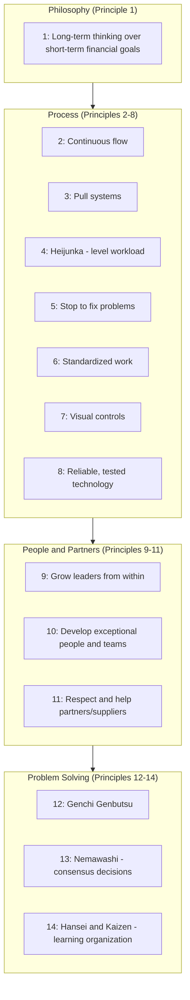

## Liker's Fourteen Management Principles Overview

### Historical Context

Jeffrey K. Liker, a professor of industrial and operations engineering at the University of Michigan, published *The Toyota Way: 14 Management Principles from the World's Greatest Manufacturer* in 2004, following years of academic research and direct study of Toyota's operations. The book represents a distinct scholarly synthesis from Toyota's own internal Toyota Way 2001 document (discussed in the companion topic on that document) — Liker is an external academic author, not a Toyota employee producing an official company publication, though his framework is understood to be substantially informed by and consistent with Toyota's own stated values. Liker organized his observations into fourteen specific management principles, grouped under a "4P model" (Philosophy, Process, People/Partners, Problem Solving), providing what became one of the most widely referenced structured frameworks for explaining TPS and Toyota Way concepts to external business and academic audiences.

### Key Points

- **The 4P Model as organizing structure**: The fourteen principles are grouped into four categories, presented as a pyramid with Philosophy as the foundation, Process above it, People and Partners above that, and Problem Solving at the top — mirroring the logic of the House of TPS model in treating philosophy/culture as foundational to specific operational tools rather than the tools standing independently.
- **Section 1 — Philosophy (1 principle)**: Base management decisions on long-term thinking, even at the expense of short-term financial goals (discussed in depth in the companion topic "Long-Term Philosophy as the Foundation of Decision Making").
- **Section 2 — Process (7 principles)**: The largest category, covering most of the classic operational TPS tools — continuous flow, pull systems, workload leveling (heijunka), stop-and-fix culture (jidoka), standardized work, visual management, and reliable, thoroughly-tested technology.
- **Section 3 — People and Partners (3 principles)**: Covers leadership development from within, respecting and developing employees and teams, and respecting and helping suppliers/partners improve.
- **Section 4 — Problem Solving (3 principles)**: Covers genchi genbutsu (fact-based decision-making through direct observation), nemawashi (consensus-based decision-making with thorough consideration of options), and hansei/kaizen (organizational learning through relentless reflection and continuous improvement).
- **Function as a synthesis rather than a Toyota-authored document**: Because Liker's framework is an external academic interpretation, it provides more explicit, numbered, and individually elaborated principles than Toyota's own more compact internal Toyota Way 2001 document, making it a commonly used teaching structure in business schools and consulting contexts specifically because of this expanded, itemized format.

### The Complete Fourteen Principles by Section

| # | Principle (Summarized) | 4P Section |
| --- | --- | --- |
| 1 | Base management decisions on long-term philosophy, even at the expense of short-term financial goals | Philosophy |
| 2 | Create continuous process flow to bring problems to the surface | Process |
| 3 | Use pull systems to avoid overproduction | Process |
| 4 | Level out the workload (heijunka) | Process |
| 5 | Build a culture of stopping to fix problems, to get quality right the first time | Process |
| 6 | Standardized tasks are the foundation for continuous improvement and employee empowerment | Process |
| 7 | Use visual controls so no problems are hidden | Process |
| 8 | Use only reliable, thoroughly tested technology that serves people and processes | Process |
| 9 | Grow leaders who thoroughly understand the work, live the philosophy, and teach it to others | People and Partners |
| 10 | Develop exceptional people and teams who follow the company's philosophy | People and Partners |
| 11 | Respect the extended network of partners and suppliers by challenging them and helping them improve | People and Partners |
| 12 | Go and see for yourself to thoroughly understand the situation (genchi genbutsu) | Problem Solving |
| 13 | Make decisions slowly by consensus, thoroughly considering all options; implement decisions rapidly (nemawashi) | Problem Solving |
| 14 | Become a learning organization through relentless reflection (hansei) and continuous improvement (kaizen) | Problem Solving |

### Diagram: The 4P Pyramid Structure (svg_diagram)

### Mapping the Fourteen Principles to Previously Covered TPS Concepts

Several of Liker's Process-section principles directly correspond to TPS mechanisms already discussed in this chapter and prior chapters, providing a useful cross-reference:

| Liker's Principle | Corresponding TPS Concept (discussed elsewhere) |
| --- | --- |
| Principle 2: Continuous flow | Continuous flow under the JIT pillar |
| Principle 3: Pull systems | Kanban and pull-based production under the JIT pillar |
| Principle 4: Heijunka | Production leveling, part of the House of TPS foundation |
| Principle 5: Stop to fix problems | Jidoka and andon systems |
| Principle 6: Standardized work | House of TPS foundation element |
| Principle 7: Visual controls | Andon boards and broader visual management practice |
| Principle 12: Genchi genbutsu | Toyota Way 2001's Continuous Improvement sub-value |
| Principle 14: Hansei and kaizen | Toyota Way 2001's Kaizen sub-value; Masaaki Imai's kaizen philosophy |

This mapping illustrates that Liker's fourteen principles are not an independent or competing description of TPS, but rather a more granular, individually-elaborated restatement and academic organization of concepts that also appear, often in more compact or differently-grouped form, in Toyota's own internal Toyota Way 2001 document and in the House of TPS model.

### Example: Principle 5 in Practice — "Build a Culture of Stopping to Fix Problems"

This principle provides a useful illustration of how Liker's framework translates an operational TPS mechanism (jidoka/andon, discussed earlier) into an explicit management principle framed for a general business audience:

- Rather than simply describing the andon cord as a piece of shop-floor equipment, Liker's principle frames the underlying management commitment required to make such a mechanism function: leadership must genuinely support and reward line stoppages triggered by workers reporting problems, rather than implicitly or explicitly penalizing workers for stoppages that reduce short-term output.
- [Inference] This framing highlights a common practical failure mode noted in Lean implementation literature: organizations that install andon-style stop mechanisms without genuinely changing management's response to stoppages (e.g., informally pressuring workers not to stop the line, or treating stoppage frequency as a negative performance metric for workers) tend to see the mechanism fall into disuse or become purely symbolic, illustrating why Liker frames this as a "culture" principle rather than merely describing the andon tool itself.

### Distinguishing Fact from Interpretation

- The existence, numbering, and 4P grouping of Liker's fourteen principles as presented in *The Toyota Way* (2004) are directly verifiable facts about that specific, widely available publication.
- The correspondence drawn between individual Liker principles and previously discussed TPS/Toyota Way concepts (House of TPS, Toyota Way 2001, Ohno's JIT/jidoka pillars) reflects a reasonable and commonly recognized conceptual mapping in secondary Lean literature, though Liker's own text organizes and elaborates these ideas independently rather than presenting them as a direct restatement of any single other named framework.
- Liker's book is a work of academic and consulting analysis based on extensive research and case study of Toyota, but it is not itself an official Toyota corporate publication; distinguishing "what Liker's research concluded about Toyota's practices" from "what Toyota has itself officially and exhaustively stated about its own practices" is a reasonable and important interpretive caution, though this does not imply any specific inaccuracy in Liker's widely respected and frequently cited research.

### Conclusion

Jeffrey Liker's fourteen management principles, organized under his 4P model (Philosophy, Process, People and Partners, Problem Solving) in *The Toyota Way* (2004), represent the most widely used external academic framework for explaining Toyota's management system to global business and academic audiences. Ranging from the foundational Philosophy principle of long-term thinking, through seven Process principles covering core TPS operational mechanisms (continuous flow, pull systems, heijunka, jidoka-based stopping culture, standardized work, visual controls, and reliable technology), to three People and Partners principles addressing leadership development and supplier relationships, and finally three Problem Solving principles addressing fact-based observation, consensus decision-making, and organizational learning, the framework provides a structured, granular restatement of concepts that also appear, often more compactly, in Toyota's own internal Toyota Way 2001 document and in the House of TPS model — making it a valuable synthesizing reference point for connecting the more specific tool-level and value-level concepts covered elsewhere in this chapter.

**Related Topics**

- Long-Term Philosophy as Principle 1 in depth (covered separately)
- Nemawashi: consensus-based decision-making and its relationship to Principle 13
- Hansei: the practice of relentless reflection underlying Principle 14
- Visual management and visual controls (Principle 7) in operational detail
- Leadership development practices at Toyota (Principles 9-10)
- Supplier relationship management under Principle 11
- Comparing Liker's 4P framework to the House of TPS and Toyota Way 2001 structures