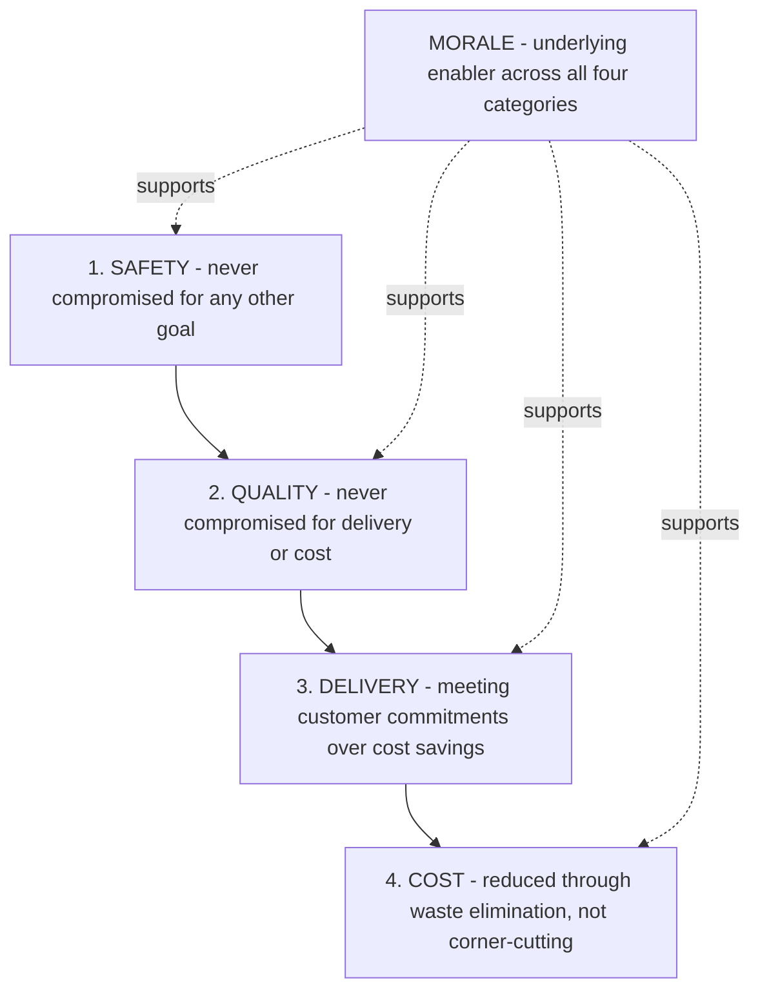

## Safety, Quality, Delivery, Cost, and Morale as an Operating Priority Framework

### Historical Context

Safety, Quality, Delivery, Cost, and Morale — commonly abbreviated as SQDCM (with variants such as SQDC, QCD, or SQDCP appearing across different organizations and industries) — is a widely used operational priority framework in Lean manufacturing environments, including Toyota-influenced operations, used to structure how frontline teams and management evaluate performance and prioritize attention at the shop-floor level. Unlike the House of TPS model or the Toyota Way 2001 document, which describe overarching philosophy and system architecture, SQDCM (and its variants) functions primarily as a practical, day-to-day operational metrics and prioritization framework, commonly displayed on visual management boards at or near the production line, and is more broadly associated with general Lean manufacturing practice across many companies than with a single, precisely documented Toyota-original invention. [Unverified] The exact origin and first formal use of the specific SQDCM acronym and ordering is not consistently attributed to a single source in secondary literature, and different organizations use varying orderings and letter sets (some placing Quality first, others Safety first; some omitting Morale entirely in favor of a four-letter QCD framework); it is best understood as a widely adopted practical convention within Lean/TPS-influenced manufacturing management rather than a single canonical, singularly authored model.

### Key Points

- **Priority ordering as the framework's central feature**: The defining characteristic of this framework is not merely listing these five categories, but establishing an explicit priority order among them — most commonly Safety first, then Quality, then Delivery, then Cost, with Morale sometimes placed last or treated as an underlying enabler threaded throughout the others.
- **Safety first**: Placing safety at the top of the priority order reflects the principle that no production, quality, delivery, or cost consideration should ever be allowed to compromise worker safety — an unsafe practice is not considered acceptable regardless of its potential benefit to the other four categories.
- **Quality second**: Quality is placed above delivery and cost, reflecting the jidoka-derived principle that producing defective work, even if doing so meets a delivery deadline or reduces short-term cost, is considered a false economy that generates greater downstream cost and waste.
- **Delivery third**: Meeting delivery commitments to the customer (in terms of timing and quantity) is prioritized above cost reduction, reflecting the JIT-derived and customer-focused principle that failing to deliver as promised undermines customer trust and value in ways that outweigh cost savings achieved by cutting corners on delivery performance.
- **Cost fourth**: Cost reduction is positioned as an important but subordinate goal — pursued through the elimination of waste (consistent with core TPS/Lean philosophy) rather than through shortcuts that would compromise safety, quality, or delivery.
- **Morale**: Where included, morale (sometimes represented as "People" or "Participation" in variant framings) reflects the Respect for People principle's recognition that sustained performance across the other four categories depends on an engaged, motivated workforce, and functions as an underlying condition supporting the other metrics rather than a separate, independent operational output.
- **Used for visual management and team-level review**: SQDCM boards, typically updated daily or per shift, are a common visual management tool (itself a Lean/TPS practice, as reflected in Liker's Principle 7) used at the team or work-cell level to track performance against targets in each category and to surface problems requiring attention, in a location visible to the team and often to visiting management.

### The Priority Order and Its Underlying Logic

| Priority Rank | Category | Underlying Principle | Related TPS Concept |
| --- | --- | --- | --- |
| 1 (highest) | Safety | No output, quality, delivery, or cost goal justifies compromising worker safety | Respect for People pillar |
| 2 | Quality | Producing defects, even to meet other goals, generates greater downstream waste | Jidoka |
| 3 | Delivery | Meeting customer commitments takes precedence over cost minimization | Just-in-Time |
| 4 | Cost | Cost should be reduced through waste elimination, not through compromising the categories above it | Muda elimination; broader TPS waste reduction |
| (underlying) | Morale | Sustained performance across all categories depends on an engaged, motivated workforce | Respect for People pillar; Toyota Way Teamwork sub-value |

### Example: Applying the Priority Order to a Trade-Off Decision

Consider a scenario at a production line facing a temporary equipment malfunction that has caused output to fall behind schedule for the day, creating pressure to catch up before the shift ends:

- **If a proposed "catch-up" solution would require bypassing a safety guard or interlock to speed up a machine cycle**: The SQDCM priority order dictates this option is rejected outright, regardless of the delivery or cost benefit it might offer, because Safety sits above all other categories.
- **If a proposed solution would allow production to resume at full speed but with a known, elevated risk of producing defective units that would need to be identified and reworked later**: The priority order suggests this should generally be rejected in favor of a slower but quality-assured approach, since Quality outranks Delivery and Cost.
- **If a proposed solution involves authorizing overtime labor cost to meet the day's delivery commitment, without compromising safety or quality**: This is consistent with the priority order, since Delivery outranks Cost, meaning an incremental cost increase is an acceptable trade-off to preserve delivery performance once safety and quality are already assured.
- This worked example illustrates the framework's primary practical function: providing a clear, pre-agreed decision hierarchy that shop-floor teams and supervisors can apply quickly under time pressure, without needing to re-derive first-principles trade-off reasoning in the moment for every operational decision.

### Diagram: SQDCM Priority Hierarchy (svg_diagram)

### Relationship to Visual Management Boards

SQDCM is most commonly encountered in practice as the organizing structure for a physical or digital visual management board at the team or cell level:

- Each category typically has associated metrics tracked over time — for example, Safety might track days since last incident or near-miss reports; Quality might track defect rate or first-pass yield; Delivery might track on-time completion rate or units produced against target; Cost might track scrap rate, overtime hours, or material consumption against standard.
- Performance is commonly displayed using simple visual indicators (e.g., green/yellow/red status, or actual-versus-target charts) allowing anyone glancing at the board, including visiting managers unfamiliar with the specific process, to immediately identify which category requires attention — directly implementing Liker's Principle 7 ("use visual controls so no problems are hidden").
- Regular (often daily) team huddles or shift-change reviews commonly use the SQDCM board as the structured agenda for discussing the previous period's performance and identifying any needed corrective action, tying this framework directly into the PDCA-driven continuous improvement cycle discussed under the Continuous Improvement pillar.

### Variants Across Organizations

Because this framework is a widely adopted practical convention rather than a single fixed standard, readers should expect variation across sources and organizations:

- **QCD (Quality, Cost, Delivery)**: A three-category variant commonly used, particularly in contexts discussing broader business or supplier performance evaluation rather than shop-floor safety-specific tracking, and closely related to the "roof" of the House of TPS model, which is often labeled with best quality, lowest cost, and shortest lead time.
- **SQDC**: A four-category variant omitting Morale, focusing purely on the operational/output metrics.
- **SQDCM or SQDCP**: Five-category variants explicitly including Morale or People as a distinct tracked dimension alongside the four operational categories.
- **Alternative orderings**: While Safety-first is the most commonly cited ordering in Lean/TPS-influenced manufacturing contexts (given the ethical and regulatory primacy typically assigned to worker safety), some sources present Quality as the leading category, particularly in contexts emphasizing customer-facing outcomes over internal operational sequencing.
- [Unverified] Given this variation, this framework should be treated as a widely used, generically Lean/TPS-influenced practical convention rather than being fully synonymous with one single, universally standardized model directly attributable to Toyota's own internal documentation in this exact five-letter form.

### Distinguishing Fact from Interpretation

- That SQDCM (and its variants QCD, SQDC) is a widely used operational priority and visual-management framework in Lean manufacturing environments is a well-documented practical fact, reflected in extensive Lean/TPS training materials and shop-floor practice across many companies.
- The specific priority ordering (Safety, then Quality, then Delivery, then Cost) and its underlying rationale, as commonly explained in Lean training literature, represents a widely repeated and broadly consistent teaching convention across multiple sources.
- The claim of a single, precisely dated, singularly attributable origin for this exact framework and acronym is not well supported in available secondary literature; readers should treat it as a broadly used industry convention of somewhat diffuse origin rather than expecting one definitive founding source or date, unlike more precisely documented artifacts such as Ohno's 1978 book or Liker's 2004 book.

### Conclusion

The Safety, Quality, Delivery, Cost, and Morale (SQDCM) framework provides a practical, priority-ordered structure for shop-floor decision-making and visual performance management within Lean and TPS-influenced manufacturing environments, establishing an explicit hierarchy in which worker safety is never compromised for quality, delivery, or cost considerations; quality is never compromised for delivery or cost; delivery commitments are prioritized above cost minimization; and cost reduction is pursued through waste elimination rather than corner-cutting on the categories above it, with morale functioning as an underlying enabling condition across all four operational categories. While variations in the exact category set and ordering exist across different organizations and sources, and the framework's precise origin is less clearly documented than other more formally authored TPS artifacts, its core function — providing frontline teams with a clear, pre-agreed decision hierarchy and a structure for visual management tracking — makes it one of the most practically applied operational frameworks connecting this chapter's philosophical principles to daily shop-floor practice.

**Related Topics**

- Visual management boards and Liker's Principle 7 in operational detail
- The House of TPS model's roof (quality, cost, lead time) as a related framework
- Andon systems and their integration with Safety and Quality priority tracking
- Daily team huddles and shift-change review practices in Lean manufacturing
- First-pass yield and other common Quality metrics tracked on SQDCM boards
- Respect for People and its connection to the Morale category
- PDCA cycle integration with SQDCM board review practices