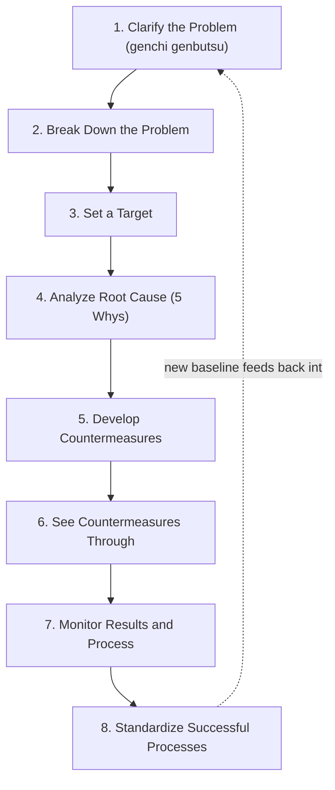

## Toyota Business Practices as a Structured Thinking Framework

### Historical Context

Toyota Business Practices (TBP) is an internal Toyota problem-solving methodology, developed and formalized by Toyota to provide a standardized, repeatable, step-by-step thinking process for addressing business and operational problems consistently across the organization. Where the Toyota Way 2001 document articulates broad philosophical values (Continuous Improvement and Respect for People) and Liker's fourteen principles provide an external academic synthesis of practices, TBP occupies a more specifically procedural role: it is Toyota's own structured methodology for how an individual employee or team should actually work through a problem from initial recognition to sustained solution, intended to operationalize the Toyota Way's Genchi Genbutsu and Kaizen values into a concrete, teachable, repeatable process. [Unverified] The precise internal history and formal naming date of TBP as a distinct codified methodology is not consistently documented with a single, universally agreed publication date across secondary sources in the way that the Toyota Way 2001 document's April 2001 release date is documented; TBP is best understood as an internal problem-solving discipline that Toyota has used and refined over an extended period and later formalized into training materials, including materials made available externally through Toyota-affiliated training and consulting programs.

### Key Points

- **An eight-step structured problem-solving process**: TBP is most commonly presented as an eight-step methodology guiding a problem-solver from initial problem clarification through to standardization and celebration of the resolved improvement, providing explicit sequential structure rather than leaving problem-solving approach to individual discretion.
- **Distinguishing symptom from root cause**: A central emphasis throughout TBP is ensuring that problem-solving efforts address genuine root causes rather than superficial symptoms, commonly reinforced through techniques such as the "5 Whys" (repeatedly asking "why" a problem occurred, typically five times, to drill down from an initial symptom to an underlying systemic cause).
- **Grounded in genchi genbutsu**: Early steps in the TBP process explicitly require direct, firsthand observation of the actual problem location and conditions, directly implementing the Toyota Way's Genchi Genbutsu sub-value rather than relying on secondhand reports or assumptions when defining and investigating a problem.
- **Emphasis on clarifying the problem before jumping to solutions**: A commonly cited discipline within TBP is resisting the natural tendency to propose solutions prematurely, instead insisting on thorough problem clarification, breakdown, and target-setting before any countermeasure is proposed — reflecting a belief that poorly understood problems lead to ineffective or superficial fixes.
- **Standardization and follow-through as final steps**: TBP's later steps explicitly require standardizing successful countermeasures (ensuring the improvement becomes the new normal operating method, not a one-off fix) and evaluating results against the original target, closing the loop back to the PDCA cycle discussed under Continuous Improvement.
- **Applicability beyond manufacturing floor problems**: While TBP shares conceptual DNA with shop-floor kaizen and PDCA activity, it is explicitly framed within Toyota as a general business problem-solving methodology applicable to a wide range of organizational challenges, not limited strictly to production-line technical issues.

### The Eight Steps of Toyota Business Practices

| Step | Name | Core Activity |
| --- | --- | --- |
| 1 | Clarify the Problem | Understand the actual situation directly (genchi genbutsu); define the gap between current and ideal/desired state |
| 2 | Break Down the Problem | Decompose a large, vague problem into smaller, more specific, more addressable sub-problems |
| 3 | Set a Target | Establish a specific, measurable target for improvement, including a timeframe |
| 4 | Analyze the Root Cause | Investigate underlying causes using techniques such as the 5 Whys, going beyond surface symptoms |
| 5 | Develop Countermeasures | Generate and select proposed solutions addressing the identified root cause(s) |
| 6 | See Countermeasures Through | Implement the selected countermeasure(s), including necessary planning and stakeholder coordination |
| 7 | Monitor Both Results and Processes | Evaluate whether the countermeasure achieved the target, and whether the implementation process itself worked as intended |
| 8 | Standardize Successful Processes | Formalize the successful countermeasure as the new standard method, and share learning more broadly within the organization |

### Diagram: The Eight-Step TBP Cycle (svg_diagram)

### Example: The 5 Whys Technique Within Root Cause Analysis (Step 4)

The 5 Whys technique, commonly cited as a core tool within TBP's root cause analysis step, illustrates the framework's emphasis on depth over superficial fixes. A frequently used illustrative example (widely circulated in Lean/TPS training materials in various forms) proceeds as follows:

1. **Problem**: A machine has stopped functioning.
2. **Why (1st)**: The machine overloaded, causing a fuse to blow. → *Why did it overload?*
3. **Why (2nd)**: The bearings were not sufficiently lubricated. → *Why were they not lubricated?*
4. **Why (3rd)**: The lubrication pump was not circulating sufficient oil. → *Why wasn't it circulating enough oil?*
5. **Why (4th)**: The pump intake was clogged with metal shavings. → *Why was it clogged with shavings?*
6. **Why (5th)**: There was no filter on the pump intake. → **Root cause identified**: installing a filter addresses the actual systemic cause, rather than merely replacing the blown fuse (which would only address the immediate symptom and allow the same failure to recur).

This example demonstrates the core TBP discipline: a superficial fix (replacing the fuse) would resolve the immediate symptom without preventing recurrence, while pursuing the chain of causation to its root (the missing filter) produces a durable, standardizable countermeasure — directly reflecting TBP's requirement that Step 8 (standardization) only makes sense once Step 4 (root cause analysis) has genuinely identified the actual underlying cause rather than a superficial symptom.

[Inference] The specific "5 Whys" example above is a commonly used generic pedagogical illustration found across many Lean/TPS training sources in broadly similar form; it should be understood as an illustrative, widely circulated teaching example rather than a documented account of one specific, named historical incident at a particular Toyota facility.

### Relationship Between "Why Five Times" and Root Cause Depth

- The specific number "five" in the 5 Whys technique is understood within TPS/Lean literature as a practical heuristic rather than a strict rule — the actual number of "why" questions needed to reach a genuine, actionable root cause varies by problem, and some problems may require fewer or more iterations.
- The technique's core value lies in its discipline of persistent causal questioning beyond the first, most obvious-seeming answer, rather than in the literal count of five iterations being independently significant.

### Relationship to Other Chapter Topics

- **Versus PDCA**: TBP's eight steps can be understood as a more granular, explicitly elaborated expansion of the PDCA cycle discussed under Continuous Improvement — Steps 1 through 5 correspond broadly to "Plan," Step 6 corresponds to "Do," Step 7 corresponds to "Check," and Step 8 corresponds to "Act," providing more specific procedural guidance within each PDCA phase than the general four-step PDCA framework alone provides.
- **Versus Genchi Genbutsu**: TBP's first step explicitly operationalizes the Genchi Genbutsu value discussed under both the Toyota Way 2001 document and Liker's Principle 12, translating the general value of "go and see" into a specific, sequenced first step within a broader structured methodology.
- **Versus Hansei**: TBP's Step 7 (monitoring both results and process) reflects the reflective discipline associated with hansei (relentless self-reflection, discussed under Liker's Principle 14), requiring honest evaluation of whether an implemented countermeasure actually achieved its intended effect, rather than simply assuming success once a countermeasure has been implemented.

### Distinguishing Fact from Interpretation

- The general existence of Toyota Business Practices as an internal Toyota structured problem-solving methodology, and its common presentation as an eight-step process, is well documented across Toyota-affiliated training materials and secondary Lean/TPS literature.
- The 5 Whys technique's association with TBP's root-cause-analysis step is well documented and widely consistent across sources, though the technique itself (asking "why" repeatedly to drill toward root cause) is also referenced more broadly across general Lean/quality-management literature independent of the specific TBP eight-step framework.
- The precise historical development timeline and formal internal naming/publication history of TBP as a distinctly labeled methodology is less consistently and precisely documented in available secondary sources compared to more specifically dated artifacts like the Toyota Way 2001 document or Ohno's 1978 book; readers should treat TBP's exact institutional history with appropriate caution while treating its content and structure (the eight steps and their function) as well-established.

### Conclusion

Toyota Business Practices (TBP) provides Toyota's own internal, structured, eight-step problem-solving methodology, translating the broader philosophical values articulated in the Toyota Way 2001 document — particularly Genchi Genbutsu and Kaizen — into a specific, sequential, and teachable process spanning problem clarification, breakdown, target-setting, root cause analysis (commonly employing the 5 Whys technique), countermeasure development and implementation, results monitoring, and final standardization. By insisting on thorough problem understanding and genuine root cause identification before solution development, and by requiring successful countermeasures to be standardized and shared rather than treated as isolated fixes, TBP operationalizes the more abstract PDCA cycle and Toyota Way values discussed elsewhere in this chapter into a concrete, repeatable discipline intended to produce consistent, high-quality problem-solving across the organization, extending well beyond shop-floor manufacturing issues into general business problem-solving contexts.

**Related Topics**

- The 5 Whys technique in root cause analysis, in further depth
- PDCA cycle as the conceptual parent framework underlying TBP's eight steps
- Genchi Genbutsu as both a stated Toyota Way value and TBP's operational first step
- Hansei (relentless reflection) and its relationship to TBP's monitoring step
- A3 problem-solving reports as a related Toyota documentation and communication tool
- Standardized work as the mechanism through which TBP's Step 8 outcomes are sustained
- Comparing TBP to other structured problem-solving methodologies (e.g., DMAIC in Six Sigma)