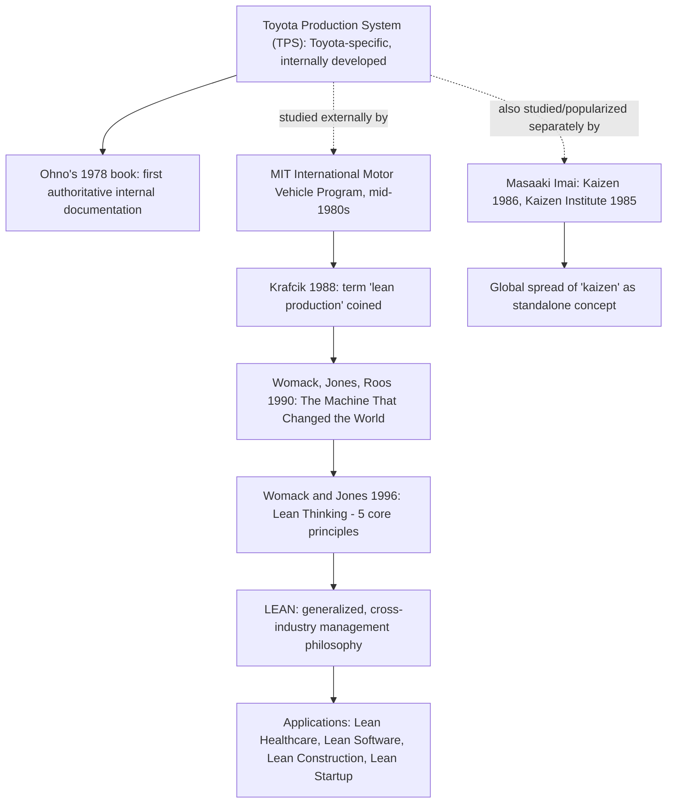

## Defining Lean Versus TPS in Terminology, Scope, and Origin

### Historical Context

Although "Lean" and "TPS" (Toyota Production System) are frequently used interchangeably in casual business conversation, they are historically and definitionally distinct terms with different origins, authors, and scopes, and this chapter has already covered the historical material needed to draw the distinction precisely. TPS is Toyota's own specific, internally developed production system, built from the late 1940s through the 1970s primarily under Taiichi Ohno's operational leadership with Eiji Toyoda's executive sponsorship, and first explicitly named and described in written form by Ohno himself in his 1978 book. "Lean" (originally "lean production") is a term coined externally by Western researchers — first by John Krafcik in his 1988 article, then substantially popularized by Womack, Jones, and Roos in their 1990 book *The Machine That Changed the World* — to describe a generalized, abstracted version of TPS-derived principles intended for broad application across industries and companies, not exclusively Toyota.

### Key Points

- **TPS is company-specific; Lean is a generalized abstraction**: TPS refers specifically to Toyota's own production system as practiced and refined within Toyota (and, by extension, at joint ventures and licensed applications directly connected to Toyota, such as NUMMI). Lean refers to a broader, industry-agnostic management philosophy derived from studying TPS (and other Japanese manufacturing practices) but formulated for general applicability well beyond Toyota or even the automotive industry.
- **Different authorship and origin**: TPS was developed internally at Toyota and first authoritatively described in writing by an internal figure (Ohno, 1978). Lean was named, defined, and popularized by external academic researchers (Krafcik, 1988; Womack, Jones, and Roos, 1990) studying Toyota and other manufacturers from outside the company.
- **Different primary purpose at time of origin**: TPS was developed as an operational solution to Toyota's specific postwar resource constraints and competitive circumstances (see the companion topic on postwar resource constraints). Lean was formulated specifically as a comparative analytical framework and generalizable teaching model, intended from its inception to be portable across companies and industries, including explicitly non-automotive contexts.
- **Scope of terminology**: TPS's vocabulary (kanban, jidoka, andon, heijunka, genchi genbutsu) remains closely tied to its original manufacturing/automotive context and Japanese-language terminology. Lean's vocabulary, as popularized by Womack and Jones (particularly in the 1996 follow-up *Lean Thinking*), favors more generalized English-language terminology (value stream, pull, flow, value) explicitly designed to translate more readily across languages, industries, and organizational contexts (healthcare, software, construction, startups, etc.).
- **Kaizen's position relative to both terms**: As discussed in the companion topic on Masaaki Imai, "kaizen" represents a partially separate transmission channel — a concept central to TPS but popularized in the West largely independently of the Lean/MIT IMVP lineage, through Imai's own consulting and publishing work, illustrating that the TPS-to-global-practice diffusion involved multiple, only partially overlapping channels (Ohno's book, the MIT IMVP/Womack-Jones lean lineage, and Imai's kaizen lineage) rather than a single linear path.
- **Overlapping but non-identical content**: Because Lean was derived substantially from studying TPS, the two frameworks share extensive conceptual overlap (pull systems, waste elimination, flow, standardized work), but Lean also incorporates generalizations, terminology choices, and emphases (e.g., the explicit "eliminate the eight wastes" framework commonly taught in Lean training, or the five core Lean principles from *Lean Thinking*) that represent the external researchers' own synthesis and organizational choices, not necessarily a direct, verbatim restatement of how Toyota itself has always organized or named its own internal concepts.

### Comparative Table: TPS Versus Lean

| Dimension | TPS (Toyota Production System) | Lean (Lean Manufacturing/Production) |
| --- | --- | --- |
| Origin | Developed internally at Toyota, late 1940s-1970s | Coined and defined externally, 1988-1990s |
| Key originating figures | Taiichi Ohno (operational design), Eiji Toyoda (executive sponsorship), Sakichi/Kiichiro Toyoda (conceptual roots) | John Krafcik (term origin, 1988); Womack, Jones, Roos (popularization, 1990); Womack and Jones (principles, 1996) |
| First major documentation | Ohno's 1978 book, "Toyota Production System: Beyond Large-Scale Production" | Krafcik's 1988 article; Womack/Jones/Roos 1990 book |
| Scope of applicability | Originally specific to Toyota's automotive manufacturing context | Explicitly generalized for cross-industry application from inception |
| Core vocabulary | Kanban, jidoka, andon, heijunka, genchi genbutsu (often retained in Japanese or transliterated form) | Value stream, pull, flow, waste, value (generalized English terminology) |
| Primary original purpose | Operational solution to Toyota's specific postwar constraints and competitive needs | Comparative analytical framework and generalizable management teaching model |
| Ownership/authorship of terminology | Toyota's own internal system and terms | Academic/consulting-coined term, not Toyota's own internal branding |

### Example: The Same Underlying Tool, Different Framing

The relationship between kanban (a TPS term) and "pull systems" (a Lean term) illustrates how the two frameworks relate at the level of specific tools:

- Within TPS terminology, "kanban" refers specifically to Toyota's particular card-based (or now often electronic) signaling mechanism, developed by Ohno and directly inspired by American supermarket restocking practices, as discussed under the JIT pillar topic.
- Within generalized Lean terminology, "pull system" (or "establish pull," one of the five core Lean principles from *Lean Thinking*) describes the broader underlying concept — production or replenishment triggered by actual downstream consumption rather than forecast-driven push — without necessarily specifying Toyota's particular card-based implementation mechanism.
- A software development team implementing a Kanban board (as discussed under the "From TPS to the Global Lean Manufacturing Movement" topic) is applying a Lean-generalized version of the pull concept, adapted to knowledge-work "inventory" (unfinished work items), which retains the *name* "kanban" (reflecting its direct historical lineage from Toyota's tool) while representing a Lean-era generalization and adaptation rather than a literal implementation of Toyota's original automotive-parts card system.
- This example shows that terminology lineage (the word "kanban" persisting into software contexts) does not always cleanly map onto a strict "TPS versus Lean" categorical boundary — some Lean-era adaptations retain original TPS vocabulary even while representing the generalized, cross-industry Lean transmission channel rather than a direct, unmodified continuation of Toyota's specific automotive practice.

### Diagram: Terminology and Scope Relationship (svg_diagram)

### Common Points of Confusion Clarified

- **"Lean Manufacturing" is not Toyota's own name for its system**: Toyota itself refers to its system as the Toyota Production System (or via the Toyota Way 2001 document's value framework); "Lean" is externally-coined terminology that Toyota did not originate and does not use as its own primary internal branding, even though Toyota is universally recognized as the system's originating source.
- **Not every "Lean" practice is a documented, verbatim TPS practice**: Because Lean represents an external synthesis and generalization, some specific tools or emphases found in general Lean training (e.g., certain specific "eight wastes" enumerations, or particular Lean Six Sigma statistical integrations) reflect the external Lean/consulting tradition's own development and elaboration over time, rather than being drawn item-for-item from a single, fixed, original Toyota document.
- **TPS predates the term "Lean" by decades**: The operational substance of TPS was substantially developed and mature well before the term "lean" existed at all (Krafcik's 1988 article postdates decades of TPS's internal development), meaning "Lean" should be understood as a later, external descriptive and generalizing label applied to an already-mature system, not as the original name or origin point of the underlying practices themselves.

### Distinguishing Fact from Interpretation

- The differing origins, authorship, and publication timelines of TPS (Ohno, 1978, building on decades of prior internal development) versus Lean (Krafcik 1988; Womack/Jones/Roos 1990) are well-documented, verifiable historical facts already established in earlier topics of this chapter.
- The characterization of Lean as a "generalized abstraction" of TPS, intended from inception for broader cross-industry application, is a widely supported and commonly stated characterization in management literature and is consistent with the stated purpose and methodology of the MIT IMVP research program.
- Specific claims about which individual tools or terms are "purely TPS" versus "Lean-era generalizations" can involve some interpretive judgment at the margins, since the two traditions have influenced each other substantially over subsequent decades of parallel use and cross-referencing in training and consulting literature; the broad categorical distinction (Toyota-internal-origin versus externally-coined-and-generalized) is well supported, but individual edge cases in terminology usage should be understood as existing on a spectrum of historical lineage rather than being cleanly and exhaustively classifiable into one category or the other in every instance.

### Conclusion

TPS and Lean, while closely related and frequently used interchangeably in casual usage, are historically distinct: TPS is Toyota's own internally developed, company-specific production system, first authoritatively documented by Taiichi Ohno in 1978 after decades of internal development dating to the late 1940s, while Lean is an externally coined and generalized descriptive term, originating with John Krafcik's 1988 article and substantially popularized through Womack, Jones, and Roos's 1990 book, intended from its inception as a cross-industry, broadly applicable management philosophy abstracted from studying TPS (and other manufacturing practices). Understanding this distinction — company-specific origin and terminology versus externally-coined generalized abstraction — clarifies why TPS vocabulary remains closely tied to its original Japanese-influenced, automotive-manufacturing context, while Lean vocabulary has been deliberately generalized to support its subsequent diffusion into healthcare, software development, construction, and many other industries far removed from Toyota's original context.

**Related Topics**

- Ohno's 1978 book as TPS's foundational internal documentation
- The Machine That Changed the World and the MIT IMVP's role in coining "Lean" (covered separately)
- Masaaki Imai's parallel, partially independent kaizen transmission channel
- The five core Lean principles from Lean Thinking (1996)
- The "eight wastes" framework as a Lean-era elaboration of TPS's original muda concept
- Diffusion of Lean terminology into non-manufacturing industries
- Comparing Toyota's own internal terminology (Toyota Way 2001, TBP) to externally-coined Lean vocabulary