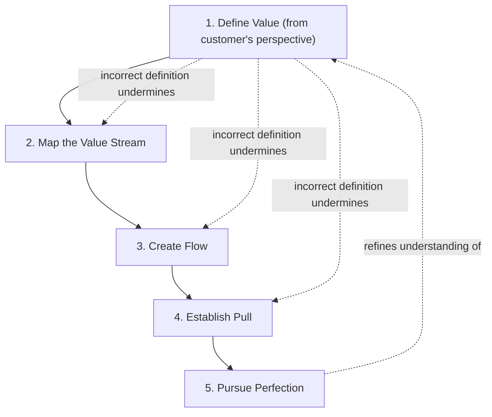

## Defining Value From the Customer's Perspective

### Historical Context

Defining value from the customer's perspective is formally identified as the first of the five core Lean principles articulated by James Womack and Daniel Jones in their 1996 book *Lean Thinking*, serving as the essential starting point for the entire Lean analytical process. Where TPS's original vocabulary (developed by Ohno and colleagues) centered on operational mechanisms like kanban and jidoka, the explicit, formalized instruction to begin any improvement effort by rigorously defining value strictly from the end customer's standpoint represents part of the generalized, externally-authored Lean abstraction discussed in the companion topic distinguishing Lean from TPS. This principle is foundational precisely because every subsequent Lean activity — mapping the value stream, creating flow, establishing pull, and pursuing perfection — depends on first having a clear, correct definition of what actually constitutes value, since without it, waste-elimination efforts risk optimizing processes that do not matter to the customer, or worse, eliminating activities the customer actually values.

### Key Points

- **Value is defined by the customer, not the producer**: A central and often counterintuitive discipline of this principle is that value must be defined by the ultimate customer of a specific product or service, not by the internal organization producing it — an organization's own assumptions about what customers want, or its own preferences for how it likes to work, do not constitute a valid definition of value under this principle.
- **Value versus activity**: The principle requires a strict distinction between "activity" (anything an organization does) and "value" (activity the customer is actually willing to pay for or genuinely benefits from) — many organizational activities, including some that consume significant time, resources, and internal pride, may not constitute value in this strict sense.
- **The corollary: anything that is not value is a candidate for waste**: Once value has been correctly and specifically defined, any activity that does not directly contribute to that value becomes a candidate for classification as one of the forms of waste (muda) discussed elsewhere in this chapter — meaning this principle functions as the necessary precondition for meaningful waste identification, not merely an abstract philosophical starting point.
- **Specificity is essential**: Lean Thinking emphasizes that value must be defined in terms of a specific product (or service) meeting a specific customer's needs at a specific price at a specific time — vague or generic value statements ("we provide quality products") are considered insufficiently precise to drive meaningful value stream analysis.
- **Common organizational failure mode — value defined by internal convenience**: A frequently cited critique in Lean literature is that many organizations implicitly define value based on what is convenient or profitable for internal departments, existing capabilities, or historical ways of working, rather than rigorously asking what the end customer genuinely needs and values — a failure mode this principle is explicitly designed to counteract.
- **Distinguishing the immediate customer from the end customer**: In multi-stage supply chains or internal process handoffs, this principle requires distinguishing between the next immediate recipient of a process's output (an "internal customer," such as the next workstation in an assembly sequence) and the ultimate end customer who purchases and uses the final product — value must ultimately trace back to genuine end-customer benefit, even when analyzing intermediate steps.

### The Value-Defining Process

| Step | Description | Common Failure Mode If Skipped |
| --- | --- | --- |
| Identify the actual product/service | Define precisely what specific product or service is being delivered to a specific customer | Analysis becomes too generic to yield actionable insight |
| Identify the actual customer | Determine who genuinely uses or benefits from the product/service (which may differ from who pays, or from internal process recipients) | Value gets defined around the wrong audience's needs |
| Articulate what the customer actually needs | Determine the specific attributes, timing, and price point the customer genuinely values, ideally through direct engagement or observation rather than assumption | Value gets defined based on internal assumption rather than genuine customer need |
| Distinguish value from mere activity | Separate what genuinely creates customer benefit from what is simply "how things have always been done" internally | Waste-elimination efforts target the wrong activities, or preserve genuinely non-value-adding work |

### Example: Value Redefinition in a Manufacturing Context

Consider a hypothetical manufacturer of an industrial component that has historically defined its "value proposition" internally as "producing a highly durable component using our proprietary advanced material," reflecting significant engineering pride and historical investment in that material's development.

- Under this principle, the organization would be required to directly investigate what its actual customers value, rather than assuming that the internally celebrated material choice is itself the source of customer value.
- Suppose direct customer engagement reveals that customers primarily value on-time delivery in small, frequent batches (to support their own downstream just-in-time assembly operations) and a specific tolerance specification, and are largely indifferent to the particular material composition as long as the tolerance and durability specifications are met.
- Under a strict application of this principle, the organization's internal narrative of value (the proprietary material) would need to be reassessed, and value redefined around what customers actually prioritize (delivery reliability, batch flexibility, and specification conformance) — potentially revealing that significant organizational effort and cost invested in further refining the proprietary material (beyond what is needed to meet the required specification) constitutes waste from the customer's perspective, however technically impressive that ongoing refinement might be from an internal engineering standpoint.
- [Inference] This scenario is a generic, illustrative example constructed to demonstrate the principle's core discipline (verifying assumed value against actual customer priorities); it is not a documented account of a specific, named historical company case, and real organizational value-definition exercises would need to be grounded in that organization's own direct customer research rather than assumed from this generic illustration alone.

### Diagram: Value Definition as the Foundation of the Five Lean Principles (svg_diagram)

### Relationship to Value Stream Mapping (Principle 2)

Correctly defining value is the essential prerequisite for the next Lean principle, mapping the value stream (a related but distinct topic covered separately in this chapter):

- Value stream mapping involves identifying every step required to deliver a product or service and classifying each step as value-adding, non-value-adding-but-necessary, or pure waste.
- This classification exercise is entirely dependent on having first established a correct, specific definition of value — without it, the classification of individual process steps as "value-adding" or "waste" has no reliable reference point and risks being arbitrary or reflecting internal bias rather than genuine customer benefit.
- This is why *Lean Thinking* explicitly places "define value" as the first principle, sequentially preceding value stream mapping, rather than treating the two as interchangeable or beginning improvement analysis with process mapping alone.

### Distinguishing Value from Related TPS/Lean Concepts

- **Versus "quality" in the House of TPS roof**: While the House of TPS model's roof includes "best quality" as a top-level goal, "quality" in that context typically refers to defect-free conformance to specification, whereas "value" in this Lean principle is a broader concept encompassing not just defect-free execution but whether the right product/service attributes are being delivered at all — a defect-free product that does not match what the customer actually needs still fails to constitute genuine value under this principle.
- **Versus "customer" in genchi genbutsu**: Genchi genbutsu (discussed under the Toyota Way's Continuous Improvement pillar) emphasizes direct observation "at the source" generally, which can include observing internal production conditions; this Lean principle specifically emphasizes observation and understanding oriented toward the *external end customer's* genuine needs, representing a related but distinctly customer-facing application of the broader "go and see" discipline.

### Distinguishing Fact from Interpretation

- The formal statement of "specify value" (or "define value") as the first of five core Lean principles, as articulated in Womack and Jones's 1996 *Lean Thinking*, is a directly verifiable fact about that specific, well-documented publication.
- The described corollary relationship between value definition and waste identification (that anything not contributing to correctly-defined value becomes a waste candidate) is a widely and consistently taught logical consequence in Lean literature, following directly from the stated principle's own internal logic.
- The illustrative manufacturing example provided is a constructed, generic pedagogical scenario intended to demonstrate the principle's application, not a documented historical case study; real-world applications of this principle require organization-specific customer research rather than reliance on generic illustrative examples.

### Conclusion

Defining value from the customer's perspective, as the first of Womack and Jones's five core Lean principles, establishes the essential analytical starting point for all subsequent Lean activity by requiring organizations to rigorously determine what a specific customer genuinely needs from a specific product or service, rather than relying on internal assumptions, historical habit, or producer convenience to define value. This discipline requires clearly distinguishing genuine customer-perceived value from mere organizational activity, however established or internally valued that activity might be, and provides the necessary reference point against which subsequent value stream mapping can meaningfully classify process steps as value-adding or wasteful. Without a correctly and specifically defined understanding of value, later Lean efforts to create flow, establish pull, and pursue perfection risk optimizing the wrong things entirely, making this principle the indispensable foundation upon which the rest of the Lean methodology depends.

**Related Topics**

- Mapping the value stream as the second core Lean principle (covered separately)
- The seven (or eight) wastes of muda as candidates once value is correctly defined
- Creating flow and establishing pull as subsequent Lean principles
- Distinguishing value-adding, non-value-adding-but-necessary, and pure-waste process steps
- Genchi genbutsu and its relationship to customer-focused value definition
- Common organizational failure modes in defining value based on internal convenience
- Voice of the Customer (VOC) techniques for gathering genuine customer input