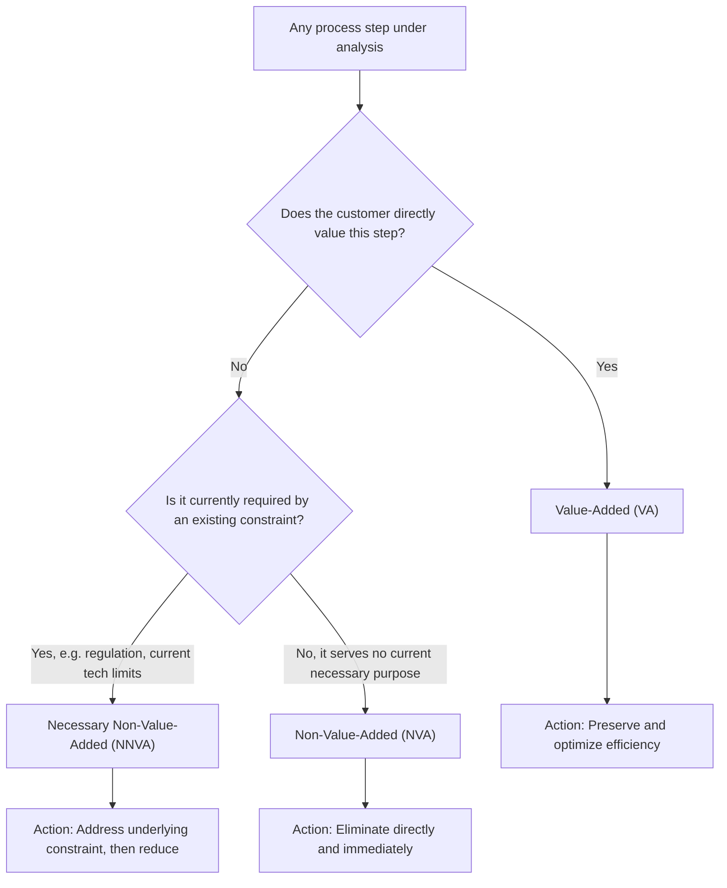

## Value Added, Non Value Added, and Necessary Non Value Added Work

### Historical Context

The three-category classification of process activity into Value-Added (VA), Non-Value-Added (NVA), and Necessary Non-Value-Added (NNVA) work is a foundational analytical framework used within value stream mapping, the second of Womack and Jones's five core Lean principles (discussed in the companion topic on defining value), and it directly operationalizes the customer-defined-value principle discussed in the preceding topic. Rather than treating "value versus waste" as a simple binary, Lean practice recognizes a practical middle category — activities that do not themselves add value from the customer's perspective but are nonetheless currently required given existing constraints (regulatory, technical, or organizational). This three-way classification traces conceptually to TPS's original muda (waste) analysis under Ohno, but its explicit three-category formalization (VA/NVA/NNVA) is most closely associated with the value stream mapping methodology as taught in Lean literature following Womack and Jones's popularization.

### Key Points

- **Value-Added (VA) work**: Any activity that directly transforms a product or service in a way the end customer recognizes as valuable and would be willing to pay for — the customer, if fully informed, would say "yes, that step needs to happen and I benefit from it."
- **Non-Value-Added (NVA) work**: Any activity that consumes time, resources, or space without contributing anything the customer values — this is waste in the fullest sense, and the target for elimination. NVA work is what TPS's muda concept most directly addresses.
- **Necessary Non-Value-Added (NNVA) work**: Activity that does not itself add customer-recognized value but is currently required due to existing constraints — such as regulatory compliance steps, required quality inspections under current process capability, or unavoidable setup/changeover time given current equipment — meaning it cannot be eliminated immediately without first changing the underlying constraint that necessitates it.
- **The critical distinction between NVA and NNVA drives different action**: Because NVA work should be targeted for direct, immediate elimination, while NNVA work requires first addressing the underlying constraint (e.g., changing a regulation is not within an organization's control; redesigning a process to reduce required inspection might be, but requires a separate improvement project) before it can be reduced or removed, correctly distinguishing between the two categories directly determines the appropriate improvement strategy.
- **Typical proportions in unimproved processes**: A commonly cited pattern in Lean training (based on various value stream mapping studies across industries) is that in many unimproved processes, the proportion of time or activity classified as genuinely value-added is often surprisingly small relative to the total process lead time, with the majority falling into NVA or NNVA categories — though [Inference] specific percentage figures cited in various training materials (sometimes quoted as being in single-digit percentages for value-added time in some processes) vary substantially by industry, process type, and specific study, and should be treated as illustrative of a general, widely observed pattern rather than as a fixed, universal statistic applicable to any specific process without direct measurement.
- **Basis for value stream mapping's core diagnostic function**: This three-category classification is the analytical engine underlying value stream mapping — each step in a mapped process is assigned to one of these three categories, providing a structured, visual basis for prioritizing improvement efforts (targeting NVA elimination first, then addressing constraints enabling NNVA reduction).

### The Three Categories in Detail

| Category | Definition | Customer's View | Improvement Strategy |
| --- | --- | --- | --- |
| Value-Added (VA) | Directly transforms the product/service in a way the customer values and would pay for | "Yes, I want this step to happen" | Preserve and optimize (make it as efficient as possible without removing it) |
| Non-Value-Added (NVA) | Consumes resources without producing customer-recognized benefit; pure waste | "I don't want or need this step" | Eliminate directly and immediately wherever possible |
| Necessary Non-Value-Added (NNVA) | Does not itself add value, but is currently required due to an existing constraint | "I don't value this step itself, but I understand why it currently happens" | Address the underlying constraint first, then reduce or eliminate the resulting NNVA activity |

### Example: Classifying Steps in an Order-Fulfillment Process

Consider a simplified order-fulfillment process for a manufactured product, with each step classified using this framework:

1. **Machining a component to customer specification**: **Value-Added** — this step directly transforms raw material into the specific form the customer needs and is willing to pay for.
2. **Component sitting in a queue awaiting the next process step**: **Non-Value-Added** — the customer receives no benefit from the component sitting idle; this represents pure waiting waste and is a direct candidate for elimination through improved flow.
3. **A mandated safety inspection required by industry regulation before shipment**: **Necessary Non-Value-Added** — the customer does not directly value the inspection activity itself (they value the safe, compliant product it helps ensure, but not the inspection step as an activity in itself), yet the step cannot simply be eliminated without first addressing the regulatory requirement that necessitates it (for instance, by working with the regulator, or by building sufficiently robust process capability that non-destructive inspection sampling rather than full inspection becomes acceptable under the regulation).
4. **Machine changeover time when switching from producing one product variant to another**: **Necessary Non-Value-Added** (in most current-state analyses) — the customer does not value the changeover time itself, but until the changeover process itself is improved (e.g., through SMED-based quick-changeover techniques), some changeover time is currently unavoidable given the equipment's present capability; this exemplifies how NNVA classification points directly to a specific, addressable target for future improvement projects (in this case, changeover time reduction) rather than to a step that must simply be tolerated indefinitely.
5. **Repackaging a product because an initial packaging error caused a customer complaint (rework)**: **Non-Value-Added** — this activity exists solely to correct a defect and provides no benefit the customer would have wanted in the first place (the customer wanted a correctly packaged product delivered the first time); this exemplifies the type of activity that appears productive (workers are busy) but constitutes pure waste from a value-added-analysis standpoint.

### Diagram: The Three-Category Classification and Corresponding Action (svg_diagram)

### Distinguishing NNVA from a License to Tolerate Waste Indefinitely

A common misunderstanding this framework must guard against is treating the "Necessary" in Necessary Non-Value-Added as a permanent excuse to avoid further improvement:

- The NNVA classification is explicitly understood in Lean literature as a *current-state* condition, not a permanent one — the underlying constraint (a regulation, a technical limitation, an equipment capability) is itself typically a legitimate future improvement target, even if it cannot be addressed by the immediate process-level improvement effort currently underway.
- This is directly connected to the Continuous Improvement pillar's "never satisfied" orientation (discussed earlier in this outline): today's NNVA activity, once its underlying constraint is successfully addressed through a separate improvement initiative, may become tomorrow's eliminated waste — reflecting the perpetual, iterative nature of Lean/kaizen improvement rather than a one-time classification exercise.
- [Inference] Distinguishing which constraints are genuinely fixed in the near term (e.g., a hard regulatory requirement outside the organization's control) from which are addressable organizational or technical limitations (e.g., current changeover procedure design) requires informed judgment specific to each situation; the framework itself provides the classification structure but does not automatically determine, in the abstract, which specific NNVA activities are realistically improvable in a given organization's near-term planning horizon.

### Relationship to Other Chapter Topics

- **Versus muda, mura, muri**: The VA/NVA/NNVA framework provides a structured classification lens specifically for evaluating individual process steps once value has been defined, while muda, mura, and muri (discussed in a related topic in this chapter) describe broader categories and types of waste and inconsistency across a system; NVA activity is often further sub-classified according to the specific type(s) of muda it represents (e.g., waiting, overproduction, defects) once identified through this VA/NVA/NNVA analysis.
- **Versus value stream mapping**: This three-category framework is the specific analytical tool applied at each individual process step during value stream mapping (Lean Principle 2), translating the general instruction to "map the value stream" into a concrete, repeatable classification method.

### Distinguishing Fact from Interpretation

- The three-category VA/NVA/NNVA classification framework is well-documented and widely and consistently taught across Lean/value-stream-mapping training literature.
- The specific illustrative order-fulfillment example provided (machining, queuing, regulatory inspection, changeover, rework) is a constructed generic scenario intended to demonstrate correct application of the framework, not a documented account of a specific named company's actual process.
- Claims about typical proportions of VA versus NVA/NNVA time observed across processes in general reflect a widely cited pattern in Lean training materials, but specific percentage figures vary considerably across different cited sources and studies and should not be treated as a single fixed, universally applicable statistic without reference to a specific study's stated scope and methodology.

### Conclusion

The classification of process activity into Value-Added, Non-Value-Added, and Necessary Non-Value-Added categories provides the essential analytical bridge between the abstract Lean principle of defining customer value and the practical work of value stream mapping and waste elimination. Value-Added work directly creates customer-recognized benefit and should be preserved and optimized; Non-Value-Added work provides no customer benefit and should be targeted for direct, immediate elimination; and Necessary Non-Value-Added work, while not itself customer-valued, is currently required by an existing constraint and should be addressed by first tackling that underlying constraint through a dedicated improvement effort, rather than being either eliminated prematurely (before the constraint is resolved) or tolerated indefinitely as an unchangeable feature of the process. This three-way distinction ensures that Lean improvement efforts are correctly targeted — eliminating true waste immediately while pursuing a realistic, constraint-focused path toward reducing necessary but non-value-adding activity over time.

**Related Topics**

- Value stream mapping methodology and symbol conventions
- Muda, mura, and muri as the broader categories of waste and inconsistency
- The seven (or eight) specific types of muda waste
- SMED (Single-Minute Exchange of Dies) as an improvement method for reducing NNVA changeover time
- Current-state versus future-state value stream maps
- Standardized work's role in stabilizing processes before further NVA/NNVA reduction
- Regulatory and compliance-driven NNVA activities and strategies for their long-term reduction