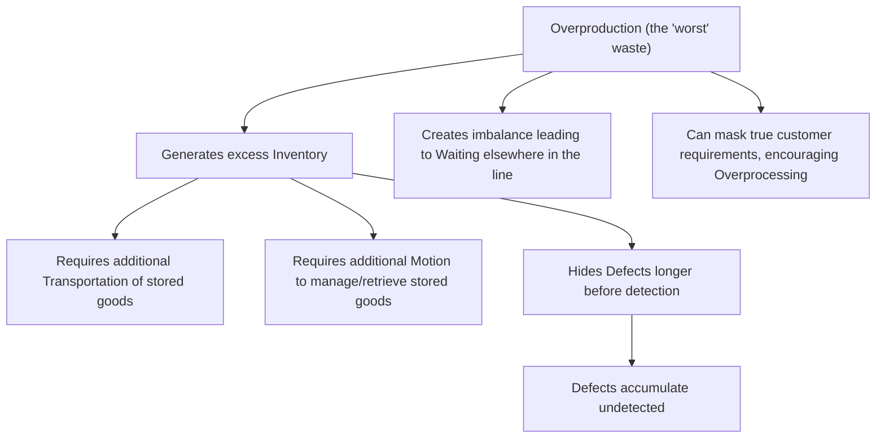

## Muda and the Seven Classical Wastes

### Historical Context

Muda (無駄), the Japanese term for waste, is one of TPS's most fundamental conceptual building blocks, closely associated with Taiichi Ohno, who is credited with identifying and formally enumerating seven specific categories of waste commonly found in manufacturing processes based on his direct observation of Toyota's operations from the late 1940s onward. Ohno's seven wastes framework represents a translation of the broader postwar scarcity-driven aversion to waste (discussed under the postwar resource constraints topic) into a specific, actionable diagnostic taxonomy that shop-floor personnel could use to identify concrete improvement opportunities. This framework predates and substantially informs the later, more generalized Lean vocabulary (including the VA/NVA/NNVA classification and value stream mapping discussed in preceding topics), and remains one of the most widely taught and referenced elements of TPS/Lean training worldwide.

### Key Points

- **Muda is one of three related Japanese waste/inconsistency concepts**: Muda (waste) is commonly discussed alongside mura (unevenness/inconsistency) and muri (overburden/unreasonableness) as the "three Ms," though muda — the direct waste of resources, time, or effort without producing customer value — is the most extensively enumerated and operationally detailed of the three (mura and muri are addressed in more detail in a related topic).
- **Ohno's seven classical wastes**: Overproduction, Waiting, Transportation, Overprocessing (or Inappropriate Processing), Inventory (excess), Motion (unnecessary), and Defects — commonly remembered using the mnemonic "TIMWOOD" (Transportation, Inventory, Motion, Waiting, Overproduction, Overprocessing, Defects) or similar acronym variants.
- **Overproduction as the "worst" waste**: Ohno specifically identified overproduction (producing more, sooner, or faster than immediate downstream demand requires) as the most serious of the seven wastes, because it directly causes or masks several of the other wastes — overproduction generates excess inventory, which requires additional transportation and storage motion, which can hide defects for longer before detection, and generally obscures the true state of a process from view.
- **Direct connection to TPS's operational pillars**: Each of the seven wastes maps onto specific TPS countermeasures discussed elsewhere in this outline — overproduction is directly countered by JIT/pull systems and kanban; defects are directly countered by jidoka and andon; waiting and transportation are addressed through improved flow and facility layout; overprocessing is addressed through standardized work and value analysis (closely related to the VA/NVA/NNVA framework).
- **An eighth waste later added by some practitioners**: Many contemporary Lean training programs and authors have added an eighth waste — commonly "Unused/Underutilized Employee Talent, Skills, or Creativity" (sometimes abbreviated to fit the mnemonic "DOWNTIME": Defects, Overproduction, Waiting, Non-utilized talent, Transportation, Inventory, Motion, Extra processing). [Unverified] This eighth waste is widely taught in contemporary Lean training and is broadly consistent with the Toyota Way's Respect for People pillar, but it is not part of Ohno's original seven-waste enumeration as historically documented, and its specific addition is generally attributed to later Lean practitioners and consultants rather than to Ohno himself; sources vary in exactly when and by whom this addition became standard.

### The Seven Classical Wastes in Detail

| Waste | Description | Manufacturing Example | Primary TPS Countermeasure |
| --- | --- | --- | --- |
| Overproduction | Producing more, earlier, or faster than immediate downstream demand requires | Running a full batch of parts when only a partial batch is currently needed | Just-in-Time, kanban, pull systems |
| Waiting | Idle time when people, machines, or materials are not being actively processed | A worker standing idle waiting for the previous station to finish | Continuous flow, line balancing |
| Transportation | Unnecessary movement of materials, parts, or products between processes | Moving components across a large facility between poorly located workstations | Improved facility layout, cellular manufacturing |
| Overprocessing (Inappropriate Processing) | Performing more work, or using more precision/resources, than the customer actually requires | Polishing a surface to a finish quality finer than the specification requires | Value analysis, standardized work, understanding true customer requirements |
| Inventory (excess) | Holding more raw material, work-in-process, or finished goods than immediately needed | Large buffer stocks between production stages | JIT, pull systems, kanban |
| Motion (unnecessary) | Unnecessary physical movement by workers (as distinct from transportation of materials) | A worker repeatedly bending or walking to reach a poorly positioned tool | Workplace/ergonomic redesign, 5S organization |
| Defects | Production of items that do not meet specification, requiring rework, scrap, or replacement | A part that fails a quality check and must be reworked or discarded | Jidoka, andon, poka-yoke |

### Diagram: The Seven Wastes and Overproduction's Amplifying Effect (svg_diagram)

### Example: Tracing Overproduction's Cascading Effects

To illustrate why Ohno considered overproduction the most serious of the seven wastes, consider a single decision to run an extra, unrequested batch of a component "while the machine is already set up":

1. **Overproduction occurs**: A stamping machine produces 500 extra units beyond the current kanban-authorized quantity, on the reasoning that the machine is already configured and running.
2. **Inventory waste follows directly**: These 500 extra units must now be stored somewhere, consuming floor space and tying up capital that could otherwise remain liquid or be used elsewhere — directly generating the Inventory waste.
3. **Transportation and Motion waste follow**: The extra units must be physically moved to a storage location and, later, retrieved when eventually needed, generating additional Transportation waste (moving the parts) and Motion waste (workers walking to and from storage, searching for and retrieving specific units).
4. **Defects may go undetected longer**: If a die wear issue caused a subtle dimensional defect partway through this extra production run, the defect might not be discovered until these units are eventually used, by which point identifying the root cause is more difficult (the die may have been changed for other jobs in the meantime), and a larger batch of defective parts has been produced than would have occurred under strict kanban-limited production.
5. **Cost accumulates across every downstream category**: The original "efficient" decision to keep the machine running actually generates several additional forms of waste, illustrating why overproduction is described as the root or amplifying waste — from a total-system perspective rather than a single-machine-utilization perspective, the seemingly efficient choice imposes net additional cost and risk.

This example demonstrates the systemic reasoning behind treating overproduction as categorically distinct from and more serious than the other six wastes: it is not merely one waste among seven equally-weighted categories, but a waste that tends to generate or worsen several of the others.

### Example: Distinguishing Necessary Motion from Wasteful Motion

A useful clarifying distinction within the Motion waste category involves separating motion that is part of genuine value-added work from motion that is purely incidental to a poorly designed workspace:

- A welder's hand movements while actually performing a weld are part of the value-added activity itself (assuming the weld is needed and correctly specified) and are not, in themselves, waste.
- However, if that same welder must walk 15 meters to retrieve a specific welding rod from a distant storage cabinet for every single weld performed, that walking motion contributes nothing to the value-added transformation of the product and represents pure Motion waste, addressable through better workplace organization (commonly through 5S methodology) — placing the welding rods within immediate reach of the workstation.

### Distinguishing Fact from Interpretation

- The identification of seven classical wastes (overproduction, waiting, transportation, overprocessing, inventory, motion, defects) and their association with Taiichi Ohno's observations at Toyota is well documented and consistently presented across TPS/Lean literature.
- The characterization of overproduction as the most serious or "worst" of the seven wastes, due to its tendency to generate or mask the other six, reflects a widely and consistently cited interpretation directly attributable to statements associated with Ohno in TPS literature.
- The addition of an eighth waste (unused talent/skills) is widely taught in contemporary Lean training and is broadly consistent with Toyota Way principles regarding Respect for People, but its specific attribution, exact wording, and precise historical addition date are less consistently documented across sources than Ohno's original seven, and it should be understood as a widely adopted later extension by the broader Lean practitioner community rather than as part of Ohno's original historical enumeration.
- The illustrative examples (the cascading overproduction scenario, the welder motion example) are constructed generic pedagogical illustrations, not documented accounts of specific named historical incidents.

### Conclusion

Muda, Taiichi Ohno's foundational TPS concept of waste, is most concretely operationalized through his enumeration of seven classical wastes — overproduction, waiting, transportation, overprocessing, excess inventory, unnecessary motion, and defects — each representing a distinct category of resource consumption that produces no genuine customer value. Among these, overproduction holds special significance as the waste Ohno considered most serious, since it directly generates or conceals several of the other six wastes, making its elimination through Just-in-Time and pull-based production a particularly high-leverage improvement target. While contemporary Lean training frequently extends this framework with an eighth waste addressing underutilized employee talent, Ohno's original seven-category taxonomy remains the foundational, most widely referenced diagnostic tool for identifying specific, actionable waste-elimination opportunities across manufacturing and, by later extension, non-manufacturing processes as well.

**Related Topics**

- Mura (unevenness) and muri (overburden) as the other two of the "three Ms"
- The eighth waste (unused talent) and its connection to the Respect for People pillar
- 5S methodology as a tool for addressing Motion and workplace organization waste
- Overproduction's specific countermeasures: kanban, takt time, and pull systems
- Poka-yoke and jidoka as countermeasures to the Defects waste category
- Value stream mapping's use of the VA/NVA/NNVA framework to identify these wastes systematically
- Applying the seven wastes framework to non-manufacturing/service processes