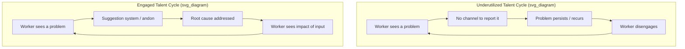

## The Eighth Waste: Underutilized Human Talent and Creativity

### Definition and Origin

The eighth waste — often abbreviated **Skills** in the muda acronym **TIMWOODS** (Transport, Inventory, Motion, Waiting, Overproduction, Over-processing, Defects, Skills) — refers to the failure to use employees' mental, creative, and skill-based potential. Unlike the original seven wastes (muda) codified by Taiichi Ohno within the Toyota Production System, this eighth category was added later by Western practitioners adapting TPS thinking, most notably articulated in Liker's *The Toyota Way* (2004) framework of "unused employee creativity."

[Inference] Ohno's original seven wastes focused on observable, physical process waste on the shop floor. The eighth waste is qualitatively different — it is organizational and managerial rather than mechanical, which is why it is sometimes contested as a "true" TPS category versus a later addition reflecting Western management consulting's emphasis on human capital.

### Why It's Classified as Waste

In Lean terms, waste (muda) is any activity that consumes resources without creating value for the customer. Underutilized talent fits this definition indirectly:

- **Opportunity cost**: Frontline workers observe process friction directly (defects, awkward motions, wait states) but if their insight is never solicited, the organization pays twice — once for the original waste, and again for not correcting it efficiently.
- **Misallocation**: Hiring or developing a skilled worker and then assigning them purely repetitive, non-cognitive tasks wastes the investment made in that person's training.
- **Compounding effect**: This waste often amplifies the other seven. A worker who spots a defect-causing step but has no channel to report it allows that defect waste to persist indefinitely.

### Manifestations in Practice

| Symptom | Description |
| --- | --- |
| Top-down only improvement | Kaizen initiatives designed exclusively by management/engineering, with no worker input mechanism |
| No suggestion system | Absence of formal channels (e.g., *teian* systems) for frontline ideas |
| Rigid job scoping | Workers explicitly discouraged from suggesting changes outside their narrow task |
| Poor cross-training | Skilled workers permanently assigned to below-skill tasks |
| Punitive error culture | Fear-based environments where raising problems (via *andon*) is discouraged rather than rewarded |
| High turnover in skilled roles | Talented staff leave because their input isn't valued, and institutional knowledge is lost |

### Relationship to Toyota's Actual Practices

Toyota's real-world countermeasures against this waste predate the "eighth waste" label itself:

- **Andon cord**: Any line worker can stop production upon detecting an abnormality — an explicit structural acknowledgment that frontline knowledge has authority.
- **Kaizen teian (suggestion systems)**: Structured programs where operators submit and often personally test small process improvements.
- **Job rotation (*multi-skilling*)**: Workers are cross-trained across stations, both to reduce monotony-driven disengagement and to build a broader diagnostic view of the line.
- **Quality Circles**: Small, worker-led groups meeting regularly to analyze and solve local problems.

[Inference] These practices existed at Toyota well before "eighth waste" terminology became common in Lean literature; the label functions more as a retroactive teaching device for organizations adopting Lean outside the original Toyota context, where such worker-empowerment mechanisms are not assumed to already exist.

### Root Causes

- Command-and-control management structures inherited from Taylorist scientific management, which explicitly separated "thinking" (management) from "doing" (labor)
- Absence of psychological safety — workers who fear blame for surfacing problems will not surface them
- Poor visual management, so problems aren't visible enough to prompt worker-initiated action
- Short-term metrics (e.g., pure output/hour) that penalize any pause for suggestion or improvement

### Countermeasures

**Key Points**

- Build explicit suggestion/kaizen submission channels with visible follow-through (ideas that are seen to be acted on encourage more submissions)
- Train workers in basic problem-solving tools (5 Whys, fishbone diagrams, PDCA) so their input is structured and actionable
- Rotate roles to build T-shaped skill profiles and reduce monotony
- Decentralize stop-the-line authority (andon-style) to the point of work
- Recognize and reward improvement contributions, not just output volume

### Example

A packaging line operator repeatedly notices that a specific carton size jams the sealing machine roughly once per shift, costing several minutes of downtime each time. In an organization exhibiting the eighth waste, this operator has no formal channel to report the pattern; the recurring defect (and its associated waiting/motion waste) persists indefinitely, "solved" only by the operator's own informal workaround, which is never captured or shared. In a Lean organization, the same operator submits the observation through a kaizen teian form, a small cross-functional team investigates within days, and the root cause (a misaligned guide rail) is corrected — eliminating the recurring downtime and demonstrating to the workforce that operational insight is valued.

### Diagram: Vicious vs. Virtuous Cycle (svg_diagram)

### Measuring This Waste

Unlike inventory or defect counts, the eighth waste resists direct quantification. Common proxy metrics include:

- Suggestion submission rate per employee per period
- Suggestion implementation rate (submitted vs. acted upon)
- Employee engagement survey scores
- Cross-training coverage (% of workers qualified on multiple stations)
- Turnover rate among skilled/tenured staff

[Speculation] Some organizations attempt to tie this waste to financial estimates (e.g., "cost of unrealized improvement ideas"), but such figures are inherently speculative since they depend on counterfactual reasoning about ideas that were never surfaced.

**Next Steps**

- Study *kaizen teian* system design and implementation
- Study andon systems and stop-the-line authority
- Study psychological safety frameworks (e.g., Edmondson's work) as they relate to Lean culture
- Compare Taylorism vs. Toyota Production System philosophies on labor and cognition
- Study Quality Circles as an organizational mechanism
- Explore T-shaped skills and multi-skilling / job rotation design