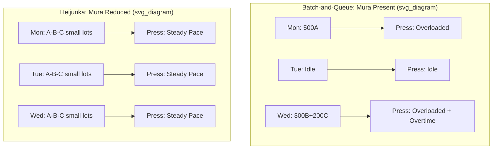

## Mura as Unevenness in Process and Demand

### Definition

**Mura** (斑/ムラ) is one of the "Three M's" of the Toyota Production System — alongside *muda* (waste) and *muri* (overburden) — and refers to unevenness, inconsistency, or irregularity in a process, workflow, or demand pattern. Where muda describes waste that is directly visible in an activity, mura describes the *variability* that generates that waste as a downstream effect. Mura is generally treated as the most fundamental of the three M's, since unevenness is frequently the root cause of both overburden (muri) and waste (muda).

### The Three M's Relationship

$$\text{Mura (unevenness)} \rightarrow \text{Muri (overburden)} \rightarrow \text{Muda (waste)}$$

- **Mura** creates irregular demand on a process or resource
- This irregularity forces the process into **muri**, i.e., periods of overburden (rushing, overstaffing, equipment strain) to absorb peaks
- Overburden produces **muda** — defects from rushing, idle time during troughs, excess inventory built up in anticipation of spikes

[Inference] This causal chain is a standard teaching framework in Lean literature, though in practice the three M's are often mutually reinforcing rather than strictly linear — muda (e.g., machine breakdowns) can itself generate mura (irregular output) which then causes muri elsewhere in the line.

### Two Broad Categories

**1. Process-level mura (internal)**

Variability introduced by the production system itself, independent of customer demand:

- Uneven cycle times between workstations
- Inconsistent work methods between operators performing the "same" task
- Batch-and-queue production creating stop-start flow
- Irregular material replenishment intervals
- Scheduling that clusters similar jobs together rather than sequencing them evenly

**2. Demand-level mura (external)**

Variability originating from the customer or upstream/downstream partners:

- Order volume fluctuations (seasonal, promotional, or erratic ordering behavior)
- The **bullwhip effect** — small fluctuations in end-customer demand amplify into large swings further up the supply chain due to batching, forecasting error, and lead-time buffering at each stage
- Uneven release of work orders from planning/scheduling systems into production

### The Bullwhip Effect as a Mura Illustration

The bullwhip effect is one of the clearest demonstrations of demand-side mura and is commonly modeled in supply chain literature. A small variance in retail-level demand, say a standard deviation of $\sigma_{retail}$, propagates upstream through distributor and manufacturer tiers, with each tier's order variance amplified relative to the tier before it:

$$\sigma_{manufacturer}^2 > \sigma_{distributor}^2 > \sigma_{retail}^2$$

[Unverified] The exact amplification ratio varies significantly by industry, forecasting method, and order batching policy, and is typically estimated empirically rather than derived from a single universal formula.

### Countermeasure: Heijunka (Production Leveling)

The primary TPS countermeasure to mura is **heijunka** — leveling both the *volume* and *mix* of production over a fixed time window, so that internal processes see a smooth, predictable demand signal regardless of actual customer order variability.

**Key Points**

- Heijunka absorbs demand mura at the point where finished-goods orders enter the plant, converting an erratic external order stream into an even internal production sequence
- Commonly implemented physically via a **heijunka box** (a pigeonhole scheduling board where kanban cards are placed in time-boxed slots to sequence mixed production)
- Enables smaller lot sizes and mixed-model production instead of large batches of a single product, which in turn reduces inventory buffers needed to cover demand swings

### Example

A stamping press produces three part variants: A, B, and C. Actual customer orders arrive irregularly — e.g., 500 units of A on Monday, none on Tuesday, 300 of B and 200 of C on Wednesday. Producing in large, order-matching batches (batch-and-queue) creates mura: the press is idle Tuesday, then overloaded Wednesday, forcing overtime (muri), which increases the defect rate from operator fatigue (muda).

Applying heijunka, the same weekly total order volume is leveled into a fixed repeating sequence — for instance, a pattern of A-B-C-A-B-C run in small lots every day, sized to match the *average* daily demand for each variant. The press now runs at a constant, sustainable pace daily; finished goods inventory absorbs the minor difference between the leveled schedule and the day's actual shipments, rather than the production line absorbing it through overtime or idle time.

### Diagram: Batch vs. Leveled Production (svg_diagram)

### Additional Countermeasures

- **Standardized work**: Reduces process-level mura by ensuring consistent cycle times across operators performing the same task
- **Takt time synchronization**: Pacing the line to customer demand rate reduces the tendency to overproduce in bursts
- **Small lot sizes / SMED (single-minute exchange of die)**: Reducing changeover time makes frequent, small, mixed production runs economically viable, which is a prerequisite for heijunka
- **Kanban pull systems**: Replenish only what's consumed, damping the amplification that a push/forecast-driven system tends to introduce
- **Demand smoothing agreements**: Longer-term supplier/customer collaboration (e.g., vendor-managed inventory, information sharing) to reduce bullwhip amplification across company boundaries

### Distinguishing Mura from Muda and Muri

| Concept | Japanese | English | Focus |
| --- | --- | --- | --- |
| Muda | 無駄 | Waste | Non-value-adding activity |
| Mura | 斑/ムラ | Unevenness | Variability in process/demand |
| Muri | 無理 | Overburden | Excessive strain on people/equipment |

[Inference] Because mura is often the root cause in this triad, Lean practitioners commonly argue that addressing mura first (via leveling) is more systemically effective than attacking muda symptoms directly, though this sequencing is a strategic heuristic rather than a strict rule applicable in every context.

**Related Topics**

- Heijunka box design and kanban card sequencing
- Takt time calculation and line balancing
- SMED / quick changeover methodology
- The bullwhip effect and supply chain amplification modeling
- Muri (overburden) as the second of the Three M's
- Mixed-model production sequencing algorithms