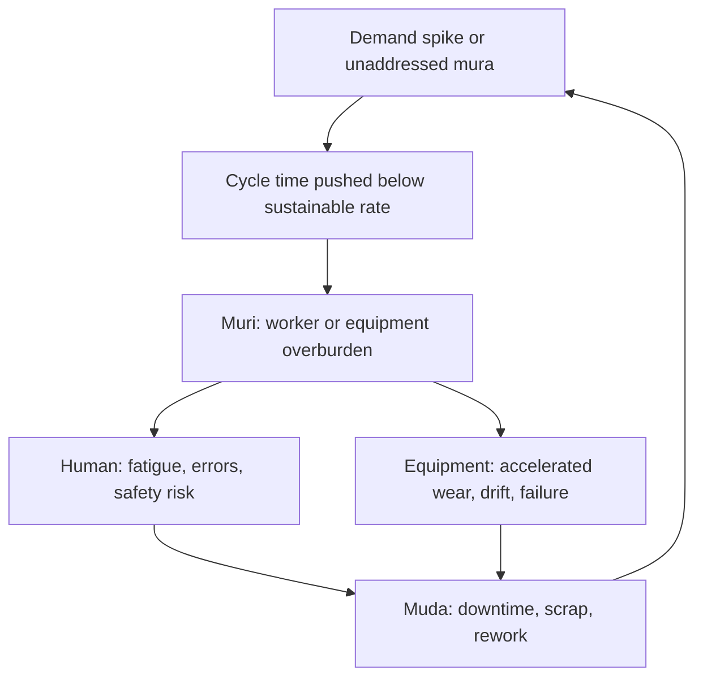

## Muri as Overburden on People and Equipment

### Definition

**Muri** (無理) is the second of the "Three M's" in the Toyota Production System — alongside *mura* (unevenness) and *muda* (waste) — and refers to overburden: pushing people, equipment, or processes beyond their natural or sustainable capacity. The term literally translates to "unreasonableness" or "impossibility," carrying the connotation of demanding something that shouldn't reasonably be asked. Muri is typically positioned as the consequence of unaddressed mura and the direct precursor to muda.

$$\text{Mura (unevenness)} \rightarrow \text{Muri (overburden)} \rightarrow \text{Muda (waste)}$$

[Inference] This linear causal framing is the standard pedagogical model in Lean literature. In practice, muri can also arise independently of mura — for example, from poor initial process design, understaffing decisions, or equipment specified below the required duty cycle — so the three M's are better understood as mutually reinforcing categories rather than a strict one-directional chain.

### Two Domains of Muri

**1. Human overburden**

- Unsustainable work pace, overtime, or physically/cognitively excessive task demands
- Understaffing relative to workload, forcing individuals to cover multiple roles simultaneously
- Ergonomically poor task design (awkward reaches, repetitive strain, excessive lifting)
- Unclear or conflicting instructions that force workers to compensate through extra mental effort
- Skill-task mismatch, assigning undertrained workers to complex tasks under time pressure

**2. Equipment/process overburden**

- Running machinery above rated capacity or duty cycle
- Deferred or skipped preventive maintenance to keep equipment running continuously
- Process parameters (speed, pressure, temperature) pushed beyond design tolerances to hit output targets
- Batch sizes or throughput targets that exceed a process's designed stable operating range

### Why Muri Is Treated as the Root-Cause Category

Where muda is a *symptom* (waste that has already occurred) and mura is a *pattern* (variability), muri is the *mechanism* by which variability translates into damage. Sustained muri produces:

- **On people**: fatigue-driven errors, increased defect rates, safety incidents, burnout, absenteeism, turnover
- **On equipment**: accelerated wear, unplanned downtime, catastrophic failure, reduced service life, quality drift as machines run outside calibrated tolerances

[Inference] Because both failure modes (human and mechanical) ultimately manifest as defects, downtime, or turnover — all muda categories — muri is often described in Lean training as the "hidden" driver of otherwise unexplained waste spikes, though attributing a specific waste event to muri versus another root cause typically requires direct investigation (e.g., 5 Whys) rather than assumption.

### Relationship to Takt Time

Muri frequently appears when a line is paced faster than its **takt time** — the rate at which product must be completed to match customer demand:

$$\text{Takt Time} = \frac{\text{Available Production Time}}{\text{Customer Demand}}$$

If cycle time is forced below what a station can sustainably achieve (to "catch up" or absorb variability elsewhere in the line), the station operates in a state of muri. Conversely, correctly calculated takt time paired with standardized work is one of the primary preventive mechanisms against muri, since it sets an explicit, sustainable pace rather than an implicit maximum-effort pace.

### Countermeasures

**Key Points**

- **Standardized work**: Defines a sustainable, repeatable pace and sequence, preventing ad hoc overexertion
- **Heijunka (production leveling)**: Addresses mura directly, which removes the demand spikes that would otherwise force muri
- **Total Productive Maintenance (TPM)**: Keeps equipment operating within designed tolerances via scheduled preventive maintenance, preventing the "run to failure" pattern that constitutes equipment muri
- **Ergonomic and job design review**: Regular assessment of physical/cognitive task demands against sustainable limits
- **Adequate staffing and cross-training buffers**: Prevents chronic reliance on overtime or role-stacking to meet output targets
- **Andon systems**: Allow workers to flag overburden conditions in real time rather than silently absorbing them

### Example

A CNC machining cell is rated for a sustainable cycle time of 90 seconds per part, including built-in time for tool wear inspection. Facing a demand spike, the plant reduces the cycle time target to 60 seconds by skipping the inspection step and running the spindle at a higher-than-rated speed. In the short term, throughput rises. Over the following weeks, tool wear accelerates unpredictably (equipment muri), producing an increase in dimensional defects (muda) and eventually an unplanned spindle failure that halts the line for repair — a downtime cost far exceeding the short-term throughput gain.

The Lean countermeasure is not to simply revert to 90 seconds, but to address the root demand spike through heijunka (leveling the order sequence across available capacity, potentially routing overflow to a second cell) rather than forcing a single resource beyond its sustainable operating parameters.

### Diagram: Muri Feedback Loop (svg_diagram)

### Distinguishing the Three M's

| Concept | Japanese | English | Primary Question |
| --- | --- | --- | --- |
| Muda | 無駄 | Waste | "Is this activity adding value?" |
| Mura | 斑/ムラ | Unevenness | "Is this workload consistent over time?" |
| Muri | 無理 | Overburden | "Is this demand within sustainable capacity?" |

### Measuring Muri

Unlike muda, which can often be quantified directly (scrap rate, cycle time waste), muri is typically assessed through leading indicators rather than a single metric:

- Overtime hours as a percentage of standard hours
- Equipment failure rate / mean time between failures (MTBF) trending downward
- Near-miss and safety incident reports
- Employee turnover and absenteeism in specific roles or stations
- Deviation between actual cycle time and designed/rated cycle time

[Speculation] Some organizations attempt composite "overburden indices" combining these signals into a single score, but such indices are not standardized across the Lean literature and their construction varies considerably by industry.

**Next Steps**

- Study takt time calculation and line balancing in depth
- Study Total Productive Maintenance (TPM) as the primary equipment-side countermeasure
- Study heijunka box design as the mura-side countermeasure that prevents downstream muri
- Explore ergonomic job design frameworks (e.g., NIOSH lifting equation) in a Lean context
- Study andon system design for real-time overburden signaling
- Compare muri to Western concepts of "burnout" and "asset overutilization"